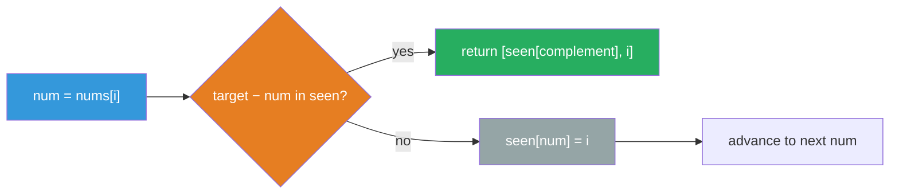
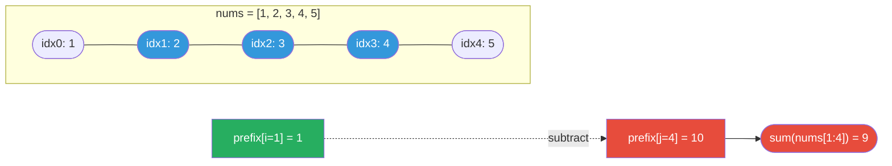

# Arrays & Hashing Guide

> **Core idea:** most array problems that look O(n²) become O(n) the moment you precompute a lookup structure — a [[Hash Map]], [[Prefix Sum|prefix sum array]], or [[Set|set]] — so that each element's "question" is answered in O(1) rather than by rescanning.

## ⚡ Cheatsheet

| Pattern                             | Reach for it when…                                         | Mechanism                                       |
| ----------------------------------- | ---------------------------------------------------------- | ----------------------------------------------- |
| [[Hash Map]] — [[Complement Pattern\|complement lookup]] | "find two elements with property X"                        | store seen values; look up complement in O(1)   |
| [[Hash Map]] — [[Frequency Counting\|frequency / grouping]] | count occurrences; group by canonical key                  | value → count or value → canonical form         |
| [[Prefix Sum]]                      | range sum or subarray-sum queries                          | `prefix[j] − prefix[i]` = sum of any slice      |
| [[Prefix Sum]] + [[Hash Map]]       | count subarrays whose sum equals k (with negatives)        | look up `current_prefix − k` in a frequency map |
| [[Set\|Set membership]]                      | "does X exist?"; find sequence starts                      | O(1) membership, O(n) total                     |
| [[0.TwoPointerGuide\|Two Pointers]]                    | sorted array, pair with property, or O(1)-space constraint | converge from both ends; no extra space needed  |

## How to think about it

The enemy is the **nested loop** — for each element, scanning the rest of the array to find a match. That's O(n²) and almost always beatable.

The trade is simple ([[Space-Time Tradeoff]]): spend O(n) time and O(n) space building a lookup structure *once*, then answer every query in O(1). The structure is always one of three things:

- **Hash map** — maps a value (or derived key) to an index, count, or group.
- **Prefix sum array** — stores cumulative sums so `sum(i..j)` is a single subtraction.
- **Set** — hash map without values; pure membership in O(1).

The skill is recognizing *what to store* and *what question to ask* at each element. Once you name those two things, the code almost writes itself.

One important boundary: if the array is already sorted, Two Pointers often beats hashing on space — O(1) instead of O(n) — so check for a sorted constraint before reaching for a map.

## The patterns

### Complement lookup

The canonical example is [[03.TwoSum|TwoSum]]: for each `num`, you need `target − num`. Instead of an inner loop, store every seen number in a map (`value → index`) and query it in O(1).

The key discipline: **check before inserting**, so you don't match an element with itself.

```python
seen = {}
for i, num in enumerate(nums):
    if target - num in seen:
        return [seen[target - num], i]
    seen[num] = i
```

**[[Complement Pattern|Complement lookup]] flow** — one O(1) map check per element, insert only after checking:



The same shape handles "does a duplicate exist?" (set instead of map), and "find any pair summing to k in a sorted array" (Two Pointers is better there — O(1) space).

### Frequency counting and canonical-key grouping

When the question is "how many times does X appear?" ([[Frequency Counting]]) or "group things that are equivalent", the map stores a count or a canonical form.

For [[04.GroupAnagrams|GroupAnagrams]]: two anagrams are equivalent. Compute a canonical key (sorted string, or a 26-length frequency tuple), then bucket every string under its key. One pass, O(n·k) total.

```python
from collections import defaultdict
groups = defaultdict(list)
for s in strs:
    key = tuple(sorted(s))        # or tuple of 26 char counts
    groups[key].append(s)
return list(groups.values())
```

The only wrinkle: dict keys must be hashable. Convert `list → tuple`, `set → frozenset`.

### Prefix sum

Precompute a running total so any slice `sum(nums[i:j])` is answered in O(1) as `prefix[j] − prefix[i]`.

```python
prefix = [0] * (len(nums) + 1)
for i, num in enumerate(nums):
    prefix[i + 1] = prefix[i] + num
# sum(nums[i:j]) == prefix[j] - prefix[i]
```

**Accumulated prefix sums** for `nums = [1, 2, 3, 4, 5]`:

| index  | 0 | 1 | 2 | 3 | 4  | 5      |
|--------|---|---|---|---|----|--------|
| nums   | — | 1 | 2 | 3 | 4  | 5      |
| prefix | 0 | 1 | 3 | 6 | 10 | **15** |

`sum(nums[1:4])` = `prefix[4] − prefix[1]` = `10 − 1` = **9** — one subtraction, no loop.

**Prefix-sum region** — the highlighted slice `nums[1:4]` is exactly `prefix[j] − prefix[i]`:



The off-by-one to remember: `prefix` has length `n+1`, with `prefix[0] = 0` acting as a sentinel. That sentinel is what lets you query subarrays starting at index 0 without a special case.

[[06.ProductOfArrayExceptSelf|ProductOfArrayExceptSelf]] is a prefix-sum variant: compute left-product and right-product separately, then multiply them — no division, O(1) extra space.

### Prefix sum + hash map (subarray count with negatives)

When you need to *count* subarrays with sum exactly `k`, sliding window breaks because negative numbers make sums non-monotonic. Use the identity:

> `sum(nums[i:j]) = k` iff `prefix[j] − prefix[i] = k` iff `prefix[i] = prefix[j] − k`

At each position, ask "how many earlier prefix sums equal `current − k`?" — one O(1) lookup in a frequency map.

```python
count = {0: 1}   # sentinel: one "empty prefix" with sum 0
cur = 0
result = 0
for num in nums:
    cur += num
    result += count.get(cur - k, 0)
    count[cur] = count.get(cur, 0) + 1
return result
```

The `{0: 1}` initialization covers subarrays that start at index 0 (their prefix sum is `current − 0 = current`, and `0` must already be in the map).

### Set membership and sequence starts

For [[09.LongestConsecutiveSequence|LongestConsecutiveSequence]], [[Sorting|sorting]] is O(n log n) — too slow. Instead, dump everything into a set and iterate. The insight: only start counting from a *sequence beginning* (`num − 1` not in set). That single check means every element is touched at most twice across the whole loop — O(n) total.

```python
num_set = set(nums)
best = 0
for num in num_set:
    if num - 1 not in num_set:      # sequence start
        length = 1
        while num + length in num_set:
            length += 1
        best = max(best, length)
return best
```

## How to approach a new problem

1. **Name the bottleneck.** What would the brute force rescan? That's the thing to precompute.
2. **Ask: sorted or unsorted?** Sorted → Two Pointers often wins on space. Unsorted → hashing.
3. **Decide what to store.** Complement lookup: store `value → index`. Frequency: store `value → count`. Grouping: store `canonical_key → [items]`. Subarray sum: store `prefix_sum → count`.
4. **Decide what to ask.** At each element, what single map/set lookup answers the question?
5. **Handle prefix sum off-by-ones.** Array length `n+1`; initialize `prefix[0] = 0` or `{0: 1}` for subarray counts.
6. **Check the hashability constraint.** If your key is a list, wrap it in `tuple()`.
7. **Trace a small example by hand.** Two Sum with three elements, or prefix sum with two negative numbers — the edge case almost always surfaces here.

## Worked example: Group Anagrams

[[04.GroupAnagrams|GroupAnagrams]] combines frequency counting with canonical-key grouping. The non-obvious move is choosing a key that is both correct and hashable.

Two keys both work:
- `tuple(sorted(s))` — O(k log k) per string, easiest to read.
- `tuple(count_26)` — O(k) per string, avoids the sort.

```python
from collections import defaultdict

def groupAnagrams(strs):
    groups = defaultdict(list)
    for s in strs:
        count = [0] * 26
        for ch in s:
            count[ord(ch) - ord('a')] += 1
        groups[tuple(count)].append(s)
    return list(groups.values())
```

Why `tuple(count)` and not `count` directly? Lists are mutable, so they can't be dict keys — `tuple()` makes it hashable.

## Problems Covered

| Problem | Primary pattern |
| --- | --- |
| [[01.ContainsDuplicate\|Contains Duplicate]] | Set membership |
| [[02.ValidAnagram\|Valid Anagram]] | Frequency counting |
| [[03.TwoSum\|Two Sum]] | Complement lookup |
| [[04.GroupAnagrams\|Group Anagrams]] | Frequency counting + canonical key |
| [[05.TopKElements\|Top K Frequent Elements]] | Frequency counting + bucket sort |
| [[06.ProductOfArrayExceptSelf\|Product of Array Except Self]] | Prefix and suffix products |
| [[07.ValidSodoku\|Valid Sudoku]] | Set membership |
| [[08.EncodeAndDecodeStrings\|Encode and Decode Strings]] | String encoding |
| [[09.LongestConsecutiveSequence\|Longest Consecutive Sequence]] | Set membership + sequence starts |

## When it's the wrong tool

- **Array is sorted and you need a pair.** Use Two Pointers — O(1) space, same O(n) time.
- **Subarray with a *contiguous* constraint and no negatives.** [[0.SlidingWindowGuide|Sliding Window]] is cleaner and equally fast.
- **You need ranked or ordered output.** Hash maps have no inherent order. Sort the result separately, or reach for a [[Heap]].
- **Positional relationship matters.** "Longest increasing *contiguous* subarray" depends on adjacency — a flat map loses that structure. Use a two-pointer or [[Dynamic Programming|DP]] approach.
- **O(1) space required.** The whole point of hashing is trading space for time; if space is forbidden, sort + Two Pointers or bit tricks ([[Bit Manipulation Tricks]]) are the fallback.
- **Need O(1) lookup *and* O(1) reorder simultaneously.** A Hash Map alone can't do both. Pair it with a doubly [[Linked List|linked list]] — that's the LRU cache pattern.

## 🐍 Python Tricks

Idioms that keep array-and-hashing code short and bug-free. General syntax: [[Python Cheatsheet]].

**A `Counter` equality check is an entire anagram test — no manual sort or count comparison needed.**
```python
Counter(s) == Counter(t)
```

**All anagrams collapse to one key: `tuple(sorted(s))` (or a 26-slot count tuple) is the canonical form — and `tuple(...)` makes it hashable, which the raw `sorted()` list isn't.**
```python
key = tuple(sorted(s))     # or: key = tuple(count_26)
groups[key].append(s)
```

**Check membership *before* inserting — otherwise a complement lookup can match an element against itself.**
```python
if target - num in seen:
    return [seen[target - num], i]
seen[num] = i
```

**`dict.get(k, 0)` collapses "increment or start at zero" into one line — no `KeyError`, no `defaultdict` import needed.**
```python
count[cur] = count.get(cur, 0) + 1
```

**`defaultdict(list)` does the same for grouping — `groups[key].append(s)` just works on the first hit.**
```python
groups = defaultdict(list)
groups[key].append(s)
```

**A `set` turns "does this number exist?" into O(1) — chain a sequence only from a true start (`num - 1 not in num_set`), and the whole scan stays O(n).**
```python
num_set = set(nums)
if num - 1 not in num_set:   # true sequence start
    ...
```
