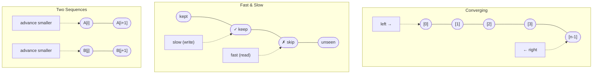
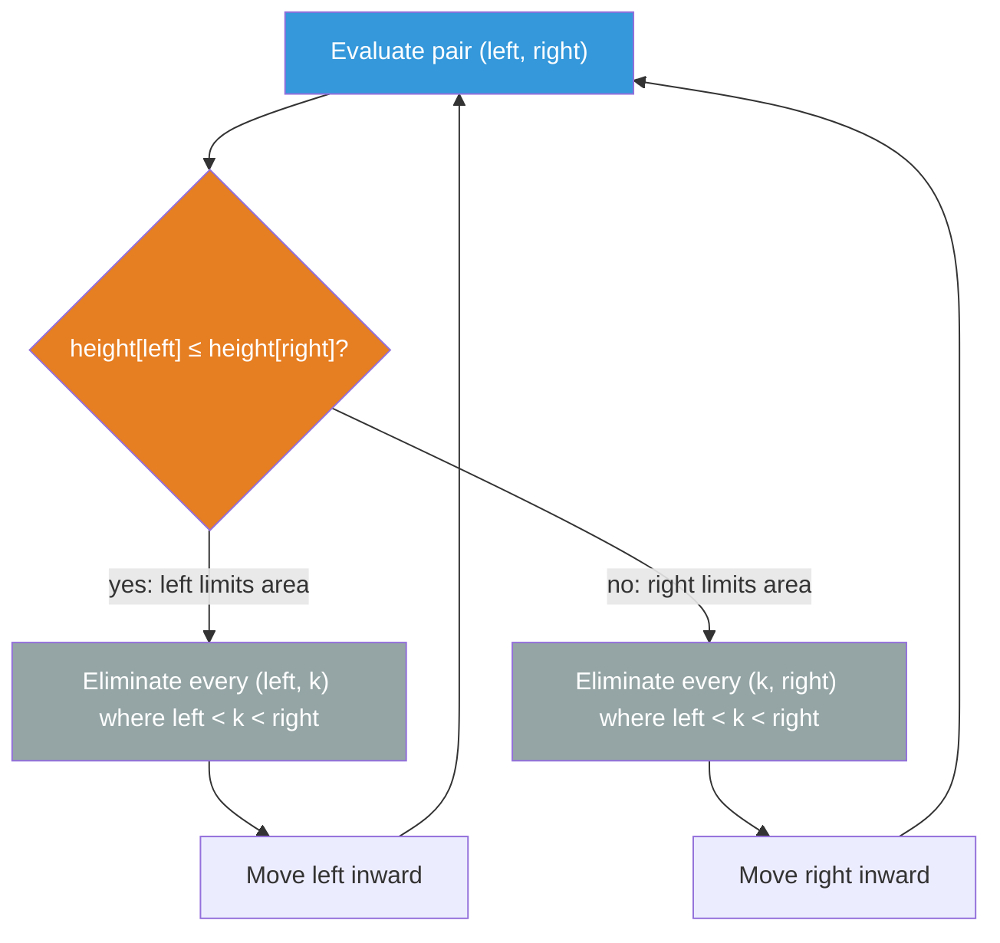

---
aliases:
  - Two Pointers
---

# Two Pointer Algorithm Guide

> **Core idea:** Two pointers turn an O(n²) brute-force into O(n) by making a **single coordinated pass**: each pointer move must *provably eliminate* at least one candidate without missing any valid answer.

## ⚡ Cheatsheet

| Pattern | Reach for it when… | Mechanism |
| --- | --- | --- |
| Two Pointers: converging | sorted input or geometric/structural constraint, find a pair or measure something between two endpoints | `left = 0`, `right = n-1`, advance the pointer where the decision says you can safely discard |
| [[Fast & Slow Pointers\|Two Pointers: fast & slow]] | partition in place, mark a write boundary, remove elements, or deduplicate | slow = write head, fast scans everything, and `slow` advances only on keep |
| Two Pointers: two sequences | both inputs are sorted, merge, intersect, or compare in linear time | one pointer per sequence, advance whichever gives the globally next element |
| [[0.SlidingWindowGuide\|Sliding Window]] | contiguous subarray or substring with a constraint such as length or count | fast grows the window, slow shrinks it, and window state updates one element at a time |
| [[Hash Map]] | unsorted array, pair sum, or complement lookup | store seen values or counts so O(1) lookup replaces sorting |

## How to think about it

Two pointers is a way to skip groups of pairs, not a data structure. The O(n²) brute force checks every pair `(i, j)`. Two pointers work when the current comparison proves that a whole group of pairs cannot contain the answer.

> **A pointer move is safe if and only if every candidate it eliminates is provably suboptimal or invalid: no valid answer is thrown away.**

That guarantee, called the **elimination guarantee**, is what you must verify before reaching for two pointers. It comes from different sources in different problems:

- **Sorted order** ([[02.TwoSumII|TwoSumII]]): moving `left` right strictly increases the sum, so all smaller-sum pairs with the same `right` are already too small.
- **Geometric monotonicity** ([[04.ContainerWithMostWater|ContainerWithMostWater]]): moving the taller wall inward can only shrink area (width shrinks, height cap stays the same). Moving the *shorter* wall is the only move with upside.
- **Symmetry** ([[01.ValidPalindrome|ValidPalindrome]]): mirror positions must match. No other traversal order makes sense.
- **Partitioning invariant** (fast & slow): `slow ≤ fast` always holds, so writing to `slow` never clobbers data that `fast` hasn't read yet.

If you cannot explain why a pointer move is safe, do not use two pointers yet.

## Interactive Walkthroughs

- [[04.ContainerWithMostWater|Container With Most Water]]: step through all eight pointer moves, including the equal-height case and the best area of 49.

### Pair-sum walkthrough

This example finds two values in `nums = [1, 2, 4, 7, 11, 15]` that add to `15`. The array is sorted, so each pointer move safely removes one endpoint from consideration.

```freeform
const values = [1, 2, 4, 7, 11, 15];
const target = 15;
const steps = [
    { left: 0, right: 5, discarded: [], sum: null, decision: "Ready to compare", line: 1, action: "Start with one pointer at each end of the sorted array." },
    { left: 0, right: 5, discarded: [], sum: 16, decision: "Too large", line: 3, action: "Compare 1 + 15 = 16, which is larger than 15." },
    { left: 0, right: 4, discarded: [5], sum: null, decision: "Moved right", line: 6, action: "Move the right pointer from 15 to 11 to lower the sum." },
    { left: 0, right: 4, discarded: [5], sum: 12, decision: "Too small", line: 3, action: "Compare 1 + 11 = 12, which is smaller than 15." },
    { left: 1, right: 4, discarded: [5, 0], sum: null, decision: "Moved left", line: 5, action: "Move the left pointer from 1 to 2 to raise the sum." },
    { left: 1, right: 4, discarded: [5, 0], sum: 13, decision: "Too small", line: 3, action: "Compare 2 + 11 = 13, which is smaller than 15." },
    { left: 2, right: 4, discarded: [5, 0, 1], sum: null, decision: "Moved left", line: 5, action: "Move the left pointer from 2 to 4 to raise the sum." },
    { left: 2, right: 4, discarded: [5, 0, 1], sum: 15, decision: "Found the pair", line: 4, action: "Compare 4 + 11 = 15, so the target pair is found." },
];

const root = document.createElement("section");root.setAttribute("role","region");root.setAttribute("aria-label","# Two Pointer Algorithm Guide interactive walkthrough 1");
root.style.cssText = "font:14px system-ui; max-width:700px; border:1px solid #c8cdd2; border-radius:10px; padding:12px; background:#ffffff; color:#17202a;";
root.innerHTML = `
    <style>
        .tp-graph { width:100%; height:auto; display:block; }
        .tp-state-grid { display:grid; grid-template-columns:1fr 1fr; gap:8px; margin-top:8px; }
        .tp-code { overflow-x:auto; font-size:13px; }
        .tp-controls { display:flex; align-items:center; gap:8px; flex-wrap:wrap; margin-top:10px; }
        .tp-controls button, .tp-controls select { min-height:44px; font-size:14px; touch-action:manipulation; }
        .tp-controls button { padding:6px 12px; }
        @media (max-width:520px) {
            .tp-state-grid { grid-template-columns:1fr; }
            .tp-code { font-size:12px; }
            .tp-controls { gap:6px; }
            .tp-controls button { flex:1 1 72px; }
            .tp-speed { flex:1 1 100%; display:flex; align-items:center; gap:8px; }
            .tp-speed select { flex:1; }
            .tp-counter { width:100%; margin-left:0 !important; text-align:center; }
        }
    </style>
    <svg class="tp-graph" viewBox="0 0 520 225" preserveAspectRatio="xMidYMid meet" role="img" aria-label="Interactive two pointers pair-sum stepper">
        <text x="260" y="24" text-anchor="middle" font-size="17" font-weight="700" fill="#17202a">Target = 15</text>
        <g data-layer="cells"></g>
        <g data-layer="pointers"></g>
        <text x="260" y="205" text-anchor="middle" font-size="14" font-weight="600" fill="#34495e" data-role="svg-note"></text>
    </svg>
    <div style="display:flex; gap:12px; flex-wrap:wrap; margin:0 0 8px; font-size:12px;">
        <span>Orange = current endpoint</span><span>Gray with X = discarded</span><span>Green = found pair</span>
    </div>
    <div data-role="status" aria-live="polite" style="min-height:22px; padding:9px 10px; border-radius:8px; background:#eef2f3;"></div>
    <div class="tp-state-grid">
        <div style="padding:8px; border:1px solid #c8cdd2; border-radius:8px;"><strong>Pointers</strong><div data-role="pointers" style="margin-top:4px; font-family:monospace;"></div></div>
        <div style="padding:8px; border:1px solid #c8cdd2; border-radius:8px;"><strong>Pair check</strong><div data-role="check" style="margin-top:4px; font-family:monospace;"></div></div>
    </div>
    <div class="tp-code" data-role="code" style="margin-top:8px; padding:8px 10px; border-radius:8px; background:#eef2f3; font-family:monospace; line-height:1.55;">
        <div data-line="1">1&nbsp; left = 0; right = n - 1</div>
        <div data-line="2">2&nbsp; while left &lt; right</div>
        <div data-line="3">3&nbsp;&nbsp;&nbsp; sum = nums[left] + nums[right]</div>
        <div data-line="4">4&nbsp;&nbsp;&nbsp; if sum == target: return pair</div>
        <div data-line="5">5&nbsp;&nbsp;&nbsp; if sum &lt; target: left += 1</div>
        <div data-line="6">6&nbsp;&nbsp;&nbsp; else: right -= 1</div>
    </div>
    <div class="tp-controls">
        <button data-action="previous" aria-label="Previous step">Previous</button>
        <button data-action="play">Play</button>
        <button data-action="next" aria-label="Next step">Next</button>
        <button data-action="reset">Reset</button>
        <label class="tp-speed" style="margin-left:8px;">Speed <select data-action="speed"><option value="1200">Slow</option><option value="700" selected>Normal</option><option value="350">Fast</option></select></label>
        <strong class="tp-counter" data-role="counter" style="margin-left:auto;"></strong>
    </div>
`;

const svg = root.querySelector("svg");
const cellLayer = root.querySelector('[data-layer="cells"]');
const pointerLayer = root.querySelector('[data-layer="pointers"]');
const ns = "http://www.w3.org/2000/svg";

values.forEach((value, i) => {
    const x = 52 + i * 83;
    const group = document.createElementNS(ns, "g");
    group.setAttribute("data-index", String(i));
    group.innerHTML = `<text x="${x}" y="56" text-anchor="middle" font-size="13" fill="#566573">index ${i}</text><rect x="${x - 29}" y="70" width="58" height="58" rx="8" fill="#d6eaf8" stroke="#2471a3" stroke-width="3"></rect><text x="${x}" y="100" text-anchor="middle" dominant-baseline="central" font-size="20" font-weight="700" fill="#17202a">${value}</text><path data-role="cross" d="M${x - 20} 79 L${x + 20} 119 M${x + 20} 79 L${x - 20} 119" stroke="#7b7d7d" stroke-width="4" visibility="hidden"></path>`;
    cellLayer.appendChild(group);
});

let index = 0;
let timer = null;

function stopPlaying() {
    if (timer !== null) clearInterval(timer);
    timer = null;
    root.querySelector('[data-action="play"]').textContent = "Play";
}

function pointerLabel(x, label) {
    const group = document.createElementNS(ns, "g");
    group.innerHTML = `<path d="M${x} 165 L${x} 135" stroke="#b03a2e" stroke-width="4"></path><path d="M${x - 7} 143 L${x} 134 L${x + 7} 143" fill="none" stroke="#b03a2e" stroke-width="4"></path><text x="${x}" y="184" text-anchor="middle" font-size="17" font-weight="700" fill="#922b21">${label}</text>`;
    pointerLayer.appendChild(group);
}

function render() {
    const step = steps[index];
    const found = step.sum === target;
    const discarded = new Set(step.discarded);
    svg.setAttribute("aria-label", `Two pointers step ${index + 1} of ${steps.length}: ${step.action}`);
    pointerLayer.replaceChildren();

    for (const group of cellLayer.querySelectorAll("g[data-index]")) {
        const i = Number(group.getAttribute("data-index"));
        const rect = group.querySelector("rect");
        const cross = group.querySelector('[data-role="cross"]');
        if (discarded.has(i)) {
            rect.setAttribute("fill", "#d5d8dc");
            rect.setAttribute("stroke", "#7b7d7d");
            cross.setAttribute("visibility", "visible");
        } else if (found && (i === step.left || i === step.right)) {
            rect.setAttribute("fill", "#82e0aa");
            rect.setAttribute("stroke", "#1e8449");
            cross.setAttribute("visibility", "hidden");
        } else if (i === step.left || i === step.right) {
            rect.setAttribute("fill", "#f8c471");
            rect.setAttribute("stroke", "#b03a2e");
            cross.setAttribute("visibility", "hidden");
        } else {
            rect.setAttribute("fill", "#d6eaf8");
            rect.setAttribute("stroke", "#2471a3");
            cross.setAttribute("visibility", "hidden");
        }
    }

    pointerLabel(52 + step.left * 83, "L");
    pointerLabel(52 + step.right * 83, "R");
    root.querySelector('[data-role="svg-note"]').textContent = step.sum === null ? step.decision: `${values[step.left]} + ${values[step.right]} = ${step.sum}`;
    root.querySelector('[data-role="status"]').textContent = step.action;
    root.querySelector('[data-role="pointers"]').textContent = `left = ${step.left} (${values[step.left]}), right = ${step.right} (${values[step.right]})`;
    root.querySelector('[data-role="check"]').textContent = step.sum === null ? step.decision: `sum = ${step.sum}; ${step.decision}`;

    for (const line of root.querySelectorAll('[data-role="code"] [data-line]')) {
        const active = Number(line.getAttribute("data-line")) === step.line;
        line.style.background = active ? "#f8c471": "transparent";
        line.style.color = active ? "#17202a": "inherit";
        line.style.fontWeight = active ? "700": "400";
        if (active) line.setAttribute("aria-current", "step");
        else line.removeAttribute("aria-current");
    }

    root.querySelector('[data-role="counter"]').textContent = `Step ${index + 1} / ${steps.length}`;
    root.querySelector('[data-action="previous"]').disabled = index === 0;
    root.querySelector('[data-action="next"]').disabled = index === steps.length - 1;
}

root.querySelector('[data-action="previous"]').addEventListener("click", () => { stopPlaying(); index = Math.max(0, index - 1); render(); });
root.querySelector('[data-action="next"]').addEventListener("click", () => { stopPlaying(); index = Math.min(steps.length - 1, index + 1); render(); });
root.querySelector('[data-action="reset"]').addEventListener("click", () => { stopPlaying(); index = 0; render(); });
root.querySelector('[data-action="play"]').addEventListener("click", () => {
    if (timer !== null) { stopPlaying(); return; }
    if (index === steps.length - 1) index = 0;
    root.querySelector('[data-action="play"]').textContent = "Pause";
    const delay = Number(root.querySelector('[data-action="speed"]').value);
    timer = setInterval(() => { if (index === steps.length - 1) { stopPlaying(); return; } index += 1; render(); }, delay);
    render();
});
root.querySelector('[data-action="speed"]').addEventListener("change", () => { if (timer === null) return; stopPlaying(); root.querySelector('[data-action="play"]').click(); });

render();
display(root);
```

**Pointer motion summary**: the same array, three different pass patterns:



## The three motions

### Converging: close from both ends

Start at opposite ends, evaluate the current pair, then advance one pointer based on a decision rule. The rule must discard all eliminated candidates. Each pointer moves at most `n` times total: O(n).

The decision at each step:
- Found it → record and optionally advance both
- "Too small" → move the left pointer right (increases the value on the left)
- "Too big" → move the right pointer left (decreases the value on the right)

The hard part isn't the loop: it's convincing yourself that the move direction is safe. For [[02.TwoSumII|TwoSumII]], sorted order provides that proof directly. For ContainerWithMostWater (unsorted!), the proof is geometric (see worked example below).

**Duplicate skipping in [[03.3Sum|3Sum]]**: fix one element with an outer loop, run converging two pointers on the rest, then skip consecutive equal values at every level: otherwise the same triplet appears multiple times.

### Fast & Slow: same direction, partition as you go

`slow` is the write head, and `fast` scans every element. The invariant:

```
[ ... keep ... | ... discard ... | ... unseen ... ]
  0          slow              fast               n-1
```

`slow` advances only when `fast` finds something worth keeping. Because `slow ≤ fast` is maintained, writing `arr[slow] = arr[fast]` is always safe. The kept prefix grows in place.

### Two sequences: merge invariant

When both inputs are sorted, the globally smallest unprocessed element is always at one of the two pointer positions. Take it and advance that pointer. Each element visited once: O(n + m).

## Core templates

Use opposite-direction pointers when sorted order lets you discard one endpoint after each comparison:

```python
left, right = 0, len(nums) - 1

while left < right:
    total = nums[left] + nums[right]
    if total == target:
        return left, right
    if total < target:
        left += 1
    else:
        right -= 1
```

Use same-direction pointers when one pointer reads every item and the other writes only the items to keep:

```python
write = 0

for read in range(len(nums)):
    if keep(nums[read]):
        nums[write] = nums[read]
        write += 1
```

The pointer pass takes O(n) time and O(1) extra space. If sorting is required first, the full algorithm takes O(n log n) time.

## How to approach a new problem

1. **Ask: is there an elimination guarantee?** Can you state, in one sentence, why a pointer move is safe? If not, stop: consider Hash Map (unsorted pair-sum) or Sliding Window (subarray constraint) instead.
2. **Identify the source of the guarantee.** Sorted order, geometry, symmetry, or partitioning invariant: knowing which source you're relying on tells you the decision rule.
3. **Choose the motion.** Pair at endpoints → converging. In-place write boundary → fast & slow. Two sorted inputs → two-sequence.
4. **Name your pointers and what they guard.** `left` = smallest untried index, `right` = largest untried index, `slow` = end of kept prefix, etc. If you can't name them, you don't have the algorithm yet.
5. **Write the loop, state the invariant at the top.** The invariant is your specification. Each iteration must restore it.
6. **Handle matches and duplicates explicitly.** Before moving both pointers after a match, decide whether you need one pair or every pair. Three Sum and similar problems also require skipping consecutive equal values after every match and outer-loop advance.
7. **Trace n = 0, 1, 2.** Empty input, single element, two elements: these catch off-by-one bugs in the termination condition (`< right` vs. `<= right`).

## Worked examples

### Container With Most Water: geometric elimination

ContainerWithMostWater: given `height[]`, find two bars that trap the most water. The array is **not sorted**, so sorted-order reasoning doesn't apply.

```python
def maxArea(height: list[int]) -> int:
    left, right = 0, len(height) - 1
    best = 0
    while left < right:
        h = min(height[left], height[right])
        best = max(best, h * (right - left))
        if height[left] < height[right]:
            left += 1
        else:
            right -= 1
    return best
```

**Why moving the shorter wall is safe:** area = `min(h[l], h[r]) × (r - l)`. If we kept the shorter wall fixed and moved the taller wall inward, width shrinks and height is still capped by the shorter wall: area can only decrease. So every pair that keeps the shorter wall fixed while the taller wall moves inward is already dominated. Moving the shorter wall is the only move with potential upside. The elimination guarantee comes from geometry.

**Geometric candidate elimination**: keep the only move that could raise the limiting height:



### Trapping Rain Water: tracking running maxes

[[05.TrappingRainWater|TrappingRainWater]]: for each bar, water above it = `min(max_left, max_right) - height`. The two-pointer approach avoids precomputing both max arrays by maintaining running maxes and always processing the side with the smaller running max.

```python
def trap(height: list[int]) -> int:
    left, right = 0, len(height) - 1
    left_max = right_max = 0
    water = 0
    while left < right:
        if height[left] < height[right]:
            if height[left] >= left_max:
                left_max = height[left]
            else:
                water += left_max - height[left]
            left += 1
        else:
            if height[right] >= right_max:
                right_max = height[right]
            else:
                water += right_max - height[right]
            right -= 1
    return water
```

The tricky part: why process the side with the *smaller* running max? When `height[left] < height[right]`, we know `right_max ≥ height[right] > height[left]`, so the limiting wall for position `left` is definitely `left_max`, not anything on the right. We can safely compute `left_max - height[left]` without knowing what's to the right. If we processed the larger-max side instead, we couldn't be sure the opposite max is the binding constraint.

## Problems Covered

| Problem | Primary pattern |
| --- | --- |
| [[01.ValidPalindrome\|Valid Palindrome]] | Converging pointers |
| [[02.TwoSumII\|Two Sum II - Input Array Is Sorted]] | Converging pointers on sorted input |
| [[03.3Sum\|3Sum]] | Sorting + converging pointers |
| [[04.ContainerWithMostWater\|Container With Most Water]] | Geometric candidate elimination |
| [[05.TrappingRainWater\|Trapping Rain Water]] | Two pointers + running boundary maxima |

## When two pointers is the wrong tool

- **Unsorted array, pair-sum target**: no sorted-order guarantee. Use Hash Map in O(n) without sorting overhead. ([[03.TwoSum|TwoSum]])
- **Contiguous subarray/substring with a count or length constraint**: the window grows and shrinks by one end at a time. That is Sliding Window, a specialization of fast and slow pointers.
- **"For each element, find the nearest greater/smaller element"**: each element gets its own independent answer, computed by a stack of unresolved candidates. Two Pointers can't express per-element nesting. Use a [[Monotonic Stack]].
- **Optimal choices depend on future elements**: two pointers makes [[0.GreedyGuide|greedy]] local decisions. If the best move at index `i` depends on index `i+10`, reach for [[Dynamic Programming]] or [[0.BacktrackingGuide|backtracking]].
- **Non-linear data**: two pointers navigates linear structures (arrays, strings, linked lists). For trees and [[Graph|graphs]], use [[DFS]] or [[BFS]].

## 🐍 Python Tricks

Idioms that keep two-pointer code short and bug-free. General syntax: [[Python Cheatsheet]].

**`while l < r` is the entire convergence loop: each pointer moves at most `n` times total, so the whole pass is O(n) no matter what happens inside.**
```python
l, r = 0, len(nums) - 1
while l < r:
    ...
```

**Swap without a temp variable.**
```python
nums[l], nums[r] = nums[r], nums[l]
```

**Sort first, then sweep: turns an unordered pair/triplet search into a converging walk for one extra `O(n log n)`.**
```python
nums.sort()
l, r = i + 1, len(nums) - 1
```

**Skip duplicates with a guard `while` right after every match or advance, at every nesting level: miss one level and duplicates leak into the output.**
```python
l += 1
while l < r and nums[l] == nums[l - 1]:
    l += 1
```

**In-place partitioning overwrites through a `slow` write head: no extra list, and `slow` only advances on a keep.**
```python
slow = 0
for fast in range(len(nums)):
    if nums[fast] != val:
        nums[slow] = nums[fast]
        slow += 1
```

**Merging two sorted sequences is one `while` with two indices: advance whichever side is smaller, then drain the leftover tail.**
```python
while i < len(a) and j < len(b):
    if a[i] <= b[j]:
        merged.append(a[i]); i += 1
    else:
        merged.append(b[j]); j += 1
merged += a[i:] + b[j:]
```
