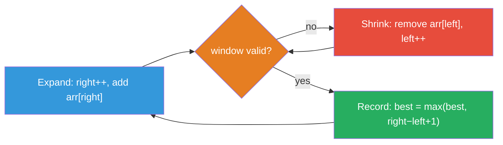
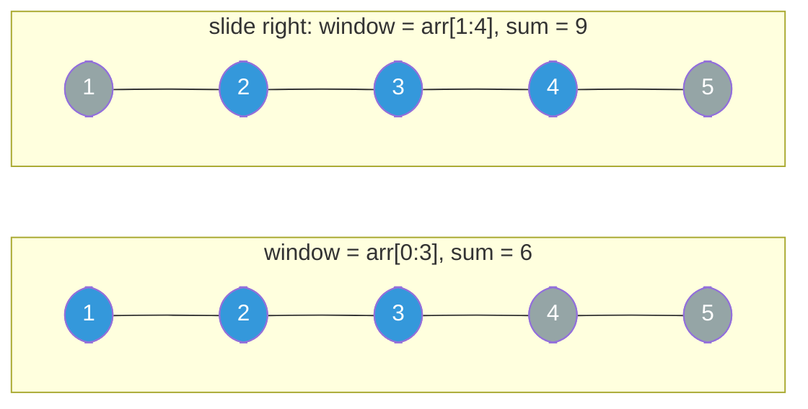

---
aliases:
  - Sliding Window
---

# Sliding Window Algorithm Guide

> **Core idea:** a sliding window is **[[0.TwoPointerGuide|two pointers]] bounding a contiguous subarray whose state you maintain incrementally**. Instead of re-scanning from scratch for every starting index (O(n²)), you slide both edges forward and update in O(1): the left edge never moves backward, so every element enters and leaves the window at most once (O(n) total).

## ⚡ Cheatsheet

| Pattern | Reach for it when… | Mechanism |
| --- | --- | --- |
| Sliding Window: shrink while invalid (longest) | longest/largest valid subarray | expand right, advance left `while invalid`, then record length |
| Sliding Window: shrink while valid (shortest) | shortest/smallest valid subarray | expand right, then record and advance left `while valid` |
| Sliding Window: non-shrinkable (max length only) | only need the length, not position | advance left once `if invalid`, so the window never shrinks |
| Sliding Window: fixed-size | aggregate over every window of size k | remove outgoing element after recording, no validity check |
| atMost trick + [[Hash Map]] | count subarrays with **exactly** k of something | `exactly(k) = atMost(k) − atMost(k−1)` |
| [[Monotonic Stack]] / deque | **maximum (or minimum) value inside each window** | deque stores candidate indices in decreasing order and removes a stale front |

## How to think about it

A sliding window avoids repeated work. Each element is added once when `right` reaches it and removed at most once when `left` passes it. The total work is O(n), even when the code contains an inner loop.

This works only when shrinking moves the window closer to a valid state:

> **Monotonic restoration**: when the window becomes invalid, removing `data[left]` must bring it *at least as close* to validity as before (never further away). If that holds, the inner loop terminates and you haven't missed any window.

Positive-integer sums, character [[Frequency Counting|frequency counts]], and violation counters all satisfy this. **Negative numbers break this rule** because removing a negative value can increase the sum. Shrinking no longer changes the sum in one predictable direction, so the window can skip valid answers. Use [[Prefix Sum]] with a Hash Map instead.

Next, decide what the window needs to track. Most problems use one of these states:
- a running **sum** (for numeric arrays with all-positive values)
- a **frequency map** (for character or element membership problems)
- a **count of violations** (e.g., "at most k zeros allowed" → `zeros` counter)

Choosing the right state variable makes the validity condition obvious. Use a number or Boolean flag when it is enough. Use a frequency map only when the problem needs per-value counts.

**Expand → contract → record cycle**: `right` always advances, while `left` advances only to fix an invalid window:

1. **Expand**: `right++`, add `arr[right]` to window state
2. **Contract**: while window is invalid: remove `arr[left]`, `left++`
3. **Record**: window is now valid: `best = max(best, right − left + 1)`
4. Repeat from 1

Key guarantee: every element is added exactly once (when `right` passes it) and removed at most once (when `left` passes it) → **O(n) total** regardless of how many contractions occur.

## Interactive expand-and-shrink walkthrough

This example finds the longest substring without repeated characters in `s = "abba"`. Expanding and shrinking are separate steps so each window change is visible.

```freeform
const chars = ["a", "b", "b", "a"];
const steps = [
    { left: null, right: null, removed: [], event: null, counts: {}, valid: true, best: 0, line: 1, action: "Start with an empty window before the first character." },
    { left: 0, right: 0, removed: [], event: 0, counts: { a: 1 }, valid: true, best: 1, line: 3, action: "Expand right to include a, which makes a valid window of length 1." },
    { left: 0, right: 1, removed: [], event: 1, counts: { a: 1, b: 1 }, valid: true, best: 2, line: 6, action: "Expand right to include b, which raises the best length to 2." },
    { left: 0, right: 2, removed: [], event: 2, counts: { a: 1, b: 2 }, valid: false, best: 2, line: 3, action: "Expand right to include the second b, which makes the window invalid." },
    { left: 1, right: 2, removed: [0], event: 0, counts: { b: 2 }, valid: false, best: 2, line: 5, action: "Shrink from the left by removing a, but the two b characters still repeat." },
    { left: 2, right: 2, removed: [0, 1], event: 1, counts: { b: 1 }, valid: true, best: 2, line: 5, action: "Shrink again by removing the first b, which restores a valid window." },
    { left: 2, right: 3, removed: [0, 1], event: 3, counts: { a: 1, b: 1 }, valid: true, best: 2, line: 6, action: "Expand right to include a, leaving the valid window ba with best length 2." },
    { left: 2, right: 3, removed: [0, 1], event: null, counts: { a: 1, b: 1 }, valid: true, best: 2, line: 2, action: "Finish after both pointers have moved only forward through the string." },
];

const root = document.createElement("section");root.setAttribute("role","region");root.setAttribute("aria-label","# Sliding Window Algorithm Guide interactive walkthrough 1");
root.style.cssText = "font:14px system-ui; max-width:700px; border:1px solid #c8cdd2; border-radius:10px; padding:12px; background:#ffffff; color:#17202a;";
root.innerHTML = `
    <style>
        .sw-graph { width:100%; height:auto; display:block; }
        .sw-state-grid { display:grid; grid-template-columns:1fr 1fr; gap:8px; margin-top:8px; }
        .sw-code { overflow-x:auto; font-size:13px; }
        .sw-controls { display:flex; align-items:center; gap:8px; flex-wrap:wrap; margin-top:10px; }
        .sw-controls button, .sw-controls select { min-height:44px; font-size:14px; touch-action:manipulation; }
        .sw-controls button { padding:6px 12px; }
        @media (max-width:520px) {
            .sw-state-grid { grid-template-columns:1fr; }
            .sw-code { font-size:12px; }
            .sw-controls { gap:6px; }
            .sw-controls button { flex:1 1 72px; }
            .sw-speed { flex:1 1 100%; display:flex; align-items:center; gap:8px; }
            .sw-speed select { flex:1; }
            .sw-counter { width:100%; margin-left:0 !important; text-align:center; }
        }
    </style>
    <svg class="sw-graph" viewBox="0 0 520 245" preserveAspectRatio="xMidYMid meet" role="img" aria-label="Interactive sliding window stepper">
        <text x="260" y="25" text-anchor="middle" font-size="17" font-weight="700" fill="#17202a">s = abba</text>
        <g data-layer="window"></g>
        <g data-layer="cells"></g>
        <g data-layer="pointers"></g>
        <text x="260" y="225" text-anchor="middle" font-size="14" font-weight="600" fill="#34495e" data-role="svg-note"></text>
    </svg>
    <div style="display:flex; gap:12px; flex-wrap:wrap; margin:0 0 8px; font-size:12px;">
        <span>Blue = active window</span><span>Orange border = changed character</span><span>Gray with X = passed by left</span>
    </div>
    <div data-role="status" aria-live="polite" style="min-height:22px; padding:9px 10px; border-radius:8px; background:#eef2f3;"></div>
    <div class="sw-state-grid">
        <div style="padding:8px; border:1px solid #c8cdd2; border-radius:8px;"><strong>Window</strong><div data-role="window-state" style="margin-top:4px; font-family:monospace;"></div></div>
        <div style="padding:8px; border:1px solid #c8cdd2; border-radius:8px;"><strong>Counts and best</strong><div data-role="counts" style="margin-top:4px; font-family:monospace;"></div></div>
    </div>
    <div class="sw-code" data-role="code" style="margin-top:8px; padding:8px 10px; border-radius:8px; background:#eef2f3; font-family:monospace; line-height:1.55;">
        <div data-line="1">1&nbsp; left = 0; best = 0</div>
        <div data-line="2">2&nbsp; for each right position</div>
        <div data-line="3">3&nbsp;&nbsp;&nbsp; add s[right] to counts</div>
        <div data-line="4">4&nbsp;&nbsp;&nbsp; while a character repeats</div>
        <div data-line="5">5&nbsp;&nbsp;&nbsp;&nbsp;&nbsp; remove s[left]; left += 1</div>
        <div data-line="6">6&nbsp;&nbsp;&nbsp; best = max(best, window length)</div>
    </div>
    <div class="sw-controls">
        <button data-action="previous" aria-label="Previous step">Previous</button>
        <button data-action="play">Play</button>
        <button data-action="next" aria-label="Next step">Next</button>
        <button data-action="reset">Reset</button>
        <label class="sw-speed" style="margin-left:8px;">Speed <select data-action="speed"><option value="1200">Slow</option><option value="700" selected>Normal</option><option value="350">Fast</option></select></label>
        <strong class="sw-counter" data-role="counter" style="margin-left:auto;"></strong>
    </div>
`;

const svg = root.querySelector("svg");
const cellLayer = root.querySelector('[data-layer="cells"]');
const windowLayer = root.querySelector('[data-layer="window"]');
const pointerLayer = root.querySelector('[data-layer="pointers"]');
const ns = "http://www.w3.org/2000/svg";

chars.forEach((char, i) => {
    const x = 100 + i * 105;
    const group = document.createElementNS(ns, "g");
    group.setAttribute("data-index", String(i));
    group.innerHTML = `<text x="${x}" y="69" text-anchor="middle" font-size="13" fill="#566573">index ${i}</text><rect x="${x - 35}" y="82" width="70" height="62" rx="8" fill="#f2f3f4" stroke="#7f8c8d" stroke-width="3"></rect><text x="${x}" y="114" text-anchor="middle" dominant-baseline="central" font-size="23" font-weight="700" fill="#17202a">${char}</text><path data-role="cross" d="M${x - 24} 91 L${x + 24} 135 M${x + 24} 91 L${x - 24} 135" stroke="#7b7d7d" stroke-width="4" visibility="hidden"></path>`;
    cellLayer.appendChild(group);
});

let index = 0;
let timer = null;

function stopPlaying() {
    if (timer !== null) clearInterval(timer);
    timer = null;
    root.querySelector('[data-action="play"]').textContent = "Play";
}

function pointerLabel(x, label, color) {
    const group = document.createElementNS(ns, "g");
    group.innerHTML = `<path d="M${x} 183 L${x} 151" stroke="${color}" stroke-width="4"></path><path d="M${x - 7} 159 L${x} 150 L${x + 7} 159" fill="none" stroke="${color}" stroke-width="4"></path><text x="${x}" y="203" text-anchor="middle" font-size="16" font-weight="700" fill="${color}">${label}</text>`;
    pointerLayer.appendChild(group);
}

function sharedPointerLabel(x) {
    const group = document.createElementNS(ns, "g");
    group.innerHTML = `<path d="M${x} 183 L${x} 151" stroke="#6c3483" stroke-width="4"></path><path d="M${x - 7} 159 L${x} 150 L${x + 7} 159" fill="none" stroke="#6c3483" stroke-width="4"></path><text x="${x + 28}" y="177" text-anchor="middle" font-size="16" font-weight="700" fill="#6c3483">L/R</text>`;
    pointerLayer.appendChild(group);
}

function render() {
    const step = steps[index];
    const removed = new Set(step.removed);
    svg.setAttribute("aria-label", `Sliding window step ${index + 1} of ${steps.length}: ${step.action}`);
    windowLayer.replaceChildren();
    pointerLayer.replaceChildren();

    if (step.left !== null) {
        const startX = 100 + step.left * 105 - 43;
        const endX = 100 + step.right * 105 + 43;
        const band = document.createElementNS(ns, "rect");
        band.setAttribute("x", String(startX));
        band.setAttribute("y", "43");
        band.setAttribute("width", String(endX - startX));
        band.setAttribute("height", "115");
        band.setAttribute("rx", "10");
        band.setAttribute("fill", "#d6eaf8");
        band.setAttribute("stroke", step.valid ? "#2471a3": "#c0392b");
        band.setAttribute("stroke-width", "3");
        band.setAttribute("stroke-dasharray", step.valid ? "": "7 5");
        windowLayer.appendChild(band);
    }

    for (const group of cellLayer.querySelectorAll("g[data-index]")) {
        const i = Number(group.getAttribute("data-index"));
        const rect = group.querySelector("rect");
        const cross = group.querySelector('[data-role="cross"]');
        const active = step.left !== null && i >= step.left && i <= step.right;
        if (removed.has(i)) {
            rect.setAttribute("fill", "#d5d8dc");
            rect.setAttribute("stroke", "#7b7d7d");
            rect.setAttribute("stroke-width", i === step.event ? "5": "3");
            cross.setAttribute("visibility", "visible");
        } else if (active) {
            rect.setAttribute("fill", "#85c1e9");
            rect.setAttribute("stroke", i === step.event ? "#d35400": "#2471a3");
            rect.setAttribute("stroke-width", i === step.event ? "5": "3");
            cross.setAttribute("visibility", "hidden");
        } else {
            rect.setAttribute("fill", "#f2f3f4");
            rect.setAttribute("stroke", "#7f8c8d");
            rect.setAttribute("stroke-width", "3");
            cross.setAttribute("visibility", "hidden");
        }
    }

    if (step.left !== null) {
        if (step.left === step.right) {
            sharedPointerLabel(100 + step.left * 105);
        } else {
            pointerLabel(100 + step.left * 105, "L", "#922b21");
            pointerLabel(100 + step.right * 105, "R", "#1f618d");
        }
    }

    const windowText = step.left === null ? "empty": chars.slice(step.left, step.right + 1).join("");
    const countText = Object.keys(step.counts).length ? Object.entries(step.counts).map(([key, value]) => `${key}:${value}`).join(", "): "empty";
    root.querySelector('[data-role="svg-note"]').textContent = step.left === null ? "Window is empty": `Window = ${windowText} (${step.valid ? "valid": "invalid"})`;
    root.querySelector('[data-role="status"]').textContent = step.action;
    root.querySelector('[data-role="window-state"]').textContent = step.left === null ? "empty": `s[${step.left}:${step.right + 1}] = "${windowText}"; ${step.valid ? "valid": "invalid"}`;
    root.querySelector('[data-role="counts"]').textContent = `${countText}; best = ${step.best}`;

    for (const line of root.querySelectorAll('[data-role="code"] [data-line]')) {
        const active = Number(line.getAttribute("data-line")) === step.line;
        line.style.background = active ? "#f8c471": "transparent";
        line.style.color = active ? "#17202a": "inherit";
        line.style.fontWeight = active ? "700": "400";
        if (active) line.setAttribute("aria-current", "step");
        else line.removeAttribute("aria-current");
    }

    root.querySelector('[data-role="counter"]').textContent = `Step ${index + 1} / ${steps.length}`;
    root.querySelector('[data-action="previous"]').disabled = index === 0;
    root.querySelector('[data-action="next"]').disabled = index === steps.length - 1;
}

root.querySelector('[data-action="previous"]').addEventListener("click", () => { stopPlaying(); index = Math.max(0, index - 1); render(); });
root.querySelector('[data-action="next"]').addEventListener("click", () => { stopPlaying(); index = Math.min(steps.length - 1, index + 1); render(); });
root.querySelector('[data-action="reset"]').addEventListener("click", () => { stopPlaying(); index = 0; render(); });
root.querySelector('[data-action="play"]').addEventListener("click", () => {
    if (timer !== null) { stopPlaying(); return; }
    if (index === steps.length - 1) index = 0;
    root.querySelector('[data-action="play"]').textContent = "Pause";
    const delay = Number(root.querySelector('[data-action="speed"]').value);
    timer = setInterval(() => { if (index === steps.length - 1) { stopPlaying(); return; } index += 1; render(); }, delay);
    render();
});
root.querySelector('[data-action="speed"]').addEventListener("change", () => { if (timer === null) return; stopPlaying(); root.querySelector('[data-action="play"]').click(); });

render();
display(root);
```

**Expand/shrink state machine**: `right` always moves forward, while `left` only moves to restore validity:



## The four window shapes

### Shrinkable: find longest valid window

The most common shape expands right, moves left until the window is valid again, and then records the answer.

```python
def longest_valid(data: list) -> int:
    left = 0
    best = 0
    # state: e.g. freq = {}, window_sum = 0, violations = 0

    for right in range(len(data)):
        # 1. expand: add data[right] to state
        ...

        # 2. contract: while INVALID, remove data[left]
        while invalid(...):
            # remove data[left] from state
            left += 1

        # 3. record: [left, right] is the longest valid window ending here
        best = max(best, right - left + 1)

    return best
```

After the `while`, the window is always valid. Record the answer after shrinking so you do not save an invalid window. Every element has been considered as the right edge, and `left` is the tightest valid boundary for that `right`. → See [[02.LongestSubstringWithoutRepeatingCharacters|LongestSubstringWithoutRepeatingCharacters]], [[03.LongestRepeatingCharacterReplacement|LongestRepeatingCharacterReplacement]]

### Shrinkable: find shortest valid window

Invert the logic: contract *while valid*, recording before each contraction.

```python
def shortest_valid(data: list) -> int:
    left = 0
    best = float("inf")
    # state ...

    for right in range(len(data)):
        # 1. expand
        ...

        # 2. contract: while VALID, record then shrink
        while valid(...):
            best = min(best, right - left + 1)
            # remove data[left] from state
            left += 1

    return best if best != float("inf") else 0
```

Record *before* shrinking so you capture the tightest window that still satisfies the constraint. → See [[05.MinimumWindowSubstring|MinimumWindowSubstring]]

### Non-shrinkable: maximum window length only

When you only need the **length** (not position or contents) of the best window, you can skip recomputing state on contraction. Replace `while` with `if`: the window shifts one step when invalid, so it never shrinks.

```python
def max_window_length(data: list) -> int:
    left = 0
    # state ...

    for right in range(len(data)):
        # 1. expand
        ...

        # 2. shift: if INVALID, remove data[left] and move left ONCE
        if invalid(...):
            # remove data[left] from state
            left += 1
        # NOTE: no while: left moves by at most 1 per right step

    return len(data) - left
```

The window's size is monotonically non-decreasing. Once it hits some size `w`, it never falls below `w`. The final `len(data) - left` equals the largest valid size ever seen. This works because a stale validity check is fine: we're only tracking the maximum length, not verifying every moment. → See [[03.LongestRepeatingCharacterReplacement|LongestRepeatingCharacterReplacement]] (the `max_freq` trick)

### Fixed-size window

The window is always exactly `k` elements. Initialize the first `k` elements before the loop, then slide and record.

```python
def fixed_window(data: list, k: int) -> ...:
    # initialize state over data[:k]
    window_sum = sum(data[:k])
    best = window_sum

    for right in range(k, len(data)):
        window_sum += data[right] - data[right - k]  # add incoming, drop outgoing
        best = max(best, window_sum)

    return best
```

Every contiguous subarray of length `k` is evaluated exactly once. → See [[01.BestTimeToBuy&SellStock|BestTimeToBuy&SellStock]] (k=1 edge case), [[04.PermutationInString|PermutationInString]]

**Fixed-size window sliding**: one element enters, one leaves, size stays exactly `k`:



**Fixed-size with a frequency map**: when equality of character counts is the validity condition, track `matches` (chars where `window[c] == need[c]`) to keep each step O(1) instead of comparing full Counters:

```python
def permutation_in_string(s: str, p: str) -> list[int]:
    from collections import Counter
    need = Counter(p)
    window: dict[str, int] = {}
    matches = 0
    required = len(need)
    k = len(p)
    result = []

    for right in range(len(s)):
        c = s[right]
        window[c] = window.get(c, 0) + 1
        if c in need and window[c] == need[c]:
            matches += 1

        if right >= k:                        # drop outgoing character
            out = s[right - k]
            if out in need and window[out] == need[out]:
                matches -= 1
            window[out] -= 1

        if matches == required:
            result.append(right - k + 1)

    return result
```

`matches` ticks up only when a count goes from `need[c]-1` to `need[c]`, and ticks down only when removal drops it below: no full-map comparison ever needed. → [[04.PermutationInString|PermutationInString]]

## How to approach a new problem

1. **Confirm contiguity.** The problem must ask about a subarray or substring (contiguous). Subsequences that can skip elements need [[Dynamic Programming|DP]] or [[0.GreedyGuide|greedy]], not a window.
2. **Check monotonic restoration.** Ask: "if I remove `data[left]`, does the window get *at least* as valid?" For positive-value sums and character counts: yes. For negative numbers or non-monotonic constraints: no: stop here and reach for Prefix Sum.
3. **Name your state variable.** What single value or map describes the window? Write it down before coding the loop.
4. **Pick the shape.** Longest → shrink while invalid. Shortest → shrink while valid. Max-length only → non-shrinkable. Fixed size → fixed window.
5. **Write the loop** in expand → contract/shift → record order. Keep the invariant explicit in a comment.
6. **Handle edge cases.** What if `k > len(data)` for fixed windows? What if no valid window exists (return 0 or "")? What does an empty input return?

## Worked example: Minimum Window Substring

[[05.MinimumWindowSubstring|MinimumWindowSubstring]] combines the shortest-valid shape with a Hash Map for character tracking: non-obvious enough to trace through.

**Goal:** find the shortest window in `s` containing every character of `t` (with duplicates).

**State:** `need` maps each character in `t` to how many more we still need. `formed` counts how many distinct characters are fully satisfied.

```python
from collections import Counter

def min_window(s: str, t: str) -> str:
    if not t or not s:
        return ""

    need = Counter(t)       # e.g. {"A":1, "B":1, "C":1} for t="ABC"
    required = len(need)    # number of distinct chars we must satisfy
    formed = 0
    window = {}
    best, best_left, left = float("inf"), 0, 0

    for right in range(len(s)):
        ch = s[right]
        window[ch] = window.get(ch, 0) + 1
        if ch in need and window[ch] == need[ch]:
            formed += 1                        # this char is now fully covered

        while formed == required:              # window is VALID: try to shrink
            if right - left + 1 < best:
                best, best_left = right - left + 1, left
            out = s[left]
            window[out] -= 1
            if out in need and window[out] < need[out]:
                formed -= 1                    # we lost coverage of this char
            left += 1

    return "" if best == float("inf") else s[best_left: best_left + best]
```

The tricky part: `formed` only ticks up when `window[ch]` *reaches* `need[ch]` (not every time we add `ch`). Symmetrically it only ticks down when removal causes `window[out]` to drop *below* `need[out]`. This avoids double-counting.

## Worked example: window maximum with a deque

For [[06.SlidingWindowMaximum|SlidingWindowMaximum]], adding the new value and removing the old value is not enough to update the maximum. A monotonic deque keeps the remaining candidates in useful order.

**Core idea:** maintain a deque of *indices* in decreasing order of their values. The front of the deque is always the index of the current window's maximum. When you add a new element, pop from the back anything smaller (they can never be a future maximum while this new element is in the window). When the front goes out of the window, pop it too.

```python
from collections import deque

def max_sliding_window(nums: list[int], k: int) -> list[int]:
    dq: deque[int] = deque()   # stores indices, values decreasing front→back
    result = []

    for right in range(len(nums)):
        # drop indices outside the window
        while dq and dq[0] < right - k + 1:
            dq.popleft()

        # maintain decreasing order: drop smaller values from the back
        while dq and nums[dq[-1]] < nums[right]:
            dq.pop()

        dq.append(right)

        if right >= k - 1:           # window is full
            result.append(nums[dq[0]])

    return result
```

Why the deque works: any element that is both *smaller than* and *to the left of* the current element can never be a window maximum: it will leave the window before this element does, and it's already beaten in value. So it's safe to discard it immediately.

## Problems Covered

| Problem | Primary pattern |
| --- | --- |
| [[01.BestTimeToBuy&SellStock\|Best Time to Buy and Sell Stock]] | Running minimum |
| [[02.LongestSubstringWithoutRepeatingCharacters\|Longest Substring Without Repeating Characters]] | Shrink while invalid + set membership |
| [[03.LongestRepeatingCharacterReplacement\|Longest Repeating Character Replacement]] | Shrinkable window + frequency counting |
| [[04.PermutationInString\|Permutation in String]] | Fixed-size window + frequency counting |
| [[05.MinimumWindowSubstring\|Minimum Window Substring]] | Shrink while valid + frequency counting |
| [[06.SlidingWindowMaximum\|Sliding Window Maximum]] | Monotonic deque |

## When sliding window is the wrong tool

| Signal | Better approach | Why SW fails |
| --- | --- | --- |
| Array has **negative numbers**, constraint is sum ≤ / = k | Prefix Sum + Hash Map | Removing a negative element *increases* the sum: monotonic restoration breaks |
| **Non-contiguous** subsequence | Dynamic Programming or greedy | Window requires contiguity |
| Need **median** (or other order statistic) of each window | [[Two Heaps]] or sorted structure | +/− one element doesn't update median in O(1) |
| **Exactly k** of something (counting subarrays) | atMost trick (still SW, but two passes) | Direct "exactly k" shrinking can skip valid windows: use `atMost(k) − atMost(k−1)` |
| Count of subarrays with sum = k, arbitrary integers | Prefix Sum + Hash Map | Negative values break monotonic restore |

The atMost decomposition for counting: `exactly(k) = atMost(k) − atMost(k−1)`. Each `atMost` is a standard shrinkable window that adds `right − left + 1` to the count after each contraction (the number of valid subarrays ending at `right` with their left edge anywhere in `[left, right]`).

## 🐍 Python Tricks

Idioms that keep sliding-window code short and bug-free. General syntax: [[Python Cheatsheet]].

**The grow-then-shrink skeleton *is* the algorithm: expand `right` unconditionally, then `while` invalid, shrink `left`.**
```python
for right in range(len(s)):
    # add s[right] to window state
    while invalid():
        # remove s[left] from window state
        left += 1
```

**`float('inf')` as a min-sentinel detects "no valid window found" without a separate flag.**
```python
best = float('inf')
...
return best if best != float('inf') else 0
```

**`res = max(res, right - left + 1)` is the entire "record" step: window length is always `right - left + 1`.**
```python
res = max(res, right - left + 1)
```

**A `defaultdict(int)` window count paired with `if cnt[c] == 0: del cnt[c]` keeps `len(cnt)` an accurate live count of distinct characters in the window.**
```python
cnt[c] -= 1
if cnt[c] == 0:
    del cnt[c]
```

**A `matches`/`formed` counter that flips only when a count crosses `need[c]` beats comparing whole frequency maps every step.**
```python
if window[c] == need[c]:
    matches += 1          # O(1) per step
# vs. the naive O(k) check every step: Counter(window) == need
```

**`collections.deque` gives O(1) pops from both ends: the only structure that keeps a sliding-window maximum in O(n) total.**
```python
from collections import deque
dq = deque()   # store indices, not values
```
