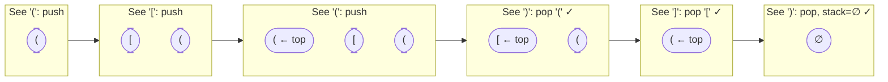
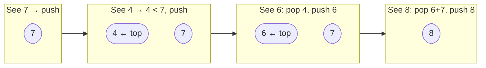

# Stack Algorithm Guide

> **Core idea:** a stack resolves **deferred context in reverse order** — push something you can't handle yet, pop it the moment its resolver arrives. If the problem has nesting, scope, or "undo the most recent thing," LIFO is the natural fit.

## ⚡ Cheatsheet

| Pattern | Reach for it when… | Mechanism |
| --- | --- | --- |
| LIFO Matching | paired delimiters, bracket validity | push openers; on each closer, pop and verify match |
| Expression Evaluation | postfix (RPN) or parenthesized infix | push operands; operator pops its two operands, pushes result |
| Scope Save/Restore | nested encoding, infix with `(` `)` | push outer state on `(`; restore and combine on `)` |
| Stack Simulation | collision / cancellation / undo | push survivors; `while` loop resolves current against stack top |
| Design with aux data | O(1) `getMin`, O(1) snapshots | pair each entry with extra context — pop restores the previous snapshot |
| [[Monotonic Stack]] | "next greater / smaller element", histogram max | maintain a sorted invariant; pop when invariant would break |

## How to think about it

A stack gives you one thing: **O(1) access to the most recently unresolved item, with O(1) removal.** That's the entire value proposition.

Every stack problem follows the same rhythm:

> **Encounter something you can't resolve yet → push it. Encounter its resolver → pop and act.**

The reason this is O(n) even when there's a `while` loop inside the outer loop: **each element is pushed at most once and popped at most once.** Total pops across the entire run cannot exceed `n`, so the amortized cost per element is O(1).

The discipline that prevents most bugs: **always guard `stack.pop()` with `if stack`** before you peek or pop. An empty stack means a closer arrived with no matching opener (invalid input), not a quirk to silently skip.

## The core patterns

### LIFO Matching — push unresolved openers, pop on closers

The most literal use of a stack. Push each "opener" you encounter. When a "closer" arrives, the stack top must be its matching opener — pop and verify. Valid input leaves the stack empty.

**Bracket matching trace** for `( [ ( ) ] )`:



See [[01.ValidParentheses|ValidParentheses]] for the canonical example — a 6-line loop with a dict mapping `')' → '('`.

### Expression Evaluation — operands wait for their operator

In postfix (RPN) notation, operands arrive before their operator. Push each operand; when an operator arrives, pop the two most recent operands (right first, then left), compute, push the result.

This works because postfix encodes precedence in token order — no parsing needed. The two most recent operands on the stack are always the correct inputs for the next operator.

```python
for token in tokens:
    if token in operators:
        right, left = stack.pop(), stack.pop()
        stack.append(apply(token, left, right))
    else:
        stack.append(int(token))
```

Python note: use `int(a / b)` not `a // b` when truncation toward zero is required — Python's `//` floors toward −∞.

See [[03.EvaluateReversePolishNotation|EvaluateReversePolishNotation]].

### Scope Save/Restore — push outer state on `(`, restore on `)`

When a `(` or `[` opens a new scope, push everything about the outer scope onto the stack and start fresh. When `)` or `]` closes the scope, pop the outer state and combine it with the inner result.

This is the same mechanism a call stack uses: entering `(` saves the outer scope's variables, and the matching `)` restores them and combines the results.

This handles arbitrarily deep nesting with O(depth) space. If the nesting depth is bounded, so is the stack.

### Stack Simulation — resolve collisions in LIFO order

Some problems need elements to interact: a new element may destroy one or more previous survivors, or be destroyed by them. The `while` loop is key:

```python
for element in elements:
    alive = True
    while alive and stack and should_collide(stack[-1], element):
        if element_wins(element, stack[-1]):
            stack.pop()               # survivor destroyed, element continues
        elif top_wins(element, stack[-1]):
            alive = False             # element destroyed
        else:
            stack.pop(); alive = False  # mutual destruction
    if alive:
        stack.append(element)
```

Each destroyed element is popped exactly once — total work is still O(n). See [[06.CarFleet|CarFleet]] for a right-to-left scan variant where "faster cars behind you" are the "collisions."

### Design: pair each entry with auxiliary data

[[02.MinStack|MinStack]] is the canonical example. To support O(1) `getMin`, store `(value, current_min)` as each entry. When you pop an entry, the entry below it already carries the correct min for the remaining stack — no recomputation ever happens.

The insight generalizes: **any snapshot you need after a pop can be stored alongside the item being pushed.**

### Monotonic Stack — resolve by value order, not arrival order

A monotonic stack maintains a sorted invariant (all-decreasing or all-increasing). When a new element breaks the invariant, pop until it's restored — those popped elements have just "found their answer."

This is a different algorithm from plain LIFO matching. The signal that you need it: "for each element, find the nearest greater/smaller value to its left/right." See [[05.DailyTemperatures|DailyTemperatures]] and [[07.LargestRectangleInHistogram|LargestRectangleInHistogram]] for the two canonical shapes.

**Monotonic decreasing stack** — processing `[7, 4, 6, 8]` to find next-warmer-day distances:



Popped elements have "found their answer" (the element that broke the invariant). Each element is pushed and popped at most once → **O(n)**.

The full template and proof of O(n) amortization live in [[Monotonic Stack]].

## How to approach a new problem

1. **Ask: is there something I can't resolve immediately?** If yes, a stack is a candidate. If every element can be handled the moment you see it, a stack adds nothing.
2. **Ask: is resolution in reverse order?** If the most recently deferred thing is always the next to resolve (closers match the latest opener; collisions hit the nearest survivor), that's LIFO. If resolution depends on value order rather than arrival order, reach for Monotonic Stack instead.
3. **Identify what to push.** Values when you need data to compare or compute; indices when you need positions for distance calculations; tuples when you need multiple pieces of context (value + running min, outer string + repeat count).
4. **Write the loop — outer `for`, inner `while`.** The outer loop advances through elements; the inner `while` resolves the current element against the stack. The guard is always `while stack and <condition>`.
5. **Guard every pop.** Before `stack[-1]` or `stack.pop()`, check `if stack`. Decide what an empty stack means for this problem (invalid input? no match? done?).
6. **Trace n = 0, 1, 2.** Empty input, single element, and the smallest two-element case catch almost every edge bug (extra closer, never-closed opener, single surviving element).

## Worked example: Generate Parentheses

[[04.GenerateParentheses|GenerateParentheses]] looks like a stack problem because of the bracket theme, but it's actually [[0.BacktrackingGuide|Backtracking]]. The key diagnostic: there's no "resolve a closer against an opener" step — instead you're *generating* all valid sequences, which requires exploring a choice tree. When you're building combinations rather than validating or evaluating, think backtracking, not stack.

The backtracking state happens to track open/close counts rather than a literal stack, but the underlying algorithm is [[DFS]] over a decision tree.

This is worth flagging because the bracket framing strongly implies stack — until you notice you're enumerating, not resolving.

## Interactive Walkthroughs

- [[Monotonic Stack]]: pushes, comparisons, multi-pop resolution, and pending indices
- [[06.SlidingWindowMaximum|Sliding Window Maximum]]: deque expiry, back pops, and current maximum

## Problems Covered

| Problem | Primary pattern |
| --- | --- |
| [[01.ValidParentheses\|Valid Parentheses]] | LIFO matching |
| [[02.MinStack\|Min Stack]] | Stack with auxiliary state |
| [[03.EvaluateReversePolishNotation\|Evaluate Reverse Polish Notation]] | Expression evaluation |
| [[04.GenerateParentheses\|Generate Parentheses]] | Backtracking over valid states |
| [[05.DailyTemperatures\|Daily Temperatures]] | Monotonic stack |
| [[06.CarFleet\|Car Fleet]] | Sorting + monotonic stack |
| [[07.LargestRectangleInHistogram\|Largest Rectangle in Histogram]] | Monotonic stack |

## When a stack is the wrong tool

- **"For each position, find the nearest greater/smaller value."** That's Monotonic Stack — it resolves by value comparison, not arrival order. A plain LIFO stack loses the index and can't write the answer back.
- **Processing order is FIFO.** [[BFS]], task scheduling, and sliding-window expiry all need elements in the order they arrived. Use a `collections.deque`.
- **You need to access elements by position.** Stacks only expose the top. Random access → array or [[Hash Map]].
- **The decision depends on future elements in a non-LIFO way.** If the right action at step `i` depends on an element far ahead (not the next closer/operator), you likely need [[Dynamic Programming]] or [[0.GreedyGuide|Greedy]].
- **Deep [[Recursion|recursion]] with no repeated subproblems.** Recursive DFS already uses the call stack implicitly. Converting to an explicit stack helps only to avoid Python's ~1000-frame recursion limit, not to change the algorithm.

## 🐍 Python Tricks

Idioms that keep stack code short and bug-free. General syntax: [[Python Cheatsheet]].

**A plain `list` already is the stack — `append`/`pop()` are both O(1), no import needed.**
```python
stack = []
stack.append(x)
top = stack.pop()
```

**`stack and stack[-1] == x` peeks safely — short-circuit evaluation skips the peek the moment the stack is empty.**
```python
pairs = {')': '(', ']': '[', '}': '{'}
if stack and stack[-1] == pairs[ch]:
    stack.pop()
```

**Push the index, not the value, whenever the answer needs a distance or width back.**
```python
for i, t in enumerate(temperatures):
    while stack and t > temperatures[stack[-1]]:
        j = stack.pop()
        answer[j] = i - j
    stack.append(i)
```

**The monotonic-stack pop is always `while stack and <invariant breaks>: stack.pop()` — memorize the shape, swap only the comparison.**
```python
while stack and heights[i] < heights[stack[-1]]:
    stack.pop()
stack.append(i)
```

**Unpacking `right, left = stack.pop(), stack.pop()` pops in the correct RPN order — the most recent push is always the right operand.**
```python
right, left = stack.pop(), stack.pop()
stack.append(left - right)   # not right - left
```

**Tuple-pack a running value alongside each entry so popping "restores" the previous state for free.**
```python
new_min = val if not stack else min(val, stack[-1][1])
stack.append((val, new_min))
cur_min = stack[-1][1]
```
