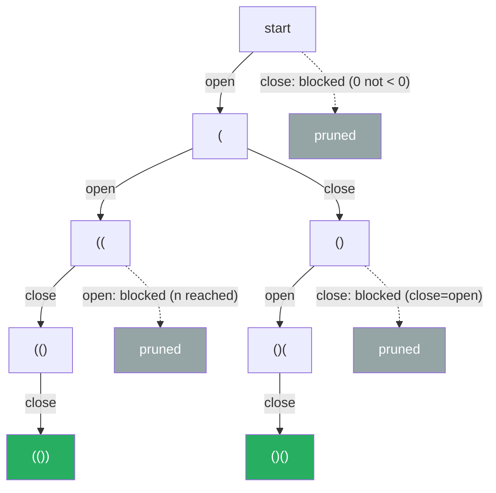

# 22. Generate Parentheses


Given n pairs of parentheses, write a function to generate all combinations of well-formed parentheses.

**Example 1:**
```
Input: n = 3
Output: ["((()))","(()())","(())()","()(())","()()()"]
```
**Example 2:**
```
Input: n = 1
Output: ["()"]
```

Constraints:

- 1 <= n <= 8

---

## Solution

### Intuition
Despite the "Stack" tag, this is a [[0.BacktrackingGuide|Backtracking]] problem: build strings one bracket at a time and only keep choices that can still lead to a valid sequence. The validity rule is simple, at any prefix the number of `)` placed must never exceed the number of `(`, and both end at `n`.

### Approach
Recurse carrying counts of open and close brackets used. Add `(` while `open < n`. Add `)` while `close < open` (never closing more than is open). When the string reaches length `2n` it is a complete valid combination.

```python
class Solution:
    def generateParenthesis(self, n: int) -> list[str]:
        res: list[str] = []

        def backtrack(cur: list[str], open_count: int, close_count: int) -> None:
            if len(cur) == 2 * n:           # used all n pairs
                res.append("".join(cur))
                return
            if open_count < n:              # can still open
                cur.append("(")
                backtrack(cur, open_count + 1, close_count)
                cur.pop()                   # undo choice (backtrack)
            if close_count < open_count:    # only close what is open
                cur.append(")")
                backtrack(cur, open_count, close_count + 1)
                cur.pop()

        backtrack([], 0, 0)
        return res
```

> The single constraint `close_count < open_count` is what guarantees well-formed output, it prevents ever writing a `)` that has no matching `(`.

### Walkthrough
Trace `n = 2` (only valid paths shown):

| cur | open | close | next allowed |
|-----|------|-------|--------------|
| `` | 0 | 0 | add `(` |
| `(` | 1 | 0 | add `(` or `)` |
| `((` | 2 | 0 | add `)` |
| `(()` | 2 | 1 | add `)` |
| `(())` | 2 | 2 | record |
| `()` | 1 | 1 | add `(` |
| `()(` | 2 | 1 | add `)` |
| `()()` | 2 | 2 | record |

Output `["(())", "()()"]`.

**Decision tree for `n = 2`, invalid branches pruned before they're ever built:**



### Complexity
- **Time:** O(4^n / sqrt(n)). The count of valid sequences is the nth Catalan number, and each is built in O(n).
- **Space:** O(n) recursion depth (excluding the output list), the call stack is at most `2n` deep.

### Key concepts to review
- [[0.BacktrackingGuide|Backtracking]] - explore choices, prune invalid branches early, undo on return.
- [[Recursion]] - the depth-first construction of each candidate string.

### Common pitfalls
- Allowing `)` when `close_count >= open_count`, which produces malformed strings like `)(`.
- Forgetting to undo (`cur.pop()`) after recursing, corrupting sibling branches.
- Checking validity only at the leaf instead of pruning during construction, which is far slower.
