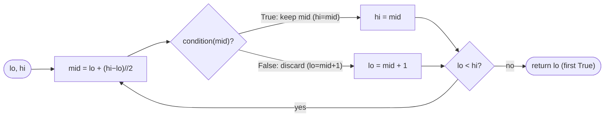
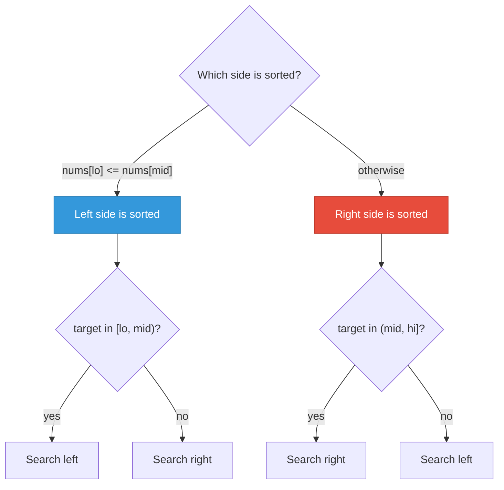

---
aliases:
  - Binary Search
---

# Binary Search Algorithm Guide

> **Core idea:** Binary search works when a condition changes only once across an ordered range. Repeatedly check the middle and remove the half that cannot contain the answer. The range can hold array indices, speeds, capacities, or other possible answers.

## ⚡ Cheatsheet

| Pattern | Reach for it when… | Mechanism |
| --- | --- | --- |
| Binary search on index | sorted array, find position or first/last occurrence | check `nums[mid]`; move `left` or `right` |
| Binary search on answer | "minimize the max" / "maximize the min" / "smallest feasible X" | search the answer range; use a feasibility check |
| Structural invariant search | rotated or modified array with one break | compare `mid` to an endpoint to find the sorted half |

## How to think about it

Binary search **halves the remaining search range at each step**. This reduces an O(n) scan to O(log n). It only works when the following rule holds:

> **The condition you evaluate at `mid` must be monotonic.** Once it becomes True, it must stay True, or the reverse. If it changes back and forth, binary search can return the wrong answer without an error.

The main skill is recognizing this rule and writing a condition that follows it. Sorted arrays already provide the needed order. Optimization problems need one extra step, but the process is repeatable:

1. Reframe the optimization as "find the smallest `k` where `feasible(k)` is True."
2. Confirm that if `feasible(k)` is True, then `feasible(k+1)` is also True (or the mirror: once False it stays False).
3. Set `lo` and `hi` wide enough to contain every possible answer.
4. Run the template; the boundary is your answer.

This is called **binary search on the answer**. It separates the solution into a reusable search loop and a feasibility check with the problem-specific logic.

For a basic exact-match search, trace `target = 15` in `nums = [2, 7, 11, 15, 20]`:

| `left` | `right` | `mid` | `nums[mid]` | Check | Action |
| --- | --- | --- | --- | --- | --- |
| 0 | 4 | 2 | 11 | `11 < 15` | Set `left = 3` |
| 3 | 4 | 3 | 15 | `15 == target` | Return `3` |

The search checks two positions instead of scanning all five values.

## The two templates

### Template 1: Find First True

Use this template for "smallest feasible X," "minimum capacity," or "first position where ..."

```python
def binary_search(lo: int, hi: int) -> int:
    def condition(mid: int) -> bool:
        pass  # problem-specific

    while lo < hi:
        mid = lo + (hi - lo) // 2
        if condition(mid):
            hi = mid        # mid might be the answer; don't discard it
        else:
            lo = mid + 1    # mid definitely isn't; discard it
    return lo               # lo == hi == first True
```

**Invariant:** `lo` is the lowest candidate that has not been ruled out, and `hi` is the highest. When they meet, only the first True candidate remains.



### Template 2: Find Last True

Template 2 reverses the boundary direction from Template 1. Use it for "largest feasible X" or "last position where ..."

```python
def binary_search_last(lo: int, hi: int) -> int:
    def condition(mid: int) -> bool:
        pass

    while lo < hi:
        mid = lo + (hi - lo + 1) // 2   # round up to avoid an infinite loop
        if condition(mid):
            lo = mid        # mid might be the answer; keep it as lo
        else:
            hi = mid - 1
    return lo
```

**Why round up?** When `lo + 1 == hi`, rounding down gives `mid == lo`, so `lo = mid` does not change the range. Rounding up gives `mid == hi`, which lets one branch shrink the range.

**Three things to customize per problem:**
1. **Boundaries:** `lo` and `hi` must include all possible answers. When unsure, use a wider range.
2. **Condition:** the monotonic True or False check.
3. **Return value:** `lo`, or `lo - 1` for the last False value.

### Classic exact-match template

When you need to find a specific target instead of a boundary, use the three-branch form. When `lo == hi`, there is still one candidate left to check, so the loop uses `lo <= hi`.

```python
def search(nums: list[int], target: int) -> int:
    lo, hi = 0, len(nums) - 1
    while lo <= hi:
        mid = lo + (hi - lo) // 2
        if nums[mid] == target:
            return mid
        elif nums[mid] < target:
            lo = mid + 1
        else:
            hi = mid - 1
    return -1
```

Use Template 1 / 2 when the problem asks for a boundary ("first/last position", "minimum feasible X"). Use the exact-match form when you need a hit-or-miss lookup. → [[01.BinarySearch|BinarySearch]]

## Patterns and motions

### Classic sorted-array search

The condition is immediate from sort order. `nums[mid] >= target` is monotonic because sorting guarantees everything left of the boundary is smaller and everything right is larger.

If the answer could be past the last element, such as an insertion position, set `hi = len(nums)` instead of `len(nums) - 1`. See [[01.BinarySearch|BinarySearch]] and [[02.SearchIn2DMatrix|SearchIn2DMatrix]] for direct applications.

### Binary search on the answer

The search space is a range of candidate answers, not array indices. The condition is a feasibility simulation: "can I achieve this threshold?"

Recipe:
- `lo` = smallest conceivable answer (often `max(arr)` or `1`)
- `hi` = largest conceivable answer (often `sum(arr)` or `max(arr)`)
- `condition(mid)` = [[0.GreedyGuide|greedy]] or simulation check that runs in O(n)

Total cost: O(n log m) where m = answer range size.

[[03.KokoEatingBananas|KokoEatingBananas]] is a clear example. The check asks whether Koko can finish within `h` hours at speed `mid`. That check fits inside a Template 1 loop.

### Structural invariant search

Rotated or bitonic arrays have exactly one "break point." You can't apply a simple value condition, but you *can* use the structure to determine which half is well-ordered and discard the safe half.

For a rotated array, compare `nums[mid]` to `nums[right]`:
- `nums[mid] <= nums[right]` → right half is sorted; the minimum is at `mid` or left of it
- otherwise → left half is sorted; the minimum is right of `mid`

The monotonicity here is structural, not value-based, but it holds just as strictly. See [[05.FindMinimumInRotatedSortedArray|FindMinimumInRotatedSortedArray]] and [[04.SearchInRotatedSortedArray|SearchInRotatedSortedArray]].

## How to approach a new problem

1. **Ask whether there is an ordered range with a monotonic condition.** The range could contain indices, values, speeds, days, or capacities. The condition must change exactly once.
2. **Write out the condition in English first.** "Can I achieve X if the parameter is `mid`?" If you can't phrase a clean boolean, binary search probably doesn't apply.
3. **Check monotonicity on three or four values by hand.** Pick `lo`, a middle value, and `hi`. Confirm the condition stays False and then stays True, or the reverse.
4. **Set boundaries wide.** `lo` = smallest possible answer, `hi` = largest. Extra range costs only O(log n) iterations.
5. **Choose the template.** "Smallest X that works" → Template 1. "Largest X that works" → Template 2. "Exact match" → three-branch `while lo <= hi` with early return.
6. **Write the condition as a named inner function.** It keeps the loop clean and forces you to reason about the function separately.
7. **Check the return value.** After the loop: `lo` = first True; `lo - 1` = last False. Make sure the boundary is actually achievable (not off-by-one at the edge of your range).
8. **Trace n = 1 and the edge of your range.** A single-element array, or `lo == hi` at the start, catches most boundary bugs.

## Worked example: binary search on the answer

`piles = [3, 6, 7, 11], h = 8`. Find the minimum eating speed.

**Why binary search applies:** if speed `k` lets Koko finish in time, any speed `k' > k` also works (eating faster never takes longer). The feasibility condition is monotonic: False for too-slow speeds, True for fast-enough speeds, with exactly one transition.

**Search space:** `lo = 1`, `hi = max(piles) = 11`. The answer must be in this range.

```python
def minEatingSpeed(piles: list[int], h: int) -> int:
    def feasible(speed: int) -> bool:
        return sum((pile - 1) // speed + 1 for pile in piles) <= h

    lo, hi = 1, max(piles)
    while lo < hi:
        mid = lo + (hi - lo) // 2
        if feasible(mid):
            hi = mid
        else:
            lo = mid + 1
    return lo
```

Tracing the key steps (feasibility condition: total hours ≤ 8):

| lo | hi | mid | hours at mid | feasible? | action   |
|----|----|----|-------------|-----------|----------|
| 1  | 11 | 6  | 6           | True      | hi = 6   |
| 1  | 6  | 3  | 10          | False     | lo = 4   |
| 4  | 6  | 5  | 8           | True      | hi = 5   |
| 4  | 5  | 4  | 8           | True      | hi = 4   |
| 4  | 4  | N/A | N/A | N/A | return 4 |

The minimum feasible speed is **4**. The loop only uses the True or False result. The `feasible` function handles the reason.

## Worked example: structural invariant

`nums = [4, 5, 6, 7, 0, 1, 2], target = 0`.

**The break point** splits the array into two sorted halves. At any `mid`, exactly one half is guaranteed sorted (the one whose endpoints are in order). You search the sorted half normally and discard it if the target isn't in its range.

```python
def search(nums: list[int], target: int) -> int:
    lo, hi = 0, len(nums) - 1
    while lo <= hi:
        mid = lo + (hi - lo) // 2
        if nums[mid] == target:
            return mid
        if nums[lo] <= nums[mid]:          # left half is sorted
            if nums[lo] <= target < nums[mid]:
                hi = mid - 1
            else:
                lo = mid + 1
        else:                              # right half is sorted
            if nums[mid] < target <= nums[hi]:
                lo = mid + 1
            else:
                hi = mid - 1
    return -1
```

The key insight: even though the array isn't fully sorted, you can always identify *one* sorted half and check in O(1) whether the target belongs there.

**Rotated array structure:** at least one half is sorted at any `mid`:



## Interactive Walkthroughs

- [[07.MedianOfTwoSortedArrays|Median of Two Sorted Arrays]]: partition cuts, boundary values, and direction changes

## Problems Covered

| Problem | Primary pattern |
| --- | --- |
| [[01.BinarySearch\|Binary Search]] | Exact-match binary search |
| [[02.SearchIn2DMatrix\|Search a 2D Matrix]] | Binary search on a flattened matrix |
| [[03.KokoEatingBananas\|Koko Eating Bananas]] | Binary search on the answer |
| [[04.SearchInRotatedSortedArray\|Search in Rotated Sorted Array]] | Structural invariant search |
| [[05.FindMinimumInRotatedSortedArray\|Find Minimum in Rotated Sorted Array]] | Structural invariant search |
| [[06.TimeBasedKeyValueStore\|Time Based Key-Value Store]] | Binary search on timestamps |
| [[07.MedianOfTwoSortedArrays\|Median of Two Sorted Arrays]] | Binary search on a partition |

## Complexity

- **Time:** O(log n) when each check takes O(1), because each step removes about half of the remaining candidates.
- **Binary search on the answer:** O(C log m), where `C` is the cost of one feasibility check and `m` is the size of the answer range.
- **Space:** O(1) for the iterative forms above. A recursive version uses O(log n) call-stack space.

## When it's the wrong tool

- **No monotonic condition.** If the condition alternates True/False/True over the domain, binary search converges to an arbitrary point. Use linear scan, [[Hash Map]], or [[DFS]]/[[BFS]].
- **Unstructured search space.** Binary search needs a linear, orderable domain. For "find target in unsorted array" use a Hash Map (O(1)) or linear scan.
- **You need all matches, not a boundary.** Binary search finds one transition point. If you need to enumerate all elements satisfying a condition, scan (optionally after binary-searching to the start).
- **Sorted, but two pointers wins.** "Do any two elements sum to target?" on a sorted array is O(n) with [[0.TwoPointerGuide|Two Pointers]], vs. O(n log n) with binary search per element. Reach for two pointers when you're scanning pairs in a sorted array.
- **Condition evaluation is O(n) and search space is also O(n).** You get O(n log n). Check whether a single O(n) pass (greedy, [[0.SlidingWindowGuide|Sliding Window]]) solves it directly.

## 🐍 Python Tricks

Idioms that keep binary search code short and bug-free. General syntax: [[Python Cheatsheet]].

**`(lo + hi) // 2` is safe in Python because Python integers do not overflow. Other languages may need `lo + (hi - lo) // 2`.**
```python
mid = (lo + hi) // 2
```

**`bisect_left` and `bisect_right` provide common boundary searches for sorted data. Check them before writing your own loop.**
```python
from bisect import bisect_left, bisect_right
bisect_left(nums, target)      # first index where nums[i] >= target
bisect_right(nums, target)     # first index where nums[i] > target
```

**`while lo < hi` and `while lo <= hi` are different templates. Mixing them can cause infinite loops or off-by-one errors.**
```python
while lo < hi:        # boundary search; ends with lo == hi
    ...
while lo <= hi:        # exact match; return from inside the loop
    ...
```

**Binary search on the answer uses Template 1 with a `feasible(x)` check. The loop stays the same.**
```python
while lo < hi:
    mid = (lo + hi) // 2
    lo, hi = (lo, mid) if feasible(mid) else (mid + 1, hi)
```

**Chained comparison collapses a 3-part range check into one line.**
```python
if nums[lo] <= target < nums[mid]:   # instead of two `and`-ed comparisons
    hi = mid - 1
```

**A `condition` or `feasible` function nested inside the search function can read `nums` and `target` without extra parameters.**
```python
def binary_search(lo, hi):
    def condition(mid):
        return nums[mid] >= target    # closes over nums, target
    ...
```
