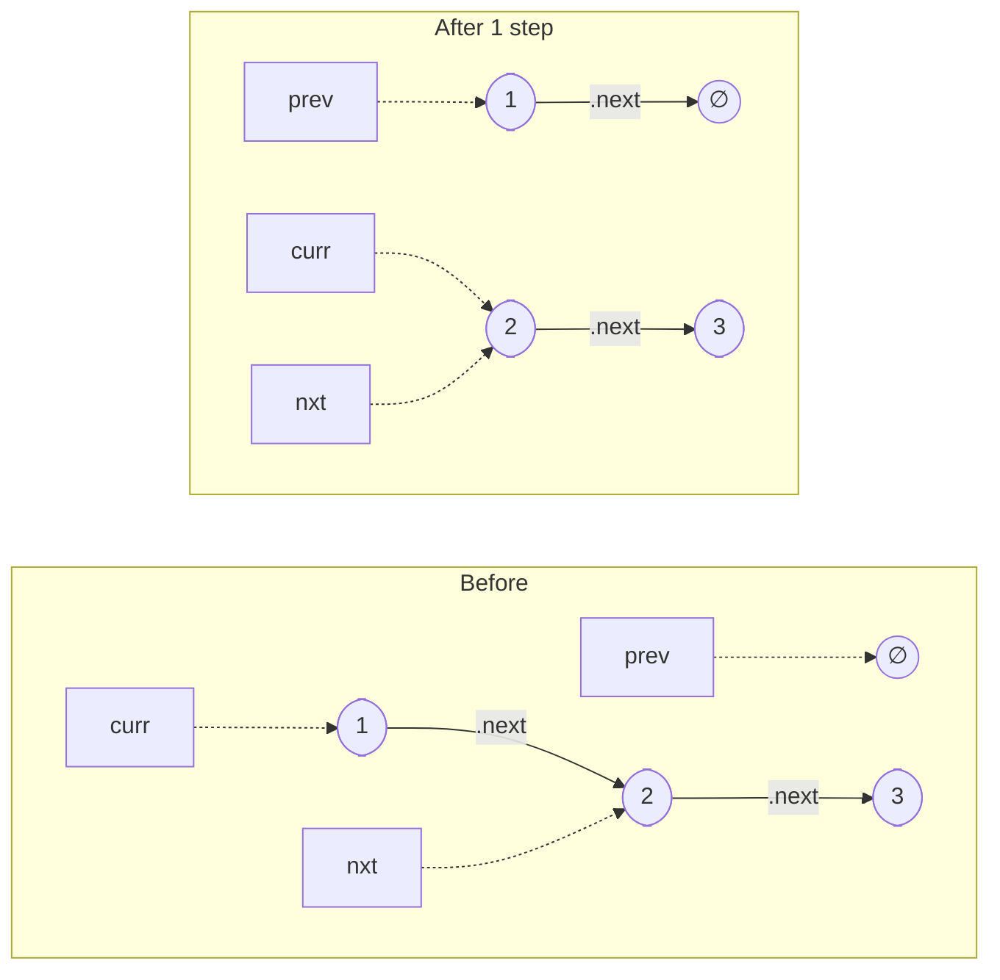
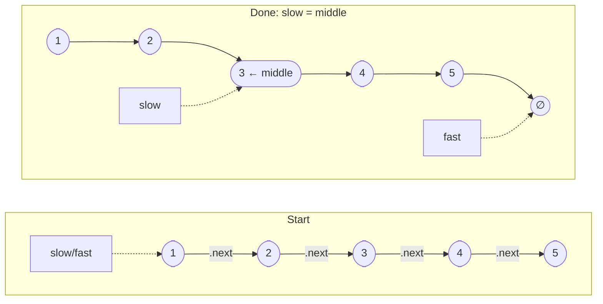

# Linked List Algorithm Guide

> **Core idea:** linked-list problems are **pointer rewiring**, not value editing. Everything reduces to redirecting `.next`. The one discipline that prevents most bugs: **save `nxt = curr.next` before you ever overwrite `curr.next`.**

## ⚡ Cheatsheet

| Pattern | Reach for it when… | Mechanism |
| --- | --- | --- |
| [[Linked List Reversal]] | you must flip order in place | three pointers: `prev`, `curr`, `nxt` |
| [[Fast & Slow Pointers]] | "middle", "cycle", "k-th from end" | two pointers at different speeds, or a fixed gap |
| [[Dummy Head]] | the head itself might change | sentinel node before head, return `dummy.next` |

## How to think about it

A linked list gives you one superpower an array doesn't: **O(1) structural edits** — splice a node out, cut the list in two, stitch two lists together — as long as you hold a pointer to the spot. In exchange it takes away random access (reaching index `k` is O(k)) and you can *never look backward* from a node.

So every linked-list problem is the same game:

> **position a pointer where the edit happens, rewire, and never lose the rest of the list.**

Losing the rest of the list is the cardinal sin. The moment you run `curr.next = prev`, you've overwritten your only reference to everything after `curr`. That's why every rewiring loop follows the same three-beat rhythm:

```python
nxt = curr.next          # 1. SAVE the link you're about to destroy
curr.next = prev         # 2. REWIRE
prev, curr = curr, nxt   # 3. ADVANCE
```

Once that rhythm is automatic, reversal, k-group reversal, and reorder all become the same motion.

**Reversal in progress** — solid arrows are `.next` links; dashed arrows show pointer variables:



**Fast & Slow — finding the middle** (slow moves ×1, fast moves ×2):



## The three motions

### Reversal — flip each `.next` to point backward
You walk the list once, and at each node you bend its arrow back toward the node you just left. `prev` trails as the head of the already-reversed part; `curr` is the frontier. Nothing is copied — only pointers move, so it's O(1) space. This is the atom that **Reverse Nodes in k-Group** repeats on fixed-size chunks. → [[Linked List Reversal]]

### Fast & Slow — two pointers at different speeds
Send one pointer 2× as fast as the other. Two consequences fall out for free:
- **Middle:** when `fast` runs off the end, `slow` is exactly halfway.
- **Cycle:** if the list loops, the gap between them shrinks by 1 every step, so they *must* collide — there's no way for fast to "jump over" slow. The same idea finds a duplicate number when you treat values as indices. → [[Fast & Slow Pointers]] (incl. the proof for locating the cycle's start)

### Dummy Head — a fake node so the head is never a special case
If the head can be deleted or replaced, naive code needs a separate `if` branch for "what if it's the first node?". A sentinel node sitting *before* the real head erases that branch: you always operate on `dummy.next`, and you always return `dummy.next` at the end — even if every original node was removed. Use it whenever you **build, merge, or remove**. → [[Dummy Head]]

## How to approach a new problem

1. **Draw 4–5 nodes on paper.** Linked-list bugs hide in your head and surface on paper. Sketch the arrows for a concrete small input before writing anything.
2. **Ask: does the head change?** If nodes get removed, inserted, or reordered at the front, start with a Dummy Head. If not, you can usually work off `head` directly.
3. **Pick the motion from the signal.** Structural flip → Linked List Reversal; middle / cycle / k-th-from-end → Fast & Slow Pointers; build / merge / remove → Dummy Head. Many problems need two or three (next section).
4. **Name every pointer and what it guards.** e.g. `prev` = tail of the finished part, `curr` = frontier, `nxt` = the saved rest. If you can't name them, you don't have the algorithm yet — keep sketching.
5. **Write the loop with the three-beat rhythm** (save → rewire → advance). Never overwrite a `.next` you haven't saved into `nxt`.
6. **Re-stitch the seams.** After cutting or reversing a segment, ask which `.next` now dangles, and point the old tail to `None` or to the next segment's head.
7. **Trace n = 0, 1, 2.** Empty list, single node, and the smallest case that actually enters the loop catch almost every edge bug.

## Composing motions: Reorder List

The reason these three are worth drilling: hard problems are just **compositions** of them. `1→2→3→4→5` → `1→5→2→4→3` is find-middle, then reverse-second-half, then interleave — three motions back to back:

```python
def reorderList(head):
    # 1. Find middle  ([[Fast & Slow Pointers]])
    slow, fast = head, head
    while fast.next and fast.next.next:
        slow, fast = slow.next, fast.next.next

    # 2. Reverse second half  ([[Linked List Reversal]])
    prev, curr = None, slow.next
    slow.next = None                 # ← CUT here, or you create a cycle
    while curr:
        nxt = curr.next
        curr.next = prev
        prev, curr = curr, nxt

    # 3. Interleave the two halves
    first, second = head, prev
    while second:
        tmp1, tmp2 = first.next, second.next
        first.next = second
        second.next = tmp1
        first, second = tmp1, tmp2
```

The bug everyone hits is forgetting `slow.next = None`. Without that cut, the first half still points into the second half, and the interleave loops forever.

## Interactive Walkthroughs

- [[Fast & Slow Pointers]]: collision, reset, and cycle entrance
- [[Linked List Reversal]]: `prev`, `curr`, `nxt`, and pointer rewiring
- [[05.CopyListWithRandomPointer|Copy List with Random Pointer]]: interleave, random links, and separation
- [[03.ReorderList|Reorder List]]: middle, split, reverse, and alternating merge
- [[09.LRUCache|LRU Cache]]: promotion, misses, and least-recently-used eviction
- [[11.ReverseNodesInK-Group|Reverse Nodes in k-Group]]: group boundaries, pointer rewiring, and incomplete tail

## Problems Covered

| Problem | Primary pattern |
| --- | --- |
| [[01.ReverseLinkedList\|Reverse Linked List]] | Linked-list reversal |
| [[02.MergeTwoLinkedList\|Merge Two Sorted Lists]] | Dummy head + two-list merge |
| [[03.ReorderList\|Reorder List]] | Fast & slow pointers + reversal |
| [[04.RemoveNthNodeFromEndOfTheList\|Remove Nth Node From End of List]] | Fixed-gap pointers + dummy head |
| [[05.CopyListWithRandomPointer\|Copy List with Random Pointer]] | Hash map or interweaving copies |
| [[06.AddTwoNumbers\|Add Two Numbers]] | Dummy head + carry simulation |
| [[07.LinkedListCycle\|Linked List Cycle]] | Fast & slow pointers |
| [[08.FindDuplicateNumber\|Find the Duplicate Number]] | Floyd's cycle detection |
| [[09.LRUCache\|LRU Cache]] | Hash map + doubly linked list |
| [[10.MergeKSortedLists\|Merge k Sorted Lists]] | Heap + linked-list merge |
| [[11.ReverseNodesInK-Group\|Reverse Nodes in k-Group]] | Fixed-size segment reversal |

## When a linked list is the wrong tool

- **Need index access or lookup by value?** That's O(n) here — use an array, or a [[Hash Map]] for O(1) lookup.
- **Need to traverse backward?** A singly linked list can't. Reverse it first, push onto a [[Stack|stack]], or switch to a doubly linked list.
- **Need O(1) lookup *and* O(1) reordering at once?** Combine both: a Hash Map (key → node) for instant find, plus a **doubly** linked list for O(1) move-to-front and eviction. That pairing is its own pattern — it's the entire trick behind an LRU cache.

## 🐍 Python Tricks

Idioms that keep linked-list code short and bug-free. General syntax: [[Python Cheatsheet]].

**`dummy = ListNode(0, head)` builds the sentinel and wires it to `head` in one line — return `dummy.next` at the end.**
```python
dummy = ListNode(0, head)
...
return dummy.next
```

**`if not head or not head.next: return head` covers the empty-list and single-node base cases in one guard.**
```python
def reverseList(head):
    if not head or not head.next:
        return head
```

**The reversal one-liner `curr.next, prev, curr = prev, curr, curr.next` works because the right side is fully evaluated before any assignment — but target order matters: `curr.next` must be set before `curr` itself is rebound, or it mutates the wrong node.**
```python
prev, curr = None, head
while curr:
    curr.next, prev, curr = prev, curr, curr.next
return prev
```

**`while fast and fast.next:` is the standard fast/slow guard — checking `fast` first short-circuits, so you never dereference `None.next` when `fast` walks off the end of an even-length list.**
```python
slow, fast = head, head
while fast and fast.next:
    slow, fast = slow.next, fast.next.next
```

**Tuple-assign to snapshot pointers before relinking — the whole right side is read before any rebind, so `tmp1, tmp2 = first.next, second.next` captures both nexts before the surgery below touches them.**
```python
tmp1, tmp2 = first.next, second.next
first.next = second
second.next = tmp1
first, second = tmp1, tmp2
```

**When only the value matters, copying `.val` is simpler than relinking — the classic trick for deleting a node given no access to its predecessor.**
```python
def deleteNode(node):
    node.val = node.next.val
    node.next = node.next.next
```
