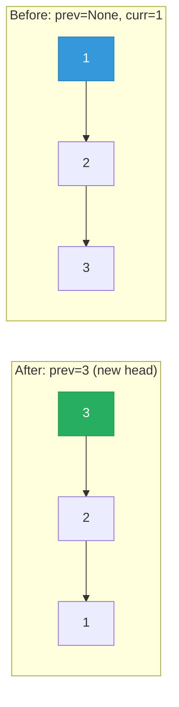

# 206. Reverse Linked List

Given the head of a singly linked list, reverse the list, and return the reversed list.


**Example 1:**

![[reverse-linked-list-example.svg]]

```
Input: head = [1,2,3,4,5]
Output: [5,4,3,2,1]
```

**Example 2:**

```
Input: head = [1,2]
Output: [2,1]
```

**Example 3:**
```
Input: head = []
Output: []
```

Constraints:

- The number of nodes in the list is the range [0, 5000].
- -5000 <= Node.val <= 5000
 

### Follow up: A linked list can be reversed either iteratively or recursively. Could you implement both?

---

## Solution

### Intuition
Reversing a [[Linked List]] means flipping every `next` pointer to point backwards. Walk the list once, and for each node redirect its `next` to the previous node. This is the canonical [[Linked List Reversal|In-place Reversal]] pattern that powers many harder list problems like [[03.ReorderList]] and [[11.ReverseNodesInK-Group]].

### Approach: Optimal (iterative)
Keep three pointers: `prev` (already-reversed portion), `curr` (node being processed), and a saved `next` so we do not lose the rest of the list when we overwrite `curr.next`.

```python
# Definition for singly-linked list.
# class ListNode:
#     def __init__(self, val=0, next=None):
#         self.val = val
#         self.next = next
from typing import Optional

class Solution:
    def reverseList(self, head: Optional[ListNode]) -> Optional[ListNode]:
        prev = None
        curr = head
        while curr:
            nxt = curr.next   # save the rest before we overwrite the pointer
            curr.next = prev  # flip this node's link backwards
            prev = curr       # advance prev into the reversed portion
            curr = nxt        # advance curr to the next original node
        return prev           # prev is the new head
```

> The order inside the loop matters: you must save `curr.next` before reassigning it, otherwise the link to the remaining nodes is lost.

A recursive version reverses the tail first, then fixes the two-node link `head.next.next = head`:

```python
class Solution:
    def reverseList(self, head: Optional[ListNode]) -> Optional[ListNode]:
        if not head or not head.next:
            return head
        new_head = self.reverseList(head.next)
        head.next.next = head  # make the next node point back to head
        head.next = None       # head becomes the new tail
        return new_head
```

### Walkthrough
Input `1 -> 2 -> 3`:



| step | prev | curr | action |
|------|------|------|--------|
| start | None | 1 | - |
| 1 | 1 | 2 | 1.next = None |
| 2 | 2 | 3 | 2.next = 1 |
| 3 | 3 | None | 3.next = 2 |

Final output: `3 -> 2 -> 1`.

### Complexity
- **Time:** O(n). Each node is visited exactly once.
- **Space:** O(1) iterative. The recursive version is O(n) due to the call stack.

### Key concepts to review
- [[Linked List]] - sequential nodes connected by `next` pointers.
- [[Linked List Reversal|In-place Reversal]] - flipping pointers without extra storage; building block for [[03.ReorderList]] and [[11.ReverseNodesInK-Group]].
- [[Recursion]] - the recursive variant reverses the sublist then re-links.
- [[Big-O Notation]] - O(1) vs O(n) space tradeoff between the two approaches.

### Common pitfalls
- Forgetting to save `curr.next` before overwriting it, which severs the rest of the list.
- Returning `head` instead of `prev`; after the loop the original head is the new tail.
- In the recursive version, forgetting `head.next = None`, which leaves a cycle between the last two nodes.
