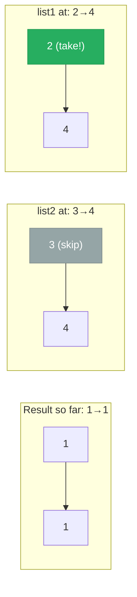

# 21. Merge Two Sorted Lists

You are given the heads of two sorted linked lists list1 and list2.

Merge the two lists in a one sorted list. The list should be made by splicing together the nodes of the first two lists.

Return the head of the merged linked list.

 
**Example 1:**

![[merge-two-sorted-lists-example.svg]]

```
Input: list1 = [1,2,4], list2 = [1,3,4]
Output: [1,1,2,3,4,4]
```

**Example 2:**
```
Input: list1 = [], list2 = []
Output: []
```

**Example 3:**
```
Input: list1 = [], list2 = [0]
Output: [0]
```

Constraints:

The number of nodes in both lists is in the range [0, 50].
-100 <= Node.val <= 100
Both list1 and list2 are sorted in non-decreasing order.

---

## Solution

### Intuition
Both inputs are sorted, so we can merge them like the merge step of merge sort: repeatedly take the smaller head and splice it into the result. A [[Dummy Head|Dummy Node]] removes the awkward special case of choosing the first node and tracking the head separately.

### Approach: Optimal
Use a dummy head and a `tail` pointer. While both lists have nodes, append the smaller one and advance. When one list runs out, attach the remainder of the other in a single step. This same merge is the core of [[10.MergeKSortedLists]].

```python
# Definition for singly-linked list.
# class ListNode:
#     def __init__(self, val=0, next=None):
#         self.val = val
#         self.next = next
from typing import Optional

class Solution:
    def mergeTwoLists(self, list1: Optional[ListNode], list2: Optional[ListNode]) -> Optional[ListNode]:
        dummy = ListNode()   # sentinel so we never special-case the head
        tail = dummy
        while list1 and list2:
            if list1.val <= list2.val:
                tail.next = list1
                list1 = list1.next
            else:
                tail.next = list2
                list2 = list2.next
            tail = tail.next
        tail.next = list1 or list2  # attach whatever remains
        return dummy.next
```

> The [[Dummy Head|Dummy Node]] lets `tail.next = ...` work uniformly, so there is no branch for "is this the first node we are adding?"

### Walkthrough
`list1 = 1 -> 2 -> 4`, `list2 = 1 -> 3 -> 4`:



| compare | take | result so far |
|---------|------|---------------|
| 1 vs 1 | list1's 1 | 1 |
| 2 vs 1 | list2's 1 | 1,1 |
| 2 vs 3 | 2 | 1,1,2 |
| 4 vs 3 | 3 | 1,1,2,3 |
| 4 vs 4 | list1's 4 | 1,1,2,3,4 |
| list1 empty | attach list2's 4 | 1,1,2,3,4,4 |

Final output: `1 -> 1 -> 2 -> 3 -> 4 -> 4`.

### Complexity
- **Time:** O(n + m). Each node from both lists is visited once.
- **Space:** O(1). We rewire existing nodes; no new nodes are created.

### Key concepts to review
- [[Linked List]] - splicing existing nodes by reassigning `next`.
- [[Dummy Head|Dummy Node]] - sentinel head that avoids first-node special casing; reused in [[04.RemoveNthNodeFromEndOfTheList]] and [[06.AddTwoNumbers]].
- [[0.TwoPointerGuide|Two Pointer]] - one cursor per input list advancing independently.

### Common pitfalls
- Using `<` instead of `<=` is fine for correctness but be consistent so the merge is stable.
- Forgetting to attach the leftover list after the loop, dropping the tail of the longer list.
- Returning `dummy` instead of `dummy.next`.
