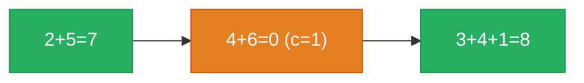

# 2. Add Two Numbers


You are given two non-empty linked lists representing two non-negative integers. The digits are stored in reverse order, and each of their nodes contains a single digit. Add the two numbers and return the sum as a linked list.

You may assume the two numbers do not contain any leading zero, except the number 0 itself.

 

**Example 1:**

![[add-two-numbers-example.svg]]

```
Input: l1 = [2,4,3], l2 = [5,6,4]
Output: [7,0,8]
Explanation: 342 + 465 = 807.
```

**Example 2:**
```
Input: l1 = [0], l2 = [0]
Output: [0]
```

**Example 3:**

```
Input: l1 = [9,9,9,9,9,9,9], l2 = [9,9,9,9]
Output: [8,9,9,9,0,0,0,1]
```

Constraints:

- The number of nodes in each linked list is in the range [1, 100].
- 0 <= Node.val <= 9
- It is guaranteed that the list represents a number that does not have leading zeros.

---

## Solution

### Intuition
The digits are stored least-significant-first, which is exactly the order you add by hand: sum corresponding digits, write the ones place, carry the rest. Walk both lists together tracking a `carry`, and use a [[Dummy Head|Dummy Node]] to build the result list cleanly.

### Approach: Optimal
Iterate while either list has digits left or there is a carry. Treat a missing node as 0, compute `sum = d1 + d2 + carry`, append `sum % 10`, and update `carry = sum // 10`.

```python
# Definition for singly-linked list.
# class ListNode:
#     def __init__(self, val=0, next=None):
#         self.val = val
#         self.next = next
from typing import Optional

class Solution:
    def addTwoNumbers(self, l1: Optional[ListNode], l2: Optional[ListNode]) -> Optional[ListNode]:
        dummy = ListNode()
        curr = dummy
        carry = 0
        while l1 or l2 or carry:
            v1 = l1.val if l1 else 0   # missing digit counts as 0
            v2 = l2.val if l2 else 0
            total = v1 + v2 + carry
            carry, digit = divmod(total, 10)
            curr.next = ListNode(digit)
            curr = curr.next
            l1 = l1.next if l1 else None
            l2 = l2.next if l2 else None
        return dummy.next
```

> Including `carry` in the loop condition handles the final carry-out (e.g. 5 + 5 = 10) without a separate trailing-node check.

### Walkthrough
`l1 = 2 -> 4 -> 3` (342), `l2 = 5 -> 6 -> 4` (465):



| digits | sum + carry | digit | carry |
|--------|-------------|-------|-------|
| 2 + 5 | 7 | 7 | 0 |
| 4 + 6 | 10 | 0 | 1 |
| 3 + 4 + 1 | 8 | 8 | 0 |

Final output: `7 -> 0 -> 8` (807).

### Complexity
- **Time:** O(max(n, m)). One pass over the longer list.
- **Space:** O(max(n, m)) for the result list (O(1) auxiliary).

### Key concepts to review
- [[Linked List]] - build a new list node by node behind a sentinel.
- [[Dummy Head|Dummy Node]] - avoids special-casing the first result digit; see [[02.MergeTwoLinkedList]].
- [[0.TwoPointerGuide|Two Pointer]] - advance through both inputs in lockstep, padding short list with zeros.

### Common pitfalls
- Dropping the final carry by not including `carry` in the loop condition.
- Dereferencing `l1.next`/`l2.next` after a list has ended; guard with `if l1`.
- Confusing `sum % 10` (digit) with `sum // 10` (carry); `divmod` keeps them straight.
