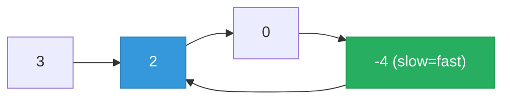

# 141. Linked List Cycle


Given head, the head of a linked list, determine if the linked list has a cycle in it.

There is a cycle in a linked list if there is some node in the list that can be reached again by continuously following the next pointer. Internally, pos is used to denote the index of the node that tail's next pointer is connected to. Note that pos is not passed as a parameter.

Return true if there is a cycle in the linked list. Otherwise, return false.

 

**Example 1:**

![[linked-list-cycle-example.svg]]

```
Input: head = [3,2,0,-4], pos = 1
Output: true
Explanation: There is a cycle in the linked list, where the tail connects to the 1st node (0-indexed).
```

**Example 2:**

![[linked-list-cycle-example-2.svg]]

```
Input: head = [1,2], pos = 0
Output: true
Explanation: There is a cycle in the linked list, where the tail connects to the 0th node.
```

**Example 3:**
```
Input: head = [1], pos = -1
Output: false
Explanation: There is no cycle in the linked list.
```

Constraints:

- The number of the nodes in the list is in the range [0, 104].
- -10<sup>5</sup> <= Node.val <= 10<sup>5</sup>
- pos is -1 or a valid index in the linked-list.
 

### Follow up: Can you solve it using O(1) (i.e. constant) memory?

---

## Solution

### Intuition
Floyd's [[Fast & Slow Pointers|Fast and Slow Pointers]] (the tortoise and hare): move one pointer one step and another two steps. If there is a cycle, the fast pointer eventually laps the slow one and they meet; if there is no cycle, fast reaches the end. This needs only O(1) memory.

### Approach 1: Brute force (for contrast)
Store visited nodes in a [[Set]]; if you ever revisit a node, there is a cycle. Correct but O(n) extra space, which the follow-up forbids.

```python
class Solution:
    def hasCycle(self, head: Optional[ListNode]) -> bool:
        seen = set()
        while head:
            if head in seen:
                return True
            seen.add(head)
            head = head.next
        return False
```

### Approach 2: Optimal (Floyd's cycle detection)
```python
# Definition for singly-linked list.
# class ListNode:
#     def __init__(self, x):
#         self.val = x
#         self.next = None
from typing import Optional

class Solution:
    def hasCycle(self, head: Optional[ListNode]) -> bool:
        slow = fast = head
        while fast and fast.next:   # fast leads; if it hits None there is no cycle
            slow = slow.next        # 1 step
            fast = fast.next.next   # 2 steps
            if slow is fast:        # they meet only inside a cycle
                return True
        return False
```

> Checking `fast and fast.next` before advancing two steps is what prevents a None dereference; reaching that None is precisely the "no cycle" exit.

### Walkthrough
List `3 -> 2 -> 0 -> -4` with tail linking back to node `2`:



| step | slow | fast |
|------|------|------|
| 1 | 2 | 0 |
| 2 | 0 | 2 (wrapped) |
| 3 | -4 | -4 |

slow meets fast at `-4`, so return True.

### Complexity
- **Time:** O(n). Fast pointer closes the gap by one each step inside a cycle.
- **Space:** O(1). Two pointers, no auxiliary structure.

### Key concepts to review
- [[Fast & Slow Pointers|Fast and Slow Pointers]] - the core cycle-detection technique; reused in [[08.FindDuplicateNumber]].
- [[Linked List]] - cycles arise when a `next` points back to an earlier node.
- [[Set]] - the O(n)-space alternative used in the brute force.

### Common pitfalls
- Advancing without checking `fast.next`, causing a None dereference on acyclic lists.
- Comparing values (`slow.val == fast.val`) instead of node identity (`slow is fast`).
- Starting fast at `head.next` works too but changes the meeting logic; starting both at head is simplest.
