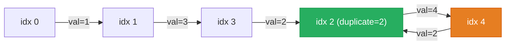

# 287. Find the Duplicate Number


Given an array of integers nums containing n + 1 integers where each integer is in the range [1, n] inclusive.

There is only one repeated number in nums, return this repeated number.

You must solve the problem without modifying the array nums and uses only constant extra space.

 

**Example 1:**

![[linked-list-find-duplicate-example.svg]]

```
Input: nums = [1,3,4,2,2]
Output: 2
```

**Example 2:**

```
Input: nums = [3,1,3,4,2]
Output: 3
```

Constraints:

- 1 <= n <= 105
- nums.length == n + 1
- 1 <= nums[i] <= n
- All the integers in nums appear only once except for precisely one integer which appears two or more times.
 

### Follow up:
- How can we prove that at least one duplicate number must exist in nums?
- Can you solve the problem in linear runtime complexity?

---

## Solution

### Intuition
Treat `nums` as an implicit linked list where index `i` points to `nums[i]`. Because every value is in [1, n] and there are n+1 elements, the duplicate creates a cycle: two indices map to the same value, forming a loop. Applying Floyd's [[Fast & Slow Pointers|Fast and Slow Pointers]] from [[07.LinkedListCycle]] detects the cycle and then locates the cycle's entry point, which is the duplicate.

### Approach 1: Brute force (for contrast)
Store seen values in a [[Set]]. Return the first value seen twice. O(n) time but O(n) space, which the constraints forbid.

```python
class Solution:
    def findDuplicate(self, nums: list[int]) -> int:
        seen = set()
        for v in nums:
            if v in seen:
                return v
            seen.add(v)
        return -1
```

### Approach 2: Optimal (Floyd's cycle detection)
Phase 1: detect a meeting point inside the cycle using slow (1 step) and fast (2 steps).
Phase 2: reset slow to index 0 and advance both one step at a time. They meet at the cycle entry, which is the duplicate value.

```python
class Solution:
    def findDuplicate(self, nums: list[int]) -> int:
        slow, fast = 0, 0

        # phase 1: find any meeting point inside the cycle
        while True:
            slow = nums[slow]           # 1 hop
            fast = nums[nums[fast]]     # 2 hops
            if slow == fast:
                break

        # phase 2: find the cycle entry (= the duplicate)
        slow = 0                        # reset one pointer to the start
        while slow != fast:
            slow = nums[slow]           # both move 1 hop now
            fast = nums[fast]
        return slow
```

> Phase 2 works because the distance from index 0 to the cycle entry equals the distance from the meeting point to the entry. Resetting one pointer to 0 and advancing both at speed 1 causes them to arrive at the entry simultaneously.

### Walkthrough
`nums = [1, 3, 4, 2, 2]` (indices 0-4, values act as "next pointers"):



Phase 1 hops (slow +1, fast +2 each step): slow `0 -> 1 -> 3 -> 2 -> 4`, fast `0 -> 3 -> 4 -> 4 -> 4`. They first coincide at index 4.

Phase 2: slow resets to 0; fast stays at the meeting point (index 4). Both advance one step each: slow `0 -> 1 -> 3 -> 2`, fast `4 -> 2 -> 4 -> 2`. They meet at index 2, so the duplicate is `2`.

### Complexity
- **Time:** O(n). Both phases are linear scans over at most n steps.
- **Space:** O(1). Only two index variables.

### Key concepts to review
- [[Fast & Slow Pointers|Fast and Slow Pointers]] - the same tortoise-and-hare used in [[07.LinkedListCycle]], applied to an array treated as an implicit list.
- [[Linked List]] - the array-as-graph mental model that makes Floyd's algorithm applicable here.
- [[Set]] - the O(n)-space alternative shown in the brute force.

### Common pitfalls
- Starting both pointers at index 0 (not value `nums[0]`) to avoid entering the "list" at a non-zero position.
- Forgetting phase 2: the phase-1 meeting point is inside the cycle, not necessarily at the entry.
- Trying to mark visited entries by negating values, which modifies the array (forbidden by constraints).
