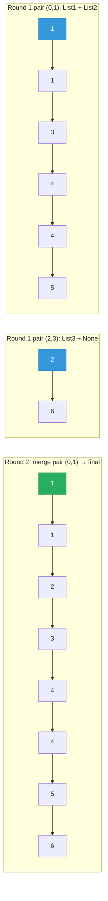

# 23. Merge k Sorted Lists


You are given an array of k linked-lists lists, each linked-list is sorted in ascending order.

Merge all the linked-lists into one sorted linked-list and return it.

 

**Example 1:**

![[merge-k-sorted-lists-example.svg]]

```
Input: lists = [[1,4,5],[1,3,4],[2,6]]
Output: [1,1,2,3,4,4,5,6]
Explanation: The linked-lists are:
[
  1->4->5,
  1->3->4,
  2->6
]
merging them into one sorted list:
1->1->2->3->4->4->5->6
```
**Example 2:**
```
Input: lists = []
Output: []
```
**Example 3:**
```
Input: lists = [[]]
Output: []
``` 

Constraints:

- k == lists.length
- 0 <= k <= 104
- 0 <= lists[i].length <= 500
- -10<sup>4</sup> <= lists[i][j] <= 10<sup>4</sup>
- lists[i] is sorted in ascending order.
- The sum of lists[i].length will not exceed 10<sup>4</sup>.

---

## Solution

### Intuition
Merging k lists naively by repeatedly picking the global minimum costs O(n * k). The key insight is to apply [[Divide and Conquer]]: repeatedly pair adjacent lists and merge each pair (reusing the two-list merge from [[02.MergeTwoLinkedList]]). After log(k) rounds only one list remains. This reduces total work to O(n log k).

### Approach 1: Brute force (for contrast)
Collect all values, sort, rebuild. O(n log n) time and O(n) space. Simple but wastes the fact that each input list is already sorted.

```python
class Solution:
    def mergeKLists(self, lists: list) -> None:
        vals = []
        for node in lists:
            while node:
                vals.append(node.val)
                node = node.next
        # rebuild from sorted values - O(n log n), O(n) space
```

### Approach 2: Optimal (iterative divide and conquer)
Each round, merge adjacent pairs and collect the results into a new list half as long. Repeat until one list remains. When a round has an odd count, the unpaired last list merges with `None` (a no-op) and carries into the next round. After ⌈log k⌉ rounds only the final merged list is left.

```python
# Definition for singly-linked list.
# class ListNode:
#     def __init__(self, val=0, next=None):
#         self.val = val
#         self.next = next
from typing import Optional

class Solution:
    def mergeKLists(self, lists: list[Optional[ListNode]]) -> Optional[ListNode]:
        def merge(a: Optional[ListNode], b: Optional[ListNode]) -> Optional[ListNode]:
            dummy = ListNode()
            cur = dummy
            while a and b:
                if a.val <= b.val:
                    cur.next = a
                    a = a.next
                else:
                    cur.next = b
                    b = b.next
                cur = cur.next
            cur.next = a or b   # attach the remaining tail
            return dummy.next

        if not lists:
            return None

        while len(lists) > 1:
            merged = []
            for i in range(0, len(lists), 2):
                a = lists[i]
                b = lists[i + 1] if i + 1 < len(lists) else None  # guard the odd tail
                merged.append(merge(a, b))
            lists = merged   # fresh half-length list, no stale, already-merged entries

        return lists[0]
```

> Building a fresh `merged` list each round (instead of overwriting `lists` in place) is what keeps this correct: an odd round leaves the count odd again, and an in-place scheme would re-merge a stale, already-consumed list from the tail, splicing already-linked nodes into a cycle that hangs `merge`.

### Walkthrough
`lists = [1->4->5, 1->3->4, 2->6]` (k=3; the odd tail List 3 pairs with None):



Round 1 (3 lists): merge (List 1, List 2) -> `1->1->3->4->4->5`. Merge (List 3, None) -> `2->6`. Two lists remain.
Round 2 (2 lists): merge the two -> `1->1->2->3->4->4->5->6`. One list remains.

Final output: `1->1->2->3->4->4->5->6`.

### Complexity
- **Time:** O(n log k). There are log(k) rounds, and each round touches all n total nodes across the merges.
- **Space:** O(k) auxiliary for the `merged` array of list heads each round (O(log k) call stack if merge were recursive). The output list reuses existing nodes.

### Key concepts to review
- [[Divide and Conquer]] - halving the problem each round is what achieves log(k) rounds.
- [[Linked List]] - merge rewires `next` pointers rather than copying values.
- [[Heap]] - an alternative O(n log k) approach: push all heads into a min-heap and pop one node at a time.
- [[Dummy Head|Dummy Node]] - the sentinel inside `merge` avoids special-casing the first appended node; see [[02.MergeTwoLinkedList]].

### Common pitfalls
- Overwriting `lists` in place while later indices still point at unmerged entries. If a round produces an odd count, a subsequent round can re-merge a stale, already-linked list and spin forever. Rebuilding a fresh list each round sidesteps it.
- Padding to even only once: after an odd round the count is odd again, so guard the last pair with `i + 1 < len(lists)` every round (or re-pad each round).
- Not handling an empty `lists` input before indexing into it.
