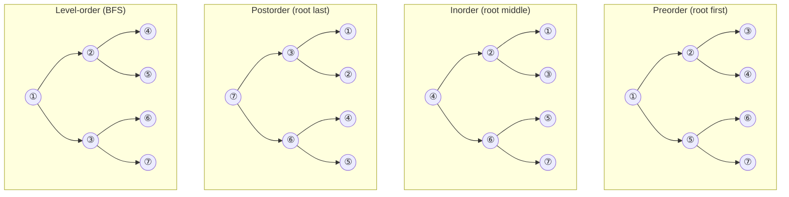
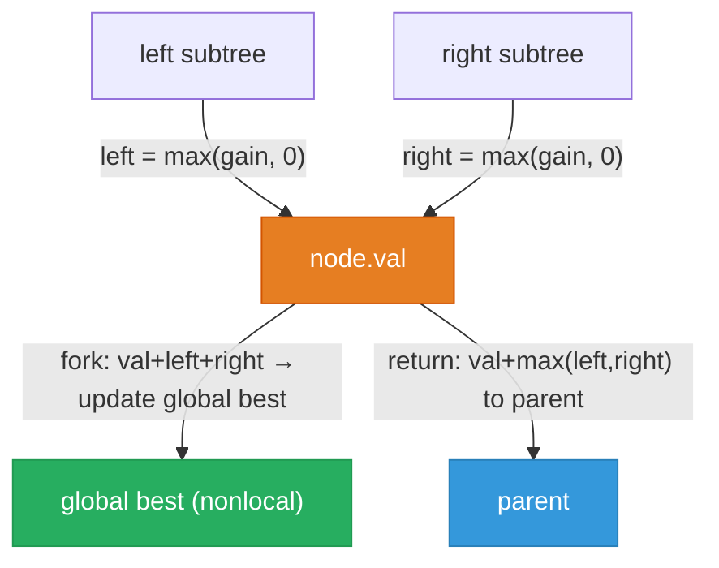

# Tree Algorithm Guide

> **Core idea:** every tree problem is the same question asked [[Recursion|recursively]] — **what do I compute at this node, and how do I combine the answers from its children?** The traversal order (pre / in / post / level) is just choosing *when* that computation fires relative to the recursive calls.

## ⚡ Cheatsheet

| Pattern | Reach for it when… | Mechanism |
| --- | --- | --- |
| [[DFS]] postorder | answer at a node depends on its children's results | recurse both sides first, then combine |
| [[DFS]] preorder | parent passes state *down* to children | process node first, then recurse |
| [[DFS]] inorder | need sorted order from a BST | left → node → right visits ascending |
| [[BFS]] level-order | answer depends on depth / level grouping | queue + `len(queue)` snapshot per level |
| [[0.BinarySearchGuide\|Binary Search]] on BST | search, insert, or validate in a BST | go left if `val < node.val`, right if greater |

## How to think about it

A tree gives you one thing for free that [[Graph|graphs]] don't: **no cycles, and a single path from root to any node**. That means you never need a `visited` [[Set|set]], and the call stack traces your path automatically.

Every recursive call returns a piece of information upward. The whole art of tree problems is figuring out **what to return** and **what order to visit children**:

- **Postorder** — children return results first; you combine them. Use when the answer at a node requires knowing the subtrees' answers (height, diameter, LCA, balance check).
- **Preorder** — you act on the node first, then recurse downward. Use when you're passing a constraint or accumulated value *down* (BST validation bounds, path sum target, serialize/invert).
- **Inorder** — left, then node, then right. On a BST this gives sorted ascending order. Use for k-th smallest, BST validation by sequence, or any "visit in sorted order" requirement.
- **Level-order (BFS)** — process all nodes at depth `d` before any at depth `d+1`. Use when the answer depends on depth or level boundaries (right-side view, minimum depth, level averages).

The [[Binary Search Tree|BST]] property — `left subtree < node < right subtree` — is a special constraint that lets you skip half the tree at every step, giving O(h) search instead of O(n).

**Traversal anatomy** — circled number = visit order; all four use the same 7-node tree, only the order changes:



## The core patterns

### Postorder — "recursion returns info" pattern

The most important tree pattern. Your function returns some piece of information per subtree; you combine left and right results at the current node.

```python
def height(node):
    if not node:
        return 0                             # base case: empty subtree
    left_h  = height(node.left)
    right_h = height(node.right)
    return 1 + max(left_h, right_h)         # combine bottom-up
```

The key discipline: **decide what your function returns, then trust that it returns the right thing for any subtree.** If you can state "this function returns X for any rooted subtree," the recursion writes itself.

When the answer isn't just the return value but a *side effect* across the whole tree (diameter, max path sum), use a nonlocal variable and have the function return a helper quantity (e.g., height) while tracking the best answer globally:

```python
def diameter_of_binary_tree(root):
    best = 0
    def height(node):
        nonlocal best
        if not node:
            return 0
        lh = height(node.left)
        rh = height(node.right)
        best = max(best, lh + rh)   # path through this node
        return 1 + max(lh, rh)
    height(root)
    return best
```

→ [[DFS]] (full postorder template in the concept note)

### Preorder — top-down propagation

Process the node *before* descending. The canonical use: passing a shrinking valid range down a BST to validate it.

```python
def is_valid_bst(root):
    def validate(node, lo, hi):
        if not node:
            return True
        if not (lo < node.val < hi):
            return False
        return (validate(node.left, lo, node.val) and
                validate(node.right, node.val, hi))
    return validate(root, float('-inf'), float('inf'))
```

Inversion ([[01.InvertBinaryTree|InvertBinaryTree]]) is also preorder: swap children first, recurse after. You don't need children's results — just act and descend.

#### Root-to-leaf accumulation — running value passed downward

A common preorder variant: pass an *accumulator* (not a constraint) downward and check it at every leaf. This is the skeleton for path-sum problems.

```python
def has_path_sum(root, target: int) -> bool:
    def dfs(node, remaining):
        if not node:
            return False
        if not node.left and not node.right:   # leaf: check accumulated value
            return remaining == node.val
        return (dfs(node.left,  remaining - node.val) or
                dfs(node.right, remaining - node.val))
    return dfs(root, target)
```

For **collecting all paths** (not just checking existence), carry a `path` list and append on entry / pop on return — standard [[0.BacktrackingGuide|Backtracking]] discipline applied to a tree.

The distinction from BST validation: there, the downward parameter is a *narrowing constraint* (`lo`, `hi`). Here, it's an *accumulator* that is checked for equality at leaves. Both are preorder, but the purpose differs.

### Inorder on BST — sorted sequence

Inorder on a BST visits nodes in strictly ascending order. This is the entire trick behind [[12.KthSmallestElementInABST|KthSmallestElementInABST]]: walk inorder, count until you hit `k`.

For early termination (stop as soon as you find the answer), use iterative inorder — it lets you pop exactly `k` times and bail:

```python
def kth_smallest(root, k):
    stack, curr = [], root
    while curr or stack:
        while curr:
            stack.append(curr)
            curr = curr.left
        curr = stack.pop()
        k -= 1
        if k == 0:
            return curr.val
        curr = curr.right
```

→ [[DFS]] (iterative inorder template)

### BFS — level-order

Snapshot `len(queue)` at the start of each outer loop to know exactly how many nodes belong to the current level. Everything enqueued *during* the inner loop belongs to the next level.

```python
from collections import deque
def level_order(root):
    if not root:
        return []
    result, queue = [], deque([root])
    while queue:
        level_size = len(queue)          # freeze the boundary
        level = []
        for _ in range(level_size):
            node = queue.popleft()
            level.append(node.val)
            if node.left:  queue.append(node.left)
            if node.right: queue.append(node.right)
        result.append(level)
    return result
```

→ [[BFS]]

## How to approach a new problem

1. **Draw 4–5 nodes on paper.** Tree bugs hide in your head and surface on diagrams. Sketch a concrete small input before writing anything.
2. **Ask: what does this node need from its children?** If it needs both children's results first → postorder. If it computes something and passes it down → preorder. If you need BST sorted order → inorder. If you need depth/level → BFS.
3. **Define what your recursive function returns.** Write it as a one-line contract: "returns the height of this subtree," "returns whether this subtree is a valid BST given bounds lo, hi." If you can't state it, you don't have the algorithm yet.
4. **Handle the base cases first.** `if not node: return ???` — what is the identity value? (0 for height, `True` for validity, `None` for a missing target.)
5. **Write the recurrence.** `left = f(node.left, ...)`, `right = f(node.right, ...)`, then combine. The combination is where the problem-specific logic lives.
6. **Check: does the answer live in a return value or a nonlocal?** If the answer might be at any node (max path sum, diameter), it's a nonlocal; the return value is just a helper (height, max gain).
7. **Trace null, single node, two nodes.** Empty tree, leaf, and smallest two-node tree catch almost every base-case bug.

## Worked example: Binary Tree Maximum Path Sum

[[14.BinaryTreeMaximumPathSum|BinaryTreeMaximumPathSum]] is the hardest postorder problem on the list — worth tracing explicitly because it trips people up.

**The problem:** a "path" can start and end anywhere in the tree. Find the maximum sum over all such paths.

**The key insight:** at each node, a path passing *through* it contributes `node.val + max(0, left_gain) + max(0, right_gain)`. But a path *continuing upward* can only go through *one* side (you can't branch left and right and still have a valid path for the parent to extend). So the function returns `node.val + max(0, left_gain, right_gain)` — the best single-branch gain — while tracking the two-branch candidate in a nonlocal.

```python
def max_path_sum(root):
    best = float('-inf')
    def gain(node):
        nonlocal best
        if not node:
            return 0
        left  = max(gain(node.left),  0)   # discard negative subtrees
        right = max(gain(node.right), 0)
        best = max(best, node.val + left + right)   # path through this node
        return node.val + max(left, right)           # best single branch upward
    gain(root)
    return best
```

**Why each node has two outputs** — the fork candidate tracked globally, and the single-branch gain returned upward:



The bug everyone hits: returning `node.val + left + right` instead of `node.val + max(left, right)`. That would fork the path — valid as a candidate (tracked in `best`), but wrong as the return value (the parent can only extend one branch).

## Interactive Walkthroughs

- [[15.SerializeAndDeserializeBinaryTree|Serialize and Deserialize Binary Tree]]: preorder token writing and tree reconstruction

## Problems Covered

| Problem | Primary pattern |
| --- | --- |
| [[01.InvertBinaryTree\|Invert Binary Tree]] | DFS preorder |
| [[02.MaxDepthOfBinaryTree\|Maximum Depth of Binary Tree]] | DFS postorder |
| [[03.DiameterOfABinaryTree\|Diameter of Binary Tree]] | DFS postorder + global maximum |
| [[04.BalancedBinaryTree\|Balanced Binary Tree]] | DFS postorder + height sentinel |
| [[05.SameTree\|Same Tree]] | Paired DFS traversal |
| [[06.SubtreeOfAnotherTree\|Subtree of Another Tree]] | DFS + subtree matching |
| [[07.LowsetCommonAncestorOfABinarySearchTree\|Lowest Common Ancestor of a Binary Search Tree]] | BST ordering |
| [[08.BinaryTreeLevelOrderTraversal\|Binary Tree Level Order Traversal]] | BFS level-order |
| [[09.BinaryTreeRightSideView\|Binary Tree Right Side View]] | BFS level-order |
| [[10.CountGoodNodesInBinaryTree\|Count Good Nodes in Binary Tree]] | DFS preorder + path maximum |
| [[11.ValidateBinarySearchTree\|Validate Binary Search Tree]] | DFS with bounds |
| [[12.KthSmallestElementInABST\|Kth Smallest Element in a BST]] | DFS inorder |
| [[13.ConstructBinaryTreeFromPreorderAndInorderTraversal\|Construct Binary Tree from Preorder and Inorder Traversal]] | Recursive tree construction |
| [[14.BinaryTreeMaximumPathSum\|Binary Tree Maximum Path Sum]] | DFS postorder + global maximum |
| [[15.SerializeAndDeserializeBinaryTree\|Serialize and Deserialize Binary Tree]] | DFS preorder serialization |

## When trees are the wrong tool

- **Structure has cycles or multiple parents?** You have a graph. Use BFS or DFS with a `visited` set.
- **Need O(1) lookup by value?** Tree lookup is O(h). Use a [[Hash Map]].
- **Need repeated min/max extraction?** Use a [[Heap]] — O(log n) per operation vs. O(n) per DFS scan.
- **Prefix matching on strings?** Use a [[0.TrieGuide|Trie]], not a binary tree.
- **Overlapping subproblems across different query parameters?** May need [[Dynamic Programming]] on trees ([[Memoization|memoization]] with a key that includes the node and its parameters).
- **Need to traverse "upward" through parents?** Standard tree DFS only goes down. Either pass parent info as a parameter, or convert to an undirected graph and BFS from the target node (the trick for "all nodes at distance K").

## 🐍 Python Tricks

Idioms that keep tree recursion short and bug-free. General syntax: [[Python Cheatsheet]].

**`if not node: return …` first — write the empty-subtree case before touching `node.left` or `node.right`.**
```python
def height(node):
    if not node:            # guards every attribute access below
        return 0
    return 1 + max(height(node.left), height(node.right))
```

**`nonlocal best` turns a nested helper into a global-answer tracker without threading an extra value through every return.**
```python
def diameter(root):
    best = 0
    def height(node):
        nonlocal best
        ...
        best = max(best, lh + rh)      # side-channel answer
        return 1 + max(lh, rh)         # value the parent actually needs
    height(root)
    return best
```

**Snapshot `level_size = len(queue)` before the inner loop — it freezes the level boundary so nodes enqueued during the loop aren't miscounted into the current level.**
```python
level_size = len(queue)
for _ in range(level_size):
    node = queue.popleft()
```

**Return a tuple to carry two facts up one traversal instead of writing two separate passes.**
```python
def dfs(node):
    if not node:
        return 0, True                    # height, is_balanced
    lh, lb = dfs(node.left)
    rh, rb = dfs(node.right)
    return 1 + max(lh, rh), lb and rb and abs(lh - rh) <= 1
```

**`float('-inf')` / `float('inf')` as the first call's bounds — no special-cased root check needed for BST validation.**
```python
def is_valid_bst(root):
    return validate(root, float('-inf'), float('inf'))
```

**A true leaf is `not node.left and not node.right` — checking only one side misses nodes with exactly one child.**
```python
if not node.left and not node.right:
    return remaining == node.val
```

**`max(gain(child), 0)` discards a negative subtree instead of letting it drag the running sum down.**
```python
left  = max(gain(node.left),  0)
right = max(gain(node.right), 0)
```
