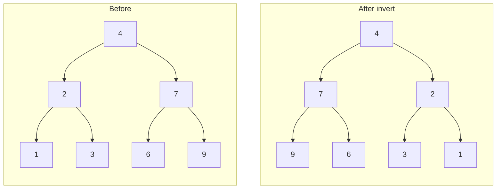

# [226. Invert Binary Tree](https://leetcode.com/problems/invert-binary-tree/)
Given the root of a binary tree, invert the tree, and return its root.

**Example 1:**

![[invert-binary-tree-example.svg]]

```
Input: root = [4,2,7,1,3,6,9]
Output: [4,7,2,9,6,3,1]
```

**Example 2:**

```
Input: root = [2,1,3]
Output: [2,3,1]
```

**Example 3:**

```
Input: root = []
Output: []
```

Constraints:
- The number of nodes in the tree is in the range [0, 100].
- -100 <= Node.val <= 100

---

## Solution

### Intuition
Inverting a [[Binary Tree]] is a classic post-order [[Recursion]] pattern: recursively invert the left and right subtrees, then swap them at the current node. The key insight is that swapping at any node is independent of what happens deeper down, so returning from the leaves upward guarantees both children are fully inverted before the swap.

### Approach: Optimal
Recurse to the base case (null node), then swap left and right children on the way back up. This is a post-order traversal.

A tempting first attempt, which contains a bug worth finding before reading on:

```python
# TreeNode definition:
# class TreeNode:
#     def __init__(self, val=0, left=None, right=None):
#         self.val = val
#         self.left = left
#         self.right = right

from typing import Optional

class Solution:
    def invertTree(self, root: Optional['TreeNode']) -> Optional['TreeNode']:
        # Base case: empty tree or leaf's missing child
        if root is None:
            return None

        # Recursively invert both subtrees first (post-order)
        root.left = self.invertTree(root.right)
        root.right = self.invertTree(root.left)

        # Return the now-inverted node
        return root
```

Wait - the snippet above has a subtle bug: the first line overwrites `root.left`, so the second call receives the already-inverted right subtree instead of the original left one. The original left subtree is lost, and the right subtree gets inverted twice. Fix with simultaneous assignment or temp variables:

```python
from typing import Optional

class Solution:
    def invertTree(self, root: Optional['TreeNode']) -> Optional['TreeNode']:
        if root is None:
            return None

        # Save right before overwriting it
        right = self.invertTree(root.right)
        left  = self.invertTree(root.left)

        root.left  = right  # place inverted-right on the left
        root.right = left   # place inverted-left on the right
        return root
```

> Both recursive calls must complete before the swap happens. Each call returns the root of the (now fully inverted) subtree, which is then assigned to the opposite side. This is why post-order (children first, current node last) is the natural order here.

### Walkthrough
Tree: `4 -> [2, 7]`, where `2 -> [1, 3]` and `7 -> [6, 9]`.



| Call | Action | Returns |
|------|--------|---------|
| invertTree(4) | recurses left and right | waits |
| invertTree(2) | recurses to 1, 3 | returns node 2 (left=3, right=1) |
| invertTree(7) | recurses to 6, 9 | returns node 7 (left=9, right=6) |
| back at 4 | left=node7, right=node2 | returns node 4 |

Result: `4 -> [7, 2]`, where `7 -> [9, 6]` and `2 -> [3, 1]`.

### Complexity
- **Time:** O(N). Every node is visited exactly once.
- **Space:** O(H). The call stack holds at most H frames, where H is the tree height. O(log N) for balanced, O(N) worst case (skewed tree).

### Key concepts to review
- [[Recursion]] - the recursive call returns the inverted subtree root, which is directly assignable.
- [[DFS|Depth-First Search]] - this is a DFS post-order traversal.
- [[Binary Tree]] - understand node structure and null-child conventions.
- [[02.MaxDepthOfBinaryTree]] - another post-order DFS that accumulates a result on the way up.

### Common pitfalls
- Swapping left and right in place before both recursive calls complete, causing one side to be lost.
- Forgetting the null base case, leading to AttributeError on `None.left`.
- Returning `None` instead of `root` at the end, discarding the entire subtree.
- Confusing pre-order (swap first, recurse later) vs post-order - both work here, but pre-order requires swapping before passing children to the recursive calls.
