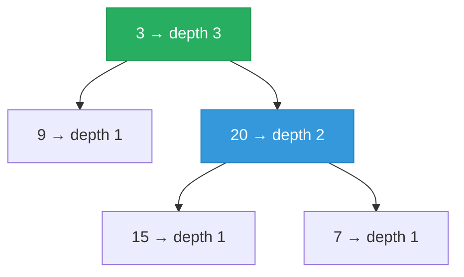

# 104. Maximum Depth of Binary Tree

Given the root of a binary tree, return its maximum depth.

A binary tree's maximum depth is the number of nodes along the longest path from the root node down to the farthest leaf node.

**Example 1:**

![[maximum-depth-binary-tree-example.svg]]

```
Input: root = [3,9,20,null,null,15,7]
Output: 3
```

**Example 2:**

```
Input: root = [1,null,2]
Output: 2
```

Constraints:
- The number of nodes in the tree is in the range [0, 104].
- -100 <= Node.val <= 100

---

## Solution

### Intuition
The maximum depth of a [[Binary Tree]] is defined recursively: the depth of any node is 1 plus the maximum depth of its two children. The base case is a null node, which has depth 0. This is a straightforward post-order [[Recursion]] pattern where each call returns a value that is used by its parent.

### Approach: Optimal
Recurse into both children, take the maximum of the two returned depths, and add 1 for the current node.

```python
# TreeNode definition:
# class TreeNode:
#     def __init__(self, val=0, left=None, right=None):
#         self.val = val
#         self.left = left
#         self.right = right

from typing import Optional

class Solution:
    def maxDepth(self, root: Optional['TreeNode']) -> int:
        # Base case: a null node contributes 0 to depth
        if root is None:
            return 0

        # Each recursive call returns the max depth of that subtree
        left_depth  = self.maxDepth(root.left)
        right_depth = self.maxDepth(root.right)

        # Add 1 to count the current node itself
        return 1 + max(left_depth, right_depth)
```

> The value flowing upward from each call is the depth of that subtree. A leaf node returns `1 + max(0, 0) = 1`, which is correct - a single node has depth 1.

### Walkthrough
Tree: `3 -> [9, 20]`, where `20 -> [15, 7]`.



| Call | Returns |
|------|---------|
| maxDepth(9) | 1 (leaf) |
| maxDepth(15) | 1 (leaf) |
| maxDepth(7) | 1 (leaf) |
| maxDepth(20) | 1 + max(1, 1) = 2 |
| maxDepth(3) | 1 + max(1, 2) = 3 |

### Complexity
- **Time:** O(N). Every node is visited exactly once.
- **Space:** O(H). The implicit call stack holds H frames. O(log N) for balanced trees, O(N) for skewed trees.

### Key concepts to review
- [[Recursion]] - the return value propagates depth information from leaves up to the root.
- [[DFS|Depth-First Search]] - this is a post-order DFS.
- [[Binary Tree]] - depth is measured in nodes, not edges.
- [[01.InvertBinaryTree]] - another simple post-order recursion on a binary tree.
- [[03.DiameterOfABinaryTree]] - extends this idea: diameter uses heights from both children simultaneously.

### Common pitfalls
- Returning `1` instead of `0` for the null base case, which overcounts depth by 1.
- Confusing depth (nodes) with height (edges) - here depth counts nodes, so a single-node tree has depth 1.
- Using BFS (level-order) without tracking levels explicitly, forgetting to return the level count.
