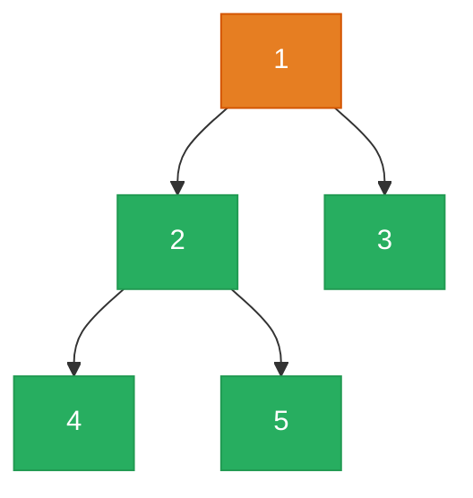

# 543. Diameter of Binary Tree

Given the root of a binary tree, return the length of the diameter of the tree.

The diameter of a binary tree is the length of the longest path between any two nodes in a tree. This path may or may not pass through the root.

The length of a path between two nodes is represented by the number of edges between them.


**Example 1:**

![[diameter-binary-tree-example.svg]]

```
Input: root = [1,2,3,4,5]
Output: 3
Explanation: 3 is the length of the path [4,2,1,3] or [5,2,1,3].
```

**Example 2:**
```
Input: root = [1,2]
Output: 1
```

Constraints:
- The number of nodes in the tree is in the range [1, 104].
- -100 <= Node.val <= 100

---

## Solution

### Intuition
The diameter through any node equals the height of its left subtree plus the height of its right subtree (in edges). The key insight is that the longest path in the whole tree must pass through some node as its "top", so we track a running maximum across all nodes using [[Recursion]]. The function returns height (to serve the parent) while updating the global max diameter as a side effect.

### Approach: Optimal
Use a single DFS that returns the height of each subtree. At each node, compute the candidate diameter (left height + right height) and update the global maximum.

```python
# TreeNode definition:
# class TreeNode:
#     def __init__(self, val=0, left=None, right=None):
#         self.val = val
#         self.left = left
#         self.right = right

from typing import Optional

class Solution:
    def diameterOfBinaryTree(self, root: Optional['TreeNode']) -> int:
        self.max_diameter = 0

        def height(node: Optional['TreeNode']) -> int:
            if node is None:
                # A null node has height 0 (no edges)
                return 0

            left_h  = height(node.left)
            right_h = height(node.right)

            # Diameter through this node = edges going left + edges going right
            self.max_diameter = max(self.max_diameter, left_h + right_h)

            # Return height to parent: 1 edge to the taller child
            return 1 + max(left_h, right_h)

        height(root)
        return self.max_diameter
```

> The function serves two roles at once: it returns height (what the parent needs) while updating max_diameter (what the caller of `diameterOfBinaryTree` needs). This dual-purpose post-order traversal avoids a second DFS pass.

### Walkthrough
Tree: `1 -> [2, 3]`, where `2 -> [4, 5]`.



| Call | left_h | right_h | diameter candidate | returns height |
|------|--------|---------|-------------------|----------------|
| height(4) | 0 | 0 | 0 | 1 |
| height(5) | 0 | 0 | 0 | 1 |
| height(2) | 1 | 1 | 2 | 2 |
| height(3) | 0 | 0 | 0 | 1 |
| height(1) | 2 | 1 | 3 | 3 |

max_diameter = 3. Correct.

### Complexity
- **Time:** O(N). Each node is visited once.
- **Space:** O(H). Call stack depth equals tree height. O(log N) balanced, O(N) skewed.

### Key concepts to review
- [[Recursion]] - the function returns height but also updates a side-effect variable.
- [[DFS|Depth-First Search]] - post-order: children computed before current node.
- [[Binary Tree]] - diameter is measured in edges, not nodes.
- [[02.MaxDepthOfBinaryTree]] - the height subroutine here is identical to max depth.
- [[04.BalancedBinaryTree]] - similar pattern: DFS returns height, updates a condition as a side effect.

### Common pitfalls
- Forgetting that the diameter is measured in edges, not nodes (off-by-one if you return 0 for a leaf instead of 1, or vice versa - be consistent).
- Recomputing height separately from the diameter update, leading to O(N^2) time.
- Only computing the diameter at the root, missing paths that don't pass through the root.
- Not handling single-node trees where `max_diameter` stays 0 (which is correct - no edges).
