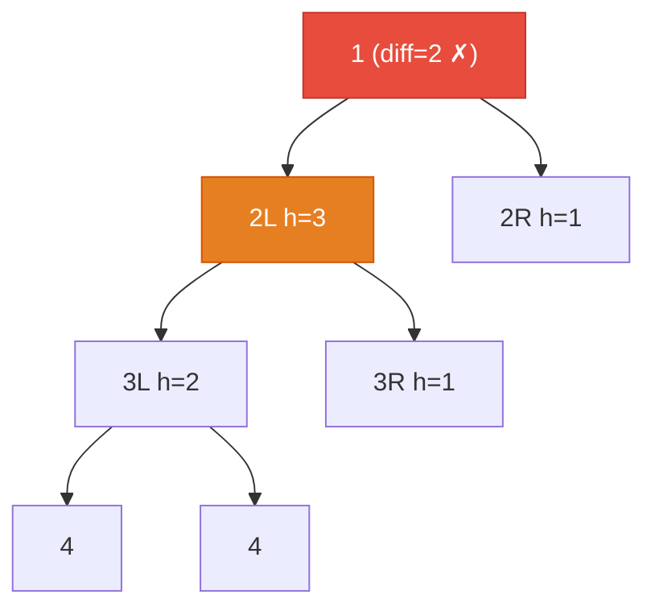

# 110. Balanced Binary Tree

Given a binary tree, determine if it is height-balanced.

For this problem, a height-balanced binary tree is defined as:

a binary tree in which the left and right subtrees of every node differ in height by no more than 1.

 

**Example 1:**

![[balanced-binary-tree-example.svg]]

```
Input: root = [3,9,20,null,null,15,7]
Output: true
```

**Example 2:**

![[balanced-binary-tree-example-2.svg]]

```
Input: root = [1,2,2,3,3,null,null,4,4]
Output: false
```

**Example 3:**
```
Input: root = []
Output: true
```

Constraints:
- The number of nodes in the tree is in the range [0, 5000].
- -104 <= Node.val <= 104

---

## Solution

### Intuition
A [[Binary Tree]] is balanced if every subtree is balanced and the heights of the two children differ by at most 1. A single DFS can check both conditions simultaneously by returning height normally when balanced, but returning -1 as a sentinel to signal "unbalanced" when the invariant is broken. This avoids recomputing heights in a separate pass.

### Approach 1: Brute force
For each node, compute left height and right height independently (O(N) each), and check the difference. This results in O(N^2) time because height is recomputed for every node.

### Approach 2: Optimal
Use a single post-order [[Recursion]] that returns the height if the subtree is balanced, or -1 if it is not. Once -1 propagates up, all ancestor calls short-circuit and return -1 immediately.

```python
# TreeNode definition:
# class TreeNode:
#     def __init__(self, val=0, left=None, right=None):
#         self.val = val
#         self.left = left
#         self.right = right

from typing import Optional

class Solution:
    def isBalanced(self, root: Optional['TreeNode']) -> bool:
        def check(node: Optional['TreeNode']) -> int:
            """Returns height if balanced, -1 if not balanced."""
            if node is None:
                return 0  # null is balanced with height 0

            left_h = check(node.left)
            if left_h == -1:
                return -1  # short-circuit: left subtree already unbalanced

            right_h = check(node.right)
            if right_h == -1:
                return -1  # short-circuit: right subtree already unbalanced

            if abs(left_h - right_h) > 1:
                return -1  # this node violates the balance condition

            # Balanced here: return actual height for the parent's use
            return 1 + max(left_h, right_h)

        return check(root) != -1
```

> The -1 sentinel is the key trick. Once any subtree is unbalanced, every ancestor immediately returns -1 without doing any further work, making this a true O(N) algorithm.

### Walkthrough
Tree: `1 -> [2, 2]`, where `2(left) -> [3, 3]`, `3(leftmost) -> [4, 4]`.



| Call | left_h | right_h | result |
|------|--------|---------|--------|
| check(4) | 0 | 0 | 1 |
| check(4) | 0 | 0 | 1 |
| check(3) | 1 | 1 | 2 |
| check(3) | 0 | 0 | 1 |
| check(2,left) | 2 | 1 | diff=1, ok - returns 3 |
| check(2,right) | 0 | 0 | 1 |
| check(1) | 3 | 1 | diff=2, returns -1 |

`check(root) == -1`, so return `False`.

### Complexity
- **Time:** O(N). Each node visited once; -1 sentinel prevents redundant work.
- **Space:** O(H). Call stack depth equals tree height.

### Key concepts to review
- [[Recursion]] - the -1 sentinel lets unbalanced status propagate upward without extra checks.
- [[DFS|Depth-First Search]] - post-order pattern: children resolved before current node.
- [[Binary Tree]] - balance is a local condition that must hold at every node.
- [[03.DiameterOfABinaryTree]] - similarly computes height as a side product of a single DFS.
- [[02.MaxDepthOfBinaryTree]] - the `check` function here is a modified version of max depth.

### Common pitfalls
- Using two separate height computations per node (brute force), leading to O(N^2).
- Returning 0 from the sentinel branch instead of -1, so the unbalanced signal is lost.
- Not short-circuiting after receiving -1 from a child, doing unnecessary recursive work.
- Confusing the null base case height (0 edges) with the leaf height (1 node).
