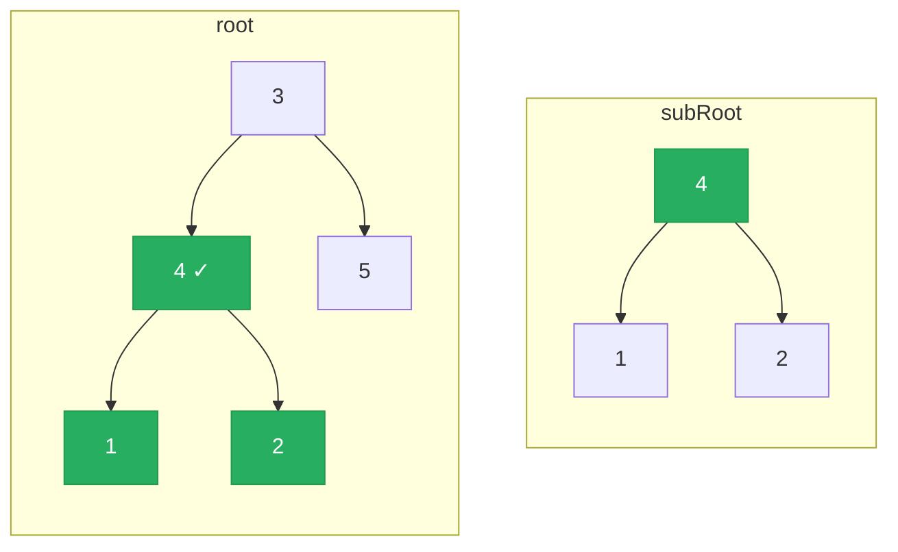

# 572. Subtree of Another Tree

Given the roots of two binary trees root and subRoot, return true if there is a subtree of root with the same structure and node values of subRoot and false otherwise.

A subtree of a binary tree tree is a tree that consists of a node in tree and all of this node's descendants. The tree tree could also be considered as a subtree of itself.

 

**Example 1:**

![[subtree-another-tree-example.svg]]

```
Input: root = [3,4,5,1,2], subRoot = [4,1,2]
Output: true
```

**Example 2:**
```
Input: root = [3,4,5,1,2,null,null,null,null,0], subRoot = [4,1,2]
Output: false
```

Constraints:
- The number of nodes in the root tree is in the range [1, 2000].
- The number of nodes in the subRoot tree is in the range [1, 1000].
- -104 <= root.val <= 104
- -104 <= subRoot.val <= 104

---

## Solution

### Intuition
At each node in `root`, the subtree rooted there might match `subRoot` exactly. This reduces to reusing the [[05.SameTree]] check as a subroutine: walk every node of `root` via [[Recursion]], and at each one ask "does the tree rooted here equal subRoot?" The key insight is composing two recursive functions - one to traverse `root`, and one to compare trees.

### Approach: recursive composition
For every node in `root` (O(M) nodes), run `isSameTree` against `subRoot` (O(N) each). Total O(M*N) time. This is the standard interview-acceptable solution for the given constraints, and the one implemented below.

**Alternative, not implemented here:** serialize both trees and check if the serialized `subRoot` is a substring of the serialized `root`. Using [[String Encoding]] with sentinel delimiters handles false positives. O(M + N) time, but the added implementation complexity buys little at interview constraints.

```python
# TreeNode definition:
# class TreeNode:
#     def __init__(self, val=0, left=None, right=None):
#         self.val = val
#         self.left = left
#         self.right = right

from typing import Optional

class Solution:
    def isSubtree(self, root: Optional['TreeNode'], subRoot: Optional['TreeNode']) -> bool:
        # An empty subRoot is always a subtree (vacuously true)
        if subRoot is None:
            return True

        # If root is exhausted but subRoot is not, no match
        if root is None:
            return False

        # Check if the tree rooted here matches subRoot exactly
        if self._isSameTree(root, subRoot):
            return True

        # Otherwise, try every node in root's left and right subtrees
        return self.isSubtree(root.left, subRoot) or self.isSubtree(root.right, subRoot)

    def _isSameTree(self, p: Optional['TreeNode'], q: Optional['TreeNode']) -> bool:
        if p is None and q is None:
            return True
        if p is None or q is None:
            return False
        if p.val != q.val:
            return False
        return self._isSameTree(p.left, q.left) and self._isSameTree(p.right, q.right)
```

> The DFS on `root` is pre-order: check the current node first, then recurse into children. This allows early exit as soon as a matching subtree is found anywhere.

### Walkthrough
root = `[3,4,5,1,2]`, subRoot = `[4,1,2]`. Green = matching subtree rooted at 4.



1. At node 3: `isSameTree(3, 4)` - values differ, False.
2. Recurse left to node 4: `isSameTree(4, 4)` - values match, check children.
   - `isSameTree(1, 1)` - match, leaves match. True.
   - `isSameTree(2, 2)` - match, leaves match. True.
   - Returns True.
3. `isSubtree` returns True without checking node 5.

### Complexity
- **Time:** O(M * N). For each of M nodes in root, we may run isSameTree which visits up to N nodes.
- **Space:** O(H_root + H_sub). Two call stacks are active simultaneously at most, each proportional to the height of its respective tree.

### Key concepts to review
- [[Recursion]] - composing two recursive functions (traverse + compare).
- [[DFS|Depth-First Search]] - pre-order traversal of `root` tries each node as a candidate.
- [[05.SameTree]] - the `isSameTree` helper is reused directly.
- [[String Encoding]] - the optimal O(M+N) approach serializes trees and uses substring matching.
- [[Binary Tree]] - subtree means a node and ALL its descendants, not just some.

### Common pitfalls
- Returning True when `root is None and subRoot is None` but False when just `subRoot is None` - an empty subRoot should always match.
- Forgetting that "subtree" means an exact match rooted at some node, including all descendants (Example 2 demonstrates a false positive if you only match by root value).
- Running `isSameTree` only at nodes where `root.val == subRoot.val` - safe optimization, but easy to skip erroneously.
- Confusing O(M*N) with O(M+N): the brute force here is quadratic, not linear.
