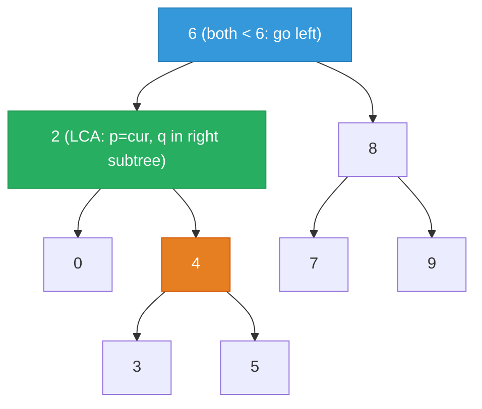

# 235. Lowest Common Ancestor of a Binary Search Tree


Given a binary search tree (BST), find the lowest common ancestor (LCA) of two given nodes in the BST.

According to the definition of LCA on Wikipedia: "The lowest common ancestor is defined between two nodes p and q as the lowest node in T that has both p and q as descendants (where we allow a node to be a descendant of itself)."

 

**Example 1:**

![[lowest-common-ancestor-bst-example.svg]]

```
Input: root = [6,2,8,0,4,7,9,null,null,3,5], p = 2, q = 8
Output: 6
Explanation: The LCA of nodes 2 and 8 is 6.
```

**Example 2:**
```
Input: root = [6,2,8,0,4,7,9,null,null,3,5], p = 2, q = 4
Output: 2
Explanation: The LCA of nodes 2 and 4 is 2, since a node can be a descendant of itself according to the LCA definition.
```
**Example 3:**
```
Input: root = [2,1], p = 2, q = 1
Output: 2
```

Constraints:

- The number of nodes in the tree is in the range `[2, 105]`.
- -10<sup>9</sup> <= Node.val <= 10<sup>9</sup>
- All Node.val are unique.
- p != q
- p and q will exist in the BST.

---

## Solution

### Intuition
The [[Binary Search Tree]] property is the key: if both p and q are less than the current node, the LCA is in the left subtree; if both are greater, it's in the right subtree. The first node where p and q "split" (one goes left, one goes right, or the node equals one of them) is the LCA. This allows a clean iterative or recursive descent without visiting the whole tree.

### Approach: Optimal
Walk down the BST using the BST ordering property. At each node, decide whether to go left, right, or return the current node.

```python
# TreeNode definition:
# class TreeNode:
#     def __init__(self, val=0, left=None, right=None):
#         self.val = val
#         self.left = left
#         self.right = right

class Solution:
    def lowestCommonAncestor(
        self,
        root: 'TreeNode',
        p: 'TreeNode',
        q: 'TreeNode'
    ) -> 'TreeNode':
        cur = root

        while cur:
            # Both targets are in the right subtree
            if p.val > cur.val and q.val > cur.val:
                cur = cur.right

            # Both targets are in the left subtree
            elif p.val < cur.val and q.val < cur.val:
                cur = cur.left

            # Split point: cur is between p and q, or cur equals one of them
            else:
                return cur

        # Problem guarantees p and q exist, so this line is never reached
        return cur
```

> The "else" branch handles three cases with a single return: p and q are on opposite sides of cur, cur equals p, or cur equals q. All three mean cur is the lowest common ancestor.

### Walkthrough
BST root=6, p=2, q=4. Blue = current step; green = LCA answer; orange = target q.



| Step | cur | p.val | q.val | Decision |
|------|-----|-------|-------|----------|
| 1 | 6 | 2 < 6 | 4 < 6 | go left |
| 2 | 2 | 2 == 2 | 4 > 2 | split, return 2 |

Node 2 is the LCA because it is p itself and q=4 is a descendant of it.

### Complexity
- **Time:** O(H). H is the tree height. O(log N) for a balanced BST, O(N) for a skewed BST.
- **Space:** O(1) iterative. The recursive version uses O(H) call stack space.

### Key concepts to review
- [[Binary Search Tree]] - the BST ordering property drives every decision in this algorithm.
- [[DFS|Depth-First Search]] - conceptually DFS, but implemented iteratively here for O(1) space.
- [[Recursion]] - the original recursive version is equally valid and arguably more readable.
- [[Binary Tree]] - contrast with LCA on a general binary tree, which requires O(N) traversal.
- [[11.ValidateBinarySearchTree]] - understanding BST invariants helps see why this split logic works.

### Common pitfalls
- Forgetting that a node can be its own ancestor (Example 2 shows p=2 is the LCA of 2 and 4).
- Applying this BST-specific logic to a general binary tree, where it does not work.
- Using `>=` instead of `>` in both conditions simultaneously, which mishandles the equality case.
- Using recursive calls without recognizing that an iterative loop is simpler and avoids stack overhead.
