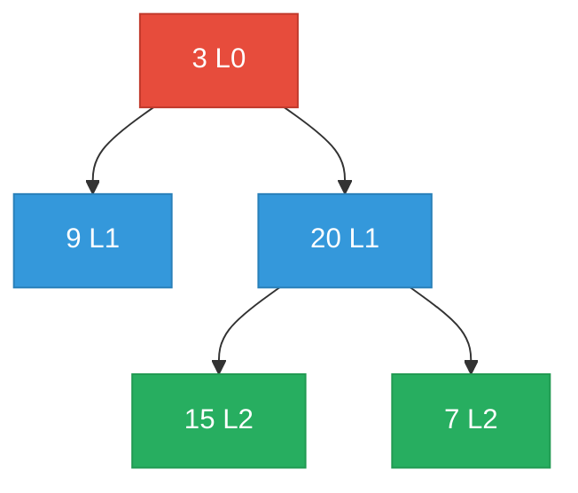

# 102. Binary Tree Level Order Traversal


Given the root of a binary tree, return the level order traversal of its nodes' values. (i.e., from left to right, level by level).

 

**Example 1:**

![[level-order-traversal-example.svg]]

```
Input: root = [3,9,20,null,null,15,7]
Output: [[3],[9,20],[15,7]]
```

**Example 2:**
```
Input: root = [1]
Output: [[1]]
```
**Example 3:**
```
Input: root = []
Output: []
```

Constraints:

- The number of nodes in the tree is in the range [0, 2000].
- -1000 <= Node.val <= 1000

---

## Solution

### Intuition
Level order traversal visits a [[Binary Tree]] one level at a time, left to right. [[BFS|Breadth-First Search]] with a queue is the natural fit: process all nodes at the current level before enqueuing the next level's children. The key technique is snapshotting the queue size at the start of each level to know exactly how many nodes belong to that level.

### Approach: Optimal
Use a `collections.deque` as the BFS queue. At each iteration, record the current queue size (= number of nodes at this level), process exactly that many nodes, and collect their values into a sublist.

```python
# TreeNode definition:
# class TreeNode:
#     def __init__(self, val=0, left=None, right=None):
#         self.val = val
#         self.left = left
#         self.right = right

from typing import Optional
import collections

class Solution:
    def levelOrder(self, root: Optional['TreeNode']) -> list[list[int]]:
        result = []

        if root is None:
            return result

        queue = collections.deque([root])

        while queue:
            level_size = len(queue)  # snapshot: nodes at the current level
            level_vals = []

            for _ in range(level_size):
                node = queue.popleft()
                level_vals.append(node.val)

                # Enqueue next level's children
                if node.left:
                    queue.append(node.left)
                if node.right:
                    queue.append(node.right)

            result.append(level_vals)

        return result
```

> Snapshotting `len(queue)` before the inner loop is the core trick. After adding children for all level-k nodes, the queue contains exactly the level-(k+1) nodes, and the outer loop's next iteration handles them.

### Walkthrough
Tree: `3 -> [9, 20]`, `20 -> [15, 7]`. Nodes colored by level (red=L0, blue=L1, green=L2).



| Iteration | queue before | level_size | level_vals | queue after |
|-----------|-------------|------------|------------|-------------|
| 1 | [3] | 1 | [3] | [9, 20] |
| 2 | [9, 20] | 2 | [9, 20] | [15, 7] |
| 3 | [15, 7] | 2 | [15, 7] | [] |

Result: `[[3], [9, 20], [15, 7]]`.

### Complexity
- **Time:** O(N). Every node is enqueued and dequeued exactly once.
- **Space:** O(N). The queue holds at most one full level, which in a perfect binary tree is N/2 nodes (O(N)).

### Key concepts to review
- [[BFS|Breadth-First Search]] - BFS processes nodes level by level, which is exactly what this problem asks.
- [[Binary Tree]] - BFS is the standard alternative to DFS for tree traversal.
- [[09.BinaryTreeRightSideView]] - direct extension: pick the last element of each level.
- [[Stack]] - DFS uses a stack (explicitly or via call stack); BFS uses a queue. Recognizing which to use is important.

### Common pitfalls
- Using a list instead of `collections.deque`, making `popleft()` O(N) instead of O(1).
- Not snapshotting `len(queue)` before the inner loop, causing the level boundary to shift as children are added.
- Appending to `result` inside the inner loop instead of after, creating one sublist per node instead of per level.
- Forgetting the null check on root, which would cause an error when initializing the deque.
