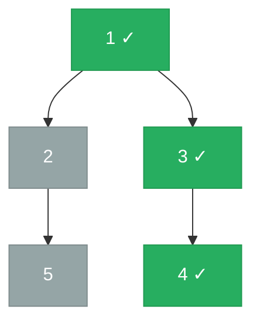

# 199. Binary Tree Right Side View


Given the root of a binary tree, imagine yourself standing on the right side of it, return the values of the nodes you can see ordered from top to bottom.

 

**Example 1:**

![[right-side-view-example.svg]]

```
Input: root = [1,2,3,null,5,null,4]
Output: [1,3,4]
```

**Example 2:**
```
Input: root = [1,null,3]
Output: [1,3]
```
**Example 3:**
```
Input: root = []
Output: []
```

Constraints:

- The number of nodes in the tree is in the range [0, 100].
- -100 <= Node.val <= 100

---

## Solution

### Intuition
The right-side view is the last visible node at each level of the [[Binary Tree]]. [[BFS|Breadth-First Search]] level-order traversal naturally groups nodes by level, so the right-side view is simply the last node in each level's group. This is a direct extension of [[08.BinaryTreeLevelOrderTraversal]]: instead of collecting all values per level, collect only the rightmost one.

### Approach: Optimal
BFS with the level-size snapshot technique. After processing each level's nodes, append the value of the last node processed at that level.

```python
# TreeNode definition:
# class TreeNode:
#     def __init__(self, val=0, left=None, right=None):
#         self.val = val
#         self.left = left
#         self.right = right

from typing import Optional
import collections

class Solution:
    def rightSideView(self, root: Optional['TreeNode']) -> list[int]:
        result = []

        if root is None:
            return result

        queue = collections.deque([root])

        while queue:
            level_size = len(queue)  # snapshot: nodes at current level

            for i in range(level_size):
                node = queue.popleft()

                # Enqueue children for the next level
                if node.left:
                    queue.append(node.left)
                if node.right:
                    queue.append(node.right)

                # The last node in this level is the rightmost visible one
                if i == level_size - 1:
                    result.append(node.val)

        return result
```

> Appending when `i == level_size - 1` picks the last node processed per level. Enqueuing left before right ensures we process nodes left-to-right, so the last one in each level is genuinely the rightmost.

### Walkthrough
Tree: `1 -> [2, 3]`, `2 -> [None, 5]`, `3 -> [None, 4]`. Green = visible from right; gray = blocked.



| Level | Nodes processed | Last node (visible) |
|-------|----------------|---------------------|
| 0 | 1 | 1 |
| 1 | 2, 3 | 3 |
| 2 | 5, 4 | 4 |

Result: `[1, 3, 4]`. Node 5 is hidden behind node 4 at level 2.

### Complexity
- **Time:** O(N). Every node is visited exactly once.
- **Space:** O(N). Queue holds at most one full level, which is O(N) for the widest level.

### Key concepts to review
- [[BFS|Breadth-First Search]] - BFS with level grouping is the clearest approach for level-specific queries.
- [[Binary Tree]] - the right side view depends on level structure, not path structure.
- [[08.BinaryTreeLevelOrderTraversal]] - the same BFS skeleton; only the collection step changes.
- [[DFS|Depth-First Search]] - DFS alternative: do right-child-first DFS; the first node visited at each depth is the rightmost. Requires tracking depth.

### Common pitfalls
- Appending the rightmost child of each node rather than the last node at each level - these differ when the rightmost node has no right child but a sibling does.
- Forgetting to enqueue left before right, which would reverse the level order and incorrectly pick the leftmost node.
- Using a regular list and `pop(0)` instead of `deque.popleft()`, making each dequeue O(N).
- Off-by-one: checking `i == level_size` instead of `i == level_size - 1`.
