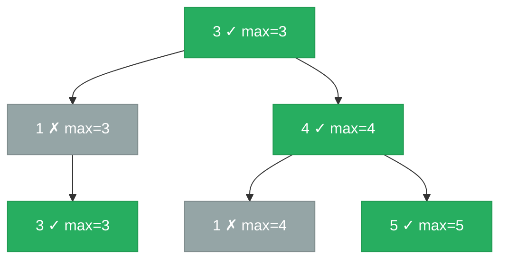

# [1448. Count Good Nodes in Binary Tree](https://leetcode.com/problems/count-good-nodes-in-binary-tree/)

Given a binary tree root, a node X in the tree is named good if in the path from root to X there are no nodes with a value greater than X.

Return the number of good nodes in the binary tree.

 

**Example 1:**

![[good-nodes-binary-tree-example.svg]]

```
Input: root = [3,1,4,3,null,1,5]
Output: 4
Explanation: Nodes in red are good.
Root Node (3) is always a good node.
Node 4 -> (3,4) is the maximum value in the path starting from the root.
Node 5 -> (3,4,5) is the maximum value in the path
Node 3 -> (3,1,3) is the maximum value in the path.
```

**Example 2:**
```
Input: root = [3,3,null,4,2]
Output: 3
Explanation: Node 2 -> (3, 3, 2) is not good, because "3" is higher than it.
```
**Example 3:**
```
Input: root = [1]
Output: 1
Explanation: Root is considered as good.
```

Constraints:
- The number of nodes in the binary tree is in the range [1, 10^5].
- Each node's value is between [-10^4, 10^4].

---

## Solution

### Intuition
A node is "good" if its value is at least as large as every ancestor's value. Rather than storing the whole path, we only need to carry the running maximum seen from the root down to the current node via [[Recursion]]. If the current node's value meets or beats that maximum, it is a good node. This is a pre-order [[DFS|Depth-First Search]] because we use the path-max from the parent before visiting children.

### Approach: Optimal
DFS with a `path_max` parameter passed top-down. At each node, increment the count if `node.val >= path_max`, then recurse with `max(path_max, node.val)`.

```python
# TreeNode definition:
# class TreeNode:
#     def __init__(self, val=0, left=None, right=None):
#         self.val = val
#         self.left = left
#         self.right = right

from typing import Optional

class Solution:
    def goodNodes(self, root: 'TreeNode') -> int:
        def dfs(node: Optional['TreeNode'], path_max: int) -> int:
            if node is None:
                return 0  # null contributes 0 good nodes

            # A node is good if no ancestor on the path has a larger value
            is_good = 1 if node.val >= path_max else 0

            # Update the running max for children
            new_max = max(path_max, node.val)

            # Count good nodes in left and right subtrees
            return is_good + dfs(node.left, new_max) + dfs(node.right, new_max)

        # Start with -infinity so the root is always good
        return dfs(root, float('-inf'))
```

> Starting `path_max` at `float('-inf')` guarantees the root is always counted as good, which matches the problem statement. The root has no ancestors, so any value passes.

### Walkthrough
Tree: `3 -> [1, 4]`, `1 -> [3, None]`, `4 -> [1, 5]`. Green = good node (val ≥ path max); gray = not good.



| Call | node.val | path_max | is_good | new_max |
|------|---------|---------|---------|---------|
| dfs(3, -inf) | 3 | -inf | 1 | 3 |
| dfs(1, 3) | 1 | 3 | 0 | 3 |
| dfs(3, 3) | 3 | 3 | 1 | 3 |
| dfs(4, 3) | 4 | 3 | 1 | 4 |
| dfs(1, 4) | 1 | 4 | 0 | 4 |
| dfs(5, 4) | 5 | 4 | 1 | 5 |

Good count: 1+0+1+1+0+1 = 4.

### Complexity
- **Time:** O(N). Every node is visited exactly once.
- **Space:** O(H). Call stack depth equals tree height.

### Key concepts to review
- [[Recursion]] - passing state top-down (path_max) is a common DFS pattern distinct from bottom-up aggregation.
- [[DFS|Depth-First Search]] - pre-order: process the current node using parent-provided context, then recurse.
- [[Binary Tree]] - the path from root to any node is uniquely determined by the tree structure.
- [[02.MaxDepthOfBinaryTree]] - bottom-up pattern contrast: that problem aggregates from leaves up; this one passes state from root down.

### Common pitfalls
- Initializing `path_max` to 0 instead of `float('-inf')`, which incorrectly marks the root as not good when its value is negative.
- Passing `path_max` without updating it with `node.val`, so children always see the original root's max.
- Counting a node as good when `node.val > path_max` (strict) instead of `>= path_max` (non-strict), which misses nodes equal to the max on the path.
- Using a global variable for the count instead of returning values, which is error-prone in recursive functions.
