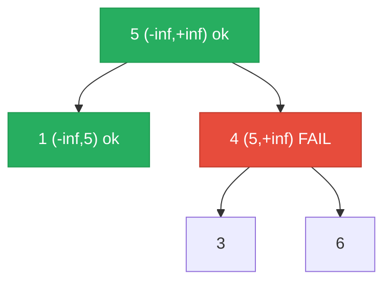

# 98. Validate Binary Search Tree


Given the root of a binary tree, determine if it is a valid binary search tree (BST).

A valid BST is defined as follows:

The left subtree of a node contains only nodes with keys less than the node's key.
The right subtree of a node contains only nodes with keys greater than the node's key.
Both the left and right subtrees must also be binary search trees.
 

**Example 1:**

![[validate-binary-search-tree-example-1.svg]]

```
Input: root = [2,1,3]
Output: true
```

**Example 2:**

![[validate-binary-search-tree-example.svg]]

```
Input: root = [5,1,4,null,null,3,6]
Output: false
Explanation: The root node's value is 5 but its right child's value is 4.
```

Constraints:

- The number of nodes in the tree is in the range [1, 10<sup>4</sup>].
- -2<sup>31</sup> <= Node.val <= 2<sup>31</sup> - 1

---

## Solution

### Intuition
The naive mistake is only checking that each node is greater than its left child and less than its right child locally. This misses cases where a node deep in the right subtree is less than the root. The correct approach: pass a valid range `(min, max)` downward via [[Recursion]]. Every node must fall strictly within its inherited range, and each step tightens the range for the child.

### Approach: Optimal
Pre-order DFS with bounds passed top-down. The root has bounds `(-inf, +inf)`. When we go left, the upper bound tightens to the current node's value. When we go right, the lower bound tightens.

```python
# TreeNode definition:
# class TreeNode:
#     def __init__(self, val=0, left=None, right=None):
#         self.val = val
#         self.left = left
#         self.right = right

from typing import Optional

class Solution:
    def isValidBST(self, root: Optional['TreeNode']) -> bool:
        def validate(node: Optional['TreeNode'], low: float, high: float) -> bool:
            if node is None:
                return True  # an empty subtree is a valid BST

            # The current node must be strictly within (low, high)
            if node.val <= low or node.val >= high:
                return False

            # Left subtree: all values must be < node.val (tighten upper bound)
            # Right subtree: all values must be > node.val (tighten lower bound)
            return (validate(node.left,  low,       node.val) and
                    validate(node.right, node.val,  high))

        return validate(root, float('-inf'), float('inf'))
```

> The bounds are exclusive (strict inequalities) because a BST requires strictly less/greater - equal values are not allowed. Using `float('-inf')` and `float('inf')` avoids edge cases with INT_MIN and INT_MAX.

### Walkthrough
Tree: `5 -> [1, 4]`, `4 -> [3, 6]`. Node 4 is in the right subtree of 5 but is smaller. Red = invalid bound.



| Call | node.val | low | high | Valid? |
|------|---------|-----|------|--------|
| validate(5, -inf, inf) | 5 | -inf | inf | 5 in range |
| validate(1, -inf, 5) | 1 | -inf | 5 | 1 in range |
| validate(4, 5, inf) | 4 | 5 | inf | 4 <= 5, FAIL |

Returns False immediately. Node 4 is in the right subtree of 5 but is smaller than 5.

### Complexity
- **Time:** O(N). Each node visited at most once.
- **Space:** O(H). Call stack depth equals tree height.

### Key concepts to review
- [[Binary Search Tree]] - BST validity is a global property, not just a local parent-child comparison.
- [[Recursion]] - passing bounds top-down is the same pattern as [[10.CountGoodNodesInBinaryTree]] (path_max) but with two bounds instead of one.
- [[DFS|Depth-First Search]] - pre-order: check current node with inherited bounds, then recurse.
- [[12.KthSmallestElementInABST]] - uses in-order traversal which also exploits BST ordering.

### Common pitfalls
- Only comparing each node to its direct parent, which misses deeper violations (classic BST validation mistake).
- Using `int` min/max constants (e.g., `float('-inf')` is safer than `-(2**31)` when node values can equal INT_MIN or INT_MAX).
- Using `<=` or `>=` instead of strict `<` and `>`, allowing duplicate values that violate the BST definition.
- Not handling the null base case, leading to AttributeError when accessing `.val` on None.
