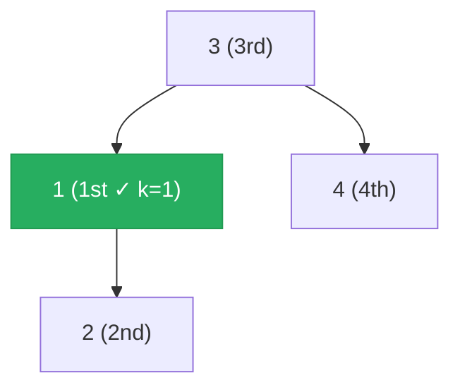

# 230. Kth Smallest Element in a BST


Given the root of a binary search tree, and an integer k, return the kth smallest value (1-indexed) of all the values of the nodes in the tree.

 

**Example 1:**

![[kth-smallest-bst-example.svg]]

```
Input: root = [3,1,4,null,2], k = 1
Output: 1
```

**Example 2:**
```
Input: root = [5,3,6,2,4,null,null,1], k = 3
Output: 3
```

Constraints:

- The number of nodes in the tree is n.
- 1 <= k <= n <= 10<sup>4</sup>
- 0 <= Node.val <= 10<sup>4</sup>
 

### Follow up: If the BST is modified often (i.e., we can do insert and delete operations) and you need to find the kth smallest frequently, how would you optimize?

---

## Solution

### Intuition
In a [[Binary Search Tree]], in-order traversal (left, node, right) visits nodes in ascending sorted order. The kth smallest element is simply the kth node encountered during in-order traversal. We can use an iterative in-order with an explicit [[Stack]] to stop early as soon as we reach the kth node, avoiding traversal of the entire tree.

### Approach: Optimal
Iterative in-order traversal with an explicit stack. Push all left-spine nodes onto the stack, then pop and count. When the count reaches k, return the current node's value.

```python
# TreeNode definition:
# class TreeNode:
#     def __init__(self, val=0, left=None, right=None):
#         self.val = val
#         self.left = left
#         self.right = right

from typing import Optional

class Solution:
    def kthSmallest(self, root: Optional['TreeNode'], k: int) -> int:
        stack = []
        current = root
        count = 0

        while current or stack:
            # Descend to the leftmost node (smallest unvisited)
            while current:
                stack.append(current)
                current = current.left

            # Visit the node (in-order position)
            current = stack.pop()
            count += 1

            if count == k:
                return current.val  # kth smallest found

            # Move to right subtree for next in-order node
            current = current.right

        # Problem guarantees k <= n, so this is unreachable
        return -1
```

> In-order traversal of a BST produces a sorted sequence. The iterative version with an explicit stack is preferred here because it exits early at exactly the kth node without traversing the rest of the tree.

### Walkthrough
BST: `3 -> [1, 4]`, `1 -> [None, 2]`. k=1. In-order visits: 1 → 2 → 3 → 4. Green = answer.



| Step | stack | current | count | action |
|------|-------|---------|-------|--------|
| 1 | [] | 3 | 0 | push 3, go left |
| 2 | [3] | 1 | 0 | push 1, go left |
| 3 | [3,1] | None | 0 | pop 1, count=1, k=1 |
| - | - | 1 | 1 | return 1 |

### Complexity
- **Time:** O(H + k). H to reach the leftmost node, then k pops to reach the kth node.
- **Space:** O(H). The stack holds at most H nodes (the left spine).

### Key concepts to review
- [[Binary Search Tree]] - in-order traversal yields sorted order, the fundamental BST property exploited here.
- [[Stack]] - the explicit stack simulates the recursive call stack of a recursive in-order traversal.
- [[DFS|Depth-First Search]] - in-order is a DFS variant (left subtree, then node, then right subtree).
- [[11.ValidateBinarySearchTree]] - also exploits BST ordering; validation uses bounds, this uses sorted-order.
- [[Recursion]] - the recursive in-order approach is simpler to write but cannot exit early without extra state.

### Common pitfalls
- Using pre-order or post-order instead of in-order, which does not yield sorted order in a BST.
- Traversing the entire tree and collecting all values into a list before indexing - correct but O(N) space.
- Off-by-one: using 0-indexed count (returning when `count == k - 1` instead of `count == k`).
- Forgetting to move to `current.right` after popping, which causes an infinite loop on the same node.
