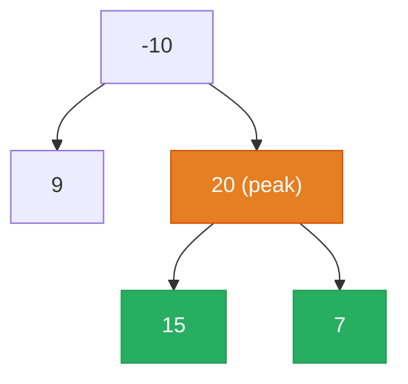

# [124. Binary Tree Maximum Path Sum](https://leetcode.com/problems/binary-tree-maximum-path-sum/)


A path in a binary tree is a sequence of nodes where each pair of adjacent nodes in the sequence has an edge connecting them. A node can only appear in the sequence at most once. Note that the path does not need to pass through the root.

The path sum of a path is the sum of the node's values in the path.

Given the root of a binary tree, return the maximum path sum of any non-empty path.

 

**Example 1:**

![[binary-tree-maximum-path-sum-example-1.svg]]

```
Input: root = [1,2,3]
Output: 6
Explanation: The optimal path is 2 -> 1 -> 3 with a path sum of 2 + 1 + 3 = 6.
```

**Example 2:**

![[maximum-path-sum-example.svg]]

```
Input: root = [-10,9,20,null,null,15,7]
Output: 42
Explanation: The optimal path is 15 -> 20 -> 7 with a path sum of 15 + 20 + 7 = 42.
```

Constraints:
- The number of nodes in the tree is in the range [1, 3 * 104].
- -1000 <= Node.val <= 1000

---

## Solution

### Intuition
Every path in a [[Binary Tree]] has exactly one "peak" node where it changes direction (from going left-up-right, for example). At each node, the locally optimal path through it is: `left_gain + node.val + right_gain`, where each gain is the max of 0 or the best one-directional path from that child. We track a global maximum across all nodes, but return only the single-arm contribution to the parent (since a path cannot split at more than one node).

### Approach: Optimal
Post-order [[DFS|Depth-First Search]]: compute left and right contributions first, then use them to update the global max and return the best single-arm path to the parent.

```python
# TreeNode definition:
# class TreeNode:
#     def __init__(self, val=0, left=None, right=None):
#         self.val = val
#         self.left = left
#         self.right = right

from typing import Optional

class Solution:
    def maxPathSum(self, root: Optional['TreeNode']) -> int:
        self.global_max = float('-inf')

        def max_gain(node: Optional['TreeNode']) -> int:
            if node is None:
                return 0  # a null branch contributes 0 (never negative)

            # Max contribution from each child (ignore negative arms)
            left_gain  = max(max_gain(node.left),  0)
            right_gain = max(max_gain(node.right), 0)

            # Best path passing through this node as the peak
            path_through = node.val + left_gain + right_gain
            self.global_max = max(self.global_max, path_through)

            # Return the best single-arm path to the parent
            return node.val + max(left_gain, right_gain)

        max_gain(root)
        return self.global_max
```

> The parent can only extend the path in one direction (left arm or right arm, not both). So `max_gain` returns `node.val + max(left_gain, right_gain)`, not the full split. The split sum is evaluated locally and recorded in `global_max`.

### Walkthrough
Tree: `-10 -> [9, 20]`, `20 -> [15, 7]`. Orange = peak node (splits both arms); green = optimal path (sum=42).



| Call | left_gain | right_gain | path_through | returns |
|------|-----------|------------|--------------|---------|
| max_gain(9) | 0 | 0 | 9 | 9 |
| max_gain(15) | 0 | 0 | 15 | 15 |
| max_gain(7) | 0 | 0 | 7 | 7 |
| max_gain(20) | 15 | 7 | 42 | 35 |
| max_gain(-10) | 9 | 35 | 34 | 25 |

global_max = 42. Correct.

### Complexity
- **Time:** O(N). Every node visited exactly once.
- **Space:** O(H). Call stack depth equals tree height. O(log N) balanced, O(N) skewed.

### Key concepts to review
- [[Recursion]] - dual-purpose function: updates global max (side effect) and returns single-arm gain (to parent).
- [[DFS|Depth-First Search]] - post-order: children must be resolved before the current node's contribution is computed.
- [[Binary Tree]] - the path splits at the "peak" node; the return value to the parent can only be one arm.
- [[03.DiameterOfABinaryTree]] - structural sibling: diameter also uses a post-order DFS that returns height to the parent but updates a global max as a side effect.
- [[Dynamic Programming]] - `max(..., 0)` is a local greedy choice: skip a negative arm, which resembles Kadane's algorithm on a tree.

### Common pitfalls
- Returning `node.val + left_gain + right_gain` to the parent, which would allow the parent to extend a forked path, making an invalid path.
- Not clamping gains to 0, which means negative subtrees drag down the sum unnecessarily.
- Initializing `global_max` to 0 instead of `float('-inf')`, which is wrong when all node values are negative (e.g., `[-3]` should return -3, not 0).
- Confusing the two different values: what to record in global_max (full split) vs what to return to parent (single arm).
