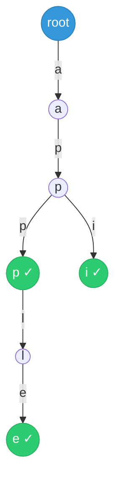
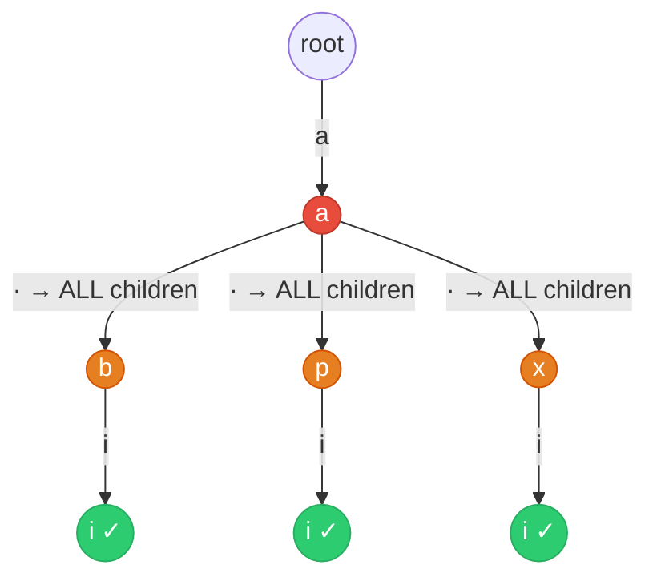

---
aliases:
  - Trie
---

# Trie Algorithm Guide

> **Core idea:** a trie stores strings as character paths from a shared root. A lookup follows one edge per character, so its time depends on the query length instead of the number of stored words. Build the trie once, use it for many queries, and stop a search as soon as an edge is missing.

## ⚡ Cheatsheet

| Pattern | Reach for it when… | Mechanism |
| --- | --- | --- |
| Trie insert or search | prefix queries, autocomplete, "starts with" | walk one edge per character; `is_end` marks complete words |
| Trie with wildcard | search with `.` or fuzzy match | at `.`, branch into every child via DFS |
| Trie + DFS / [[0.BacktrackingGuide\|Backtracking]] | find all words from a word list in a 2-D grid | build trie from list; one DFS per cell prunes dead paths instantly |

## How to think about it

An array or hash set can tell you "is this exact string present?" in O(m). What they cannot do is tell you "give me everything that *starts with* this prefix" without scanning every key.

A trie stores the prefix structure in the shape of the tree. Each edge is one character, and every path from the root to a node is a unique prefix stored once. Reaching a prefix node takes O(m). Every node below it shares that prefix.

> **Memory use:** each node carries a `children` dictionary or array, so a trie uses more memory than a hash set. This [[Space-Time Tradeoff]] makes prefix searches fast and lets a traversal stop as soon as a character has no matching edge.

The two modes you will actually use:

1. **Point-query mode:** insert words, then answer `search(word)` and `startsWith(prefix)`. This is the main idea behind [[01.ImplementTrie|ImplementTrie]] and [[02.DesignAddandSearchWordDataStructure|DesignAddandSearchWordDataStructure]].
2. **Guided-search mode:** build a trie from a word list, then let [[DFS]] or Backtracking follow trie edges through a grid or string. If there is no matching edge, stop that branch. One DFS tracks all words that share the current prefix. This is [[03.WordSearchII|WordSearchII]].

**Trie structure** for the words `"app"`, `"apple"`, and `"api"`. Each edge is one character, and green nodes mark `is_end = True`:



`"app"` and `"apple"` share the path `a → p → p`, while `"api"` branches at the second `p`. Searching `"ap"` reaches the `ap` node but finds `is_end = False`. The prefix exists, but no complete word ends there.

## The two motions

### Motion 1: Insert, search, and prefix lookup

Walk from the root one character at a time. For insert, create missing nodes. For search, bail out the instant a character is missing. Mark the final node with `is_end = True` to distinguish a complete word from a prefix that only exists because a longer word passes through it.

```python
class TrieNode:
    def __init__(self):
        self.children: dict[str, "TrieNode"] = {}
        self.is_end: bool = False


class Trie:
    def __init__(self):
        self.root = TrieNode()

    def insert(self, word: str) -> None:
        node = self.root
        for ch in word:
            if ch not in node.children:
                node.children[ch] = TrieNode()
            node = node.children[ch]
        node.is_end = True

    def search(self, word: str) -> bool:
        node = self._find(word)
        return node is not None and node.is_end

    def starts_with(self, prefix: str) -> bool:
        return self._find(prefix) is not None

    def _find(self, text: str) -> TrieNode | None:
        node = self.root
        for ch in text:
            node = node.children.get(ch)
            if node is None:
                return None
        return node
```

The `is_end` flag separates `search("app")` from `starts_with("app")` when `"apple"` is stored but `"app"` is not.

| Call | Path result | Return value |
| --- | --- | --- |
| `search("app")` | Path exists and `is_end = True` | `True` |
| `search("ap")` | Path exists but `is_end = False` | `False` |
| `starts_with("ap")` | Path exists | `True` |

### Motion 2: Trie-guided DFS with branch pruning

Build the trie from a word list, then launch a DFS / Backtracking over each starting position in the data source. At each step, ask the trie: "is there an edge for this character?" No edge → return immediately. This collapses `|words|` independent DFS calls into one shared traversal.

Two implementation tricks that matter here:

- **Store the full word at the terminal node** (`node.word = word`) instead of `is_end`. When you hit a terminal during DFS you can append directly without reconstructing the path.
- **Prune exhausted branches:** after recording a found word, set `node.word = None` to avoid duplicates. After returning from a DFS call, if the node has no children, run `del parent.children[char]`. Future DFS calls will skip that edge.

```python
# Inside the DFS after matching the current character
if node.word is not None:
    result.append(node.word)
    node.word = None            # deduplicate

board[r][c] = "#"               # mark visited (backtracking)
for dr, dc in ((0,1),(0,-1),(1,0),(-1,0)):
    nr, nc = r + dr, c + dc
    if 0 <= nr < rows and 0 <= nc < cols and board[nr][nc] != "#":
        dfs(nr, nc, node)
board[r][c] = char              # restore

if not node.children:           # prune dead branch
    del parent.children[char]
```

→ [[DFS]], [[0.BacktrackingGuide|Backtracking]]

### Motion 3: Wildcard branching

When a search pattern contains `.` to match any character, you cannot follow one edge. Recurse into every child and combine the results with `or`. A concrete character still needs one child lookup. A `.` can branch up to 26 ways for lowercase English letters, but the trie only checks children that exist.

```python
if char == ".":
    return any(dfs(i + 1, child) for child in node.children.values())
else:
    if char not in node.children:
        return False
    return dfs(i + 1, node.children[char])
```

**Wildcard branching:** pattern `"a.i"` against a trie holding `"abi"`, `"api"`, and `"axi"`. The `.` checks every child at that level:



## How to approach a new problem

1. **Spot the prefix signal.** Words like "starts with", "autocomplete", "shortest root", or "find all words in a grid from a list" are the tell. Exact-match-only problems don't need a trie.
2. **Decide the mode.** Single-source queries (insert + search) → Motion 1. Grid or collection search against a word list → Motion 2. Wildcard patterns → Motion 3.
3. **Choose what to store at terminal nodes.** `is_end: bool` for insert/search. `word: str | None` when you will reconstruct results during DFS.
4. **Build the trie first, then write the traversal.** Keep construction and search in separate loops.
5. **Add pruning only where it pays.** For Word Search II, branch pruning is critical; for a plain trie query, skip it.
6. **Trace the boundary cases.** Empty string as query, prefix that exists but no full word ends there (`is_end = False`), word list with duplicates (set `word = None` after finding to deduplicate).

## Worked example: Word Search II

[[03.WordSearchII|WordSearchII]] is a guided-search example. Given a grid and a word list, return every word that can be spelled by adjacent cells without reusing a cell in one path.

**Why brute force is slow.** Running a separate Backtracking DFS per word costs O(w · R·C · 4^L). With 10 000 words that share prefixes, you repeat the same grid traversal thousands of times.

**Why the trie fixes it.** Words sharing a prefix (e.g. "oath" and "oat") follow the same trie path until they diverge. One DFS from cell (r, c) explores that shared path once, then forks. The no-edge prune eliminates every word simultaneously when the current cell's character doesn't appear in the trie.

Trace from cell (0,0)='o' with trie containing "oath":

```
(0,0)='o' → root has 'o'? YES
  (0,1)='a' → o-node has 'a'? YES
    (1,1)='t' → a-node has 't'? YES
      (2,1)='h' → t-node has 'h'? YES
        h-node.word = "oath" → append, clear word
        h-node has no children → del t-node.children['h']
```

After "oath" is found and the branch pruned, every future DFS that reaches the t-node sees one fewer child to explore.

Full implementation:

```python
class TrieNode:
    def __init__(self):
        self.children: dict[str, "TrieNode"] = {}
        self.word: str | None = None


class Solution:
    def findWords(self, board: list[list[str]], words: list[str]) -> list[str]:
        root = TrieNode()
        for word in words:
            node = root
            for ch in word:
                if ch not in node.children:
                    node.children[ch] = TrieNode()
                node = node.children[ch]
            node.word = word

        rows, cols = len(board), len(board[0])
        result: list[str] = []

        def dfs(r: int, c: int, parent: TrieNode) -> None:
            ch = board[r][c]
            node = parent.children.get(ch)
            if node is None:
                return

            if node.word is not None:
                result.append(node.word)
                node.word = None          # avoid duplicates

            board[r][c] = "#"            # mark visited
            for dr, dc in ((0,1),(0,-1),(1,0),(-1,0)):
                nr, nc = r + dr, c + dc
                if 0 <= nr < rows and 0 <= nc < cols and board[nr][nc] != "#":
                    dfs(nr, nc, node)
            board[r][c] = ch             # restore

            if not node.children:        # prune exhausted branch
                del parent.children[ch]

        for r in range(rows):
            for c in range(cols):
                if board[r][c] in root.children:
                    dfs(r, c, root)

        return result
```

Mark `board[r][c] = "#"` before recursing so one path cannot reuse the same cell. Restore the character after recursion so later paths can use it.

## Complexity and common mistakes

- **Insert, search, and prefix lookup:** O(L) time for a string of length L because each character uses one edge lookup.
- **Space:** one root plus one node per distinct stored prefix. This is at most O(total characters inserted).
- **Wildcard search:** one `.` may check every child at that level, so repeated wildcards can make the search much larger than O(L).
- Set `is_end = True` after inserting a word. Without it, `search` cannot tell a complete word from a prefix.
- Build one trie before processing many queries. Building a new trie for every query repeats the setup work.
- Use a dictionary for `children` unless the allowed alphabet is fixed and small. A 26-slot array only fits lowercase English letters.

## Problems Covered

| Problem | Primary pattern |
| --- | --- |
| [[01.ImplementTrie\|Implement Trie (Prefix Tree)]] | Trie insert / search |
| [[02.DesignAddandSearchWordDataStructure\|Design Add and Search Words Data Structure]] | Trie + wildcard DFS |
| [[03.WordSearchII\|Word Search II]] | Trie + backtracking |

## When it's the wrong tool

- **Exact match only.** If `startsWith` never appears and you only need `search`, use a `set`. A trie's structural advantage is wasted on point lookups.
- **Small or one-time word list.** A direct loop is simpler when the list is small and only searched once.
- **Substring matching (not prefix).** Tries handle prefixes natively. For arbitrary substring search, use suffix arrays or KMP/Rabin-Karp.
- **[[Frequency Counting|Character-frequency]] problems.** Anagram detection and similar checks depend on counts, not character positions. Use a [[Hash Map]] of character frequencies.
- **Memory is limited.** Each node carries a `children` dictionary. When words share few prefixes, compare the memory cost with a sorted array plus [[0.BinarySearchGuide|binary search]].

**Higher patterns.** A bitwise trie stores binary representations instead of words. Problems such as maximum XOR use it to choose the opposite bit at each level. See [[0.BitManipulationGuide|Bit Manipulation]].

## 🐍 Python Tricks

Idioms that keep trie code short and bug-free. General syntax: [[Python Cheatsheet]].

**Nested dictionaries with `setdefault` can build a small trie without a `TrieNode` class.**
```python
root = {}
for word in words:
    node = root
    for ch in word:
        node = node.setdefault(ch, {})
    node['$'] = True        # sentinel marks end-of-word
```

**A sentinel key such as `'$'` can mark the end of a word if no real word contains that character.**
```python
if '$' in node:
    ...   # this path spells a complete word
```

**`defaultdict(Trie)` can create child dictionaries automatically, but `setdefault` is often easier to explain in an interview.**
```python
from collections import defaultdict
def Trie(): return defaultdict(Trie)
root = Trie()
```

**`node.children.get(ch)` returns `None` for a missing child, which avoids a separate membership check.**
```python
node = parent.children.get(ch)
if node is None:
    return
```

**`del parent.children[ch]` removes a dead branch in place.**
```python
if not node.children:
    del parent.children[ch]
```

**Use a class when each node needs to store more than one fact, such as both `word` and `children`.**
```python
class TrieNode:
    def __init__(self):
        self.children: dict[str, "TrieNode"] = {}
        self.word: str | None = None
```
