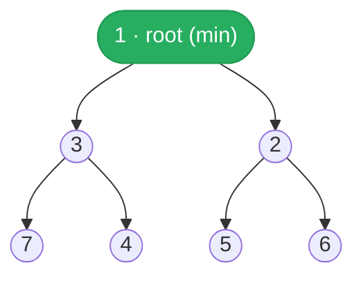
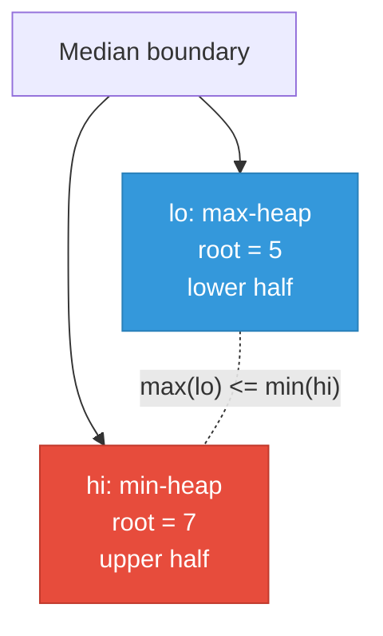

# Heap / Priority Queue Algorithm Guide

> **Core idea:** a [[Heap]] is the go-to structure whenever you **repeatedly need the min or max of a changing collection**. It buys you O(log n) push and pop with O(1) peek — perfect when the collection grows or shrinks over time and full sorting would be wasteful.

## ⚡ Cheatsheet

| Pattern | Reach for it when… | Mechanism |
| --- | --- | --- |
| Top-K | "return the K largest/smallest" from N items | min-heap of size K; evict root whenever `len > K` |
| [[Two Heaps]] | streaming median; partition a stream into halves | max-heap (lo) + min-heap (hi); keep sizes balanced |
| K-Way Merge | merge K sorted sequences into one | seed heap with first element of each sequence; pop global min, push its successor |
| [[0.GreedyGuide\|Greedy]] by priority | always process the most/least urgent item next | max-heap or min-heap drives the greedy choice each step |
| Lazy Deletion | need to "remove" an arbitrary element, not just the root | mark deleted in a counter; discard stale entries when they surface |

## How to think about it

A heap gives you one thing an array doesn't: **O(1) access to the extremum at all times**, even as elements arrive and leave. The cost is that you can only see the root — you can't index into the heap or walk it in order.

**Min-heap structure** — every parent ≤ its children; root is always the global minimum:



Python's `heapq` maintains this property automatically on every push/pop (O(log n) each).

So every heap problem is the same game:

> **set up the right invariant at the root, then preserve it with every push and pop.**

That invariant is what differs between patterns:
- **Top-K:** the root is always the Kth-largest seen so far. Everything smaller has been evicted.
- **[[Two Heaps]]:** every element in `lo` ≤ every element in `hi`, and their sizes differ by at most 1. That guarantees the median is always at one or both roots.
- **K-Way Merge:** the root is the global minimum across all K active sequences. Each pop is followed by pushing the next element from the same sequence.

Python's `heapq` is **min-heap only**. Negate values to simulate a max-heap:

```python
import heapq

# max-heap: negate on push, negate again on pop
heapq.heappush(max_heap, -val)
largest = -heapq.heappop(max_heap)
```

When heap entries contain non-comparable objects (e.g., `ListNode`), add a numeric tiebreaker as the second tuple element so Python never falls through to compare the object itself:

```python
# (priority, unique_index, item) — index breaks ties without comparing item
heapq.heappush(heap, (node.val, i, node))
```

## The core patterns

### Top-K — filter via a bounded heap

The heap holds the K best elements seen so far. Each new element is compared against the heap's minimum: if the newcomer is larger, it replaces that minimum. After processing all N elements, exactly the K largest remain.

```python
# Keep the K largest — use a MIN-heap so the weakest (root) is easiest to evict
heap = []
for item in items:
    heapq.heappush(heap, key(item))
    if len(heap) > k:
        heapq.heappop(heap)       # evict the smallest
# heap now contains exactly the K largest
```

The counterintuitive part: **to keep the K largest, use a min-heap**. The root is the smallest of your top-K; that is exactly the one you want to compare against and potentially evict. A max-heap would make eviction expensive. → [[04.KthLargestElementInAnArray|KthLargestElementInAnArray]], [[01.kthLargestElementInAStream|kthLargestElementInAStream]]

### Two Heaps — split a stream at the median

Split the elements into two halves: a max-heap holds the lower half so its top is the largest low value, and a min-heap holds the upper half so its top is the smallest high value. The median sits at the boundary, readable from the two tops in O(1).

Two invariants to maintain on every insert:
1. **Order:** `max(lo) ≤ min(hi)` — no element in the left pile exceeds any element in the right pile.
2. **Balance:** `len(lo) == len(hi)` or `len(lo) == len(hi) + 1` — lo holds the median when odd count.

```python
lo = []   # max-heap (negate values)
hi = []   # min-heap

def add(num):
    heapq.heappush(lo, -num)

    # Fix order invariant
    if hi and -lo[0] > hi[0]:
        heapq.heappush(hi, -heapq.heappop(lo))

    # Fix balance invariant
    if len(lo) > len(hi) + 1:
        heapq.heappush(hi, -heapq.heappop(lo))
    elif len(hi) > len(lo):
        heapq.heappush(lo, -heapq.heappop(hi))

def median():
    if len(lo) > len(hi):
        return float(-lo[0])
    return (-lo[0] + hi[0]) / 2.0
```

Always push to `lo` first, then fix order, then fix balance — in that order. Doing it backwards can break the invariant you just established. → [[07.FindMedianFromDataStream|FindMedianFromDataStream]]

**Two Heaps boundary** — `lo` is a max-heap (exposes its largest), `hi` is a min-heap (exposes its smallest); median lives at the boundary:



### K-Way Merge — track the frontier across K sequences

The heap holds one entry per list: that list's current head. Each step pops the globally smallest head, appends it to the output, and pushes the next element from the same list. The heap never exceeds K entries.

```python
heap = []
for i, seq in enumerate(sequences):
    if seq:
        heapq.heappush(heap, (seq[0], i, 0))   # (value, seq_index, elem_index)

result = []
while heap:
    val, si, ei = heapq.heappop(heap)
    result.append(val)
    if ei + 1 < len(sequences[si]):
        heapq.heappush(heap, (sequences[si][ei + 1], si, ei + 1))
```

Heap size stays at most K throughout — the total cost is O(N log K) where N is total elements across all sequences. → [[10.MergeKSortedLists|MergeKSortedLists]]

### Greedy by priority — always pick the most urgent item

When a [[0.GreedyGuide|greedy]] algorithm needs to repeatedly pick the max/min priority item, a heap is the right driver. The heap orders candidates so each greedy step is O(log n) rather than O(n). Common shape: pop the highest-priority item, process it, optionally push a modified version or a dependent item back.

[[05.TaskScheduler|TaskScheduler]] exemplifies this: always schedule the most frequent remaining task (max-heap by count), with a cooldown queue to gate re-entry.

### Lazy Deletion — mark first, clean on access

You can't efficiently remove an arbitrary heap element. The workaround: record the deletion in a `Counter`, and whenever you peek or pop, discard any stale entries at the root first.

```python
from collections import Counter

deleted = Counter()

def lazy_remove(val):
    deleted[val] += 1           # O(1) logical removal

def clean(heap):
    while heap and deleted[heap[0]]:
        deleted[heapq.heappop(heap)] -= 1

def safe_pop(heap):
    clean(heap)
    return heapq.heappop(heap)
```

Each entry is cleaned at most once, so the amortized cost stays O(log n) per operation.

## How to approach a new problem

1. **Ask: do I repeatedly need the min or max?** If the answer is "just once," use `min()` / `max()` in O(n). A heap is for *repeated* extremum access on a *changing* collection.
2. **Identify the pattern.** Look for the signal words:
   - "top K / K largest / K smallest / K most frequent" → Top-K
   - "median" or "split stream into halves" → Two Heaps
   - "merge K sorted" → K-Way Merge
   - "always pick highest priority / most frequent / earliest deadline" → Greedy by priority
   - "remove elements other than the root" → Lazy Deletion
3. **Decide min-heap vs. max-heap.** For Top-K largest, use a **min**-heap (evict the smallest). For Top-K smallest, use a **max**-heap (evict the largest). State this out loud before coding — it's the most common source of confusion.
4. **Name your tuple layout.** Before writing the heap, decide: `(priority, item)` or `(priority, tiebreaker, item)`? You need a tiebreaker whenever two items can tie on priority and the item type doesn't support `<`.
5. **Write the push-and-fix loop.** For Top-K: push then conditionally pop. For Two Heaps: push then fix order then fix balance. For K-Way Merge: pop then push successor.
6. **Check edge cases.** Empty heap before peek/pop. K > len(input). Sequences of length 0 in K-Way Merge. Even vs. odd count for median.

## Worked example: Two Heaps trace

[[07.FindMedianFromDataStream|FindMedianFromDataStream]] — stream arrives as `5, 2, 8, 1, 4`.

| Operation | lo (shown positive) | hi | Median |
| --- | --- | --- | --- |
| add(5) | [5] | [] | 5.0 |
| add(2) | [2] | [5] | 3.5 |
| add(8) | push 8→lo; 8 > 5, move 8→hi; hi too big, move 5→lo → [2,5] | [8] | 5.0 |
| add(1) | push 1→lo (size 3 vs 1), move 5→hi → [1,2] | [5,8] | 3.5 |
| add(4) | push 4→lo; 4 < 5, order OK; lo size 3 vs hi 2, OK → [1,2,4] | [5,8] | 4.0 |

The add(8) step is the tricky one: after pushing 8 to `lo`, the order invariant breaks (lo's max 8 > hi's min 5), so 8 moves to `hi`. Now `hi` is larger than `lo`, breaking balance, so 5 moves back to `lo`. Two rebalance moves for one insert — this is why the order check always precedes the balance check.

## Interactive Walkthroughs

- [[Quickselect]]: pivot placement, partition bounds, and discarded ranges
- [[Two Heaps]]: rebalancing lower and upper halves while tracking the median
- [[06.DesignTwitter|Design Twitter]]: candidate tweets, newest-pop order, and per-user replenishment

## Problems Covered

| Problem | Primary pattern |
| --- | --- |
| [[01.kthLargestElementInAStream\|Kth Largest Element in a Stream]] | Top-K min-heap |
| [[02.LastStoneWeight\|Last Stone Weight]] | Max-heap simulation |
| [[03.KClosestPointsToOrigin\|K Closest Points to Origin]] | Top-K heap |
| [[04.KthLargestElementInAnArray\|Kth Largest Element in an Array]] | Top-K min-heap |
| [[05.TaskScheduler\|Task Scheduler]] | Greedy max-heap + cooldown queue |
| [[06.DesignTwitter\|Design Twitter]] | K-way merge with a max-heap |
| [[07.FindMedianFromDataStream\|Find Median from Data Stream]] | Two heaps |

## When it's the wrong tool

- **Need the full [[Sorting|sorted]] order.** Just call `sorted()` — O(n log n), same as n heap pops, but simpler.
- **Need the extremum only once.** `min()` / `max()` is O(n) and O(1) space. No data structure needed.
- **Need the Kth element (not the full top-K set).** [[Quickselect]] runs in O(n) average. A size-K heap costs O(n log k) — worse when k is large. Python's `statistics.median` and `heapq.nlargest(k, nums)[-1]` exist, but for pure Kth-element queries, quickselect wins asymptotically.
- **Need arbitrary rank queries on a dynamic collection.** A heap only exposes the root. If you need to ask "what is the 10th smallest right now?", you need a balanced [[Binary Search Tree|BST]] or a `SortedList` from `sortedcontainers`.
- **Collection is static and you have many range/rank queries.** Sort once; [[0.BinarySearchGuide|binary search]] each query.
- **Values are in a small bounded range [0, C].** Bucket/counting sort is O(n + C) — no log factor at all.

## 🐍 Python Tricks

Idioms that keep heap code short and correct. General syntax: [[Python Cheatsheet]].

**`heapq.heapreplace` collapses "push then evict" into one call once the heap is already at size K.**
```python
if len(heap) < k:
    heapq.heappush(heap, x)
elif x > heap[0]:
    heapq.heapreplace(heap, x)   # pop-then-push in one step; heap never exceeds size k
```

**Seed K-Way Merge with a list comprehension plus one `heapify()`, not K individual pushes.**
```python
heap = [(seq[0], i, 0) for i, seq in enumerate(sequences) if seq]
heapq.heapify(heap)   # O(K), not O(K log K)
```

**A tiebreaker doesn't need `itertools.count()` if you already track a unique index — reuse it.**
```python
heapq.heappush(heap, (val, seq_idx, elem_idx))  # seq_idx breaks ties; no counter object needed
```

**Peek with `heap[0]` before popping — it's O(1) and leaves the heap untouched, so use it to decide whether a pop/push is even needed.**
```python
if hi and -lo[0] > hi[0]:        # check both roots before touching either heap
    heapq.heappush(hi, -heapq.heappop(lo))
```

**A max-heap bug is almost always a missing negation on the way out — negate on push AND on pop.**
```python
heapq.heappush(max_heap, -val)
largest = -heapq.heappop(max_heap)   # drop this `-` and you return the wrong sign, not an error
```

**Lazy deletion needs a `Counter`, not `list.remove()` — removing from a heap's backing list by value is O(n) and can break the heap invariant.**
```python
deleted = Counter()
deleted[val] += 1   # O(1) logical delete; heap.remove(val) would be O(n) and unsafe
```
