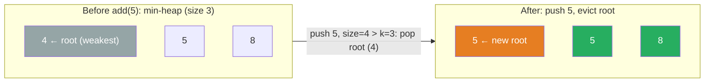

# 703. Kth Largest Element in a Stream

Design a class to find the kth largest element in a stream. Note that it is the kth largest element in the sorted order, not the kth distinct element.

Implement KthLargest class:

- KthLargest(int k, int[] nums) Initializes the object with the integer k and the stream of integers nums.
- int add(int val) Appends the integer val to the stream and returns the element representing the kth largest element in the stream.
 

**Example 1:**

```text
Input
["KthLargest", "add", "add", "add", "add", "add"]
[[3, [4, 5, 8, 2]], [3], [5], [10], [9], [4]]
Output
[null, 4, 5, 5, 8, 8]
Explanation
KthLargest kthLargest = new KthLargest(3, [4, 5, 8, 2]);
kthLargest.add(3);   // return 4
kthLargest.add(5);   // return 5
kthLargest.add(10);  // return 5
kthLargest.add(9);   // return 8
kthLargest.add(4);   // return 8
```

Constraints:
- 1 <= k <= 104
- 0 <= nums.length <= 104
- -104 <= nums[i] <= 104
- -104 <= val <= 104
- At most 104 calls will be made to add.
- It is guaranteed that there will be at least k elements in the array when you search for the kth element.

---

## Solution

### Intuition
To track the kth largest element without sorting the full stream each time, maintain a min-[[Heap]] of exactly k elements. The smallest value in that heap is, by definition, the kth largest overall. When a new value arrives, push it and pop the minimum if the heap exceeds size k.

### Approach
Use Python's `heapq` (a min-heap). Initialize by pushing all nums and then trimming down to k elements. On each `add`, push the new value and pop if needed. The answer is always `heap[0]`.

```python
import heapq


class KthLargest:

    def __init__(self, k: int, nums: list[int]) -> None:
        self.k = k
        self.heap: list[int] = []
        for num in nums:
            heapq.heappush(self.heap, num)
        # trim heap to exactly k elements
        while len(self.heap) > k:
            heapq.heappop(self.heap)

    def add(self, val: int) -> int:
        heapq.heappush(self.heap, val)
        if len(self.heap) > self.k:
            heapq.heappop(self.heap)  # remove the smallest, keeping top-k
        return self.heap[0]  # min of heap = kth largest overall
```

> `heapq` in Python is always a min-heap. To simulate a max-heap you would negate values, but here a min-heap of size k is exactly what is needed: the root is the smallest of the top-k, which is the kth largest.

### Walkthrough
k=3, initial nums=[4,5,8,2]. After trimming: heap=[4,5,8].

| add(val) | Push then trim | heap (sorted view) | Return |
|---|---|---|---|
| add(3) | push 3, size=4 -> pop 3 | [4,5,8] | 4 |
| add(5) | push 5, size=4 -> pop 4 | [5,5,8] | 5 |
| add(10) | push 10, size=4 -> pop 5 | [5,8,10] | 5 |
| add(9) | push 9, size=4 -> pop 5 | [8,9,10] | 8 |
| add(4) | push 4, size=4 -> pop 4 | [8,9,10] | 8 |

**Bounded min-heap of size 3.** `add(5)` pushes a new value and the current root (weakest, `4`) gets evicted:



### Complexity
- **Time:** O(n log n) to initialize (the constructor pushes all n values, *then* trims to k, so the heap grows to size n during the pushes), O(log k) per `add`.
- **Space:** O(k) for the heap.

### Key concepts to review
- [[Heap]] - the core structure; a size-k min-heap gives O(log k) updates. See siblings [[02.LastStoneWeight]] and [[04.KthLargestElementInAnArray]].
- [[Sorting]] - the naive alternative: sort the stream each time for O(n log n) per query.

### Common pitfalls
- `heapq.nlargest(k, nums)` returns a plain sorted list, not a heap. If you initialize with it, run `heapq.heapify` on the result before pushing new values, or the heap operations will corrupt silently.
- Checking `> k` (not `>= k`) before popping: the heap should hold exactly k elements.
- Returning `self.heap[0]` (not `heapq.heappop`) so the heap stays intact for the next call.
- Forgetting that `heapq` is a min-heap: `heap[0]` is the minimum, which is what you want here.
