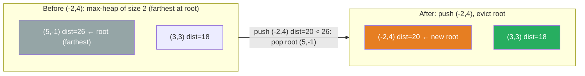

# 973. K Closest Points to Origin


Given an array of points where points[i] = [xi, yi] represents a point on the X-Y plane and an integer k, return the k closest points to the origin (0, 0).

The distance between two points on the X-Y plane is the Euclidean distance (i.e., √(x1 - x2)2 + (y1 - y2)2).

You may return the answer in any order. The answer is guaranteed to be unique (except for the order that it is in).

 

**Example 1:**

![[k-closest-points-example.svg]]

```text
Input: points = [[1,3],[-2,2]], k = 1
Output: [[-2,2]]
Explanation:
The distance between (1, 3) and the origin is sqrt(10).
The distance between (-2, 2) and the origin is sqrt(8).
Since sqrt(8) < sqrt(10), (-2, 2) is closer to the origin.
We only want the closest k = 1 points from the origin, so the answer is just [[-2,2]].
```

**Example 2:**

```text
Input: points = [[3,3],[5,-1],[-2,4]], k = 2
Output: [[3,3],[-2,4]]
Explanation: The answer [[-2,4],[3,3]] would also be accepted.
```

Constraints:

- 1 <= k <= points.length <= 10<sup>4</sup>
- -10<sup>4</sup> < xi, yi < 10<sup>4</sup>

---

## Solution

### Intuition
To keep the k closest points without sorting all n, maintain a max-[[Heap]] of size k keyed on squared distance. When a closer point arrives it bumps out the current farthest, keeping only the k nearest at any time. Squaring the distance avoids the square root and preserves ordering.

### Approach
Use a max-heap (negated distances in Python's min-heap). For each point, push `(-dist_squared, x, y)`. If the heap exceeds k, pop the farthest (most negative distance becomes the largest). The remaining heap holds the k closest points.

```python
import heapq


class Solution:
    def kClosest(self, points: list[list[int]], k: int) -> list[list[int]]:
        # max-heap via negation: keep k smallest distances
        heap: list[tuple[int, int, int]] = []

        for x, y in points:
            dist_sq = x * x + y * y  # no sqrt needed; ordering is preserved
            heapq.heappush(heap, (-dist_sq, x, y))
            if len(heap) > k:
                heapq.heappop(heap)  # evict the farthest point

        return [[x, y] for _, x, y in heap]
```

> Squared Euclidean distance preserves the same ordering as true Euclidean distance because the square root function is monotonically increasing. Skipping the sqrt saves computation and avoids floating-point precision issues.

### Walkthrough
points = `[[1,3],[-2,2]]`, k=1.

| Point | dist_sq | heap after push | heap after trim |
|---|---|---|---|
| [1,3] | 10 | [(-10,1,3)] | [(-10,1,3)] |
| [-2,2] | 8 | [(-10,1,3),(-8,-2,2)] | pop -10 -> [(-8,-2,2)] |

Return `[[-2,2]]`.

**Bounded max-heap of size k=2.** Using `points = [[3,3],[5,-1],[-2,4]]`, the farthest point sits at the root and gets evicted when a closer one arrives:



### Complexity
- **Time:** O(n log k). Each point triggers one push and at most one pop, both O(log k).
- **Space:** O(k) for the heap.

### Key concepts to review
- [[Heap]] - max-heap of size k for rolling top-k selection. See siblings [[01.kthLargestElementInAStream]] and [[04.KthLargestElementInAnArray]].
- [[Sorting]] - the simpler O(n log n) alternative: `sorted(points, key=lambda p: p[0]**2 + p[1]**2)[:k]`.
- [[Quickselect]] - an O(n) average-time alternative for this problem; see [[04.KthLargestElementInAnArray]] for the pattern.

### Common pitfalls
- Taking the actual square root is unnecessary and slower; compare squared distances directly.
- Using a min-heap of size n and popping k times gives the right answer but costs O(n + k log n) rather than O(n log k).
- Not negating the distance when pushing to the heap, causing the wrong element to be evicted.
- Returning `heap` directly instead of extracting `[x, y]` pairs (the tuple also contains the negated distance).
