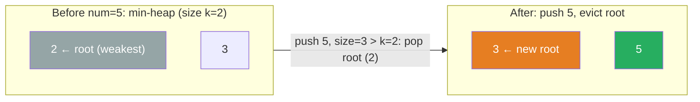

# 215. Kth Largest Element in an Array


Given an integer array nums and an integer k, return the kth largest element in the array.

Note that it is the kth largest element in the sorted order, not the kth distinct element.

 

**Example 1:**

```text
Input: nums = [3,2,1,5,6,4], k = 2
Output: 5
```

**Example 2:**

```text
Input: nums = [3,2,3,1,2,4,5,5,6], k = 4
Output: 4
```

Constraints:

- 1 <= k <= nums.length <= 10<sup>4</sup>
- -10<sup>4</sup> <= nums[i] <= 10<sup>4</sup>

---

## Solution

### Intuition
The simplest heap approach maintains a min-[[Heap]] of size k. After processing all elements, the heap root is the kth largest. An alternative using [[Quickselect]] achieves O(n) average time by partitioning around a pivot, similar to quicksort, without fully sorting the array.

### Approach 1: Brute force
Sort the array in descending order and return `nums[k-1]`. Correct but O(n log n) time.

### Approach 2: Optimal (min-heap of size k)
Iterate through nums, push each value into a min-heap, and pop when the heap exceeds k. The root `heap[0]` is the kth largest at the end.

```python
import heapq


class Solution:
    def findKthLargest(self, nums: list[int], k: int) -> int:
        heap: list[int] = []

        for num in nums:
            heapq.heappush(heap, num)
            if len(heap) > k:
                heapq.heappop(heap)  # evict the smallest; keep top-k

        return heap[0]  # min of heap = kth largest
```

> [[Quickselect]] is an O(n) average-time alternative. Python's `statistics` module and C++ `nth_element` implement this. The heap approach is preferred in interviews for clarity and O(n log k) worst-case guarantee.

### Walkthrough
nums = [3,2,1,5,6,4], k=2.

| num | heap after push | after trim |
|---|---|---|
| 3 | [3] | [3] |
| 2 | [2,3] | [2,3] |
| 1 | [1,3,2] | pop 1 -> [2,3] |
| 5 | [2,3,5] | pop 2 -> [3,5] |
| 6 | [3,5,6] | pop 3 -> [5,6] |
| 4 | [4,6,5] | pop 4 -> [5,6] |

Return `heap[0]` = 5.

**Bounded min-heap of size k=2.** `num=5` pushes in and evicts the current root (weakest, `2`):



### Complexity
- **Time:** O(n log k). Each element triggers one push and at most one pop, both O(log k).
- **Space:** O(k) for the heap.

### Key concepts to review
- [[Heap]] - min-heap of size k pattern. See siblings [[01.kthLargestElementInAStream]] and [[03.KClosestPointsToOrigin]].
- [[Quickselect]] - partition-based O(n) average alternative; worth knowing for follow-up questions.
- [[Sorting]] - the naive O(n log n) baseline.

### Common pitfalls
- Confusing kth largest with kth smallest: kth largest uses a min-heap of size k, kth smallest uses a max-heap of size k.
- Off-by-one: "2nd largest" in [5,6] is 5 (index k-1 in sorted descending), which is `heap[0]` after maintaining size k.
- Using `heapq.nlargest(k, nums)[-1]` works but internally sorts, giving O(n log k) with a larger constant.
- Forgetting that `heapq.heappop` returns the smallest, so the heap root after trimming is already the kth largest.
