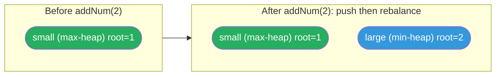

# 295. Find Median from Data Stream


The median is the middle value in an ordered integer list. If the size of the list is even, there is no middle value and the median is the mean of the two middle values.

For example, for arr = [2,3,4], the median is 3.
For example, for arr = [2,3], the median is (2 + 3) / 2 = 2.5.
Implement the MedianFinder class:

MedianFinder() initializes the MedianFinder object.
void addNum(int num) adds the integer num from the data stream to the data structure.
double findMedian() returns the median of all elements so far. Answers within 10-5 of the actual answer will be accepted.
 

**Example 1:**

```text
Input
["MedianFinder", "addNum", "addNum", "findMedian", "addNum", "findMedian"]
[[], [1], [2], [], [3], []]
Output
[null, null, null, 1.5, null, 2.0]

Explanation
MedianFinder medianFinder = new MedianFinder();
medianFinder.addNum(1);    // arr = [1]
medianFinder.addNum(2);    // arr = [1, 2]
medianFinder.findMedian(); // return 1.5 (i.e., (1 + 2) / 2)
medianFinder.addNum(3);    // arr[1, 2, 3]
medianFinder.findMedian(); // return 2.0
```

Constraints:

- -10<sup>5</sup> <= num <= 10<sup>5</sup>
- There will be at least one element in the data structure before calling findMedian.
- At most 5 * 104 calls will be made to addNum and findMedian.
 

Follow up:

- If all integer numbers from the stream are in the range [0, 100], how would you optimize your solution?
- If 99% of all integer numbers from the stream are in the range [0, 100], how would you optimize your solution?

---

## Solution

### Intuition
This problem is the canonical use case for the [[Two Heaps]] pattern. Split the sorted stream into two halves: a max-heap (`small`) for the lower half and a min-heap (`large`) for the upper half. The median is always at the boundary between the two halves. The key insight is that after every insertion you rebalance so that `small` is either equal in size to `large` or has exactly one extra element.

### Approach
`small` is a max-heap (values negated in Python). `large` is a min-heap. When adding a number, always push to `small` first, then move `small`'s max to `large` to maintain ordering. Then rebalance sizes so `small` is never smaller than `large`. The median is `small[0]` if sizes differ, or the average of `small[0]` and `large[0]` if equal.

```python
import heapq


class MedianFinder:

    def __init__(self) -> None:
        # small: max-heap for lower half (negate for Python min-heap)
        self.small: list[int] = []
        # large: min-heap for upper half
        self.large: list[int] = []

    def addNum(self, num: int) -> None:
        # push to small (max-heap) first
        heapq.heappush(self.small, -num)

        # ensure every element in small <= every element in large
        if self.large and (-self.small[0]) > self.large[0]:
            val = -heapq.heappop(self.small)
            heapq.heappush(self.large, val)

        # rebalance sizes: small may have at most 1 extra element
        if len(self.small) > len(self.large) + 1:
            val = -heapq.heappop(self.small)
            heapq.heappush(self.large, val)
        elif len(self.large) > len(self.small):
            val = heapq.heappop(self.large)
            heapq.heappush(self.small, -val)

    def findMedian(self) -> float:
        if len(self.small) > len(self.large):
            return float(-self.small[0])  # odd total: median is top of small
        return (-self.small[0] + self.large[0]) / 2.0  # even total: average
```

> Always push to `small` first regardless of the value, then fix ordering by moving `small`'s top to `large` if needed. This two-step pattern is simpler than conditionally choosing which heap to push to initially, and avoids subtle ordering bugs.

### Walkthrough
addNum(1), addNum(2), addNum(3).

| Action | small (max-heap view) | large (min-heap view) | median |
|---|---|---|---|
| addNum(1) | [1] | [] | 1.0 |
| addNum(2) | push 2 to small -> [2,1], move max(2) to large -> [1], large=[2] | [1] [2] | (1+2)/2=1.5 |
| addNum(3) | push 3 to small -> [3,1], move max(3) to large -> [1], large=[2,3], rebalance: large>small, move 2 to small -> [2,1] | [2,1] [3] | 2.0 |

**Two-heap split.** `small` (green, max-heap over the lower half) and `large` (blue, min-heap over the upper half). `addNum(2)` pushes then rebalances so both roots bound the median:



### Complexity
- **Time:** `addNum` O(log n) for heap operations. `findMedian` O(1).
- **Space:** O(n) total across both heaps.

### Key concepts to review
- [[Two Heaps]] - the defining pattern for streaming median. Both heaps together hold all elements in sorted order at their boundary.
- [[Heap]] - understanding Python's min-heap and the negation trick for max-heap. See siblings [[05.TaskScheduler]] and [[06.DesignTwitter]].

### Common pitfalls
- Forgetting to negate values when pushing to `small` or reading from it: `-self.small[0]` gives the true maximum.
- Rebalancing in the wrong direction: `small` should always be >= size of `large` (never smaller). If `large` grows larger, move one element back to `small`.
- The ordering invariant (all elements in small <= all elements in large) can break if you push directly to `large` without checking.
- Returning an integer instead of a float for the even-size case: use `/ 2.0` not `// 2`.
