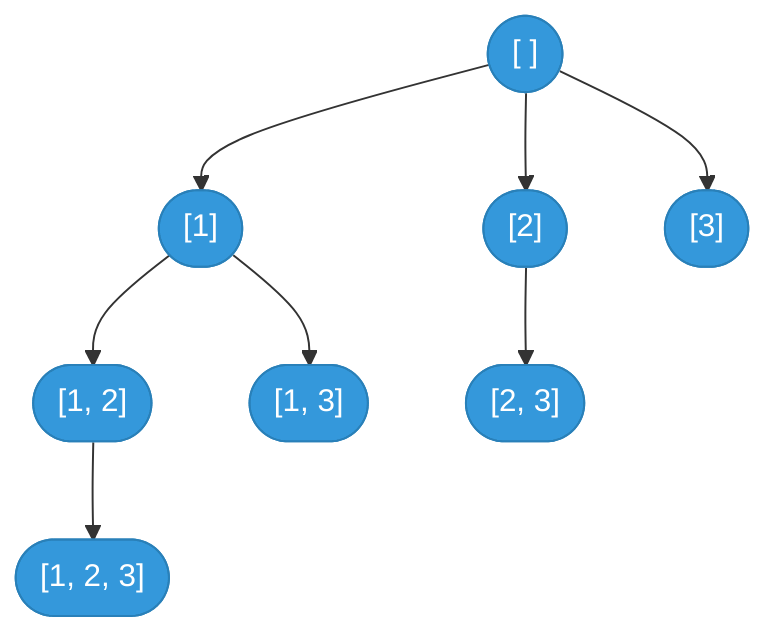
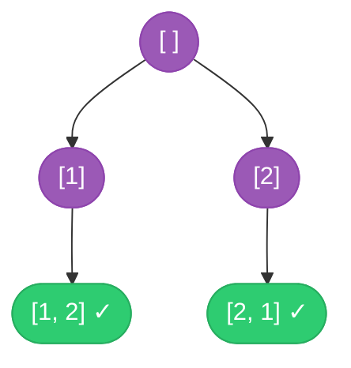

---
aliases:
  - Backtracking
---

# Backtracking Algorithm Guide

> **Core idea:** Backtracking is [[DFS]] over a decision tree. **Choose** one option, **explore** deeper, then **undo** the choice to try another path. Every path from root to leaf is a candidate solution. Pruning stops a branch as soon as it breaks a constraint.

## ⚡ Cheatsheet

| Pattern | Reach for it when… | Mechanism |
| --- | --- | --- |
| Backtracking: subsets / combos | "return all subsets" or "combinations summing to k" | `start` index advances right; record at each node or only at leaves |
| Backtracking: permutations | "all orderings" of a set | `visited` array replaces `start`; iterate `range(n)` every level |
| Backtracking: constraint satisfaction | N-Queens, Sudoku; place items with hard constraints | prune the moment any constraint fires; sets for O(1) checks |
| [[DFS]] on a grid | "does path or word exist" on a 2-D board | mark (`"#"`) as choose; restore as undo |
| Backtracking: string partition | "all valid ways to split" a string | `start` = next unprocessed index; advance by one valid segment |

## How to think about it

Backtracking checks possible answers in a fixed order and stops a branch early when it cannot work. Each level of the decision tree is one decision, and each leaf is one complete candidate. A plain brute-force search visits every leaf. Backtracking skips whole subtrees when a partial solution breaks a constraint.

The three-beat loop is the same regardless of variant:

```python
for choice in available_choices:
    path.append(choice)          # Choose
    backtrack(next_state)        # Explore
    path.pop()                   # Undo
```

After `backtrack` returns, `path` is **identical to what it was before the call**. Every sibling branch starts from the same clean state. This is the main invariant.

The interactive walkthrough uses subsets of `[1, 2]` to show each choice, recursive call, recorded result, and undo.

```freeform
const nodes = {
    R: { x: 310, y: 35, label: "start", sub: "path = []" },
    I1: { x: 170, y: 105, label: "choose 1", sub: "[1]" },
    S1: { x: 450, y: 105, label: "skip 1", sub: "[]" },
    I12: { x: 80, y: 195, label: "choose 2", sub: "[1, 2]" },
    I1S2: { x: 255, y: 195, label: "skip 2", sub: "[1]" },
    S1I2: { x: 365, y: 195, label: "choose 2", sub: "[2]" },
    S1S2: { x: 540, y: 195, label: "skip 2", sub: "[]" },
};
const edges = [
    { key: "R-I1", from: "R", to: "I1", path: "M264 58 L216 82" },
    { key: "R-S1", from: "R", to: "S1", path: "M356 58 L404 82" },
    { key: "I1-I12", from: "I1", to: "I12", path: "M147 128 L103 172" },
    { key: "I1-I1S2", from: "I1", to: "I1S2", path: "M192 128 L233 172" },
    { key: "S1-S1I2", from: "S1", to: "S1I2", path: "M428 128 L387 172" },
    { key: "S1-S1S2", from: "S1", to: "S1S2", path: "M473 128 L517 172" },
];

const steps = [
    { active: "R", edge: null, path: [], results: [], done: [], used: [], line: 2, action: "Start with an empty path and choose whether to include 1." },
    { active: "I1", edge: "R-I1", path: [1], results: [], done: [], used: ["R-I1"], line: 2, action: "Choose 1 and recurse with path [1]." },
    { active: "I12", edge: "I1-I12", path: [1, 2], results: [], done: [], used: ["R-I1", "I1-I12"], line: 2, action: "Choose 2 and recurse with path [1, 2]." },
    { active: "I12", edge: null, path: [1, 2], results: [[1, 2]], done: ["I12"], used: ["R-I1", "I1-I12"], line: 1, action: "The path is complete, so copy [1, 2] into the results." },
    { active: "I1", edge: "I1-I12", path: [1], results: [[1, 2]], done: ["I12"], used: ["R-I1", "I1-I12"], line: 4, action: "Undo 2, returning the path to [1]." },
    { active: "I1S2", edge: "I1-I1S2", path: [1], results: [[1, 2]], done: ["I12"], used: ["R-I1", "I1-I12", "I1-I1S2"], line: 5, action: "Skip 2 and recurse with path [1]." },
    { active: "I1S2", edge: null, path: [1], results: [[1, 2], [1]], done: ["I12", "I1S2"], used: ["R-I1", "I1-I12", "I1-I1S2"], line: 1, action: "Reach the base case and copy [1] into the results." },
    { active: "R", edge: "R-I1", path: [], results: [[1, 2], [1]], done: ["I12", "I1S2", "I1"], used: ["R-I1", "I1-I12", "I1-I1S2"], line: 4, action: "Undo 1, returning the path to []." },
    { active: "S1", edge: "R-S1", path: [], results: [[1, 2], [1]], done: ["I12", "I1S2", "I1"], used: ["R-I1", "I1-I12", "I1-I1S2", "R-S1"], line: 5, action: "Skip 1 and recurse on the remaining choice." },
    { active: "S1I2", edge: "S1-S1I2", path: [2], results: [[1, 2], [1]], done: ["I12", "I1S2", "I1"], used: ["R-I1", "I1-I12", "I1-I1S2", "R-S1", "S1-S1I2"], line: 2, action: "Choose 2 and recurse with path [2]." },
    { active: "S1I2", edge: null, path: [2], results: [[1, 2], [1], [2]], done: ["I12", "I1S2", "I1", "S1I2"], used: ["R-I1", "I1-I12", "I1-I1S2", "R-S1", "S1-S1I2"], line: 1, action: "The path is complete, so copy [2] into the results." },
    { active: "S1", edge: "S1-S1I2", path: [], results: [[1, 2], [1], [2]], done: ["I12", "I1S2", "I1", "S1I2"], used: ["R-I1", "I1-I12", "I1-I1S2", "R-S1", "S1-S1I2"], line: 4, action: "Undo 2, returning the path to []." },
    { active: "S1S2", edge: "S1-S1S2", path: [], results: [[1, 2], [1], [2]], done: ["I12", "I1S2", "I1", "S1I2"], used: ["R-I1", "I1-I12", "I1-I1S2", "R-S1", "S1-S1I2", "S1-S1S2"], line: 5, action: "Skip 2 and recurse with path []." },
    { active: "S1S2", edge: null, path: [], results: [[1, 2], [1], [2], []], done: ["I12", "I1S2", "I1", "S1I2", "S1S2", "S1", "R"], used: ["R-I1", "I1-I12", "I1-I1S2", "R-S1", "S1-S1I2", "S1-S1S2"], line: 1, action: "Reach the base case and copy [] to finish all four subsets." },
];

const root = document.createElement("section");root.setAttribute("role","region");root.setAttribute("aria-label","# Backtracking Algorithm Guide interactive walkthrough 1");
root.style.cssText = "font:14px system-ui;max-width:760px;border:1px solid #c8cdd2;border-radius:10px;padding:12px;background:#ffffff;color:#17202a;";
root.innerHTML = `
<style>
  .bt-graph{display:block;width:100%;height:auto}.bt-state{display:grid;grid-template-columns:1fr 2fr;gap:8px;margin-top:8px}.bt-panel{padding:8px;border:1px solid #c8cdd2;border-radius:8px}.bt-code{margin-top:8px;padding:8px 10px;border-radius:8px;background:#eef2f3;font:13px/1.55 monospace;overflow-x:auto}.bt-controls{display:flex;align-items:center;gap:8px;flex-wrap:wrap;margin-top:10px}.bt-controls button,.bt-controls select{min-height:44px;font-size:14px}.bt-controls button{padding:6px 12px}
  @media(max-width:520px){.bt-state{grid-template-columns:1fr}.bt-controls button{flex:1 1 72px;min-height:44px}.bt-speed{display:flex;align-items:center;gap:8px;flex:1 1 100%}.bt-speed select{flex:1;min-height:44px}.bt-counter{width:100%;margin-left:0!important;text-align:center}.bt-code{font-size:12px}}
</style>
<svg class="bt-graph" viewBox="0 0 620 260" preserveAspectRatio="xMidYMid meet" role="img" aria-label="Interactive subsets backtracking tree"><g data-layer="edges"></g><g data-layer="nodes"></g></svg>
<div style="display:flex;gap:12px;flex-wrap:wrap;font-size:12px;margin-bottom:8px"><span>Orange = current choice or undo</span><span>Blue = branch already used</span><span>Green + done = completed result</span><span>Gray = not visited</span></div>
<div data-role="status" aria-live="polite" style="min-height:22px;padding:9px 10px;border-radius:8px;background:#eef2f3"></div>
<div class="bt-state">
  <div class="bt-panel"><strong>Current path</strong><div data-role="path" style="margin-top:4px;font-family:monospace"></div></div>
  <div class="bt-panel"><strong>Collected results</strong><div data-role="results" style="margin-top:4px;font-family:monospace"></div></div>
</div>
<div class="bt-code" data-role="code">
  <div data-line="1">1&nbsp; if i == n: record a copy of path; return</div>
  <div data-line="2">2&nbsp; choose nums[i], then recurse</div>
  <div data-line="4">4&nbsp; path.pop()</div>
  <div data-line="5">5&nbsp; backtrack(i + 1) without nums[i]</div>
</div>
<div class="bt-controls">
  <button data-action="previous">Previous</button><button data-action="play">Play</button><button data-action="next">Next</button><button data-action="reset">Reset</button>
  <label class="bt-speed" style="margin-left:8px">Speed <select data-action="speed"><option value="1200">Slow</option><option value="700" selected>Normal</option><option value="350">Fast</option></select></label>
  <strong class="bt-counter" data-role="counter" style="margin-left:auto"></strong>
</div>`;

const edgeLayer = root.querySelector('[data-layer="edges"]'), nodeLayer = root.querySelector('[data-layer="nodes"]');
for (const edge of edges) {
    const path = document.createElementNS("http://www.w3.org/2000/svg", "path"); path.setAttribute("d", edge.path); path.setAttribute("data-edge", edge.key); path.setAttribute("fill", "none"); edgeLayer.appendChild(path);
}
for (const [key, node] of Object.entries(nodes)) {
    const group = document.createElementNS("http://www.w3.org/2000/svg", "g"); group.setAttribute("data-node", key); group.setAttribute("transform", `translate(${node.x} ${node.y})`);
    group.innerHTML = `<rect x="-54" y="-23" width="108" height="46" rx="9"></rect><text y="-5" text-anchor="middle" font-size="14" font-weight="700" fill="#17202a">${node.label}</text><text data-role="node-sub" y="14" text-anchor="middle" font-size="12" fill="#17202a">${node.sub}</text>`; nodeLayer.appendChild(group);
}

const svg = root.querySelector("svg");
let index = 0, timer = null;
function stopPlaying() { if (timer !== null) clearInterval(timer); timer = null; root.querySelector('[data-action="play"]').textContent = "Play"; }
function showList(value) { return `[${value.map(item => Array.isArray(item) ? `[${item.join(", ")}]` : item).join(", ")}]`; }
function render() {
    const step = steps[index], done = new Set(step.done), used = new Set(step.used);
    svg.setAttribute("aria-label", `Backtracking step ${index + 1} of ${steps.length}: ${step.action}`);
    for (const group of nodeLayer.querySelectorAll('g[data-node]')) {
        const key = group.getAttribute("data-node"), rect = group.querySelector("rect"), active = key === step.active, complete = done.has(key);
        rect.setAttribute("fill", active ? "#f8c471" : complete ? "#82e0aa" : "#d5d8dc"); rect.setAttribute("stroke", active ? "#b03a2e" : complete ? "#1e8449" : "#566573"); rect.setAttribute("stroke-width", active ? "4" : "2.5");
        const state = active ? " current" : complete ? " done" : "";
        group.querySelector('[data-role="node-sub"]').textContent = `${nodes[key].sub}${state}`;
    }
    for (const path of edgeLayer.querySelectorAll('path[data-edge]')) {
        const key = path.getAttribute("data-edge"), current = key === step.edge, seen = used.has(key);
        path.setAttribute("stroke", current ? "#d35400" : seen ? "#2471a3" : "#6c757d"); path.setAttribute("stroke-width", current ? "5" : seen ? "3.5" : "2.5");
    }
    root.querySelector('[data-role="status"]').textContent = step.action;
    root.querySelector('[data-role="path"]').textContent = `[${step.path.join(", ")}]`;
    root.querySelector('[data-role="results"]').textContent = showList(step.results);
    for (const line of root.querySelectorAll('[data-role="code"] [data-line]')) {
        const active = Number(line.getAttribute("data-line")) === step.line;
        line.style.cssText = active ? "background:#f8c471;color:#17202a;font-weight:700" : "";
        if (active) line.setAttribute("aria-current", "step");
        else line.removeAttribute("aria-current");
    }
    root.querySelector('[data-role="counter"]').textContent = `Step ${index + 1} / ${steps.length}`; root.querySelector('[data-action="previous"]').disabled = index === 0; root.querySelector('[data-action="next"]').disabled = index === steps.length - 1;
}
root.querySelector('[data-action="previous"]').addEventListener("click", () => { stopPlaying(); index = Math.max(0, index - 1); render(); });
root.querySelector('[data-action="next"]').addEventListener("click", () => { stopPlaying(); index = Math.min(steps.length - 1, index + 1); render(); });
root.querySelector('[data-action="reset"]').addEventListener("click", () => { stopPlaying(); index = 0; render(); });
root.querySelector('[data-action="play"]').addEventListener("click", () => { if (timer !== null) return stopPlaying(); if (index === steps.length - 1) index = 0; root.querySelector('[data-action="play"]').textContent = "Pause"; timer = setInterval(() => { if (index === steps.length - 1) return stopPlaying(); index += 1; render(); }, Number(root.querySelector('[data-action="speed"]').value)); render(); });
root.querySelector('[data-action="speed"]').addEventListener("change", () => { if (timer === null) return; stopPlaying(); root.querySelector('[data-action="play"]').click(); });
render();
display(root);
```

The static trees below give a faster overview of the full search shape and show how subset and permutation trees differ.

**Decision tree for subsets of `[1, 2, 3]`:** every node, not just each leaf, is a valid result. The `start` index ensures each element appears only once per root-to-node path.



**Permutations of `[1, 2]`:** there is no `start` index. Every unused element is available at every level, so both orderings are reachable.



Blue = subsets (record at every node). Purple/green = permutations (record only at leaves when `len(path) == n`).

**What it costs:** Subsets take O(n * 2^n) time, and permutations take O(n * n!) time when each completed result takes O(n) to copy. The recursion uses O(n) extra space, excluding stored results. Pruning reduces the number of visited nodes on some inputs but does not change the worst case.

### General template

Use this form when a problem does not match one of the more specific patterns below:

```python
def backtrack(start, path, result):
    if is_complete(path):
        result.append(path[:])
        return

    for choice in choices(start):
        if not is_valid(choice, path):
            continue
        path.append(choice)
        backtrack(next_start, path, result)
        path.pop()
```

Update constraint state when choosing a value, then undo that update when backtracking. Rechecking every constraint from the beginning adds up to O(n) work at each decision-tree node.

## The core patterns

### Subsets (and "combos no reuse")

Every root-to-node path is a valid subset. Record `path` at *every* call, not just at leaves. The `start` index marches rightward so `[1,2]` and `[2,1]` aren't both generated.

```python
def backtrack(start, path):
    result.append(path[:])           # every node is valid
    for i in range(start, len(nums)):
        path.append(nums[i])         # choose
        backtrack(i + 1, path)       # i + 1 avoids reuse
        path.pop()                   # undo
```

**Dedup (see [[04.SubsetsII|SubsetsII]]):** [[Sorting|sort]] first, then at each level skip any value that equals the previous sibling's value (`if i > start and nums[i] == nums[i-1]: continue`). "Same level" is the key. The guard is `i > start`, not `i > 0`.

### Combinations with a target (reuse allowed)

Same shape as subsets, but record only when `remaining == 0`. Passing `i` instead of `i + 1` lets the same element repeat. Sorting enables an early `break` when `candidates[i] > remaining`.

```python
def backtrack(start, remaining):
    if remaining == 0:
        result.append(path[:])
        return
    for i in range(start, len(candidates)):
        if candidates[i] > remaining:
            break                    # sorted, so the rest are larger
        path.append(candidates[i])
        backtrack(i, remaining - candidates[i])   # i = reuse OK
        path.pop()
```

To forbid reuse (see [[05.CombinationSumII|CombinationSumII]]), pass `i + 1` and add the same duplicate-skip guard as Subsets II.

### Permutations

Permutations need *every* ordering, so there's no "only go right" rule. Replace `start` with a `visited` array and iterate `range(n)` at every level, skipping already-used indices.

```python
visited = [False] * n

def backtrack(path):
    if len(path) == n:
        result.append(path[:])
        return
    for i in range(n):
        if visited[i]:
            continue
        visited[i] = True
        path.append(nums[i])         # choose
        backtrack(path)              # explore
        path.pop()                   # undo
        visited[i] = False
```

**Dedup (with duplicates in input):** sort + `if i > 0 and nums[i] == nums[i-1] and not visited[i-1]: continue`. The `not visited[i-1]` clause enforces left-to-right ordering among equal values, collapsing duplicate permutations into one.

### Constraint satisfaction (N-Queens)

Row-by-row placement guarantees no two queens share a row. Three [[Set|sets]] (`cols`, `diag1 = row-col`, `diag2 = row+col`) give O(1) conflict checks. If any set contains the new position, skip that column because the whole subtree below it is invalid.

```python
cols, diag1, diag2 = set(), set(), set()

def backtrack(row):
    if row == n:
        result.append(["".join(r) for r in board])
        return
    for col in range(n):
        if col in cols or (row-col) in diag1 or (row+col) in diag2:
            continue                          # prune
        board[row][col] = "Q"
        cols.add(col); diag1.add(row-col); diag2.add(row+col)
        backtrack(row + 1)
        board[row][col] = "."
        cols.remove(col); diag1.remove(row-col); diag2.remove(row+col)
```

### Grid DFS / word search

The board *is* the decision tree. Mark a cell in-place to prevent revisiting; restore it afterward. See [[06.WordSearch|WordSearch]].

```python
def backtrack(r, c, idx):
    if idx == len(word): return True
    if r < 0 or r >= rows or c < 0 or c >= cols or board[r][c] != word[idx]:
        return False
    saved, board[r][c] = board[r][c], "#"    # choose (mark visited)
    for dr, dc in [(0,1),(0,-1),(1,0),(-1,0)]:
        if backtrack(r+dr, c+dc, idx+1): return True
    board[r][c] = saved                       # undo by restoring
    return False
```

### String partitioning

`start` = the first unprocessed character. At each level try every endpoint; only recurse on segments that pass a predicate (e.g. is-palindrome). When `start == len(s)`, the entire string has been consumed. See [[07.PalindromePartitioning|PalindromePartitioning]].

```python
def backtrack(start, path):
    if start == len(s):
        result.append(path[:])
        return
    for end in range(start + 1, len(s) + 1):
        seg = s[start:end]
        if seg == seg[::-1]:          # predicate: palindrome
            path.append(seg)
            backtrack(end, path)
            path.pop()
```

## How to approach a new problem

1. **Draw the decision tree for a tiny input** with 3 or 4 elements. Each level is one decision, and each edge is one choice. If you cannot draw it, the algorithm is not clear yet.
2. **Identify the variant.** "All subsets or combos" uses a `start` index that advances right. "All orderings" uses a `visited` array and full `range(n)`. "Path on a grid" uses in-place marking. "Split a string" uses `start` as a cursor.
3. **Decide when to record.** Subsets: every node. Combinations: only when `remaining == 0`. Permutations: only when `len(path) == n`. Grid: when `idx == len(word)`.
4. **Add pruning.** Sort input when working with numeric targets so you can `break` early. Add duplicate-skip guards when the input contains repeated values. Return `False` immediately on constraint violation.
5. **Check that each choice has a matching undo.** Every `append` needs a `pop`. Every `visited[i] = True` needs a `visited[i] = False`. Every in-place mutation needs a restore.
6. **Verify the copy.** `result.append(path[:])`, not `result.append(path)`. Appending the list itself gives you a reference that will be mutated to empty by the time you read it.
7. **Trace n = 0, 1, 2.** Empty input, one element, and the smallest branching case expose many base-case bugs.

## Worked example: why `start` vs `visited` matters

Given `[1, 2, 3]`, both subsets and permutations build paths of length ≤ 3 from the same elements. The structural difference is one line:

| | Subsets / Combos | Permutations |
|---|---|---|
| Who decides "which choices are available"? | `range(start, n)`, so only rightward elements | `range(n)`, so all unused elements are available at every level |
| What prevents using the same element twice? | `start = i + 1` on the recursive call | `visited[i]` flag |
| How many leaves (length-3 paths)? | 1 (`[1,2,3]`) | 6 (`3!`) |

`start` enforces an order by allowing only elements to the right, which removes ordering duplicates automatically. `visited` has no order constraint, so every arrangement is reachable. That is exactly what permutations need.

## Related Interactive Walkthroughs

- [[06.WordSearch|Word Search]]: board path, visited cells, rejection, and restoration
- [[09.N-Queens|N-Queens]]: placements, blocked lines, rejection, and backtracking

## Problems Covered

| Problem | Primary pattern |
| --- | --- |
| [[01.Subsets\|Subsets]] | Start-index backtracking |
| [[02.CombinationSum\|Combination Sum]] | Unbounded combination backtracking |
| [[03.Permutations\|Permutations]] | Backtracking with visited choices |
| [[04.SubsetsII\|Subsets II]] | Sorting + duplicate skipping |
| [[05.CombinationSumII\|Combination Sum II]] | Sorting + duplicate skipping |
| [[06.WordSearch\|Word Search]] | Grid DFS + backtracking |
| [[07.PalindromePartitioning\|Palindrome Partitioning]] | String partition backtracking |
| [[08.LetterCombinationsOfAPhone\|Letter Combinations of a Phone Number]] | Cartesian-product backtracking |
| [[09.N-Queens\|N-Queens]] | Constraint-satisfaction backtracking |

## When backtracking is the wrong tool

- **"Minimum, maximum, or count":** you do not need all solutions, only the best answer or the number of answers. Reach for [[Dynamic Programming]] or [[0.GreedyGuide|Greedy]]. Backtracking visits every solution, while DP saves repeated subproblems. [[08.CoinChange|CoinChange]] looks like combination sum but asks for the minimum count, so it uses DP.
- **Heavily overlapping subproblems:** if many paths reach the same partial state, backtracking solves it again each time. Add [[Memoization|memoization]] or switch to Dynamic Programming.
- **Graph with cycles:** backtracking without a visited set will loop. Use [[BFS]] or DFS with visited tracking instead.
- **Greedy-choice structure:** if a locally best pick is always safe, such as [[Interval Scheduling|interval scheduling]], an O(n log n) greedy pass makes backtracking unnecessary.

**Quick rule:** Use Backtracking for "return all," "list every," or "find if one exists." Try Dynamic Programming or Greedy first for "minimum," "maximum," or "how many."

## 🐍 Python Tricks

Idioms that keep backtracking code short and bug-free. General syntax: [[Python Cheatsheet]].

**`result.append(path[:])`: append a copy, or every recorded result changes together.**
```python
result.append(path[:])   # snapshot
result.append(path)      # BUG: every entry aliases the same list
```

**`append`, recurse, and `pop` must stay symmetric. A missing `pop` leaks state into sibling branches.**
```python
path.append(choice)
backtrack(next_state)
path.pop()               # runs even if backtrack already found an answer
```

**Pass a `start` index instead of slicing `nums[start:]`. An index is O(1) per call, while a slice copies O(n).**
```python
for i in range(start, len(nums)):
    backtrack(i + 1, path)      # no new list allocated
```

**Sort once, then use `if i > start and nums[i] == nums[i-1]: continue`. This skips duplicate siblings at the same depth without a set.**
```python
nums.sort()
for i in range(start, len(nums)):
    if i > start and nums[i] == nums[i - 1]:
        continue
```

**Track `visited` by index, not value. A `[False] * n` array correctly treats duplicate values as distinct picks.**
```python
if i > 0 and nums[i] == nums[i - 1] and not visited[i - 1]:
    continue   # same value, but the earlier copy wasn't used first
```

**Mark the grid itself as visited with `board[r][c] = "#"`. This needs no separate set, and restoring the saved value undoes the change.**
```python
saved, board[r][c] = board[r][c], "#"
...
board[r][c] = saved
```

**Join once at the leaf with `''.join(path)` instead of using `+=` during recursion. Repeated concatenation takes O(n^2) time across a path of length n.**
```python
if len(path) == n:
    result.append(''.join(path))
```
