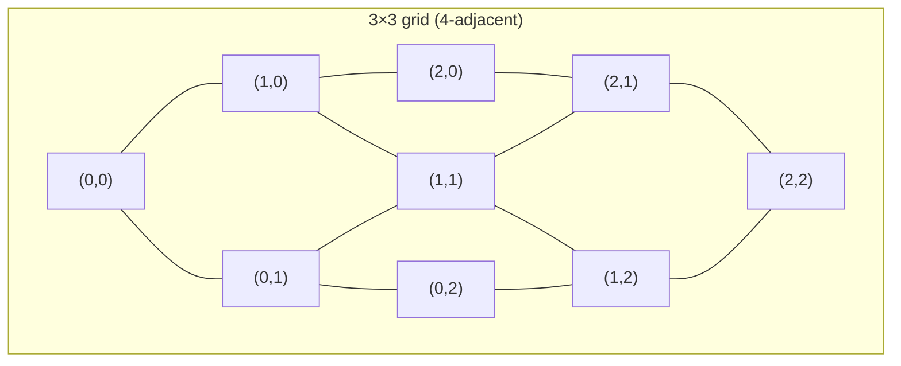
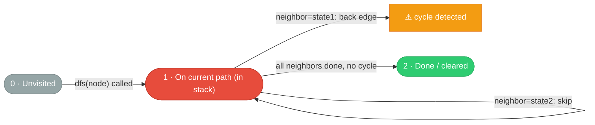
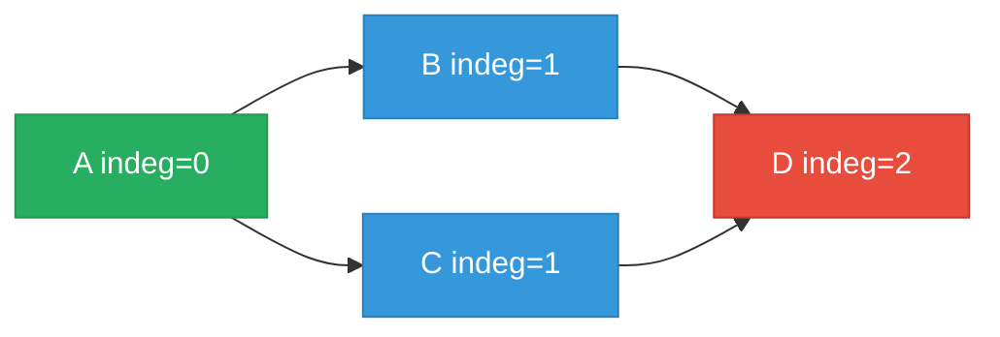

# Graph Algorithm Guide

> **Core idea:** graphs are **relationships between things**. Every graph problem reduces to the same move: pick a starting point, grow a frontier, and never revisit a node. The data structure holding the frontier — queue vs. [[Stack|stack]] — is the only decision that changes everything.

## ⚡ Cheatsheet

| Pattern              | Reach for it when…                                                                  | Mechanism                                                        |
| -------------------- | ----------------------------------------------------------------------------------- | ---------------------------------------------------------------- |
| [[BFS]]              | shortest path (unweighted), level-by-level spread                                   | FIFO queue; first time you reach a node = shortest distance      |
| [[DFS]]              | connected components, flood-fill, cycle detection, any-path                         | stack / recursion; explores one branch fully before backtracking |
| [[Union-Find]]       | incremental connectivity, "are these in the same group?", cycle in undirected graph | `find` + `union` with path compression; near-O(1) per operation  |
| [[Topological Sort]] | dependency ordering, "must A happen before B?", cycle in directed graph             | Kahn's BFS on indegrees; fails gracefully if a cycle exists      |

## How to think about it

A graph is just a way of saying "node X is connected to node Y." That single idea covers an enormous range of problems: cities and roads, courses and prerequisites, pixels in a grid, words that differ by one letter.

The key insight that unlocks [[Matrix Traversal|grid problems]]: **a 2D grid is a graph in disguise.** Each cell `(r, c)` is a node; its neighbors are the four adjacent cells. You never need to build an explicit adjacency list — just use:

```python
directions = [(1,0), (-1,0), (0,1), (0,-1)]
```

Once you see the grid as a graph, all the same BFS/DFS logic applies.



The second insight: **the [[Set|visited set]] is non-negotiable.** Without it, a single cycle causes infinite looping. Mark a node as visited the moment you discover it (for BFS: when you enqueue; for DFS: when you enter). Visiting on dequeue instead of enqueue is the classic BFS bug — you'll enqueue the same node multiple times.

## The four patterns

### DFS — go deep, backtrack, flood-fill

DFS excels when you need to **explore an entire region** or **prove a path exists**. The call stack naturally records "where you came from," which is what makes cycle detection and backtracking fall out for free.

For grids, DFS is the natural flood-fill: [[Recursion|recurse]] in all four directions, marking cells visited as you go. The outer loop counts how many separate fills you trigger — each one is a connected component.

```python
# Grid flood-fill skeleton
def dfs(r, c):
    if r < 0 or r >= rows or c < 0 or c >= cols or grid[r][c] != '1':
        return
    grid[r][c] = '#'          # mark visited in-place
    for dr, dc in [(1,0),(-1,0),(0,1),(0,-1)]:
        dfs(r + dr, c + dc)
```

See [[DFS]] for the full recursive and iterative templates.

**Directed graph cycle detection — 3-color DFS**

A binary `visited` set is wrong for directed graphs: reaching an already-visited node isn't a cycle unless that node is still on the *current DFS path*. Use three states — `0` unvisited, `1` in current path, `2` fully explored:

```python
state = [0] * n   # 0=unvisited, 1=on current path, 2=done

def dfs(node) -> bool:
    if state[node] == 1: return True    # back edge → cycle
    if state[node] == 2: return False   # already cleared
    state[node] = 1
    for neighbor in adj[node]:
        if dfs(neighbor): return True
    state[node] = 2
    return False

has_cycle = any(dfs(i) for i in range(n) if state[i] == 0)
```

`state == 1` means the node is an ancestor in the current recursion stack — a back edge, which defines a cycle. `state == 2` means it was fully explored with no cycle found from a *previous* call — safe to skip immediately. → [[08.CourseSchedule|CourseSchedule]]

**3-color DFS state machine:**



Kahn's (topological sort) is an equivalent cycle detector: if `len(order) < n` after Kahn's, a cycle blocked the remaining nodes. Use 3-color DFS when you need to *find* the cycle; use Kahn's when you also need the topological order.

### BFS — shortest path in unweighted graphs

BFS guarantees that **the first time you reach a node, you've found the shortest path to it** (in hop count). This is the one thing DFS cannot promise.

The multi-source variant is worth memorizing: when multiple cells/nodes are all "distance 0" sources (e.g., all rotten oranges in [[06.RottenOranges|RottenOranges]], all gates in [[07.WallsAndGates|WallsAndGates]]), enqueue them all at the start. BFS then spreads from all sources simultaneously — equivalent to adding a virtual super-node connected to all of them.

```python
from collections import deque

# Multi-source BFS skeleton
queue = deque()
for r in range(rows):
    for c in range(cols):
        if is_source(grid[r][c]):
            queue.append((r, c, 0))   # (row, col, distance)
            grid[r][c] = visited_marker

while queue:
    r, c, dist = queue.popleft()
    for dr, dc in [(1,0),(-1,0),(0,1),(0,-1)]:
        nr, nc = r + dr, c + dc
        if in_bounds(nr, nc) and not_visited(grid[nr][nc]):
            grid[nr][nc] = visited_marker
            queue.append((nr, nc, dist + 1))
```

See [[BFS]] for the full template and level-tracking variant.

### Union-Find — incremental connectivity

Union-Find answers "are these two nodes connected?" as edges are added one at a time. DFS/BFS would re-traverse the whole graph for each query; Union-Find answers each query in amortized O(α(n)) ≈ O(1).

The cycle-detection use is elegant: process edges one by one. If you're about to add edge `(u, v)` and `find(u) == find(v)`, they're already connected — adding the edge would create a cycle. That's the entire trick behind [[10.RedundantConnection|RedundantConnection]].

```python
class UnionFind:
    def __init__(self, n):
        self.parent = list(range(n))
        self.rank = [0] * n
        self.components = n

    def find(self, x):
        if self.parent[x] != x:
            self.parent[x] = self.find(self.parent[x])  # path compression
        return self.parent[x]

    def union(self, x, y):
        rx, ry = self.find(x), self.find(y)
        if rx == ry:
            return False          # already connected — would create a cycle
        if self.rank[rx] < self.rank[ry]:
            rx, ry = ry, rx
        self.parent[ry] = rx
        if self.rank[rx] == self.rank[ry]:
            self.rank[rx] += 1
        self.components -= 1
        return True
```

See [[Union-Find]] for the full implementation and the "number of components" pattern.

### Topological Sort — dependency ordering

Topological Sort produces a linear ordering of a directed graph so every edge points forward — every prerequisite comes before the thing that depends on it. It only works on DAGs (directed acyclic graphs); a cycle means no valid ordering exists.

**Kahn's algorithm** (BFS on indegrees) is the interview-standard approach. The core invariant: a node with indegree 0 has *all its prerequisites already satisfied* and is safe to output. Each time you dequeue and output a node, you "fulfill" it for its dependents by decrementing their indegrees — any neighbor that hits 0 is now also satisfiable and joins the queue.

```python
from collections import deque

def topo_sort(n, edges):
    adj = [[] for _ in range(n)]
    indegree = [0] * n
    for pre, dep in edges:
        adj[pre].append(dep)
        indegree[dep] += 1

    queue = deque(i for i in range(n) if indegree[i] == 0)
    order = []
    while queue:
        node = queue.popleft()
        order.append(node)
        for neighbor in adj[node]:
            indegree[neighbor] -= 1
            if indegree[neighbor] == 0:
                queue.append(neighbor)

    return order if len(order) == n else []  # [] means a cycle exists
```

**Topological ordering** — nodes with indegree 0 start in the queue; each processed node decrements its neighbors' indegrees:



Valid orderings: `A → B → C → D` or `A → C → B → D`. If a cycle existed, D's indegree would never reach 0 — it would never enter the queue, and `len(order) < n`.

**Cycle detection — why stuck nodes never dequeue:**


Z enters the queue and is processed. Decrementing X's indegree drops it to 0… but X and Y form a mutual dependency. X's indegree will never reach 0 because Y has never been processed, and Y's won't either. Both are permanently stuck. `len(order) < n` catches this — the unprocessed nodes are exactly the cycle participants.

**DFS-based topological sort** — an alternative using post-order traversal. Visit all descendants of a node before adding the node itself to the result. Reversing the collected post-order gives a valid topological ordering.

```python
def topo_sort_dfs(n, edges):
    adj = [[] for _ in range(n)]
    for pre, dep in edges:
        adj[pre].append(dep)

    visited = [False] * n
    result = []

    def dfs(node):
        visited[node] = True
        for neighbor in adj[node]:
            if not visited[neighbor]:
                dfs(neighbor)
        result.append(node)   # post-order: node added after all its reachable descendants

    for i in range(n):
        if not visited[i]:
            dfs(i)

    return result[::-1]   # reverse gives topological order
```

Why the reverse works: a node is appended only after every node reachable from it is appended first. Reversing this list guarantees every prerequisite appears before its dependent.

**Kahn's vs DFS — when to reach for each:**

| | Kahn's (BFS) | DFS post-order |
|---|---|---|
| Cycle detection | `len(order) < n` (simple, no extra state) | needs a 3-color "in-stack" flag — see DFS |
| Output | correct order directly | must reverse the post-order list |
| Prefer when | also need the topological order AND cycle detection in one clean pass | already doing DFS for other reasons, or need to find the actual cycle |

Both produce a valid topological ordering when the graph is a DAG. Kahn's is the standard interview choice for problems like CourseSchedule and [[09.CourseScheduleII|CourseScheduleII]].

→ [[Topological Sort]] (full concept note)

## How to approach a new problem

1. **What are the nodes and edges?** Name them explicitly. Cells? Courses? Words? This step turns "I see a grid" into "I see a graph."
2. **Is this shortest path or any path?** Shortest path in an unweighted graph → BFS. "Does a path exist?" or "how many components?" → DFS or Union-Find.
3. **Is the graph directed or undirected?** Directed + ordering/scheduling → Topological Sort. Undirected + cycle detection → Union-Find. Directed + cycle detection → 3-color DFS or Kahn's (see CourseSchedule).
4. **Single source or multiple sources?** Multi-source → enqueue all sources at step 0 in BFS.
5. **Check the edge cases before coding:** empty grid, single node, disconnected graph (need outer loop over all nodes), grid bounds `0 <= r < rows and 0 <= c < cols`.
6. **Mark visited on discovery, not on processing.** For BFS: add to `visited` when you append to the queue. For DFS: add when you enter the function. Getting this wrong is the most common graph bug.
7. **Ask: do I need distance tracking?** If yes, either store `(node, dist)` in the queue, or use `for _ in range(len(queue))` to process one level at a time.

## Worked example: Surrounded Regions

[[05.SurroundedRegions|SurroundedRegions]] asks you to flip all `'O'` cells that are **not** reachable from the border to `'X'`. The naive approach — check every `'O'` for border-connectivity — is expensive. The insight: **reverse the question**.

DFS/BFS from every border `'O'` and mark cells that are safe (reachable from the border). Everything unmarked is surrounded.

```python
def solve(board):
    if not board:
        return
    rows, cols = len(board), len(board[0])

    def dfs(r, c):
        if r < 0 or r >= rows or c < 0 or c >= cols or board[r][c] != 'O':
            return
        board[r][c] = 'S'          # safe — reachable from border
        for dr, dc in [(1,0),(-1,0),(0,1),(0,-1)]:
            dfs(r + dr, c + dc)

    # Phase 1: mark all border-connected 'O' cells as safe
    for r in range(rows):
        dfs(r, 0); dfs(r, cols - 1)
    for c in range(cols):
        dfs(0, c); dfs(rows - 1, c)

    # Phase 2: flip remaining 'O' (surrounded) → 'X', restore 'S' → 'O'
    for r in range(rows):
        for c in range(cols):
            if board[r][c] == 'O':
                board[r][c] = 'X'
            elif board[r][c] == 'S':
                board[r][c] = 'O'
```

The same "start from the boundary, work inward" reversal appears in [[04.PacificAtlanticWaterFlow|PacificAtlanticWaterFlow]]: instead of checking from every cell whether water reaches both oceans, DFS inward from each ocean's border and intersect the two reachable sets.

## Interactive Walkthroughs

- [[DFS]]: recursive call stack, tree edges, back edges, and backtracking
- [[BFS]]: queue order, levels, first discovery, and skipped edges
- [[Union-Find]]: unions, rank, parent arrays, and path compression
- [[Topological Sort]]: indegree updates, zero-indegree queue, ordering, and cycle check
- [[02.CloneGraph|Clone Graph]]: clone registration, original-to-clone mapping, and edge wiring
- [[13.WordLadder|Word Ladder]]: BFS frontiers and first discovery of the target

## Problems Covered

| Problem | Primary pattern |
| --- | --- |
| [[01.NumberOfIslands\|Number of Islands]] | DFS flood-fill |
| [[02.CloneGraph\|Clone Graph]] | DFS + hash map |
| [[03.MaxAreaOfIsland\|Max Area of Island]] | DFS flood-fill |
| [[04.PacificAtlanticWaterFlow\|Pacific Atlantic Water Flow]] | Reverse DFS from boundaries |
| [[05.SurroundedRegions\|Surrounded Regions]] | Boundary DFS flood-fill |
| [[06.RottenOranges\|Rotting Oranges]] | Multi-source BFS |
| [[07.WallsAndGates\|Walls and Gates]] | Multi-source BFS |
| [[08.CourseSchedule\|Course Schedule]] | Topological sort + cycle detection |
| [[09.CourseScheduleII\|Course Schedule II]] | Topological sort |
| [[10.RedundantConnection\|Redundant Connection]] | Union-Find cycle detection |
| [[11.NumberOfConnectedComponentsInAnUndirectedGraph\|Number of Connected Components in an Undirected Graph]] | Union-Find connectivity |
| [[12.GraphValidTree\|Graph Valid Tree]] | Union-Find cycle detection |
| [[13.WordLadder\|Word Ladder]] | BFS shortest path |

## When graphs are the wrong tool

- **Weighted shortest path.** BFS counts hops, not weights. If edges have different costs, use [[Dijkstra]] (non-negative weights). BFS giving wrong answers on a weighted graph is the most common "almost right" mistake.
- **The structure is a tree and you know it.** Trees have exactly one path between any two nodes and no cycles. Skip the visited set; use simpler recursive tree traversal.
- **All permutations or subsets are required.** The "graph" is an implicit decision tree; use [[0.BacktrackingGuide|Backtracking]], not BFS/DFS on an explicit graph.
- **Optimal value over a sequence of choices.** If subproblems overlap and you need the best total, reach for [[Dynamic Programming]].
- **You need edges visited a specific number of times.** Eulerian path/circuit needs Hierholzer's algorithm, not standard traversal.

## 🐍 Python Tricks

Idioms that keep graph code short and bug-free. General syntax: [[Python Cheatsheet]].

**Visit all 4 neighbors with a direction tuple — no copy-pasted ifs.**
```python
for dr, dc in ((1, 0), (-1, 0), (0, 1), (0, -1)):
    nr, nc = r + dr, c + dc
    if 0 <= nr < ROWS and 0 <= nc < COLS and (nr, nc) not in visited:
        ...
```

**Chain the bounds check into one comparison — `0 <= nr < ROWS` reads as math, not two ANDed conditions.**
```python
# equivalent to: r < 0 or r >= rows or c < 0 or c >= cols
if not (0 <= r < rows and 0 <= c < cols):
    return
```

**Mutate the grid in place to mark visited when you're allowed to touch the input — no separate set needed.**
```python
grid[r][c] = '#'   # O(1) visited marker; skip this if the input must stay intact
```

**When you can't mutate the input, track visited cells as a set of `(r, c)` tuples — tuples are hashable out of the box.**
```python
visited = {(0, 0)}
if (nr, nc) not in visited:
    visited.add((nr, nc))
```

**Always use `deque` + `popleft()` for BFS — `list.pop(0)` is O(n) and quietly turns O(V+E) BFS into O(V²).**
```python
from collections import deque
queue = deque([start])
node = queue.popleft()   # O(1); a list here would shift every remaining element
```

**Seed multi-source BFS in one line — `deque()` accepts any iterable, including a generator.**
```python
queue = deque((r, c, 0) for r in range(rows) for c in range(cols) if is_source(grid[r][c]))
```

**Build an adjacency list with `defaultdict(list)` when nodes aren't small contiguous ints (course names, words, etc.).**
```python
from collections import defaultdict
adj = defaultdict(list)
for u, v in edges:
    adj[u].append(v)
    adj[v].append(u)   # omit for directed graphs
```
