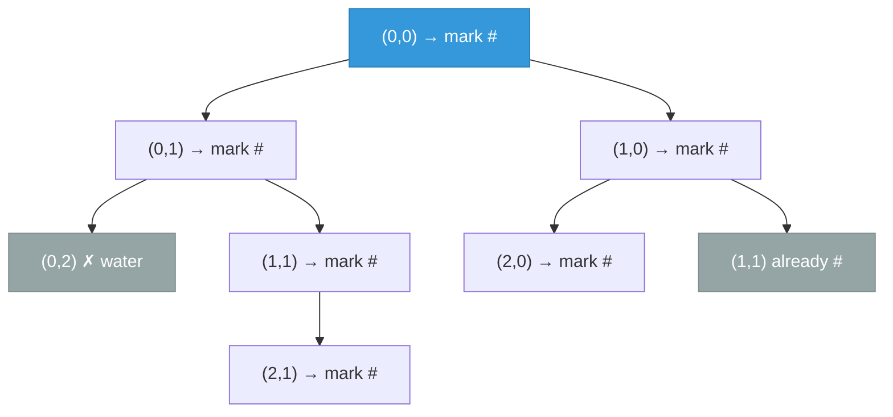

# [200. Number of Islands](https://leetcode.com/problems/number-of-islands/)


Given an m x n 2D binary grid grid which represents a map of '1's (land) and '0's (water), return the number of islands.

An island is surrounded by water and is formed by connecting adjacent lands horizontally or vertically. You may assume all four edges of the grid are all surrounded by water.

 

**Example 1:**

![[number-of-islands-example.svg]]

```
Input: grid = [
  ["1","1","1","1","0"],
  ["1","1","0","1","0"],
  ["1","1","0","0","0"],
  ["0","0","0","0","0"]
]
Output: 1
```
**Example 2:**
```
Input: grid = [
  ["1","1","0","0","0"],
  ["1","1","0","0","0"],
  ["0","0","1","0","0"],
  ["0","0","0","1","1"]
]
Output: 3
```

Constraints:

- m == grid.length
- n == grid[i].length
- 1 <= m, n <= 300
- grid[i][j] is '0' or '1'.

---

## Solution

### Intuition
Each island is a connected component of '1' cells reachable via 4-directional adjacency. We scan the grid and launch a [[DFS|Depth-First Search]] from every unvisited land cell, marking all reachable cells visited so we count each island exactly once. The total number of DFS launches equals the number of islands.

### Approach
Iterate over every cell. When an unvisited '1' is found, increment the count and run DFS to mark the entire connected island as visited. Direction vectors keep the four-neighbor logic clean.

```python
class Solution:
    def numIslands(self, grid: list[list[str]]) -> int:
        if not grid:
            return 0

        rows, cols = len(grid), len(grid[0])
        visited: set[tuple[int, int]] = set()
        directions = [(1, 0), (-1, 0), (0, 1), (0, -1)]

        def dfs(r: int, c: int) -> None:
            # Mark visited before recursing to avoid re-queueing
            visited.add((r, c))
            for dr, dc in directions:
                nr, nc = r + dr, c + dc
                if (0 <= nr < rows and 0 <= nc < cols
                        and grid[nr][nc] == '1'
                        and (nr, nc) not in visited):
                    dfs(nr, nc)

        count = 0
        for r in range(rows):
            for c in range(cols):
                if grid[r][c] == '1' and (r, c) not in visited:
                    count += 1   # new island found
                    dfs(r, c)
        return count
```

> The visited set (or in-place mutation of the grid) must be updated before recursing, not after, to prevent exponential revisits on large islands.

### Walkthrough
Grid (4x5, Example 1) - all '1's form one island:

| step | cell | action |
|------|------|--------|
| scan | (0,0) | '1', unvisited - count=1, DFS floods entire top-left blob |
| DFS | (0,0)-(2,1) | all marked visited |
| scan | rest | all already visited or '0' |

Result: 1.

DFS flood-fill from (0,0), where cells visited in order, marking each `#` before recursing:



### Complexity
- **Time:** O(m * n). Each cell is visited at most once.
- **Space:** O(m * n). Visited set and recursion stack can grow to grid size.

### Key concepts to review
- [[DFS|Depth-First Search]] - recursive flood-fill to explore a connected component.
- [[BFS|Breadth-First Search]] - alternative iterative approach using a queue; see [[06.RottenOranges]] for multi-source BFS.
- [[Matrix Traversal]] - direction vectors for 4-directional grid movement.
- [[Graph]] - each land cell is a node; edges connect 4-directional neighbors.

### Common pitfalls
- Forgetting to mark a cell visited before recursing, causing infinite loops on grids with large components.
- Using `grid[r][c] = '0'` to mark visited in-place is valid but mutates the input; prefer a separate visited set if the grid must be preserved.
- Checking bounds after the recursive call instead of before, which raises index errors.
- Counting the DFS call instead of the outer loop trigger - the outer loop count is the island count.
