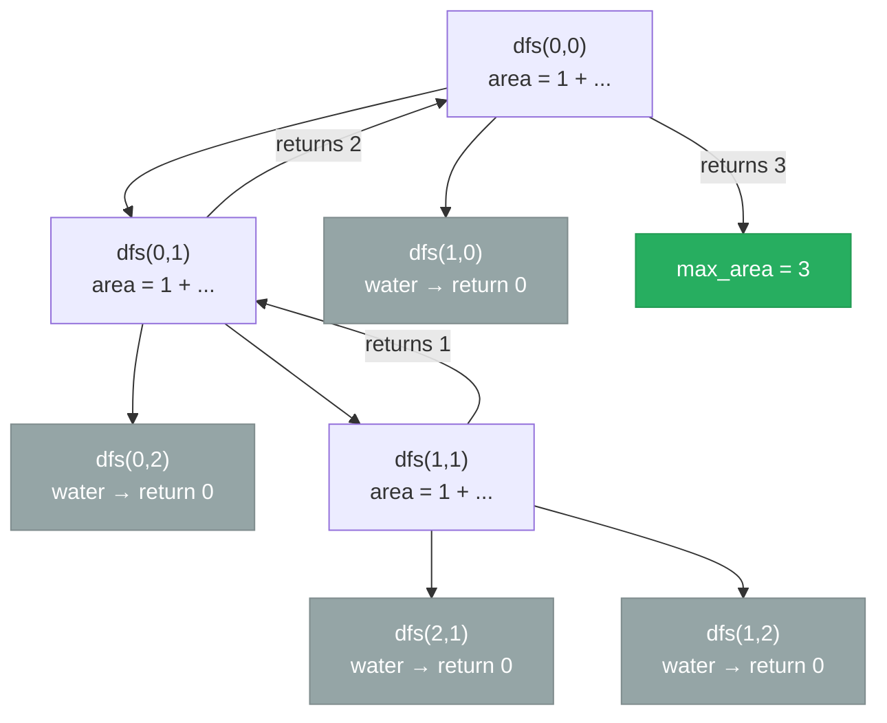

# [695. Max Area of Island](https://leetcode.com/problems/max-area-of-island/)


You are given an m x n binary matrix grid. An island is a group of 1's (representing land) connected 4-directionally (horizontal or vertical.) You may assume all four edges of the grid are surrounded by water.

The area of an island is the number of cells with a value 1 in the island.

Return the maximum area of an island in grid. If there is no island, return 0.

 

**Example 1:**

![[max-area-of-island-example.svg]]

```
Input: grid = [
[0,0,1,0,0,0,0,1,0,0,0,0,0],
[0,0,0,0,0,0,0,1,1,1,0,0,0],
[0,1,1,0,1,0,0,0,0,0,0,0,0],
[0,1,0,0,1,1,0,0,1,0,1,0,0],
[0,1,0,0,1,1,0,0,1,1,1,0,0],
[0,0,0,0,0,0,0,0,0,0,1,0,0],
[0,0,0,0,0,0,0,1,1,1,0,0,0],
[0,0,0,0,0,0,0,1,1,0,0,0,0]]
Output: 6
Explanation: The answer is not 11, because the island must be connected 4-directionally.
```
**Example 2:**
```
Input: grid = [[0,0,0,0,0,0,0,0]]
Output: 0
```

Constraints:

- m == grid.length
- n == grid[i].length
- 1 <= m, n <= 50
- grid[i][j] is either 0 or 1.

---

## Solution

### Intuition
This is a direct extension of [[01.NumberOfIslands]]: instead of counting islands, we measure each island's size using [[DFS|Depth-First Search]] and track the maximum. The DFS returns the area of the component rooted at each cell by summing 1 (current cell) plus the areas returned by its four neighbors.

### Approach
Scan the grid. For each unvisited '1', run DFS that returns the component size. Update the running maximum. Mark cells visited in-place by setting them to 0 to avoid a separate visited set.

```python
class Solution:
    def maxAreaOfIsland(self, grid: list[list[int]]) -> int:
        rows, cols = len(grid), len(grid[0])
        directions = [(1, 0), (-1, 0), (0, 1), (0, -1)]

        def dfs(r: int, c: int) -> int:
            if r < 0 or r >= rows or c < 0 or c >= cols or grid[r][c] == 0:
                return 0
            grid[r][c] = 0   # mark visited in-place to avoid extra set
            area = 1
            for dr, dc in directions:
                area += dfs(r + dr, c + dc)  # accumulate area from all 4 neighbors
            return area

        max_area = 0
        for r in range(rows):
            for c in range(cols):
                if grid[r][c] == 1:
                    max_area = max(max_area, dfs(r, c))
        return max_area
```

> Mutating the grid to 0 during DFS is the most space-efficient approach, but it modifies the input. If the caller needs the original grid intact, use an explicit `visited` set instead (same O(m*n) space as recursion stack anyway).

### Walkthrough
Small grid:
```
1 1 0
0 1 0
0 0 1
```

| scan | cell | action |
|------|------|--------|
| (0,0) | 1 | DFS: visits (0,0), (0,1), (1,1) - returns 3 |
| (2,2) | 1 | DFS: visits (2,2) - returns 1 |
| max_area = 3 | | |

DFS area accumulation, where each call returns 1 + sum of neighbors' areas, building up bottom-up:



### Complexity
- **Time:** O(m * n). Every cell is visited at most once.
- **Space:** O(m * n). Recursion stack depth in the worst case (one giant island).

### Key concepts to review
- [[DFS|Depth-First Search]] - recursive size accumulation across a connected component.
- [[Matrix Traversal]] - direction vectors for 4-directional movement.
- [[Graph]] - grid as an implicit graph; each '1' cell is a node.
- [[01.NumberOfIslands]] - simpler version: count components rather than measure their size.

### Common pitfalls
- Forgetting to mark the current cell visited before recursing, causing infinite loops.
- Returning 1 unconditionally without first checking bounds/water - causes wrong counts.
- Using `max_area = max(max_area, dfs(...))` but initializing `max_area` to 1 instead of 0, which fails on all-water grids.
- Counting area from each direction separately and summing instead of accumulating recursively.
