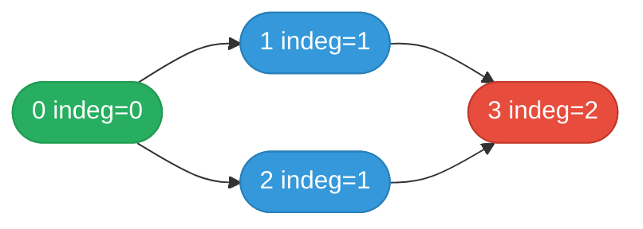

# [207. Course Schedule](https://leetcode.com/problems/course-schedule/)


There are a total of numCourses courses you have to take, labeled from 0 to numCourses - 1. You are given an array prerequisites where prerequisites[i] = [ai, bi] indicates that you must take course bi first if you want to take course ai.

For example, the pair [0, 1], indicates that to take course 0 you have to first take course 1.
Return true if you can finish all courses. Otherwise, return false.

 

**Example 1:**

![[course-schedule-example-1.svg]]

```
Input: numCourses = 2, prerequisites = [[1,0]]
Output: true
Explanation: There are a total of 2 courses to take. 
To take course 1 you should have finished course 0. So it is possible.
```
**Example 2:**

![[course-schedule-example-2.svg]]

```
Input: numCourses = 2, prerequisites = [[1,0],[0,1]]
Output: false
Explanation: There are a total of 2 courses to take. 
To take course 1 you should have finished course 0, and to take course 0 you should also have finished course 1. So it is impossible.
```

Constraints:

- 1 <= numCourses <= 2000
- 0 <= prerequisites.length <= 5000
- prerequisites[i].length == 2
- 0 <= ai, bi < numCourses
- All the pairs prerequisites[i] are unique.

---

## Solution

### Intuition
Prerequisites form a directed graph where an edge b -> a means "take b before a." Finishing all courses is possible if and only if this directed graph has no cycle. [[Topological Sort]] (Kahn's algorithm) detects cycles by checking whether all nodes can be processed: if any node remains with non-zero in-degree after BFS, a cycle exists.

### Approach
Build an adjacency list and an in-degree array from the prerequisites. Enqueue all nodes with in-degree 0 (no prerequisites). Process the queue: for each node, decrement the in-degree of its neighbors and enqueue any that reach 0. Count processed nodes - if the count equals numCourses, no cycle exists.

```python
import collections


class Solution:
    def canFinish(self, numCourses: int, prerequisites: list[list[int]]) -> bool:
        # Build graph and in-degree array
        graph: list[list[int]] = [[] for _ in range(numCourses)]
        in_degree = [0] * numCourses

        for course, prereq in prerequisites:
            graph[prereq].append(course)   # prereq -> course
            in_degree[course] += 1

        # Seed queue with all courses that have no prerequisites
        queue: collections.deque[int] = collections.deque(
            c for c in range(numCourses) if in_degree[c] == 0
        )

        completed = 0
        while queue:
            course = queue.popleft()
            completed += 1   # this course can be taken
            for neighbor in graph[course]:
                in_degree[neighbor] -= 1
                if in_degree[neighbor] == 0:
                    queue.append(neighbor)   # all prereqs satisfied

        return completed == numCourses
```

> `completed == numCourses` is the cycle-detection check: if a cycle exists, every node in it always has in-degree >= 1 and is never enqueued, so `completed` falls short.

### Walkthrough
numCourses=4, prerequisites=`[[1,0],[2,0],[3,1],[3,2]]`

Initial in_degree: [0,1,1,2], graph: {0:[1,2], 1:[3], 2:[3]}

| step | queue | completed | action |
|------|-------|-----------|--------|
| init | [0] | 0 | in_degree[0]=0 |
| pop 0 | [1,2] | 1 | decrement 1->0, 2->0 |
| pop 1 | [2,3] | 2 | decrement 3: 2->1 |
| pop 2 | [3] | 3 | decrement 3: 1->0, enqueue 3 |
| pop 3 | [] | 4 | done |

4 == numCourses: return True.

Kahn's BFS topology. Each node becomes available once all incoming edges are "consumed":



Pop order: 0 → (1 and 2 unlock) → 1 → (3 indegree drops to 1) → 2 → (3 unlocks) → 3. All 4 processed → no cycle.

### Complexity
- **Time:** O(V + E). V = numCourses, E = prerequisites.length. Each node and edge processed once.
- **Space:** O(V + E). Graph storage plus in-degree array and queue.

### Key concepts to review
- [[Topological Sort]] - Kahn's BFS-based algorithm; detects cycles via the completed count.
- [[Graph]] - directed acyclic graph (DAG) representation using adjacency list.
- [[BFS|Breadth-First Search]] - drives Kahn's algorithm; processes nodes in dependency order.
- [[09.CourseScheduleII]] - same structure but also records the topological order.

### Common pitfalls
- Building edges in the wrong direction (course -> prereq instead of prereq -> course) - topological order comes out backwards.
- Forgetting to initialize in-degree for all courses, leaving nodes out of the initial queue.
- Checking `len(result) == numCourses` but only appending to result sometimes - use a simple counter instead.
- Using DFS with a visited set but not tracking the recursion stack separately - misses cycles in multi-path graphs.
