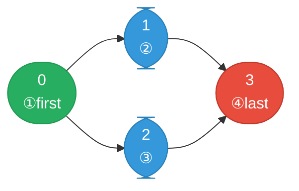

# [210. Course Schedule II](https://leetcode.com/problems/course-schedule-ii/)


There are a total of numCourses courses you have to take, labeled from 0 to numCourses - 1. You are given an array prerequisites where prerequisites[i] = [ai, bi] indicates that you must take course bi first if you want to take course ai.

For example, the pair [0, 1], indicates that to take course 0 you have to first take course 1.
Return the ordering of courses you should take to finish all courses. If there are many valid answers, return any of them. If it is impossible to finish all courses, return an empty array.

 

**Example 1:**

![[graphs-course-schedule-ii-example-1.svg]]

```
Input: numCourses = 2, prerequisites = [[1,0]]
Output: [0,1]
Explanation: There are a total of 2 courses to take. To take course 1 you should have finished course 0. So the correct course order is [0,1].
```
**Example 2:**

![[course-schedule-ii-example.svg]]

```
Input: numCourses = 4, prerequisites = [[1,0],[2,0],[3,1],[3,2]]
Output: [0,2,1,3]
Explanation: There are a total of 4 courses to take. To take course 3 you should have finished both courses 1 and 2. Both courses 1 and 2 should be taken after you finished course 0.
So one correct course order is [0,1,2,3]. Another correct ordering is [0,2,1,3].
```
**Example 3:**
```
Input: numCourses = 1, prerequisites = []
Output: [0]
```

Constraints:

- 1 <= numCourses <= 2000
- 0 <= prerequisites.length <= numCourses * (numCourses - 1)
- prerequisites[i].length == 2
- 0 <= ai, bi < numCourses
- ai != bi
- All the pairs [ai, bi] are distinct.

---

## Solution

### Intuition
This extends [[08.CourseSchedule]] from cycle detection to actually producing the ordering. [[Topological Sort]] via Kahn's algorithm naturally yields nodes in dependency order as they are dequeued - simply collect them. If the result list is shorter than numCourses, a cycle prevents completion and we return an empty array.

### Approach
Identical to Course Schedule I: build adjacency list and in-degree array, seed queue with zero-in-degree nodes, process BFS and collect each dequeued node into the result list. Return the list if its length equals numCourses, otherwise return [].

```python
import collections


class Solution:
    def findOrder(self, numCourses: int, prerequisites: list[list[int]]) -> list[int]:
        graph: list[list[int]] = [[] for _ in range(numCourses)]
        in_degree = [0] * numCourses

        for course, prereq in prerequisites:
            graph[prereq].append(course)   # prereq -> course
            in_degree[course] += 1

        queue: collections.deque[int] = collections.deque(
            c for c in range(numCourses) if in_degree[c] == 0
        )

        order: list[int] = []
        while queue:
            course = queue.popleft()
            order.append(course)          # record topological order
            for neighbor in graph[course]:
                in_degree[neighbor] -= 1
                if in_degree[neighbor] == 0:
                    queue.append(neighbor)

        return order if len(order) == numCourses else []
```

> The BFS dequeue order is one valid topological ordering, but not the unique one. Any ordering where every prerequisite precedes the course it unlocks is correct.

### Walkthrough
numCourses=4, prerequisites=`[[1,0],[2,0],[3,1],[3,2]]`

in_degree: [0,1,1,2], graph: {0:[1,2],1:[3],2:[3]}

| step | queue | order | in_degree changes |
|------|-------|-------|-------------------|
| init | [0] | [] | |
| pop 0 | [1,2] | [0] | 1:1->0, 2:1->0 |
| pop 1 | [2,3?] | [0,1] | 3:2->1 |
| pop 2 | [3] | [0,1,2] | 3:1->0 |
| pop 3 | [] | [0,1,2,3] | |

Return [0,1,2,3]. Also valid: [0,2,1,3].

The dependency graph and one valid topological ordering. Dequeue order IS the output:



### Complexity
- **Time:** O(V + E). Each node and edge processed once.
- **Space:** O(V + E). Graph, in-degree array, queue, and result list.

### Key concepts to review
- [[Topological Sort]] - Kahn's algorithm; dequeue order IS the topological order.
- [[Graph]] - directed graph built from prerequisites; cycle = impossible schedule.
- [[BFS|Breadth-First Search]] - BFS drives Kahn's algorithm level by level.
- [[08.CourseSchedule]] - same logic without collecting the order; compare side by side.

### Common pitfalls
- Returning `order` without checking its length against numCourses - silently returns partial order when a cycle exists.
- Reversing the edge direction (course -> prereq) - produces reverse topological order.
- Using a set instead of a list for `order`, which loses the ordering guarantee.
- Confusing in-degree (prerequisites needed) with out-degree (courses unlocked).
