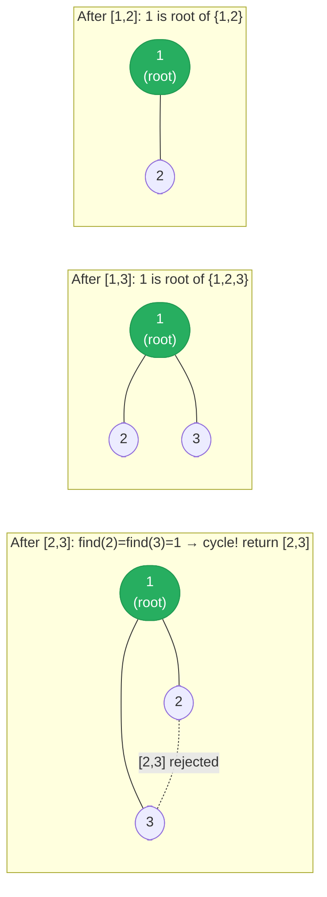

# [684. Redundant Connection](https://leetcode.com/problems/redundant-connection/)


In this problem, a tree is an undirected graph that is connected and has no cycles.

You are given a graph that started as a tree with n nodes labeled from 1 to n, with one additional edge added. The added edge has two different vertices chosen from 1 to n, and was not an edge that already existed. The graph is represented as an array edges of length n where edges[i] = [ai, bi] indicates that there is an edge between nodes ai and bi in the graph.

Return an edge that can be removed so that the resulting graph is a tree of n nodes. If there are multiple answers, return the answer that occurs last in the input.

 

**Example 1:**

![[redundant-connection-example.svg]]

```
Input: edges = [[1,2],[1,3],[2,3]]
Output: [2,3]
```
**Example 2:**

![[graphs-redundant-connection-example-2.svg]]

```
Input: edges = [[1,2],[2,3],[3,4],[1,4],[1,5]]
Output: [1,4]
```

Constraints:

- n == edges.length
- 3 <= n <= 1000
- edges[i].length == 2
- 1 <= ai < bi <= edges.length
- ai != bi
- There are no repeated edges.
- The given graph is connected.

---

## Solution

### Intuition
A tree with n nodes has exactly n-1 edges and no cycles. The one extra edge creates a cycle; we need to find and return it. [[Union-Find|Union Find]] solves this directly: process edges in order and union the endpoints of each edge. The first edge whose two endpoints already share the same root (already connected) is the redundant one. Because we process in order, the last such edge is returned naturally.

### Approach
Initialize Union Find with n nodes, each its own parent. For each edge [a, b], check if `find(a) == find(b)`. If so, they are already connected and this edge is redundant - return it. Otherwise, union them and continue.

```python
class UnionFind:
    def __init__(self, n: int) -> None:
        self.parent = list(range(n + 1))   # 1-indexed
        self.size = [1] * (n + 1)

    def find(self, x: int) -> int:
        while x != self.parent[x]:
            self.parent[x] = self.parent[self.parent[x]]  # path compression
            x = self.parent[x]
        return x

    def union(self, x: int, y: int) -> bool:
        """Returns False if x and y are already in the same component."""
        rx, ry = self.find(x), self.find(y)
        if rx == ry:
            return False   # same component - this edge is redundant
        if self.size[rx] < self.size[ry]:
            rx, ry = ry, rx
        self.parent[ry] = rx       # union by size: attach the smaller component under the larger
        self.size[rx] += self.size[ry]
        return True


class Solution:
    def findRedundantConnection(self, edges: list[list[int]]) -> list[int]:
        uf = UnionFind(len(edges))
        for a, b in edges:
            if not uf.union(a, b):
                return [a, b]   # first (and only) redundant edge
        return []
```

> Path compression in `find` (halving: `self.parent[x] = self.parent[self.parent[x]]`) flattens the tree lazily. Combined with union by size, each operation is nearly O(1) amortized (inverse Ackermann time).

### Walkthrough
edges = `[[1,2],[1,3],[2,3]]`

| edge | find(a) | find(b) | action |
|------|---------|---------|--------|
| [1,2] | 1 | 2 | different - union, parent[2]=1 |
| [1,3] | 1 | 3 | different - union, parent[3]=1 |
| [2,3] | find(2)=1 | find(3)=1 | same! return [2,3] |

Union-Find forest after each edge. Edges [1,2] and [1,3] build the tree; [2,3] finds same root:



### Complexity
- **Time:** O(n * alpha(n)) where alpha is the inverse Ackermann function - effectively O(n).
- **Space:** O(n). Parent and size arrays.

### Key concepts to review
- [[Union-Find|Union Find]] - detect connectivity with near-O(1) operations; core data structure here.
- [[Graph]] - undirected graph; one extra edge creates exactly one cycle.
- [[11.NumberOfConnectedComponentsInAnUndirectedGraph]] - another Union Find application on undirected graphs.
- [[12.GraphValidTree]] - similar: check if a graph is a valid tree (no cycles, connected).

### Common pitfalls
- Returning the edge immediately when `find(a) == find(b)` is correct - there is exactly one redundant edge so no need to continue scanning.
- Off-by-one: nodes are 1-indexed; initialize `parent` with size n+1.
- Attaching the larger component under the smaller one (defeats union by size) - degrades to O(n) per operation.
- Forgetting path compression - makes the solution technically correct but slower than optimal.
