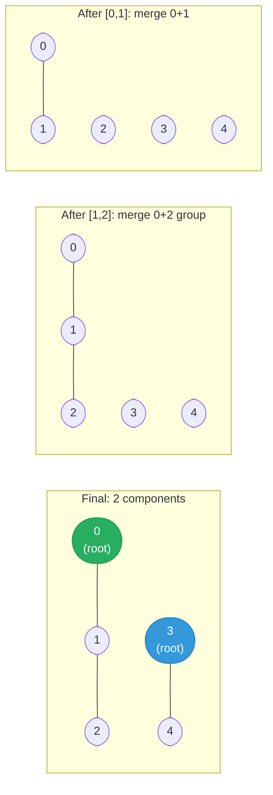

# [323. Number of Connected Components in an Undirected Graph](https://leetcode.com/problems/number-of-connected-components-in-an-undirected-graph/)


Given n nodes labeled from 0 to n - 1 and a list of undirected edges (each edge is a pair of nodes), write a function to find the number of connected components in an undirected graph.

**Example 1:**
```text
     0          3
     |          |
     1 --- 2    4 
```
```
Input: n = 5 and edges = [[0, 1], [1, 2], [3, 4]]
Output: 2
```
**Example 2:**
```text
     0           4
     |           |
     1 --- 2 --- 3
```
```
Input: n = 5 and edges = [[0, 1], [1, 2], [2, 3], [3, 4]]
Output: 1
```
Note: You can assume that no duplicate edges will appear in edges. Since all edges are undirected, [0, 1] is the same as [1, 0] and thus will not appear together in edges.

---

## Solution

### Intuition
Each connected component is a set of nodes that can reach each other. [[Union-Find|Union Find]] counts components directly: start with n components (each node is its own), then merge two components for every edge. Each successful union reduces the component count by one.

### Approach
Initialize Union Find with n nodes and a component counter equal to n. For each edge, attempt to union the two endpoints. If they were in different components, decrement the counter. Return the final counter.

```python
class UnionFind:
    def __init__(self, n: int) -> None:
        self.parent = list(range(n))
        self.size = [1] * n

    def find(self, x: int) -> int:
        while x != self.parent[x]:
            self.parent[x] = self.parent[self.parent[x]]  # path halving
            x = self.parent[x]
        return x

    def union(self, x: int, y: int) -> bool:
        """Returns True if x and y were in different components (a merge occurred)."""
        rx, ry = self.find(x), self.find(y)
        if rx == ry:
            return False
        if self.size[rx] < self.size[ry]:
            rx, ry = ry, rx
        self.parent[ry] = rx
        self.size[rx] += self.size[ry]
        return True


class Solution:
    def countComponents(self, n: int, edges: list[list[int]]) -> int:
        uf = UnionFind(n)
        components = n   # start: every node is its own component

        for a, b in edges:
            if uf.union(a, b):
                components -= 1   # two components merged into one

        return components
```

> Starting the component count at n and decrementing on each successful union is cleaner than re-counting roots at the end. It avoids a final O(n) pass over the parent array.

### Walkthrough
n=5, edges=`[[0,1],[1,2],[3,4]]`, components starts at 5.

| edge | roots | action | components |
|------|-------|--------|-----------|
| [0,1] | 0,1 | merge | 4 |
| [1,2] | 0,2 | merge | 3 |
| [3,4] | 3,4 | merge | 2 |

Return 2.

Union-Find merging: each successful union reduces the component count by 1:



### Complexity
- **Time:** O(n + E * alpha(n)). Building UF is O(n); each of E union/find calls is nearly O(1).
- **Space:** O(n). Parent and size arrays.

### Key concepts to review
- [[Union-Find|Union Find]] - track connected components; decrement count on each successful union.
- [[DFS|Depth-First Search]] - alternative: count the number of DFS launches over unvisited nodes.
- [[Graph]] - undirected graph; components partition the node set.
- [[10.RedundantConnection]] - related UF problem; union and detect cycles simultaneously.
- [[12.GraphValidTree]] - valid tree iff exactly n-1 edges and one component.

### Common pitfalls
- Initializing components to 0 instead of n - off by the number of isolated nodes.
- Not distinguishing between `union` returning True (merged) vs False (already connected) - double-decrementing components.
- Forgetting nodes 0 to n-1 are 0-indexed here (unlike [[10.RedundantConnection]] which is 1-indexed).
- Using DFS but building the adjacency list for only one direction - misses some edges in undirected graph.
