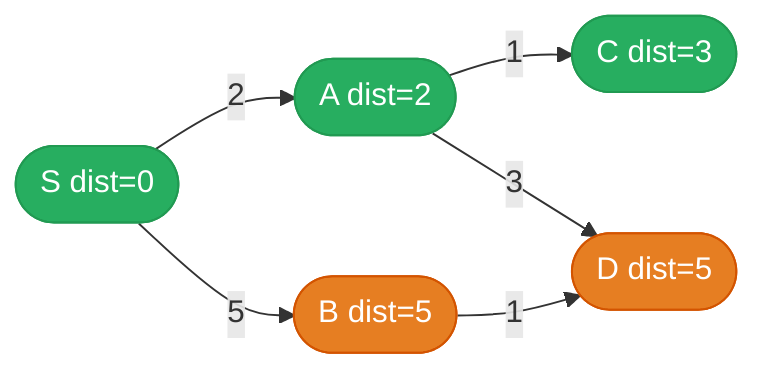
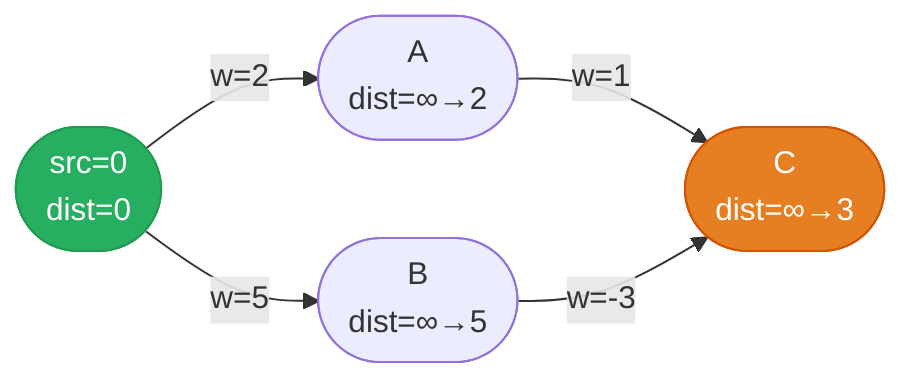
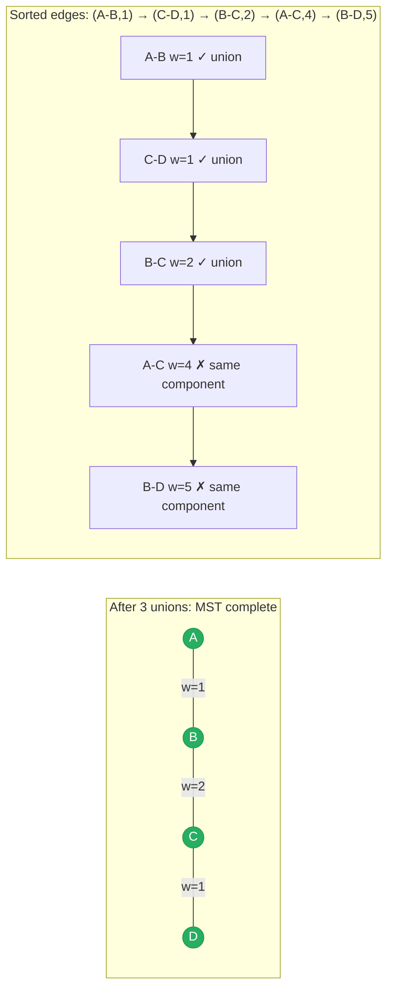
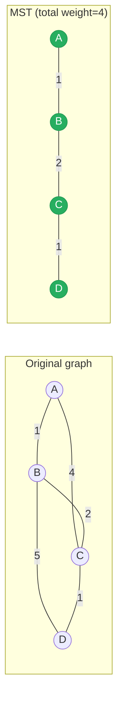

# Advanced Graphs Guide

> **Core idea:** when edges have **weights**, swap BFS's plain queue for a min-[[Heap]] (Dijkstra) or repeat relaxation passes (Bellman-Ford); when you need to **connect all nodes cheaply**, grow a tree one cheapest edge at a time (Prim/Kruskal). The base graph toolkit ([[DFS]], [[BFS]], [[Topological Sort]], [[Union-Find]]) still applies — these algorithms are specializations on top of it.

## ⚡ Cheatsheet

| Pattern                 | Reach for it when…                                            | Mechanism                                                                 |
| ----------------------- | ------------------------------------------------------------- | ------------------------------------------------------------------------- |
| [[Dijkstra]]            | shortest path, non-negative weights                           | min-heap always expands the globally closest unvisited node               |
| [[Bellman-Ford]]        | shortest path, negative weights allowed (or k-hop constraint) | relax every edge V−1 times; detect negative cycles on pass V              |
| [[Prim's Algorithm]]    | minimum spanning tree, dense graph or heap is natural         | grow tree from a seed node using a min-heap of crossing edges             |
| [[Kruskal's Algorithm]] | minimum spanning tree, sparse graph or edges given sorted     | sort edges by weight, add cheapest that doesn't form a cycle (Union-Find) |
| [[Topological Sort]]    | ordering under dependencies (DAG)                             | Kahn's BFS on indegrees; also reconstructs ordering from a weighted DAG   |
| [[Union-Find]]          | dynamic connectivity, cycle detection on undirected graph     | path-compressed find + union-by-rank, near-O(1) per operation             |

## How to think about it

The basic graph toolkit (BFS, DFS) treats every edge as cost 1. That assumption breaks the moment edge weights differ — BFS might return a 2-hop path of total weight 100 when a 5-hop path costs 7.

**Dijkstra's key insight:** [[0.GreedyGuide|greedily]] finalize nodes in order of their *current shortest distance*. Because weights are non-negative, once you pop a node from the min-heap, no future path can ever improve its distance — so you can commit to it. This is why the min-Heap is load-bearing: it gives you the globally closest uncommitted node in O(log V) instead of O(V) for a scan.

**Bellman-Ford's key insight:** if the shortest path uses at most k edges, k passes of edge relaxation are enough to find it. Run V−1 passes to handle any shortest path (which visits each node at most once in an acyclic path); a V-th pass that still improves something reveals a negative cycle.

**MST insight:** a spanning tree touches all V nodes with exactly V−1 edges. To minimize total weight, both Prim and Kruskal apply the same **cut property**: the minimum-weight edge crossing any cut of the graph is safe to include in the MST. Prim grows a single tree outward; Kruskal merges components globally.

**Topological sort + weights:** on a DAG you can compute shortest (or longest) paths in O(V+E) — just relax edges in topological order. No heap needed. This is the trick behind critical-path scheduling.

## The core patterns

### Dijkstra — BFS with a priority queue

The min-heap always returns the unprocessed node with the smallest known distance. Popping that node finalizes its distance because all edge weights are non-negative. Stale heap entries from earlier, longer paths are skipped with the `if d > dist[u]: continue` guard.

```python
import heapq

def dijkstra(graph, src, n):
    # graph[u] = [(v, weight), ...]
    dist = [float('inf')] * n
    dist[src] = 0
    heap = [(0, src)]          # (cost, node)

    while heap:
        d, u = heapq.heappop(heap)
        if d > dist[u]:        # stale entry — a shorter path already won
            continue
        for v, w in graph[u]:
            if d + w < dist[v]:
                dist[v] = d + w
                heapq.heappush(heap, (dist[v], v))

    return dist
```

The `if d > dist[u]: continue` line is the one everyone forgets. Without it, you'd re-expand nodes using outdated distances, which wastes time and can corrupt results if you stop early. → [[Dijkstra]]

**Dijkstra wavefront** — green nodes are finalized (popped, shortest path confirmed); each pop expands the nearest uncommitted node:



Pop order: S(0) → A(2) → C(3) → B(5) or D(5). Non-negative weights guarantee that once a node is popped, no future path can do better.

**Where it shows up:** [[03.NetworkDelayTime|NetworkDelayTime]] (single-source to all nodes), [[06.CheapestFlightsWithinKStops|CheapestFlightsWithinKStops]] (add a hop-count dimension to the state).

### Bellman-Ford — relax all edges V−1 times

You don't need a heap. Just loop V−1 times over every edge and tighten distances. Because any simple path visits each node at most once, V−1 passes are enough to propagate the true shortest distance through any chain.

**Why V−1 passes?** A shortest simple path can visit at most V nodes, meaning it uses at most V−1 edges. After pass `k`, `dist[v]` is correct for all paths that use at most `k` edges. So after V−1 passes, all shortest paths are found — provided no negative cycles exist.

```python
def bellman_ford(n, edges, src):
    # edges = [(u, v, weight), ...]
    dist = [float('inf')] * n
    dist[src] = 0

    for _ in range(n - 1):
        for u, v, w in edges:
            if dist[u] != float('inf') and dist[u] + w < dist[v]:
                dist[v] = dist[u] + w

    # Optional: detect negative cycle
    for u, v, w in edges:
        if dist[u] + w < dist[v]:
            return None  # negative cycle exists

    return dist
```

**Pass-by-pass trace** — how distances settle over multiple rounds:



After pass 1: A=2, B=5 (direct edges from src). After pass 2: C gets min(2+1, 5−3) = min(3, 2) = 2. Without a second pass, C would be stuck at 3.

**The k-hop variant** (for CheapestFlightsWithinKStops): run exactly `k+1` passes (k stops = k+1 edges), and **snapshot** `dist` before each pass to avoid chaining updates within a single round. Without the snapshot, a single pass could chain `A→B→C` as two hops instead of one.

```python
for _ in range(k + 1):
    tmp = dist[:]            # snapshot: read from old values, write to tmp
    for u, v, w in edges:
        if dist[u] != float('inf') and dist[u] + w < tmp[v]:
            tmp[v] = dist[u] + w
    dist = tmp               # commit the round's updates together
```

**Dijkstra vs Bellman-Ford — when to use which:**

| | Dijkstra | Bellman-Ford |
|---|---|---|
| Edge weights | non-negative only | any (including negative) |
| Negative cycles | silently wrong | detected on V-th pass |
| Complexity | O((V+E) log V) with heap | O(V × E) |
| k-hop constraint | hard to enforce cleanly | natural: just limit to k+1 passes |
| Interview default | [[03.NetworkDelayTime\|NetworkDelayTime]], [[04.SwimInRisingWater\|SwimInRisingWater]] | CheapestFlightsWithinKStops |

### Prim's MST — grow a tree with a heap

Pick any starting node. Push all its edges into a min-heap. Always pick the cheapest edge that connects a new node to the tree. This is Dijkstra's shape but the heap holds *edge weights*, not cumulative distances.

```python
import heapq

def prim_mst(n, adj):
    # adj[u] = [(weight, v), ...]
    visited = set()
    heap = [(0, 0)]    # (edge_weight, node); seed from node 0
    total = 0

    while heap and len(visited) < n:
        w, u = heapq.heappop(heap)
        if u in visited:
            continue
        visited.add(u)
        total += w
        for cost, v in adj[u]:
            if v not in visited:
                heapq.heappush(heap, (cost, v))

    return total if len(visited) == n else -1
```

**Where it shows up:** [[02.MinCostToConnectAllPoints|MinCostToConnectAllPoints]] (each point is a node; edge cost = Manhattan distance between two points).

### Kruskal's MST — sort edges, union components

Sort all edges by weight. Walk through them cheapest-first. Add an edge if its two endpoints are in different components (checked with Union-Find). Stop when you have V−1 edges.

The correctness rests on the **cut property**: for any partition of the graph's nodes into two groups (a "cut"), the minimum-weight edge crossing that cut is always safe to include in the MST. Kruskal's implicitly applies this: the cheapest remaining edge always crosses *some* cut between two as-yet-disconnected components, so it's always safe to add.

```python
def kruskal_mst(n, edges):
    # edges = [(weight, u, v)]
    edges.sort()
    uf = UnionFind(n)
    total, count = 0, 0

    for w, u, v in edges:
        if uf.union(u, v):      # returns True if they were in different sets
            total += w
            count += 1
            if count == n - 1:
                break

    return total if count == n - 1 else -1
```

The Union-Find `union` call does double duty: it merges components *and* detects whether the edge would create a cycle (same root → skip it). → [[Union-Find]]

**Step-by-step Kruskal's trace** — edges sorted by weight, Union-Find tracks components:



Each `✓` means the edge crossed a cut between two components and was added. Each `✗` means both endpoints were already in the same component — adding it would create a cycle, so it's skipped.

**Prim vs Kruskal** — both find the same MST, different traversal strategy:



**Prim vs Kruskal decision guide:**

| | Prim's | Kruskal's |
|---|---|---|
| Core operation | grow one tree outward via a min-heap | sort all edges globally, then union |
| Better for | dense graphs (O(n²) edges), when adjacency list is already built | sparse graphs, when edges are pre-sorted or given as a list |
| Data structure | min-Heap | Union-Find + sorted edge list |
| Interview default | [[02.MinCostToConnectAllPoints\|MinCostToConnectAllPoints]] (dense complete graph) | problems where edges are explicitly listed |

### Topological Sort recap (for weighted DAGs)

On a DAG, relax edges in topological order. No heap needed — each node's predecessors are already finalized by the time you reach it. This handles both shortest and longest paths in O(V+E). → [[Topological Sort]]

**Where it shows up:** [[05.AlienDictionary|AlienDictionary]] (derive character ordering from sorted word pairs), [[09.CourseScheduleII|CourseScheduleII]] (output the actual ordering, not just feasibility).

## How to approach a new problem

1. **Identify the graph structure.** Is it explicit (adjacency list given) or implicit (grid cells, string transitions)? Are edges directed or undirected? Weighted or unweighted?
2. **Check for weights.** Unweighted → BFS for shortest path. Non-negative weights → Dijkstra. Negative weights or k-hop constraint → Bellman-Ford. No path query at all → skip both.
3. **Ask: is it a connectivity / grouping problem?** If the question is "how many components", "does adding this edge create a cycle", or "are these two nodes connected" — Union-Find is usually cleaner than BFS/DFS.
4. **Ask: is it an ordering problem?** Prerequisites, dependencies, character ordering → Topological Sort. Check for cycles (if `len(order) < n`, a cycle exists).
5. **Ask: is it a spanning-tree problem?** "Connect all nodes at minimum cost" → Prim or Kruskal. If edges are given pre-sorted or sparse, Kruskal; if building an adjacency list anyway, Prim.
6. **Name your state.** For Dijkstra variants, the heap entry often needs extra dimensions: `(cost, node, stops_remaining)` for CheapestFlightsWithinKStops, `(water_level, row, col)` for SwimInRisingWater. If the state space grows, add those dimensions *in the heap tuple*.
7. **Trace the small example.** For Dijkstra, manually pop 2–3 nodes and verify the stale-skip fires correctly. For Kruskal, check that union returns False on the cycle-forming edge.
8. **Edge cases:** disconnected graph (return -1 or inf), negative weight with Dijkstra (it will silently give wrong answers — use Bellman-Ford instead), graph with 1 node (MST cost 0, Dijkstra returns `[0]`).

## Worked example: Cheapest Flights Within K Stops

CheapestFlightsWithinKStops: find the cheapest path from `src` to `dst` using at most `k` stops (= k+1 edges). Dijkstra almost works, but the constraint "at most k stops" means the same node can be reached multiple times at different stop counts, and a shorter-cost path with more stops must not overwrite a valid-stop-count path. The safest model is Bellman-Ford with exactly `k+1` relaxation passes.

```python
def findCheapestPrice(n, flights, src, dst, k):
    dist = [float('inf')] * n
    dist[src] = 0

    for _ in range(k + 1):          # k stops = k+1 edges
        tmp = dist[:]               # snapshot: don't chain updates in one pass
        for u, v, w in flights:
            if dist[u] != float('inf') and dist[u] + w < tmp[v]:
                tmp[v] = dist[u] + w
        dist = tmp

    return dist[dst] if dist[dst] != float('inf') else -1
```

The critical subtlety: copy `dist` into `tmp` before the inner loop and only write to `tmp`. Without this snapshot, a single pass could chain updates `A→B→C` as if two hops happened in one iteration — violating the "one new edge per pass" invariant.

## Worked example: Swim in Rising Water

SwimInRisingWater: find the path from `(0,0)` to `(n-1,n-1)` minimizing the *maximum cell value* along the path. This is a min-heap problem, but the "distance" is not cumulative — it's the running max.

```python
import heapq

def swimInWater(grid):
    n = len(grid)
    heap = [(grid[0][0], 0, 0)]     # (max_so_far, row, col)
    visited = set()

    while heap:
        t, r, c = heapq.heappop(heap)
        if (r, c) in visited:
            continue
        visited.add((r, c))
        if r == n - 1 and c == n - 1:
            return t
        for dr, dc in [(1,0),(-1,0),(0,1),(0,-1)]:
            nr, nc = r + dr, c + dc
            if 0 <= nr < n and 0 <= nc < n and (nr, nc) not in visited:
                heapq.heappush(heap, (max(t, grid[nr][nc]), nr, nc))
```

The heap key `max(t, grid[nr][nc])` makes Dijkstra's greedy expansion still correct here: the node we pop is the one reachable with the smallest worst-case elevation so far, and non-negative values mean no future path can improve on a finalized node. Recognizing the pattern as "Dijkstra with a different cost accumulator" is the unlock.

## Interactive Walkthroughs

- [[Dijkstra]]: heap pops, relaxations, finalized nodes, and stale entries
- [[Bellman-Ford]]: pass-by-pass relaxation and negative-edge handling
- [[Prim's Algorithm]]: frontier heap, selected MST edges, and stale entries
- [[Kruskal's Algorithm]]: sorted edges, components, accepted edges, and cycle skips
- [[01.ReconstructItinerary|Reconstruct Itinerary]]: ticket consumption, dead ends, postorder, and reversal
- [[05.AlienDictionary|Alien Dictionary]]: graph construction, indegrees, ordering, and invalid prefix
- [[06.CheapestFlightsWithinKStops|Cheapest Flights Within K Stops]]: bounded relaxation with previous-pass snapshots

## Problems Covered

| Problem | Primary pattern |
| --- | --- |
| [[01.ReconstructItinerary\|Reconstruct Itinerary]] | Hierholzer's algorithm + DFS |
| [[02.MinCostToConnectAllPoints\|Min Cost to Connect All Points]] | Prim's minimum spanning tree |
| [[03.NetworkDelayTime\|Network Delay Time]] | Dijkstra's shortest path |
| [[04.SwimInRisingWater\|Swim in Rising Water]] | Dijkstra's minimax path |
| [[05.AlienDictionary\|Alien Dictionary]] | Topological sort |
| [[06.CheapestFlightsWithinKStops\|Cheapest Flights Within K Stops]] | Bellman-Ford with bounded edges |

## When it's the wrong tool

- **Unweighted shortest path:** plain BFS is O(V+E) and simpler — don't pay for a heap.
- **Just reachability or components on a static graph:** DFS or BFS suffice; Union-Find adds complexity without benefit.
- **Negative-weight cycle exists and you need shortest path:** no finite answer exists; Bellman-Ford detects this but cannot solve it.
- **Dijkstra with negative edges:** it will silently give wrong answers. The greedy "finalize on pop" argument breaks down when a future negative edge could improve an already-finalized node.
- **Optimal value over a sequence of choices:** if the problem has overlapping subproblems and recurrence, [[Dynamic Programming]] on a DAG beats any graph search.
- **All permutations or route orderings needed:** [[0.BacktrackingGuide|Backtracking]] over an implicit decision tree, not Dijkstra. ([[01.ReconstructItinerary|ReconstructItinerary]] is a Eulerian path problem — use Hierholzer's algorithm via DFS with a [[Stack|stack]], not shortest-path.)

## 🐍 Python Tricks

Idioms for weighted-graph state. General syntax: [[Python Cheatsheet]].

**Put the cost first in the heap tuple — `(dist, node)` makes the heap order by distance automatically, no `key=` needed.**
```python
heapq.heappush(heap, (dist[v], v))   # tuples compare left-to-right: dist decides, node only breaks ties
```

**The stale-entry guard `if d > dist[u]: continue` stands in for a decrease-key operation — `heapq` doesn't have one.**
```python
d, u = heapq.heappop(pq)
if d > dist[u]:
    continue   # a better entry for u was already processed; this one is obsolete
```

**When nodes are contiguous ints `0..n-1`, use a list for `dist` — O(1) access, no hashing, no membership checks.**
```python
dist = [float('inf')] * n
dist[src] = 0
```

**When nodes are strings or arbitrary labels, switch to a dict with `.get(v, float('inf'))` instead of pre-sizing an array.**
```python
dist = {src: 0}
if dist.get(u, float('inf')) + w < dist.get(v, float('inf')):
    dist[v] = dist.get(u, float('inf')) + w
```

**Pick one adjacency-tuple order and stick to it — this guide's own Dijkstra (`(v, weight)`) and Prim (`(weight, v)`) snippets use different conventions, and mixing them up swaps a node id for a weight without raising an error.**
```python
# Dijkstra here: graph[u] = [(v, weight), ...]   → for v, w in graph[u]
# Prim here:     adj[u]   = [(weight, v), ...]   → for cost, v in adj[u]
```

**Snapshot a whole `dist` array with `dist[:]`, not a loop — one slice copies it, and k-hop Bellman-Ford passes stay independent.**
```python
tmp = dist[:]            # shallow copy is enough for a list of numbers
for u, v, w in edges:
    if dist[u] + w < tmp[v]:
        tmp[v] = dist[u] + w
dist = tmp
```
