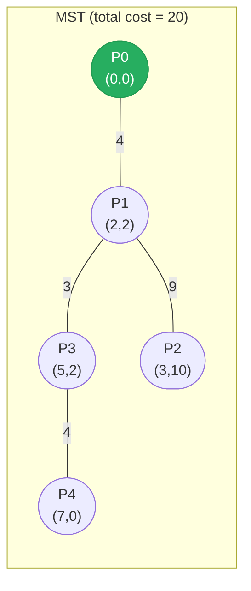

# [1584. Min Cost to Connect All Points](https://leetcode.com/problems/min-cost-to-connect-all-points/)

You are given an array points representing integer coordinates of some points on a 2D-plane, where points[i] = [xi, yi].

The cost of connecting two points [xi, yi] and [xj, yj] is the manhattan distance between them: |xi - xj| + |yi - yj|, where |val| denotes the absolute value of val.

Return the minimum cost to make all points connected. All points are connected if there is exactly one simple path between any two points.

 

**Example 1:**

![[min-cost-connect-points-example.svg]]

```text
Input: points = [[0,0],[2,2],[3,10],[5,2],[7,0]]
Output: 20
```

**Example 2:**

```text
Input: points = [[3,12],[-2,5],[-4,1]]
Output: 18
```

Constraints:

1 <= points.length <= 1000
-106 <= xi, yi <= 106
All pairs (xi, yi) are distinct.

---

## Solution

### Intuition
We need a Minimum Spanning Tree (MST) where each edge weight is the Manhattan distance between two points. Prim's algorithm with a [[Heap]] is a natural fit: start from any point, greedily expand to the cheapest reachable unvisited point, and repeat until all points are included. The [[0.GreedyGuide|Greedy]] choice is safe because MST greedily selecting minimum edges is provably optimal.

### Approach: Prim's Algorithm with a Min-Heap
Maintain a min-heap of `(cost, point_index)`. At each step, pop the cheapest edge, add that point to the MST, then push all edges from the newly added point to unvisited points. Stop when all n points are in the MST.

```python
import heapq

class Solution:
    def minCostConnectPoints(self, points: list[list[int]]) -> int:
        n = len(points)
        visited: set[int] = set()
        # WHY: start from index 0 with cost 0 (any point works for Prim's)
        heap: list[tuple[int, int]] = [(0, 0)]
        total_cost = 0

        while len(visited) < n:
            cost, i = heapq.heappop(heap)
            if i in visited:
                continue  # WHY: skip stale heap entries
            visited.add(i)
            total_cost += cost

            xi, yi = points[i]
            for j in range(n):
                if j not in visited:
                    xj, yj = points[j]
                    dist = abs(xi - xj) + abs(yi - yj)
                    heapq.heappush(heap, (dist, j))

        return total_cost
```

> Prim's and Kruskal's both find the MST. Prim's with a heap is O(E log V) while Kruskal's with Union-Find is O(E log E). For dense graphs (like this one with O(n^2) edges), Prim's is generally preferred.

### Walkthrough
points = `[[0,0],[2,2],[3,10],[5,2],[7,0]]`

| Step | Popped (cost, i) | visited | total_cost |
|------|-----------------|---------|------------|
| 1 | (0, 0) | {0} | 0 |
| 2 | (4, 1) | {0,1} | 4 |
| 3 | (3, 3) | {0,1,3} | 7 |
| 4 | (4, 4) | {0,1,3,4} | 11 |
| 5 | (9, 2) | {0,1,2,3,4} | 20 |

Output: `20`

Prim's expansion. The tree grows one cheapest edge at a time; each step adds the minimum-cost connection to an unvisited point:



### Complexity
- **Time:** O(n^2 log n). There are O(n^2) edges pushed to the heap, each heap operation is O(log n).
- **Space:** O(n^2). The heap can hold O(n^2) entries in the worst case.

### Key concepts to review
- [[0.GreedyGuide|Greedy]] - MST algorithms make locally optimal edge choices that lead to global optimum
- [[Heap]] - min-heap drives Prim's algorithm by always expanding the cheapest frontier edge
- [[Union-Find|Union Find]] - alternative MST approach via Kruskal's algorithm
- [[Graph]] - complete graph where every pair of points is an implicit edge
- [[03.NetworkDelayTime]] - another shortest-path/graph problem using a heap

### Common pitfalls
- Forgetting to skip already-visited nodes popped from the heap (stale entries accumulate).
- Using a `set` with mutable lists as keys - use indices instead.
- Not initializing with cost 0 for the starting node, causing an off-by-one in total cost.
- On dense graphs, a naive O(n^2) Prim's without a heap can actually be faster than the heap version due to lower constant factors.
