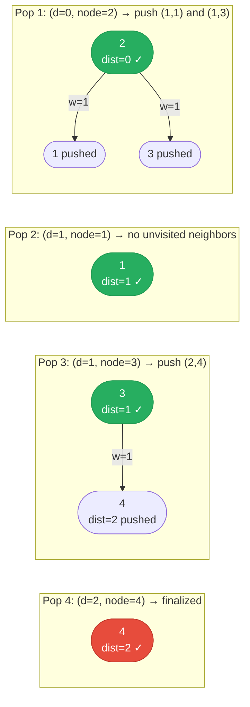

# [743. Network Delay Time](https://leetcode.com/problems/network-delay-time/)

You are given a network of n nodes, labeled from 1 to n. You are also given times, a list of travel times as directed edges times[i] = (ui, vi, wi), where ui is the source node, vi is the target node, and wi is the time it takes for a signal to travel from source to target.

We will send a signal from a given node k. Return the minimum time it takes for all the n nodes to receive the signal. If it is impossible for all the n nodes to receive the signal, return -1.

 

**Example 1:**

![[network-delay-time-example.svg]]

```text
Input: times = [[2,1,1],[2,3,1],[3,4,1]], n = 4, k = 2
Output: 2
```

**Example 2:**

```text
Input: times = [[1,2,1]], n = 2, k = 1
Output: 1
```

**Example 3:**

```text
Input: times = [[1,2,1]], n = 2, k = 2
Output: -1
```

Constraints:

- 1 <= k <= n <= 100
- 1 <= times.length <= 6000
- times[i].length == 3
- 1 <= ui, vi <= n
- ui != vi
- 0 <= wi <= 100
- All the pairs (ui, vi) are unique. (i.e., no multiple edges.)

---

## Solution

### Intuition
We need the shortest path from node k to every other node, then return the maximum of those shortest paths (the last node to receive the signal). [[Dijkstra|Dijkstra's Algorithm]] solves single-source shortest paths on graphs with non-negative weights in O((V + E) log V), which is exactly this scenario.

### Approach: Dijkstra's Algorithm
Build an adjacency list, then run Dijkstra's from node k using a min-heap of `(distance, node)`. Track the shortest distance to each node. After processing all reachable nodes, if any node is unreached, return -1. Otherwise return the maximum shortest distance.

```python
import heapq
import collections

class Solution:
    def networkDelayTime(self, times: list[list[int]], n: int, k: int) -> int:
        # Build adjacency list: src -> [(weight, dst)]
        graph: dict[int, list[tuple[int, int]]] = collections.defaultdict(list)
        for u, v, w in times:
            graph[u].append((w, v))

        # WHY: dist tracks minimum known time to reach each node
        dist: dict[int, int] = {}
        heap: list[tuple[int, int]] = [(0, k)]

        while heap:
            d, node = heapq.heappop(heap)
            if node in dist:
                continue  # WHY: already found optimal path to this node
            dist[node] = d
            for weight, neighbor in graph[node]:
                if neighbor not in dist:
                    heapq.heappush(heap, (d + weight, neighbor))

        # WHY: if not all n nodes reached, signal can't propagate everywhere
        return max(dist.values()) if len(dist) == n else -1
```

> The answer is `max(dist.values())` because the signal reaches all nodes simultaneously but the last node to receive it determines the total delay.

### Walkthrough
times = `[[2,1,1],[2,3,1],[3,4,1]]`, n = 4, k = 2

| Step | Popped (d, node) | dist | heap after |
|------|-----------------|------|------------|
| 1 | (0, 2) | {2:0} | [(1,1),(1,3)] |
| 2 | (1, 1) | {2:0,1:1} | [(1,3)] |
| 3 | (1, 3) | {2:0,1:1,3:1} | [(2,4)] |
| 4 | (2, 4) | {2:0,1:1,3:1,4:2} | [] |

len(dist) == 4 == n, so return max(0,1,1,2) = `2`

Dijkstra greedy expansion. Each pop finalizes one node's shortest distance:



### Complexity
- **Time:** O((V + E) log V). Each node and edge is processed at most once; each heap operation is O(log V).
- **Space:** O(V + E). Adjacency list stores all edges; heap and dist store up to V entries.

### Key concepts to review
- [[Dijkstra|Dijkstra's Algorithm]] - single-source shortest path for non-negative weighted graphs
- [[Heap]] - min-heap is the core data structure enabling efficient Dijkstra's
- [[Graph]] - directed weighted graph representation via adjacency list
- [[02.MinCostToConnectAllPoints]] - Prim's MST algorithm, a similar greedy heap approach
- [[04.SwimInRisingWater]] - modified Dijkstra's on a grid

### Common pitfalls
- Returning `max(dist.values())` without checking `len(dist) == n` - unreachable nodes would be silently ignored.
- Using a visited set check before popping instead of after - can cause incorrect shortest paths.
- Forgetting that Dijkstra's requires non-negative weights; negative weights require Bellman-Ford.
- Using 1-indexed nodes with 0-indexed arrays, causing off-by-one errors.
