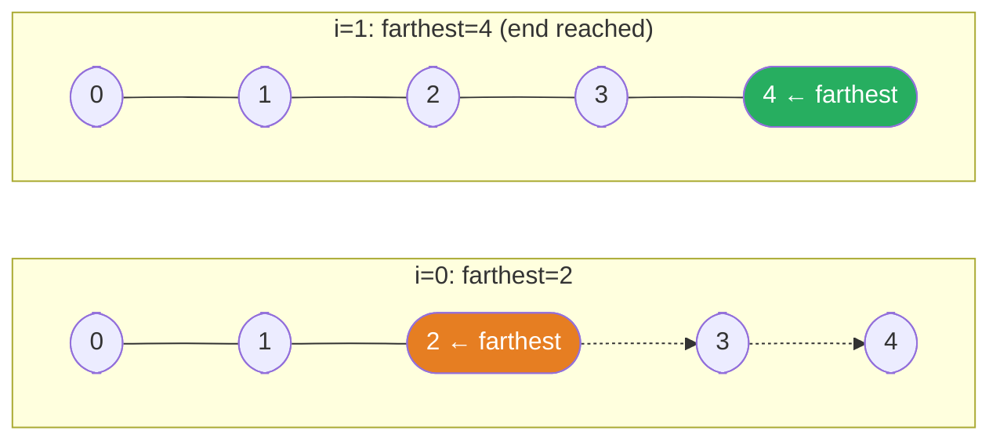

---
aliases:
  - Greedy
---

# Greedy Algorithm Guide

> **Core idea:** A greedy algorithm makes the best available choice at each step and does not undo it. This works only when you can prove that each local choice can still lead to a globally best answer.

## ⚡ Cheatsheet

| Pattern | Reach for it when… | Mechanism |
| --- | --- | --- |
| Frontier / reachability | "can you reach the end?", "minimum steps?" | maintain the farthest reachable index; advance by levels |
| Deficit reset | circular route feasibility | track running surplus; reset start after every deficit |
| [[Kadane's Algorithm\|Extend or restart]] | maximum sum/product over a contiguous subarray | keep the best state ending here; restart when extending is worse |
| Cut at earliest valid boundary | "partition into most parts", each char contained in one part | last-occurrence map; extend current partition, cut immediately when boundary reached |
| Smallest card must start a group | grouping / hand-of-straights style | Counter + sorted keys; consume consecutive runs from the minimum |
| [[Heap]] | greedy with a dynamic "current best" (e.g. task scheduling, median stream) | max/min-heap to always pop the optimal next choice |

## How to think about it

Greedy works when you can prove that the locally best move does not block a better answer later. Two common proof tools are:

- **Exchange argument:** take an optimal solution that differs from greedy at step `k`. Replace its choice with the greedy choice and show that the answer does not get worse. Repeat until the optimal solution uses every greedy choice.
- **Staying-ahead argument:** show that after every step `k`, the greedy partial result is at least as good as every other valid partial result.

The scan takes O(n) time when the input is already in the needed order. If sorting is required, the full algorithm takes O(n log n) time. A basic scan uses O(1) extra space, while a heap or the sorting method may use more. One counterexample is enough to show that a proposed greedy rule is wrong.

> Before committing, ask: "Does this choice block an option that the best answer needs?" If yes, use [[Dynamic Programming]] or another approach.

### Proof example: activity selection

Suppose the intervals are already sorted by end time. Select the next interval whose start is at or after the end of the last selected interval.

| Interval | Does it fit? | Action | Selected count | Last end |
| --- | --- | --- | --- | --- |
| `(1, 3)` | yes | select | 1 | 3 |
| `(2, 4)` | no | skip | 1 | 3 |
| `(3, 5)` | yes | select | 2 | 5 |
| `(6, 7)` | yes | select | 3 | 7 |

The result is `(1, 3), (3, 5), (6, 7)`. To prove it, compare the first greedy interval `g` with the first interval `o` in any optimal answer. Since `g` ends no later than `o`, replacing `o` with `g` leaves at least as much room for every later interval. Repeating the same replacement proves that some optimal answer uses every greedy choice.

```python
intervals.sort(key=lambda interval: interval[1])
last_end = float("-inf")
selected = 0

for start, end in intervals:
    if start >= last_end:
        selected += 1
        last_end = end
```

## The core patterns

### Frontier / Reachability: "how far can I reach?"

The key insight for [[02.Jump|Jump]] (Jump Game): you do not need to simulate every possible path. You only need to track the **farthest index currently reachable**. If you're standing at index `i` and `i > farthest`, you're stranded.

```python
def can_jump(nums: list[int]) -> bool:
    farthest = 0
    for i in range(len(nums)):
        if i > farthest:
            return False
        farthest = max(farthest, i + nums[i])
    return True
```

**Frontier expansion on `[2, 3, 1, 1, 4]`:** `farthest` grows as we scan left to right.

| i | nums[i] | i + nums[i] | farthest |
|---|---|---|---|
| 0 | 2 | 2 | 2 |
| 1 | 3 | **4** | **4** |
| 2 | 1 | 3 | 4 |
| 3 | 1 | 4 | 4 |
| 4 | reached ✓ | n/a | n/a |

At `i = 1`, `farthest` reaches 4, the last index. We can stop because every scanned position was reachable.

**Frontier extending over indices:** the reachable edge moves from 2 to 4 in one step.



For [[03.JumpII|JumpII]], all positions reachable in `k` jumps form one range. The farthest position reachable from that range becomes the end of the next range. Increase the jump count when the scan reaches the end of the current range.

```python
def jump(nums: list[int]) -> int:
    jumps = 0
    current_end = 0    # right edge of the current level
    farthest = 0

    for i in range(len(nums) - 1):
        farthest = max(farthest, i + nums[i])
        if i == current_end:       # level exhausted → must jump
            jumps += 1
            current_end = farthest
    return jumps
```

This is optimal because every index in the current range uses the same number of jumps. Only the farthest next position matters before the jump count increases.

### Deficit Reset: circular route feasibility ([[04.GasStation|GasStation]])

Two observations collapse a circular-route problem to a single O(n) pass:

1. **Feasibility:** if `sum(gas) >= sum(cost)`, a valid start always exists.
2. **Which start:** if running from `start` causes a deficit at station `i`, then every station in `[start, i]` is also invalid as a start (they all hit the same or worse deficit by `i`). So reset `start = i + 1`.

```python
def gas_station(gas, cost):
    total, current, start = 0, 0, 0
    for i in range(len(gas)):
        diff = gas[i] - cost[i]
        total += diff
        current += diff
        if current < 0:
            start = i + 1
            current = 0
    return start if total >= 0 else -1
```

If any station in `[old_start, i]` were a valid start, it would have to avoid the deficit reached at `i`. None does, because each starts with no more saved gas than `old_start` had before the failed segment. The next candidate is `i + 1`.

**Deficit-reset segments:** each red station drives the running surplus below zero and forces a reset. The green station is the remaining candidate.

```text
station:   0      1      2      3      4
diff:     -2     -2     -2     +3     +3
status:  reset  reset  reset  start  finish
```

### Extend or Restart: Kadane's Algorithm ([[01.MaximumSubarray|MaximumSubarray]])

At each index, the maximum subarray ending *here* is either:
- the previous subarray extended by `nums[i]`, or
- a fresh subarray starting at `nums[i]`.

A negative running sum can only drag down any extension, so restarting is strictly better. That single local decision is the entire algorithm:

```python
def max_subarray(nums):
    curr = best = nums[0]
    for n in nums[1:]:
        curr = max(n, curr + n)
        best = max(best, curr)
    return best
```

### Cut at the earliest valid boundary ([[07.PartitionLabels|PartitionLabels]])

A character forces the current partition to reach at least its last occurrence. Extend the partition boundary as you scan; the moment `i == partition_end`, you *must* cut (any later cut only merges partitions). Pre-building a last-occurrence map makes each extension O(1):

```python
def partition_labels(s):
    last = {ch: i for i, ch in enumerate(s)}
    start = end = 0
    result = []
    for i, ch in enumerate(s):
        end = max(end, last[ch])
        if i == end:
            result.append(end - start + 1)
            start = i + 1
    return result
```

Cutting later never helps because it only merges two independent partitions into one.

### Smallest card must start a group ([[05.HandOfStraights|HandOfStraights]])

If the smallest remaining card exists in the frequency table, it **must** be the start of some group (no smaller card can precede it). Try to form a complete run of `groupSize` consecutive cards starting there. If any card in the run is missing, no valid grouping exists.

```python
from collections import Counter

def is_straight_hand(hand, group_size):
    if len(hand) % group_size != 0:
        return False
    freq = Counter(hand)
    for card in sorted(freq):
        count = freq[card]
        if count > 0:
            for i in range(1, group_size):
                if freq[card + i] < count:
                    return False
                freq[card + i] -= count
    return True
```

### When Heap enters the picture

Some greedy problems need to repeatedly find the best option among the items currently available. A heap returns that option in O(log n) time instead of using an O(n) scan. [[Sorting|Sort]] by one key to fix the outer order, then use a heap for the changing inner choices.

For [[05.TaskScheduler|Task Scheduler]], schedule the available task with the highest remaining count and use a max-heap to update that choice after each step.

## How to approach a new problem

1. **Identify what you are optimizing:** minimum or maximum count, feasibility, largest partition count, or another exact goal.
2. **Ask whether the local choice can block a needed future option.** Try 2 or 3 small examples, including a likely failure case. If you find a counterexample, use Dynamic Programming or [[0.BacktrackingGuide|Backtracking]].
3. **Find the sorting or scanning order.** Most greedy problems sort by a key that exposes the next safe choice or scan left to right while keeping a running invariant. Check that you chose the correct sort key.
4. **Name your state variables.** Examples include `farthest`, `current_surplus`, `partition_end`, and `freq`. If you cannot say what each variable tracks and why, the algorithm is not clear yet.
5. **State the invariant.** After processing `k` items, say exactly what remains true. For Jump Game, `farthest` is the largest index reachable through any scanned position.
6. **Write the loop and check the boundary.** Confirm whether touching endpoints are allowed and whether the comparison needs `>=` or `>`. Jump Game II stops at `n - 2` because it does not need to jump from the last index.
7. **Edge cases:** empty input, single element, all elements the same, total that just barely hits zero (Gas Station).

## Worked example: Valid Parenthesis String ([[08.ValidParenthesisString|ValidParenthesisString]])

This problem is non-obvious because `*` can be `(`, `)`, or empty. A pure greedy tracks the **range of possible open-paren counts** as a `[lo, hi]` interval:

- `(` increases both `lo` and `hi` by 1.
- `)` decreases both values by 1.
- `*` decreases `lo` and increases `hi`.

After each character, set `lo = max(lo, 0)` because the number of unmatched opening parentheses cannot be negative. If `hi < 0`, there are too many closing parentheses, so return `False`. At the end, return whether `lo == 0`.

```python
def check_valid_string(s: str) -> bool:
    lo = hi = 0
    for ch in s:
        if ch == '(':
            lo += 1; hi += 1
        elif ch == ')':
            lo -= 1; hi -= 1
        else:           # '*'
            lo -= 1; hi += 1
        if hi < 0:
            return False
        lo = max(lo, 0)
    return lo == 0
```

This is greedy because it keeps only the smallest and largest possible counts instead of branching three ways for each `*`. Negative counts are impossible, so clamping `lo` to 0 removes no valid answer. After every character, every possible unmatched-open count lies within `[lo, hi]`.

## Interactive Walkthroughs

- [[03.JumpII|Jump Game II]]: jump windows, farthest reach, boundary changes, and jump count

## Problems Covered

| Problem | Primary pattern |
| --- | --- |
| [[01.MaximumSubarray\|Maximum Subarray]] | Kadane's extend-or-restart scan |
| [[02.Jump\|Jump Game]] | Farthest-reachable frontier |
| [[03.JumpII\|Jump Game II]] | Level-by-level greedy frontier |
| [[04.GasStation\|Gas Station]] | Deficit reset |
| [[05.HandOfStraights\|Hand of Straights]] | Sorted frequency consumption |
| [[06.MergeTripletsToFormTargetTriplet\|Merge Triplets to Form Target Triplet]] | Filter valid triplets, cover target coordinates |
| [[07.PartitionLabels\|Partition Labels]] | Last-occurrence boundary |
| [[08.ValidParenthesisString\|Valid Parenthesis String]] | Greedy range of valid open counts |

## When greedy is the wrong tool

- **Choices interact non-locally.** Picking item `i` affects whether item `j` (far away) can be picked, and no sorting order untangles it. Classic: 0/1 Knapsack. Use Dynamic Programming.
- **Non-standard coin denominations.** Coins `{1, 3, 4}`, amount 6: greedy picks 4+1+1 = 3 coins; optimal is 3+3 = 2 coins. The locally largest choice blocks the globally best path.
- **You want to undo a past decision.** Greedy choices are irrevocable. If you catch yourself thinking "I should have picked differently two steps ago," that's a sign you need Backtracking or Dynamic Programming.
- **The problem asks for all solutions or a count of solutions.** Greedy produces one path. For exhaustive enumeration, use Backtracking.
- **Need the globally optimal choice from a shrinking pool at each step.** If the pool changes dynamically and sorting once isn't enough, pair greedy with a Heap (e.g. median tracking, task scheduling with cooldowns).
- **Choices have different values.** Unweighted interval scheduling maximizes the number of intervals with greedy. Weighted interval scheduling maximizes total value and uses Dynamic Programming.

## 🐍 Python Tricks

Idioms that make single-pass greedy scans short and hard to get wrong. General syntax: [[Python Cheatsheet]].

**`sort(key=lambda x: x[1])` sorts by end time or deadline, which turns interval scheduling into one scan.**
```python
intervals.sort(key=lambda x: x[1])   # earliest end/deadline first
```

**Tuple comparison is lexicographic. For `(first, second)` pairs, plain `sort()` uses the second value to break ties.**
```python
points.sort()   # first element, then second element for ties
```

**A single running-best variable replaces a whole history array.**
```python
curr = best = nums[0]
for n in nums[1:]:
    curr = max(n, curr + n)
    best = max(best, curr)
```

**`max(iterable, key=...)` picks the best object directly without sorting the full list.**
```python
best_task = max(tasks, key=lambda t: freq[t])
```

**Initialize or reset several running values in one tuple assignment.**
```python
total, current, start = 0, 0, 0
for i, (g, c) in enumerate(zip(gas, cost)):
    total += g - c
    current += g - c
    if current < 0:
        start, current = i + 1, 0   # reset both at once
```

**A dict comprehension builds a last-occurrence map in one line.**
```python
last = {ch: i for i, ch in enumerate(s)}   # PartitionLabels: last index of each character
```

**Clamp with `max(x, 0)` when a value cannot be negative.**
```python
lo = max(lo, 0)   # ValidParenthesisString: minimum open count is zero
```
