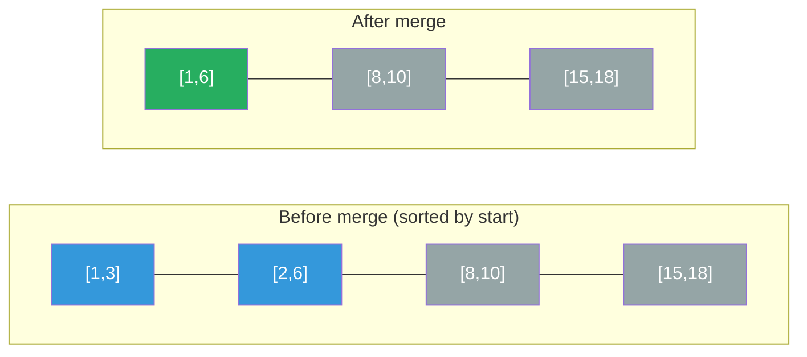

# Intervals Guide

> **Core idea:** interval problems are **[[Sorting|sorting]] + sweeping**. Once you sort by one endpoint, overlapping intervals become adjacent — and a single linear pass can merge, count, or select them. The only question is *which* endpoint to sort by and what to track as you scan.

## ⚡ Cheatsheet

| Pattern | Reach for it when… | Mechanism |
| --- | --- | --- |
| Greedy (sort by start) | merge, insert, or detect any overlap | sort by start; extend running group if `curr.start <= last.end` |
| Greedy (sort by end) | maximize non-overlapping count / minimize removals | sort by end; greedily pick earliest-finishing interval |
| [[Sweep Line\|Sweep line]] | count peak concurrency, allocate rooms | emit `(time, +1/-1)` events, sort, track running count |
| [[Heap]] (min-heap of ends) | allocate/free rooms, track which room frees next | sort by start; reuse earliest-ending room if it's free |

## How to think about it

Every interval is just a segment on a number line. The key insight: **in an unsorted list, checking whether any two intervals overlap takes O(n²) pairwise comparisons**. Sorting buys you adjacency — after sorting by start, if interval `B` doesn't overlap with interval `A` (which came just before it), it can't overlap with anything earlier either, because all earlier intervals end no later than `A`. You get a single O(n) sweep for free.

The tradeoff is that **sort order determines what you can do in the sweep**:

- Sort by **start** → merged groups form naturally left-to-right. Good for merging, inserting, and checking if any overlap exists.
- Sort by **end** → the [[0.GreedyGuide|greedy]] choice (earliest finish) leaves the most room for future intervals. Good for maximizing the number of compatible intervals.
- **Sweep line** → don't merge at all; instead convert each interval into two events and count the peak running total. Good when you need the exact number of simultaneous overlaps.

The overlap test itself is simple: after sorting by start so `a.start <= b.start`, intervals `a` and `b` overlap iff `b.start <= a.end`. A strict `<` vs `<=` matters — check whether touching at a single point counts as overlap for your problem.

## The core patterns

### Sort by start — merge and detect

Walk the sorted list and maintain the "current group" as a running `[start, end]`. For each next interval: if it starts within the current group (`curr_start <= group_end`), extend the group's end. Otherwise, close the group and start a new one.

Each interval either starts inside the current group, which extends the group's end, or starts after the group ends, which closes the group and begins a new one at that interval.

```python
intervals.sort(key=lambda x: x[0])
merged = []
for start, end in intervals:
    if merged and start <= merged[-1][1]:
        merged[-1][1] = max(merged[-1][1], end)
    else:
        merged.append([start, end])
```

**Merge trace** on `[[1,3],[2,6],[8,10],[15,18]]` — sorted by start, each step extends or closes the current group:

| Interval | start ≤ last end? | Action | Running result |
|---|---|---|---|
| [1, 3] | — (first) | open group | `[1, 3]` |
| [2, 6] | 2 ≤ 3 · overlaps | extend end → 6 | `[1, 6]` |
| [8, 10] | 8 > 6 · gap | close, open new | `[8, 10]` |
| [15, 18] | 15 > 10 · gap | close, open new | `[15, 18]` |

Result: `[[1,6],[8,10],[15,18]]`.

**Number line before/after merge** — `[1,3]` and `[2,6]` overlap and combine; the rest pass through unchanged:



The `max` on `merged[-1][1]` matters: a shorter interval nested inside a longer one (`[1,10]` then `[2,4]`) shouldn't shrink the group.

See [[02.MergeInterval|MergeInterval]] for the full problem. The same scan works for [[04.MeetingRooms|MeetingRooms]] (just return `False` the moment two consecutive intervals overlap, instead of merging).

### Sort by end — greedy scheduling

This is the classic [[Interval Scheduling|activity-selection]] pattern. You want the maximum number of non-overlapping intervals; equivalently, the minimum number to remove.

Sort by end time and greedily pick each interval that doesn't conflict with the last one selected. The exchange argument: if an optimal solution chose interval X instead of greedy choice G at some step, and `G.end <= X.end`, then swapping X for G can't create new conflicts and can't reduce the count. So greedy is at least as good as optimal.

```python
intervals.sort(key=lambda x: x[1])
count, prev_end = 0, float("-inf")
for start, end in intervals:
    if start >= prev_end:
        count += 1
        prev_end = end
# minimum removals = len(intervals) - count
```

The critical failure mode: sorting by **start** for this problem picks `[1,10]` first and then can't fit any of `[2,3]`, `[4,5]`, `[6,7]` — it returns 1 instead of 3. Sort by end. → [[03.Non-OverlappingIntervals|Non-OverlappingIntervals]]

### Sweep line — peak concurrency

Instead of merging, convert each interval into two timestamped events: `(start, +1)` and `(end, -1)`. Sort by time (break ties by putting `-1` before `+1` so an ending slot is freed before a starting one claims it). Sweep through, maintaining a running count; the peak is your answer.

```python
events = []
for start, end in intervals:
    events.append((start, 1))
    events.append((end, -1))
events.sort(key=lambda x: (x[0], x[1]))

peak = curr = 0
for _time, delta in events:
    curr += delta
    peak = max(peak, curr)
```

**Why the tie-break matters**: if one meeting ends at time 10 and another starts at 10, sorting `(10, -1)` before `(10, +1)` means the room is freed first — those two meetings don't overlap. Reverse the tie-break if your problem says touching intervals do overlap.

**Sweep-line events with running count** — for `[[0,30],[5,10],[15,20]]`, orange marks where `curr` hits its peak:

```text
time:     0    5    10   15   20   30
event:   +1   +1   -1   +1   -1   -1
active:   1    2    1    2    1    0
```

→ [[05.MeetingRoomsII|MeetingRoomsII]]

### Heap — room allocation

Same problem as sweep line, different mental model: think about physically assigning rooms. Sort meetings by start time. Maintain a min-heap of the end times of currently occupied rooms. For each new meeting, peek at the room that frees up earliest:

- If it frees before this meeting starts (`heap[0] <= start`), reuse it (pop, push new end).
- Otherwise, open a new room (just push).

The heap size at the end is the number of rooms needed.

```python
import heapq
intervals.sort(key=lambda x: x[0])
heap = []  # min-heap of end times
for start, end in intervals:
    if heap and heap[0] <= start:
        heapq.heapreplace(heap, end)
    else:
        heapq.heappush(heap, end)
return len(heap)
```

Use this approach over sweep line when you need to track **which** room (not just how many), or when the problem extends to tracking room identity.  → [[05.MeetingRoomsII|MeetingRoomsII]], [[Heap]]

### Three-phase insertion

When the input is already sorted and non-overlapping, you don't need to sort. Inserting a new interval partitions the existing list into three non-overlapping regions: everything before the new interval, everything overlapping it, and everything after. One pointer scan handles all three in O(n).

```python
result, i, n = [], 0, len(intervals)
while i < n and intervals[i][1] < new[0]:   # phase 1: before
    result.append(intervals[i]); i += 1
while i < n and intervals[i][0] <= new[1]:  # phase 2: overlap
    new = [min(new[0], intervals[i][0]), max(new[1], intervals[i][1])]
    i += 1
result.append(new)
while i < n:                                 # phase 3: after
    result.append(intervals[i]); i += 1
```

The phase boundaries are monotonic — you only move forward — so no interval falls into two phases. → [[01.InsertInterval|InsertInterval]]

## How to approach a new problem

1. **Draw the intervals on a number line.** Sketch 4–5 concrete intervals before writing anything. Mark where they overlap, where they gap, what the answer looks like visually.
2. **Identify what the problem is actually asking.** "Merge all" → sort-by-start merge. "Can everyone attend?" → sort-by-start, check adjacent pairs. "How many rooms?" → sweep line or heap. "Fewest removals?" → sort-by-end, greedy count. "Insert into sorted list?" → three-phase scan.
3. **Pin down the overlap definition.** Does `[1,2]` and `[2,3]` overlap? (Half-open intervals: no. Closed intervals: yes.) This determines whether you use `<` or `<=` in your boundary checks. Getting this wrong produces off-by-one errors that only surface on edge cases.
4. **Choose sort order before coding.** Write `intervals.sort(key=lambda x: x[?])` first, with the right endpoint. If you're unsure, ask: "am I merging/detecting overlaps (sort start) or selecting non-overlapping greedily (sort end)?"
5. **Name your running state.** For merge: `last_end`. For greedy: `prev_end`, `count`. For sweep: `curr`, `peak`. For heap: the heap itself. If you can't name the state, you haven't chosen a pattern yet.
6. **Trace n = 0, 1, 2.** Empty list, a single interval, and two intervals (overlapping and non-overlapping) catch most edge bugs. Also check: what if all intervals are the same? What if one contains another?

## Worked example: Meeting Rooms II with both approaches

**Input**: `[[0,30], [5,10], [15,20]]` — how many rooms?

**Sweep line trace**:

Events after sort: `(0,+1), (5,+1), (10,-1), (15,+1), (20,-1), (30,-1)`

| Event | curr | peak |
|-------|------|------|
| (0,+1) | 1 | 1 |
| (5,+1) | 2 | **2** |
| (10,-1) | 1 | 2 |
| (15,+1) | 2 | 2 |
| (20,-1) | 1 | 2 |
| (30,-1) | 0 | 2 |

Answer: 2 rooms.

**Heap trace** (sort by start: already sorted):

- `[0,30]`: heap empty → push 30. Heap: `[30]`
- `[5,10]`: `heap[0]=30 > 5` → new room, push 10. Heap: `[10, 30]`
- `[15,20]`: `heap[0]=10 <= 15` → reuse, replace 10 with 20. Heap: `[20, 30]`

Heap size = 2. Same answer.

The heap makes explicit *which* meeting is in which room; the sweep line is simpler when you only need the count.

## Problems Covered

| Problem | Primary pattern |
| --- | --- |
| [[01.InsertInterval\|Insert Interval]] | Three-phase interval scan |
| [[02.MergeInterval\|Merge Intervals]] | Sort by start and merge |
| [[03.Non-OverlappingIntervals\|Non-overlapping Intervals]] | Interval-scheduling greedy |
| [[04.MeetingRooms\|Meeting Rooms]] | Sort by start and detect overlap |
| [[05.MeetingRoomsII\|Meeting Rooms II]] | Sweep line / min-heap of end times |
| [[06.MinimumIntervalToIncludeEachQuery\|Minimum Interval to Include Each Query]] | Offline queries + min-heap |

## When it's the wrong tool

- **Point queries or range updates on an array**: if the question is "sum of array[i..j]" with updates, you need a segment tree or BIT — sorting intervals won't help.
- **2D intervals or rectangles**: 1D sort-then-scan doesn't generalize. You need a sweep line paired with a [[Binary Search Tree|balanced BST]], or a specialized data structure.
- **Dynamic online queries** (intervals inserted one by one, queried after each): a static sort requires re-sorting on each insert. Use an interval tree for O(log n) insert and query.
- **Subarrays of a single array**: "longest subarray with property X" is [[0.SlidingWindowGuide|Sliding Window]] or [[Dynamic Programming]], not intervals. The `[i, j]` indices are not the same as explicit `[start, end]` interval inputs.
- **Weighted interval scheduling** (maximize total value, not count): the greedy exchange argument breaks when intervals have different weights. Switch to Dynamic Programming (sort by end, then `dp[i] = max(dp[i-1], val[i] + dp[last non-overlapping])`).

## 🐍 Python Tricks

Idioms that keep interval code short and bug-free. General syntax: [[Python Cheatsheet]].

**Plain `.sort()` already sorts by start — lists compare lexicographically, so the lambda is optional.**
```python
intervals.sort()                     # by start, ties broken by end
intervals.sort(key=lambda x: x[1])   # spell out a key only for end-first order
```

**Unpack in the loop header — no index arithmetic to get wrong.**
```python
for start, end in intervals:
    if not merged or start > merged[-1][1]:
        merged.append([start, end])   # append lists, not tuples — the next trick mutates
```

**Extend the current group by mutating `merged[-1][1]` — no pop-and-reappend.** `merged[-1]` aliases the last inner list, so assignment updates it in place.
```python
if start <= merged[-1][1]:
    merged[-1][1] = max(merged[-1][1], end)   # max: nested [2,4] can't shrink [1,10]
```

**The overlap test is two comparisons — no sorting, no six-case analysis.**
```python
def overlaps(a, b):                        # closed intervals, either order
    return a[0] <= b[1] and b[0] <= a[1]   # half-open: make both strict <
```

**Sort event tuples with no key — `-1 < +1` gives the end-before-start tie-break for free.**
```python
events = [(s, 1) for s, e in intervals] + [(e, -1) for s, e in intervals]
events.sort()   # (10, -1) lands before (10, +1): a room frees before the next start claims it
```

**Two sorted lists + [[0.TwoPointerGuide|two pointers]] — room counting without event tuples.**
```python
starts = sorted(i[0] for i in intervals)
ends = sorted(i[1] for i in intervals)
rooms = e = 0
for s in starts:
    if s < ends[e]: rooms += 1       # earliest meeting still running — new room
    else: e += 1                     # it ended — reuse its room
```

**`max(..., default=0)` — aggregate over possibly-empty intervals without a crash.**
```python
gaps = [b[0] - a[1] for a, b in zip(merged, merged[1:])]
biggest_gap = max(gaps, default=0)   # merged may have fewer than 2 intervals
```
