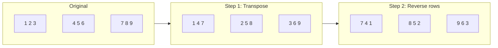
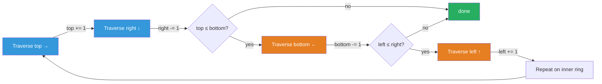

# Math & Geometry Guide

> **Core idea:** this topic is a **collection of tricks**, not one algorithm. Each problem hides a structural shortcut — rotation decomposes into transpose + reverse, a bounded numeric sequence must cycle, a matrix can mark itself using its own first row/col. Recognize the trick, and the brute force collapses to in-place O(1) extra space or to O(log n) arithmetic.

## ⚡ Cheatsheet

| Pattern | Reach for it when… | Mechanism |
| --- | --- | --- |
| Transpose + reverse rows | rotate a matrix 90° clockwise in-place | swap across diagonal, then mirror each row |
| [[Matrix Traversal\|Four-boundary shrink]] | spiral or layer-by-layer traversal | `top/bottom/left/right` contract inward each pass |
| First-row/col as markers | zero rows/cols with O(1) extra space | borrow the matrix's own edge as a flag array |
| Digit math (carry / sum) | arithmetic on numbers stored as digits | loop from LSB; handle overflow by prepending |
| [[Fast & Slow Pointers]] | detect a cycle in a numeric sequence | digit-sum maps to a bounded state space → must cycle |
| [[Hash Map]] | count or look up geometric corners | store point frequencies; O(1) corner checks per candidate |

## How to think about it

Math & Geometry problems look like they need simulation but almost always have a **structural shortcut**. There are three recurring flavors:

**Matrix manipulation** — a coordinate transformation can often be decomposed into two self-inverse operations you can do in-place. Rotation is the archetype: `(r, c) → (c, n-1-r)` factors into transpose then row-reverse. [[Matrix Traversal|Spiral traversal]] peels the matrix one edge at a time using four boundary pointers. Set Matrix Zeroes co-opts the matrix's own border as scratch storage. None of these allocate a second matrix.

**Digit / number tricks** — when the problem works with individual digits (carry propagation, digit-square sums, string multiplication), you're doing elementary school arithmetic but carefully. The key is working from the **least significant digit** and tracking carry. For cycle detection (Happy Number), recognize that any digit-sum function maps large numbers to small ones, so the state space is finite and a cycle is guaranteed.

**Geometric enumeration with a hash map** — Detect Squares is the model: fix one side of the square, compute the required side length, and look up the other two corners in O(1) via a [[Frequency Counting|frequency map]]. The hash map turns what looks like an O(n³) search into O(n) per query.

## The recurring tricks

### Trick 1 — In-place matrix rotation (transpose + reverse)

The 90° clockwise map `(r, c) → (c, n-1-r)` factors cleanly:
1. **Transpose:** swap `matrix[i][j]` with `matrix[j][i]` for `j > i` — this moves `(r,c)` to `(c,r)`.
2. **Reverse each row:** turns `(c, r)` into `(c, n-1-r)`. Done.

Both steps touch each element once, so it's O(n²) time and O(1) extra space. Transpose reflects the matrix across its main diagonal; reversing each row then produces the 90-degree clockwise rotation.

```python
# Rotate Image (RotateImage)
def rotate(matrix: list[list[int]]) -> None:
    n = len(matrix)
    for i in range(n):                      # transpose
        for j in range(i + 1, n):
            matrix[i][j], matrix[j][i] = matrix[j][i], matrix[i][j]
    for row in matrix:                      # reverse each row
        row.reverse()
```

**Rotation decomposition** — two O(n²) in-place steps give a 90° CW rotation with no extra matrix:



Counter-clockwise variant: reverse each **column** (or transpose then reverse each column).

### Trick 2 — Four-boundary spiral

Maintain `top`, `bottom`, `left`, `right`. Each iteration peels one full ring: go right across `top`, down `right`, left across `bottom` (guard: `top <= bottom`), up `left` (guard: `left <= right`), then shrink all four bounds inward. The guards prevent double-counting when the remaining region is a single row or column.

```python
# SpiralMatrix — key structure only
top, bottom, left, right = 0, len(matrix)-1, 0, len(matrix[0])-1
while top <= bottom and left <= right:
    for col in range(left, right + 1):   result.append(matrix[top][col])
    top += 1
    for row in range(top, bottom + 1):   result.append(matrix[row][right])
    right -= 1
    if top <= bottom:
        for col in range(right, left-1, -1): result.append(matrix[bottom][col])
        bottom -= 1
    if left <= right:
        for row in range(bottom, top-1, -1): result.append(matrix[row][left])
        left += 1
```

**Spiral boundary contraction** — traverse one edge, move its boundary inward, and guard the last two edges so a single remaining row or column is not visited twice:



### Trick 3 — First row/col as O(1) marker storage

The trick in [[03.SetMatrixZeroes|SetMatrixZeroes]]: instead of a separate `O(m+n)` marker array, use `matrix[0][j]` to record "column j should be zeroed" and `matrix[i][0]` for rows. **Process the first row and column last** (after you've applied all other markers), or you'll corrupt the markers mid-pass.

```python
# SetMatrixZeroes — the ordering constraint
first_row_zero = any(matrix[0][j] == 0 for j in range(n))
first_col_zero = any(matrix[i][0] == 0 for i in range(m))
# ... mark and apply inner cells ...
if first_row_zero: ...  # zero first row last
if first_col_zero: ...  # zero first col last
```

### Trick 4 — Digit math (carry propagation)

For [[05.PlusOne|Plus One]] and [[07.MultiplyStrings|Multiply Strings]], work from the **rightmost digit**. A carry out of position `i` propagates left to `i-1`. The only surprising edge case is all-9s (e.g. `999 → 1000`): all digits become 0 and you prepend `1`.

```python
# PlusOne — the carry loop
for i in range(len(digits) - 1, -1, -1):
    if digits[i] < 9:
        digits[i] += 1
        return digits
    digits[i] = 0          # absorb carry, keep going
return [1] + digits        # 999...9 case
```

### Trick 5 — Numeric cycle detection with Fast & Slow Pointers

Happy Number: applying the digit-square-sum function repeatedly either reaches 1 or loops. It **must** loop because for any large number the sum of squared digits is far smaller, so the sequence is eventually bounded — the state space is finite. Two ways to detect the cycle:

- **[[Set]]:** add each value to a `seen` set; stop when you hit a repeat or reach 1. O(log n) space.
- **Floyd's two-pointer:** treat the sequence as a [[Linked List|linked list]]. `slow` advances one step, `fast` two. If `fast` reaches 1, it's happy; if `slow == fast`, there's a cycle and it's not.

```python
# HappyNumber — Floyd's variant (O(1) space)
def digit_sq(n):
    total = 0
    while n:
        total += (n % 10) ** 2
        n //= 10
    return total

slow, fast = n, digit_sq(n)
while fast != 1 and slow != fast:
    slow = digit_sq(slow)
    fast = digit_sq(digit_sq(fast))
return fast == 1
```

→ Full proof that the cycle is entered is in [[Fast & Slow Pointers]].

### Trick 6 — Hash map for geometric corner counting

Detect Squares: given a query point `(qx, qy)`, enumerate all stored points `(qx, y2)` on the same vertical — this fixes one side of the square. Side length is `|qy - y2|`. The other two corners must be at `(qx ± side, qy)` and `(qx ± side, y2)`. A frequency map lets you count how many valid corner pairs exist in O(1).

```python
# DetectSquares — core query logic
for y2 in self.x_points[qx]:
    side = abs(qy - y2)
    if side == 0: continue
    for dx in [side, -side]:
        total += self.count[(qx+dx, qy)] * self.count[(qx+dx, y2)]
```

→ Full data structure in [[Hash Map]].

## How to approach a new problem

1. **Classify the input type.** Matrix of integers → likely rotation, spiral, or in-place marking. A single number or digit array → likely carry math or cycle detection. A set of 2D points → likely geometric enumeration with a hash map.
2. **Ask: is there an in-place trick?** Matrix problems almost always want O(1) space. Ask "can the matrix store its own markers?" (Set Matrix Zeroes) or "does the transform decompose?" (rotation).
3. **Ask: is there a cycle?** Any numeric process on bounded integers eventually repeats. If the problem involves iterating a function on a number (Happy Number, Find Duplicate via Floyd's on indices), reach for Fast & Slow Pointers.
4. **Ask: what do I need to look up?** If you're enumerating candidates and need to check or count complements (Detect Squares), reach for a hash map.
5. **Sketch the edge cases before coding.** For matrices: 1×1, single row, single column. For digit math: all 9s, `n = 0`, negative exponent. For cycles: the number 1 itself (already happy).
6. **Write the loop, then handle the seams.** Spiral: the two `if` guards that prevent double-counting the last row/col. Set Matrix Zeroes: process the marker row/col last. Rotation: transpose only `j > i` (not `j >= i`, or you'd undo yourself).

## Worked example — Rotate Image

Input:
```
1  2  3
4  5  6
7  8  9
```

After transpose (swap `(i,j)` with `(j,i)` for `j > i`):
```
1  4  7
2  5  8
3  6  9
```

After reversing each row:
```
7  4  1
8  5  2
9  6  3
```

Verify: `1` was at `(0,0)`, should land at `(0, n-1-0) = (0,2)`. Result `[0][2] = 1` ✓. `7` at `(2,0)` should land at `(0, n-1-2) = (0,0)`. Result `[0][0] = 7` ✓.

## Worked example — Detect Squares

Query `(0, 0)`. Stored points include `(0, 2)` (same x). Side = 2. We need corners at `(2, 0)` and `(2, 2)` (dx = +2) or `(-2, 0)` and `(-2, 2)` (dx = -2). If `count[(2,0)] = 1` and `count[(2,2)] = 1`, that's `1 × 1 = 1` valid square in the `dx=+2` direction. The multiplication counts duplicate points correctly: if there are two copies of `(2,2)`, that's 2 squares.

The non-obvious part: iterating over `x_points[qx]` gives every point on the same vertical as the query — not every point in the structure. This keeps the per-query work proportional to how many points share that x-coordinate, not the total point count.

## Problems Covered

| Problem | Primary pattern |
| --- | --- |
| [[01.RotateImage\|Rotate Image]] | Transpose + reverse rows |
| [[02.SpiralMatrix\|Spiral Matrix]] | Four-boundary traversal |
| [[03.SetMatrixZeroes\|Set Matrix Zeroes]] | First-row/column marker storage |
| [[04.HappyNumber\|Happy Number]] | Floyd cycle detection |
| [[05.PlusOne\|Plus One]] | Carry propagation |
| [[06.Pow(x,n)\|Pow(x, n)]] | Fast exponentiation |
| [[07.MultiplyStrings\|Multiply Strings]] | Grade-school multiplication |
| [[08.DetectSquares\|Detect Squares]] | Geometric counting with a frequency map |

## When it's the wrong tool

- **The problem requires exploring all subsets or permutations.** No math shortcut exists; use [[0.BacktrackingGuide|Backtracking]].
- **Optimal value over a sequence of choices.** Math gives closed-form answers, not recurrence relations — use [[Dynamic Programming]].
- **The "math" is inside a graph traversal.** If the hard part is reaching connected components or shortest paths, the arithmetic is incidental — use [[BFS]] or [[DFS]].
- **The grid requires simulating local neighborhood interactions** (Game of Life). No global formula applies; you must simulate step by step.
- **Floating-point geometry** (intersections, areas, angles). Integer math tricks break down; you'll need epsilon comparisons or a proper geometry library.

## 🐍 Python Tricks

Language-level shortcuts for matrix and digit code — the algorithmic tricks above are unchanged. General syntax: [[Python Cheatsheet]].

**`zip(*matrix[::-1])` is the one-line form of Trick 1's transpose + reverse.** It builds a *new* rotated matrix — say out loud that in-place needs the two-step version.
```python
rotated = [list(r) for r in zip(*matrix[::-1])]   # 90° CW; zip yields tuples, so re-wrap
```

**`in` and `zip(*matrix)` turn row/column scans into one-liners.**
```python
first_row_zero = 0 in matrix[0]                   # Trick 3's flags, no index loop
first_col_zero = any(row[0] == 0 for row in matrix)
for col in zip(*matrix): ...                      # iterate columns without index math
```

**`divmod` does the digit peel and the carry split in one step.**
```python
n, d = divmod(n, 10)           # HappyNumber's loop: strip the low digit
carry, d = divmod(total, 10)   # MultiplyStrings: carry and digit together
```

**Take `abs()` before digit loops — Python floors negatives, so `while n:` never exits.** `-7 % 10 == 3` and `-1 // 10 == -1` (C/Java truncate toward zero instead); a negative `n //= 10` loop sticks at `-1` forever.
```python
sign = -1 if n < 0 else 1
n = abs(n)                     # peel digits, reapply sign at the end
```

**Ints never overflow — digit problems have one-line "cheats"; know them and expect the ban.**
```python
str(int(num1) * int(num2))                 # MultiplyStrings, if int() weren't banned
int("".join(map(str, digits))) + 1         # PlusOne as plain arithmetic
```

**`complex` is a built-in 2-D point — hashable as a dict/set key, and multiplying by `1j` rotates 90°.**
```python
p = complex(x, y)              # point arithmetic without writing a class
p * 1j                         # (x, y) → (-y, x): 90° CCW about the origin
```
