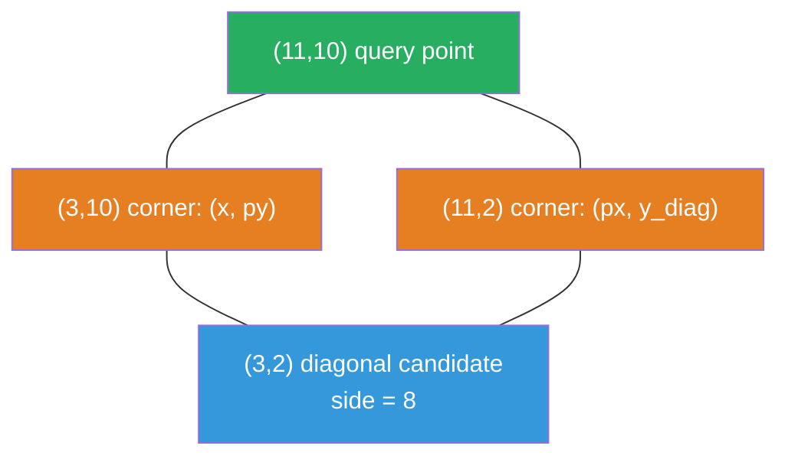

# 2013. Detect Squares

You are given a stream of points on the X-Y plane. Design an algorithm to add points and, given a query point, count the number of ways to choose 3 points from the data structure such that the 4 points form an axis-aligned square with positive area.

Implement DetectSquares:
- DetectSquares() - initializes the object
- void add(int[] point) - adds a point (duplicates allowed)
- int count(int[] point) - counts valid squares using the query point as one corner
**Example 1:**

![[detect-squares-example.svg]]

```
Input:
["DetectSquares","add","add","add","count","count","add","count"]
[[],[[3,10]],[[11,2]],[[3,2]],[[11,10]],[[14,8]],[[11,2]],[[11,10]]]
Output: [null,null,null,null,1,0,null,2]
```

Constraints:
- point.length == 2
- 0 <= x, y <= 1000
- At most 3000 calls total to add and count

---

## Solution

### Intuition
[[Hash Map]] point counting: to count axis-aligned squares with query point `(px, py)` as one corner, iterate over all distinct x-coordinates that have appeared. For each candidate `x != px`, the side length is `|px - x|`. The two opposite corners on the same column as `px` are `(px, py + side)` and `(px, py - side)`. Count valid squares by multiplying the counts of all three required points.

### Approach: Point count map + x-column enumeration
Store a nested count map `pt_count[(x, y)]` and a set of all seen x-coordinates. For each `count` query, iterate over distinct x-values. For each `x`, compute the side and check both square orientations (above and below the query row).

```python
from collections import defaultdict

class DetectSquares:
    def __init__(self) -> None:
        self.pt_count: dict[tuple[int, int], int] = defaultdict(int)
        self.x_coords: set[int] = set()  # WHY: distinct x-columns seen so far

    def add(self, point: list[int]) -> None:
        x, y = point
        self.pt_count[(x, y)] += 1
        self.x_coords.add(x)          # WHY: a set keeps columns distinct, no double-counting

    def count(self, point: list[int]) -> int:
        px, py = point
        total = 0

        for x in self.x_coords:
            if x == px:
                continue           # WHY: need a different x to form a square with positive area
            side = abs(px - x)

            # WHY: two possible squares - same row as query or reflected across it
            for dy in [side, -side]:
                y_diag = py + dy   # WHY: diagonal corner shares column x
                # WHY: multiply counts of the three required points
                total += (self.pt_count[(x, py)] *
                          self.pt_count[(px, y_diag)] *
                          self.pt_count[(x, y_diag)])

        return total
```

> `x_coords` is a **set**, so each x-column is visited exactly once per query. A plain list would be a bug: two points sharing an x-column would record it twice, and the `count` loop would tally every square through that column twice. Point *multiplicity* is still honored because it lives in `pt_count`, which the multiplication reads.

### Walkthrough
After adding `(3,10)`, `(11,2)`, `(3,2)`: query `(11,10)`

px=11, py=10. Iterate distinct x in {3, 11}:
- x=3: side=8. dy=+8: y_diag=18 -> pt_count[(3,10)]*pt_count[(11,18)]*pt_count[(3,18)] = 1*0*0 = 0. dy=-8: y_diag=2 -> pt_count[(3,10)]*pt_count[(11,2)]*pt_count[(3,2)] = 1*1*1 = 1.
- x=11: skip (x==px).

Output: `1`

**Query point (green) plus a diagonal candidate (blue) at distance `side` determine the two derived corners (orange) needed to complete the square:**



### Complexity
- **Time (add):** O(1) amortized.
- **Time (count):** O(n) where n is the number of add calls, since we iterate over all recorded x-coordinates.
- **Space:** O(n). The count map and the `x_coords` set each hold at most n entries.

### Key concepts to review
- [[Hash Map]] - enables O(1) point-count lookups during the square enumeration
- [[Frequency Counting]] - each point's count multiplies into the final answer to handle duplicates
- [[04.HappyNumber]] - another problem where the key insight is recognizing a structural pattern (cycle vs. square geometry)

### Common pitfalls
- Not handling duplicate points: duplicates must increase the count, not be ignored.
- Checking only one square orientation (above or below) and missing the other.
- Storing every point's x in a plain list instead of a set. A repeated x-column then gets iterated multiple times, over-counting every square that passes through it.
- Forgetting to skip `x == px`, which would try to form a degenerate (zero-area) square.
