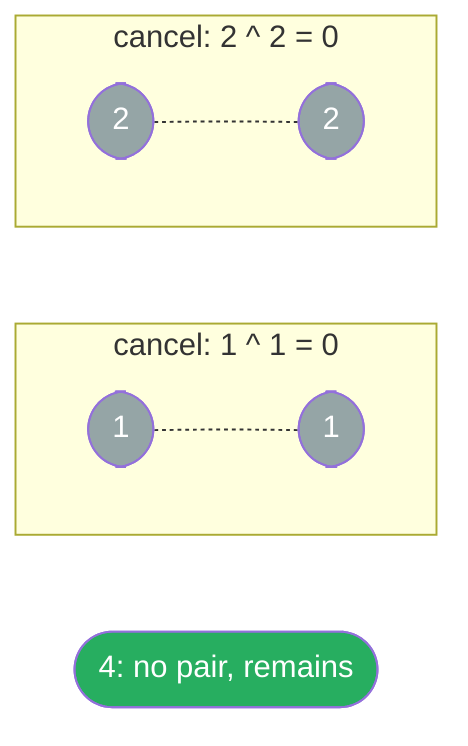
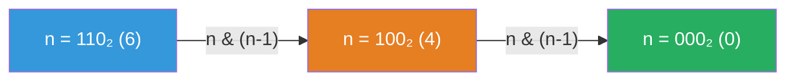

# Bit Manipulation Algorithm Guide

> **Core idea:** every integer is a sequence of **independent** bits. That independence means you can query, flip, or zero any bit in O(1) without touching any other. XOR also lets paired elements cancel to zero, leaving the unique or missing value.

## ⚡ Cheatsheet

| Pattern | Reach for it when… | Mechanism |
| --- | --- | --- |
| XOR cancellation | duplicates or a missing element where pairs cancel | `a ^ a = 0`, `a ^ 0 = a`. XOR everything so pairs cancel |
| Bit-by-bit construction | output at each bit position depends only on input at that position | loop over 32 positions, read a bit, place it in the result |
| Brian Kernighan | count set bits efficiently | `n &= (n - 1)` strips the lowest set bit each iteration |
| Bitwise arithmetic | arithmetic operators are forbidden | XOR gives the sum without carry. AND + left-shift gives the carry |
| Bitmask set | the set is small and each item can map to one bit | set, clear, test, or enumerate membership with one integer |
| [[Dynamic Programming]] on bit structure | count set bits for all `[0..n]` at once | `dp[i] = dp[i >> 1] + (i & 1)` |

## How to think about it

A 32-bit integer has 32 bit positions. Bitwise operators act on those positions directly. Two properties explain most bit operations:

**Independence.** Bit position `i` never interacts with bit position `j`. That makes it legal to build an answer one bit at a time, or to extract any single bit in O(1) with a mask.

**XOR self-inverse.** `a ^ a = 0` and `a ^ 0 = a`. XOR is also commutative and associative, so order does not matter. Paired elements cancel regardless of where they appear in the sequence. This turns "find the one element that does not repeat" into a one-liner.

**Signed integers.** Most languages store signed integers with two's complement. To form `-x` at a fixed width, flip every bit and add 1. This explains why `~x == -(x + 1)` and why `x & -x` keeps only the lowest set bit.

> **The discipline that prevents Python-specific bugs:** Python integers are *arbitrary precision*, so they have no natural 32-bit ceiling. Whenever the problem specifies a 32-bit result (ReverseBits, SumOfTwoIntegers), apply `& 0xFFFFFFFF` to keep the value in range, and interpret a result greater than or equal to `0x80000000` as negative using `result - 0x100000000`.

| Expression | Meaning |
| --- | --- |
| `x & y` | Keep bit positions that are 1 in both values |
| `x \| y` | Set bit positions that are 1 in either value |
| `x ^ y` | Set bit positions where the values differ |
| `~x` | Flip every stored bit, subject to the language's integer width |
| `x << k` | Shift left by `k`, which multiplies a non-overflowing value by `2^k` |
| `x >> k` | Shift right by `k`, which divides a nonnegative value by `2^k` and rounds down |

For fixed-width integers, one bitwise operation takes O(1) time and O(1) extra space. Python integers can grow past 32 or 64 bits, so the operation cost grows as the value needs more machine words.

## Five common patterns

### XOR cancellation: pairs cancel, one value remains

XOR accumulates all elements. Anything that appears an even number of times cancels to 0. The element appearing an odd number of times remains.

```python
result = 0
for val in nums:
    result ^= val
# result = the element with no pair
```

**XOR cancellation** on `[4, 1, 2, 1, 2]`: each pair reduces to 0, so only the single `4` remains.

| Step | Value | acc (XOR result) |
|---|---|---|
| start | N/A | `0` |
| XOR 4 | 4 | `4` |
| XOR 1 | 1 | `5` |
| XOR 2 | 2 | `7` |
| XOR 1 | 1 ↩ pair | `6` |
| XOR 2 | 2 ↩ pair | **`4` ✓** |

**XOR cancellation pairing:** matched values cancel to 0, while the unpaired value remains.



The missing-number variant ([[05.MissingNumber|MissingNumber]]) pairs each array value with its *index*: XOR all indices `0..n` together with all array values. Every present number cancels its index. Only the missing index remains. See [[Bit Manipulation Tricks]] for the derivation.

**Caution:** this only works when elements cancel in *pairs*. If elements repeat three times, XOR leaves one copy behind and gives the wrong result. For triples, count each bit position modulo 3, as required by LC 137.

### Bit-by-bit construction: read one side, write the other

When the output at each bit position is a function of exactly one input bit (no carry, no interaction), loop over all 32 positions and place each bit independently.

```python
result = 0
for i in range(32):
    bit = (n >> i) & 1        # extract bit i
    result |= bit << (31 - i) # place it at the mirror position
return result & 0xFFFFFFFF    # clamp to 32 bits (Python safety)
```

This is the main pattern in [[04.ReverseBits|ReverseBits]]. The mask at the end is mandatory in Python. Without it, large `n` values produce results outside the 32-bit range.

### Brian Kernighan: skip zero bits entirely

`n & (n - 1)` strips exactly the lowest set bit from `n`. Each iteration removes one set bit, so the loop runs `k` times where `k` is the popcount. This is faster than scanning all 32 positions when the number has few set bits.

```python
count = 0
while n:
    n &= (n - 1)   # clear lowest set bit
    count += 1
```

**Brian Kernighan trace** on `n=6` (`110₂`, 2 set bits): `n & (n-1)` clears the rightmost `1` each step.

| n | binary | n & (n−1) | count |
|---|---|---|---|
| 6 | `110₂` | `110 & 101 = 100` | 1 |
| 4 | `100₂` | `100 & 011 = 000` | **2 ✓** |
| 0 | `000₂` | loop exits | N/A |

Subtracting 1 flips the lowest set bit to 0 and all trailing zeros to 1. AND with the original zeroes every changed bit.

**Brian Kernighan bit-clearing steps:** each `n & (n-1)` strips exactly the lowest set bit.



Why does it work? Subtracting 1 flips the lowest set bit to 0 and all lower bits to 1. ANDing with the original zeroes all of those flipped bits and nothing else. See [[02.NumberOf1Bits|NumberOf1Bits]].

### Bitwise arithmetic: simulate `+` with logic gates

Binary addition at each position uses `sum_bit = a XOR b` and `carry_bit = (a AND b) << 1`. Iterate until no carry remains. In Python, apply `& mask` to every intermediate value so the result stays within 32 bits.

```python
mask = 0xFFFFFFFF
while b & mask:
    carry = (a & b) << 1
    a = a ^ b
    b = carry
return (a & mask) if b > 0 else a
```

See [[06.SumOfTwoIntegers|SumOfTwoIntegers]] and [[Bit Manipulation Tricks]] for the full explanation with negative-number handling.

### Bitmask set: store membership in one integer

A bitmask can represent a small set whose items are numbered from `0` to `n - 1`. Bit `i` is 1 when item `i` belongs to the set and 0 when it does not.

```python
mask |= 1 << i          # add i
mask &= ~(1 << i)       # remove i
contains_i = (mask & (1 << i)) != 0
```

Every number from `0` through `(1 << n) - 1` represents one subset, so this loop visits every possible subset:

```python
for mask in range(1 << n):
    subset = [i for i in range(n) if mask & (1 << i)]
```

There are `2^n` masks. Visiting each mask takes O(2^n), while building every list shown above takes O(n * 2^n). For scale, `n = 20` produces 1,048,576 masks before any work inside the loop.

## How to approach a new problem

1. **Ask: is there a pairing structure?** Does every element appear an even number of times except one? Or can you pair values with indices? If yes, XOR cancellation ([[01.SingleNumber|SingleNumber]], [[05.MissingNumber|MissingNumber]]).
2. **Ask: is the answer built bit-by-bit?** Does each output bit depend on exactly one input bit (no cross-bit interaction, no carry)? If yes, bit-by-bit construction ([[04.ReverseBits|ReverseBits]]).
3. **Ask: does a small set need membership tracking?** Map each item to one bit. Enumerate all masks only when `2^n` states fit the input limit.
4. **Ask: do you need a popcount?** If you are counting set bits once, use Brian Kernighan. If you need popcount for *all* numbers in `[0..n]`, a Dynamic Programming recurrence on bit structure is O(n) total. See [[03.CountingBits|CountingBits]].
5. **Ask: are arithmetic operators banned?** Simulate with XOR + AND-shift ([[06.SumOfTwoIntegers|SumOfTwoIntegers]]).
6. **Apply `& 0xFFFFFFFF` whenever the problem is 32-bit.** Python will not warn you when a result exceeds that range.
7. **Trace with a 4-bit example.** Write the binary representations explicitly. Most bit bugs are invisible at the decimal level.
8. **Edge cases:** `n = 0` (all bits zero), `n = 1`, the single-node/single-element input, and for signed problems `n = -1` (all bits set).

## Worked example: Counting Bits with DP on bit structure

[[03.CountingBits|CountingBits]] asks for `ans[i]` = popcount of `i`, for every `i` in `[0..n]`. Brian Kernighan runs in O(k) per number, which is O(n log n) total. There is a faster way.

**Observation:** `i >> 1` is `i` with its last bit removed. So `popcount(i) = popcount(i >> 1) + (i & 1)`. Since we fill the `dp` array left to right, `dp[i >> 1]` is always already known.

```python
def countBits(n: int) -> list[int]:
    dp = [0] * (n + 1)
    for i in range(1, n + 1):
        dp[i] = dp[i >> 1] + (i & 1)
    return dp
```

Trace for `n = 5`:

| i | binary | i >> 1 | i & 1 | dp[i] |
|---|--------|--------|-------|-------|
| 0 | 000 | N/A | N/A | 0 |
| 1 | 001 | 0 | 1 | 0 + 1 = 1 |
| 2 | 010 | 1 | 0 | 1 + 0 = 1 |
| 3 | 011 | 1 | 1 | 1 + 1 = 2 |
| 4 | 100 | 2 | 0 | 1 + 0 = 1 |
| 5 | 101 | 2 | 1 | 1 + 1 = 2 |

Result: `[0, 1, 1, 2, 1, 2]`. Each answer takes O(1) to compute, so the whole table takes O(n) time and O(n) space. This is Dynamic Programming on the smaller binary prefix `i >> 1`.

## Problems Covered

| Problem | Primary pattern |
| --- | --- |
| [[01.SingleNumber\|Single Number]] | XOR cancellation |
| [[02.NumberOf1Bits\|Number of 1 Bits]] | Brian Kernighan bit clearing |
| [[03.CountingBits\|Counting Bits]] | DP on bit prefixes |
| [[04.ReverseBits\|Reverse Bits]] | Bit-by-bit construction |
| [[05.MissingNumber\|Missing Number]] | Index/value XOR cancellation |
| [[06.SumOfTwoIntegers\|Sum of Two Integers]] | XOR sum + AND-shift carry |
| [[07.ReverseInteger\|Reverse Integer]] | Digit extraction with overflow guards |

## When not to use bit manipulation

- **Elements repeat more than twice.** XOR leaves residuals. For triples, use modular bit counting. For arbitrary counts, use a [[Hash Map]].
- **Order or position matters.** XOR is commutative, so it discards where elements appear. If the answer depends on index or sequence, XOR alone is not enough.
- **No binary decomposition exists.** Pair-sum, k-sum, and ordering problems have no independent bit structure to use. Use [[0.TwoPointerGuide|Two Pointers]] or a hash map instead.
- **The subset state count is too large.** Bitmask DP is O(2ⁿ). At `n = 25`, it has 33,554,432 states. At `n = 30`, it has 1,073,741,824 states. Use another Dynamic Programming formulation or [[0.GreedyGuide|Greedy]] approach.
- **Floating-point or string data.** Bitwise operators only apply to integers. Exception: a 26-bit mask over lowercase letters is fine and common in [[0.SlidingWindowGuide|sliding-window]] problems.

## 🐍 Python Tricks

This section covers how Python's unbounded integers affect bit problems. The bit identities are in [[Bit Manipulation Tricks]]. For general syntax, see [[Python Cheatsheet]].

**Emulate 32 bits with a clamp and a sign restore.** Mask every intermediate value. At the end, reinterpret values greater than or equal to `0x80000000` as negative.
```python
a &= 0xFFFFFFFF
if a >= 0x80000000:
    a = ~(a ^ 0xFFFFFFFF)     # same as a - 0x100000000
```

**Mask negatives before any bit loop.** Python right-shifts negative values by filling with 1 bits, so `-1 >> 1` stays `-1`. The expression `n &= n - 1` on a negative value also never reaches 0, so `while n:` does not stop.
```python
n &= 0xFFFFFFFF    # now NumberOf1Bits terminates on "negative" input
while n:
    n &= n - 1
```

**Mask bitwise NOT when the problem uses 32-bit values.** In Python, `~x` equals `-(x + 1)` instead of flipping only 32 bits.
```python
flipped = (~x) & 0xFFFFFFFF
# Equivalent when x is already within 32 bits:
flipped = x ^ 0xFFFFFFFF
```

**`bit_length()` finds the highest set bit without a loop.** The `n.bit_count()` method is the modern popcount in Python 3.10 and later. Use `bin(n).count('1')` on older versions.
```python
n.bit_length()                # 6 → 3  (110₂ needs 3 bits)
1 << (n.bit_length() - 1)     # highest set bit (n > 0)
(1 << n.bit_length()) - 1     # all-ones mask covering n
```

**`f"{x:032b}"` prints the padded binary that step 6's tracing needs.** `bin()` strips leading zeros. Format specifications keep them.
```python
f"{x & 0xFFFFFFFF:032b}"   # mask first so negatives render as 32 ones, not '-…'
f"{x:#010x}"               # 0x-prefixed hex for mask literals
```

**Shifts never overflow, so a single integer can act as a bitset of any size.** A 26-bit letter mask or a much larger visited set needs no array.
```python
seen |= 1 << i           # add i
hit = seen >> i & 1      # test i
seen &= ~(1 << i)        # remove i
```

**Parenthesize shift arithmetic because `-` binds tighter than `<<`.** `1 << n - 1` means `1 << (n-1)`. Comparisons bind *looser* than `&`/`^`/`|` in Python, unlike C, so `x & 1 == 0` safely parses as `(x & 1) == 0`.
```python
(1 << n) - 1    # n low bits set, and the parentheses are required
```
