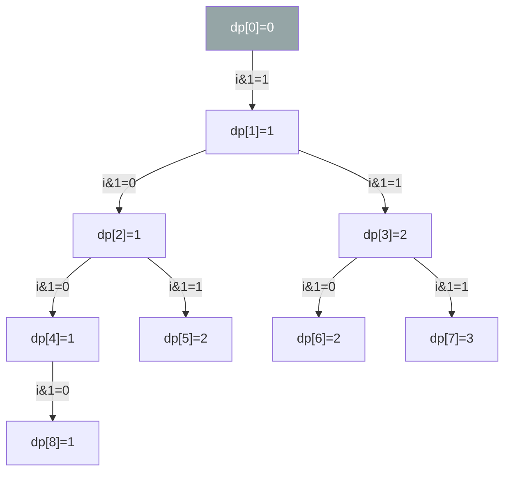

# 338. Counting Bits

Given an integer n, return an array ans of length n + 1 such that for each i (0 <= i <= n), ans[i] is the number of 1's in the binary representation of i.
**Example 1:**

```
Input: n = 2
Output: [0,1,1]
Explanation:
0 --> 0
1 --> 1
2 --> 10
```
**Example 2:**

```
Input: n = 5
Output: [0,1,1,2,1,2]
Explanation:
0 --> 0
1 --> 1
2 --> 10
3 --> 11
4 --> 100
5 --> 101
```

Constraints:

- 0 <= n <= 105
 

### Follow up:
- It is very easy to come up with a solution with a runtime of O(n log n). Can you do it in linear time O(n) and possibly in a single pass?
- Can you do it without using any built-in function (i.e., like __builtin_popcount in C++)?

---

## Solution

### Intuition
Every integer `i` is its parent `i >> 1` (right-shifted by 1, i.e. dropping the last bit) plus the value of that dropped bit (`i & 1`). This recurrence lets us compute the 1-bit count for every number in O(1) using a previously computed result, making the whole array solvable in a single O(n) pass with [[Dynamic Programming]].

### Approach 1: O(n log n) naive
For each number, count its 1-bits independently in O(log n) time using the `n & (n-1)` trick or `bin(i).count('1')`. Total: O(n log n).

### Approach 2: DP with right-shift recurrence (optimal)
`dp[i] = dp[i >> 1] + (i & 1)` - right-shifting drops the least significant bit, and `i & 1` accounts for it.

```python
class Solution:
    def countBits(self, n: int) -> list[int]:
        dp = [0] * (n + 1)
        for i in range(1, n + 1):
            dp[i] = dp[i >> 1] + (i & 1)  # parent's count + this number's lowest bit
        return dp
```

> `i >> 1` is equivalent to `i // 2`. The recurrence works because the binary representation of `i >> 1` is just `i` with the least significant bit removed, so its popcount is already computed.

**`dp[i] = dp[i >> 1] + (i & 1)` dependency graph for `i = 0..8`** - since `i >> 1` is a binary-heap parent index, the dependencies form a tree:



### Walkthrough
`n = 5`, building `dp` step by step:

| i  | binary | i >> 1 | i & 1 | dp[i>>1] | dp[i] |
|----|--------|--------|-------|----------|-------|
| 0  | 000    | -      | -     | -        | 0     |
| 1  | 001    | 0      | 1     | 0        | 1     |
| 2  | 010    | 1      | 0     | 1        | 1     |
| 3  | 011    | 1      | 1     | 1        | 2     |
| 4  | 100    | 2      | 0     | 1        | 1     |
| 5  | 101    | 2      | 1     | 1        | 2     |

Result: `[0, 1, 1, 2, 1, 2]`.

### Complexity
- **Time:** O(n). One pass; each dp entry computed in O(1).
- **Space:** O(n). The output array itself (no auxiliary space beyond the result).

### Key concepts to review
- [[Dynamic Programming]] - building answers from overlapping subproblems (here, each number reuses its parent's result).
- [[0.BitManipulationGuide|Bit Manipulation]] - right shift as integer halving, `& 1` to extract the least significant bit.
- [[Tabulation]] - the dp array is filled bottom-up: each count reads an already-computed smaller index (`dp[i >> 1]`), so every dependency exists before it is needed.
- See siblings: [[02.NumberOf1Bits]] (counts bits for a single number), [[01.SingleNumber]].

### Common pitfalls
- Off-by-one: the array must be length `n + 1` to include index `n`.
- Confusing `i >> 1` with `i - 1`; the parent is the right-shifted value, not the predecessor.
- An alternative offset-based recurrence (`dp[i] = 1 + dp[i - offset]`, where offset doubles at each power of 2) also works in O(n) but requires tracking the current power-of-2 boundary separately.
- `bin(i).count('1')` is a valid Pythonic solution but uses a built-in and is O(log n) per call.
