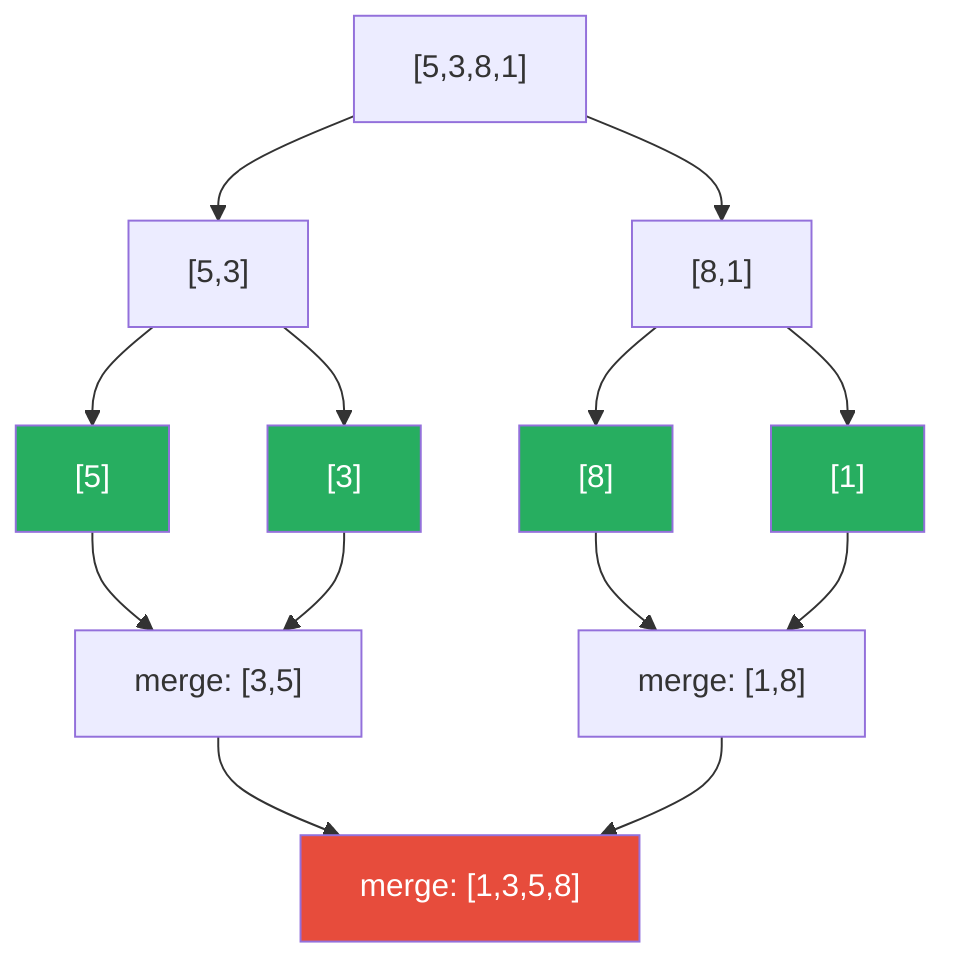

# Divide and Conquer

**TL;DR:** Split a problem into independent subproblems, solve each recursively, then combine their answers — the combine step is where the real work (and the complexity) usually lives.

## When to reach for it
- The problem can be split into pieces whose answers don't depend on each other, and there's a cheap way to merge the pieces' answers into the whole answer.
- Sorting (merge sort splits in half, sorts each half, merges) or searching a sorted structure ([[0.BinarySearchGuide|Binary Search]] discards half each step).
- Merging many sorted structures — pair them up and merge two at a time, halving the count of "pending" structures at each round.
- Fast exponentiation — `x^n = (x^(n/2))^2`, halving the exponent each call instead of multiplying `n` times.
- A signal in the problem statement: "sorted," "merge," "median of two," or an operation that's naturally cheaper on two halves than brute-forcing the whole.

## How it works
Every divide-and-conquer algorithm has the same three-part shape: **divide** the input into smaller independent pieces, **conquer** by recursing on each piece, **combine** the sub-results into the final answer. The recursion bottoms out at a base case trivial enough to answer directly.

Trace merge-sorting `[5, 3, 8, 1]`:

| step | action | state |
|---|---|---|
| divide | split in half | `[5, 3]` and `[8, 1]` |
| divide | split again | `[5]`, `[3]`, `[8]`, `[1]` — base case, size 1 |
| conquer | (nothing to sort — already size 1) | — |
| combine | merge `[5]`+`[3]` → `[3, 5]`; merge `[8]`+`[1]` → `[1, 8]` | `[3, 5]`, `[1, 8]` |
| combine | merge `[3, 5]`+`[1, 8]` → `[1, 3, 5, 8]` | `[1, 3, 5, 8]` |



All the actual sorting work happens in the merge (combine) steps — the divide steps just split indices, doing no comparisons at all.

## Why it works
Correctness is an induction argument, same as [[Recursion]] generally: if solving each half correctly is assumed (inductive hypothesis), and the combine step correctly builds the whole answer from two correct half-answers, then the whole is correct — down to the base case, which is trivially correct by inspection. The complexity payoff comes from the *shape* of the recursion tree: splitting into equal halves gives `log n` levels, and if the combine step is linear in the size of the pieces at that level, each level does O(n) total work across all its nodes — giving O(n log n) overall (merge sort), instead of the O(n²) you'd get from combining pieces naively without the halving structure.

## Template
```python
# Generic shape
def divide_and_conquer(problem):
    if is_base_case(problem):
        return solve_directly(problem)

    left, right = split(problem)                    # divide
    left_result = divide_and_conquer(left)           # conquer
    right_result = divide_and_conquer(right)          # conquer
    return combine(left_result, right_result)         # combine

# Merge sort — the canonical instance
def merge_sort(arr):
    if len(arr) <= 1:
        return arr
    mid = len(arr) // 2
    left = merge_sort(arr[:mid])
    right = merge_sort(arr[mid:])
    return merge(left, right)   # O(n) merge of two sorted halves

def merge(a, b):
    result, i, j = [], 0, 0
    while i < len(a) and j < len(b):
        if a[i] <= b[j]:
            result.append(a[i]); i += 1
        else:
            result.append(b[j]); j += 1
    return result + a[i:] + b[j:]
```

## Complexity
Time: driven by the recurrence `T(n) = 2T(n/2) + O(n)` for the merge-sort shape, which solves to O(n log n) — `log n` levels of splitting, O(n) combine work at each level. More generally, halving the input at each step (whether or not you recurse into both halves) produces a `log n` factor — that's the same reasoning behind [[0.BinarySearchGuide|Binary Search]]'s O(log n). Space: O(n) extra for merge sort's temporary arrays; O(log n) stack depth for the recursion itself (assuming balanced splits).

## Common pitfalls
- Splitting the input but doing an O(n) or worse combine step *per node* without accounting for it — the combine step's cost, multiplied across `log n` levels, is where the real complexity comes from, not the splitting.
- Unbalanced splits (e.g. always peeling off one element instead of splitting in half) — this degrades the `log n` factor into O(n) levels, silently turning an O(n log n) algorithm into O(n²).
- Recomputing the same subproblem in different branches — that's a sign the subproblems aren't actually independent, and you likely want [[Dynamic Programming]] / [[Memoization]] instead.
- Off-by-one errors in the split point (`mid = len(arr) // 2` vs `len(arr) // 2 + 1`) causing infinite recursion on a 2-element input.

## NeetCode examples
- [[07.MedianOfTwoSortedArrays|MedianOfTwoSortedArrays]] — binary search across two arrays to discard halves without merging
- [[06.Pow(x,n)|Pow(x,n)]] — halve the exponent each call instead of multiplying n times
- [[10.MergeKSortedLists|MergeKSortedLists]] — pair up and merge lists, halving the count of pending lists each round
- [[01.BinarySearch|BinarySearch]] — discard half the search space every step

## Full guide
[[Job Search/Neetcode/01. Questions/05. Binary Search/0.BinarySearchGuide|Binary Search Guide]]
